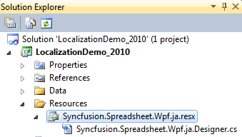
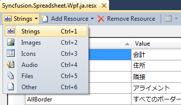
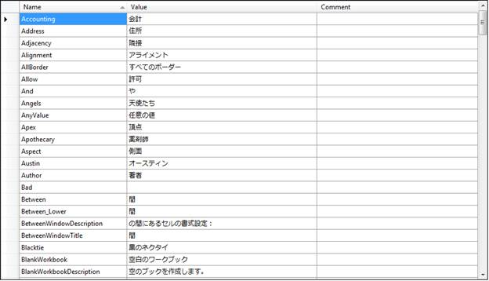
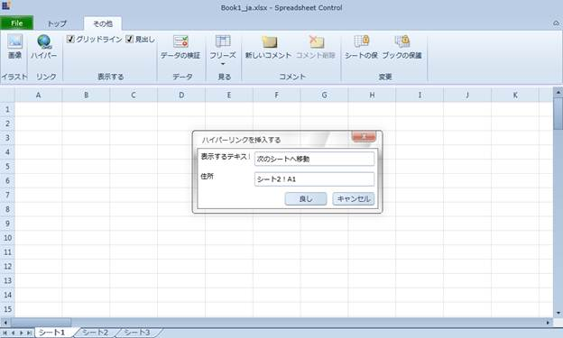

::: {style="DISPLAY: none"}
{#d2h_url_template}{#d2h_package_url style="WIDTH: 0px; DISPLAY: none; HEIGHT: 0px"}
:::

::::: {#nsbanner .d2h_main_nsbanner style="BORDER-BOTTOM: #999999 1px solid; POSITION: relative; PADDING-BOTTOM: 0px; BACKGROUND-COLOR: transparent; PADDING-LEFT: 0px; PADDING-RIGHT: 0px; DISPLAY: none; BORDER-TOP: #999999 1px solid; PADDING-TOP: 0px; LEFT: 0px"}
:::: {#TitleRow .d2h_main_titlerow style="PADDING-BOTTOM: 4px; BACKGROUND-COLOR: transparent; PADDING-LEFT: 22px; WIDTH: 100%; PADDING-RIGHT: 10px; DISPLAY: none; PADDING-TOP: 4px"}
::: {#ienav .d2h_main_ienav style="DISPLAY: none"}
{#D2HPrevious .D2HPreviousEnabled}  {#D2HNext .D2HNextEnabled}
:::
::::
:::::

:::: {#nstext .d2h_main_nstext style="PADDING-BOTTOM: 10px; BACKGROUND-COLOR: transparent; PADDING-LEFT: 22px; PADDING-RIGHT: 10px; HEIGHT: 100%; OVERFLOW: auto; PADDING-TOP: 5px" hasuserbackground="true" valign="bottom"}
::: {#d2h_breadcrumbs .d2h_breadcrumbs}
[Essential Studio User Guide Documentation](ms-xhelp:///?Id=12457748-09e3-4d74-a240-8e049cedf030){.d2h_breadcrumbsNormal}[ \> ]{.d2h_breadcrumbsLinkSeparator}[Reporting Edition](ms-xhelp:///?Id=027aa5b6-6676-4f93-ad23-c20e8c45792e){.d2h_breadcrumbsNormal}[ \> ]{.d2h_breadcrumbsLinkSeparator}[Essential Spreadsheet](ms-xhelp:///?Id=25812fa4-b4ea-4485-bbfb-30849a783142){.d2h_breadcrumbsNormal}[ \> ]{.d2h_breadcrumbsLinkSeparator}[Spreadsheet WPF]{.d2h_breadcrumbsContentsOnly}[ \> ]{.d2h_breadcrumbsLinkSeparator}[Concepts and Features](ms-xhelp:///?Id=804a67a1-e889-4f6c-8d16-34b9ef155da4){.d2h_breadcrumbsNormal}
:::

## Localization {#localization style="tab-stops: 0pt"}

Localization is the process of customizing the application to culture-specific. This involves configuring the application for the specific languages. Culture is the combination of Language and the Location (e.g. En-US is the Culture for English spoken at United States; En-GB is the Culture for English spoken at Great Britain).

Syncfusion Spreadsheet allows you to set custom resource through **Resx** file. You can give the string values in resource file for a specific Culture and set the Culture in the application. The given string values will be set to the Grid which does not affect the Code Block of the Grid.

[]{#_Use_Case_Scenarios}[]{#_Adding_<FEATURE_NAME>} 

Adding Localization to an Application

The following are steps to implementation Localization support to an application:

1.   Create a WPF application and add spreadsheet control to it.

2.   Create a folder named Resources in the application.

3.   Create a resource file (Resx file) and name it as Syncfusion.Spreadsheet.WPF. \<your culture info name\>.resx

Example: Syncfusion.Spreadsheet.WPF.ja.resx.

Note: It is mandatory to use this naming convention.

 

{border="0"}

Figure 42: Adding Resource file to the Application

 

4.   Select the String option in the Resource file.

 

{border="0"}

Figure 43: Selecting and adding String Resources to the Resource file of the Application

*[]{style="FONT-SIZE: 9pt"}* 

5.   Resource table will open.

6.   Enter the UI name in the Name column and the equivalent term you want in the Value column.

                                                             

{border="0"}

*[Figure ]{style="FONT-SIZE: 9pt"}[44]{style="FONT-SIZE: 9pt"}[: localizing the application to the Japanese Culture]{style="FONT-SIZE: 9pt"}*

*[]{style="FONT-SIZE: 9pt"}* 

7.   Assign the *CultureInfo* to the application before the **InitializeComponent()** method is being called.

 

The following code illustrates localizing the application to the Japanese CultureInfo.

 

+-------------------------------------------------------------------------------------------------------------------------------------------------------------------------------------------------------------------------------------------------------------------+
| **[\[C#\]]{style="FONT-FAMILY: 'Courier New'"}**                                                                                                                                                                                                                  |
|                                                                                                                                                                                                                                                                   |
| [public]{style="FONT-FAMILY: Consolas; COLOR: blue; FONT-SIZE: 9.5pt"}[ MainPage()]{style="FONT-FAMILY: Consolas; FONT-SIZE: 9.5pt"}                                                                                                                              |
|                                                                                                                                                                                                                                                                   |
| [{]{style="FONT-FAMILY: Consolas; FONT-SIZE: 9.5pt"}                                                                                                                                                                                                              |
|                                                                                                                                                                                                                                                                   |
| [System.Threading.[Thread]{style="COLOR: #2b91af"}.CurrentThread.CurrentUICulture = [new]{style="COLOR: blue"} System.Globalization.[CultureInfo]{style="COLOR: #2b91af"}([\"ja-JP\"]{style="COLOR: #a31515"});]{style="FONT-FAMILY: Consolas; FONT-SIZE: 9.5pt"} |
|                                                                                                                                                                                                                                                                   |
| [InitializeComponent();]{style="FONT-FAMILY: Consolas; FONT-SIZE: 9.5pt"}                                                                                                                                                                                         |
|                                                                                                                                                                                                                                                                   |
| [}]{style="FONT-FAMILY: Consolas; FONT-SIZE: 9.5pt"}                                                                                                                                                                                                              |
+-------------------------------------------------------------------------------------------------------------------------------------------------------------------------------------------------------------------------------------------------------------------+

 

 

+----------------------------------------------------------------------------------------------------------------------------------------------------------------------------+
| **[\[VB\]]{style="FONT-FAMILY: 'Courier New'"}**                                                                                                                           |
|                                                                                                                                                                            |
| []{style="FONT-FAMILY: Consolas; FONT-SIZE: 9.5pt"}                                                                                                                        |
|                                                                                                                                                                            |
| [Public]{style="FONT-FAMILY: 'Courier New'; COLOR: blue"}[ [Sub]{style="COLOR: blue"} [New]{style="COLOR: blue"}()]{style="FONT-FAMILY: 'Courier New'"}                    |
|                                                                                                                                                                            |
| [System.Threading.Thread.CurrentThread.CurrentUICulture = [New]{style="COLOR: blue"} System.Globalization.CultureInfo(\"ja-JP\")]{style="FONT-FAMILY: 'Courier New'"}      |
|                                                                                                                                                                            |
| [InitializeComponent()]{style="FONT-FAMILY: 'Courier New'"}                                                                                                                |
|                                                                                                                                                                            |
| [End]{style="FONT-FAMILY: 'Courier New'; COLOR: blue"}[ [Sub]{style="COLOR: blue"}]{style="FONT-FAMILY: 'Courier New'"}[]{style="FONT-FAMILY: Consolas; FONT-SIZE: 9.5pt"} |
+----------------------------------------------------------------------------------------------------------------------------------------------------------------------------+

 

8.   Add Supported Cultures to the Application

 

The following are the steps to add Supported Cultures:

1.   In the Solution Explorer, right-click application project and choose Unload Project from the Context Menu. The project will be unloaded.

2.   Right click the project again, and select the Edit \<ProjectName\>.csproj option.

3.   Example: LocalizationSample WPF.csproj

4.   In the .csproj file, find the \<SupportedCultures\>\</SupportedCultures\> tags. Default the tags will be empty. So, add the required cultures. Use semicolon to separate if you want to add multiple culture.

5.   Example: \<SupportedCultures\>en-GB;de;hi;es;it;Ja\</SupportedCultures\>

6.   Save the project.

7.   Right click the \<ProjectName\>.csproj and choose Reload \<ProjectName\>.csproj.[]{#_Properties} Project will be added with specific culture.

 

{border="0"}

Figure 45: Localized Application

 

Sample Link

A demo of localization is available at the following location: 

Essential Studio WPF Sample Browser [à]{style="FONT-FAMILY: Wingdings"} Spreadsheet [à]{style="FONT-FAMILY: Wingdings"} Localization [à]{style="FONT-FAMILY: Wingdings"}Localization Demo.[.]{style="COLOR: #0070c0"}

 

[]{#related-topics}
::::
