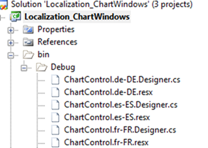
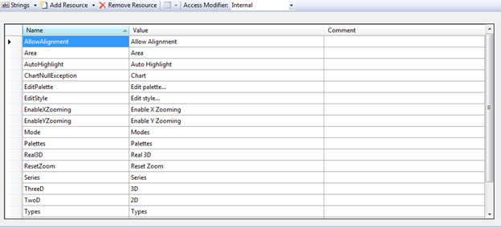
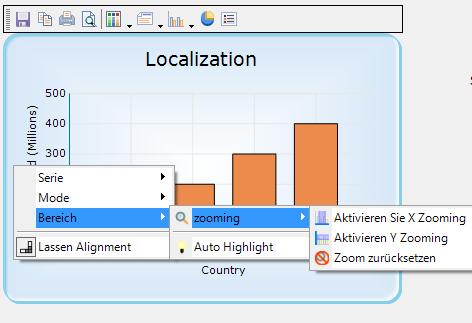

::: {style="DISPLAY: none"}
{#d2h_url_template}{#d2h_package_url style="WIDTH: 0px; DISPLAY: none; HEIGHT: 0px"}
:::

::::: {#nsbanner .d2h_main_nsbanner style="BORDER-BOTTOM: #999999 1px solid; POSITION: relative; PADDING-BOTTOM: 0px; BACKGROUND-COLOR: transparent; PADDING-LEFT: 0px; PADDING-RIGHT: 0px; DISPLAY: none; BORDER-TOP: #999999 1px solid; PADDING-TOP: 0px; LEFT: 0px"}
:::: {#TitleRow .d2h_main_titlerow style="PADDING-BOTTOM: 4px; BACKGROUND-COLOR: transparent; PADDING-LEFT: 22px; WIDTH: 100%; PADDING-RIGHT: 10px; DISPLAY: none; PADDING-TOP: 4px"}
::: {#ienav .d2h_main_ienav style="DISPLAY: none"}
{#D2HPrevious .D2HPreviousEnabled}  {#D2HNext .D2HNextEnabled}
:::
::::
:::::

::::::: {#nstext .d2h_main_nstext style="PADDING-BOTTOM: 10px; BACKGROUND-COLOR: transparent; PADDING-LEFT: 22px; PADDING-RIGHT: 10px; HEIGHT: 100%; OVERFLOW: auto; PADDING-TOP: 5px" hasuserbackground="true" valign="bottom"}
::: {#d2h_breadcrumbs .d2h_breadcrumbs}
[Essential Studio User Guide Documentation](ms-xhelp:///?Id=12457748-09e3-4d74-a240-8e049cedf030){.d2h_breadcrumbsNormal}[ \> ]{.d2h_breadcrumbsLinkSeparator}[User Interface Edition](ms-xhelp:///?Id=c29296b7-531c-413b-a0ec-488ca1f7f669){.d2h_breadcrumbsNormal}[ \> ]{.d2h_breadcrumbsLinkSeparator}[Essential Windows](ms-xhelp:///?Id=e60759d8-47a4-4570-9d7a-16a68d63f2ea){.d2h_breadcrumbsNormal}[ \> ]{.d2h_breadcrumbsLinkSeparator}[Essential Chart]{.d2h_breadcrumbsContentsOnly}[ \> ]{.d2h_breadcrumbsLinkSeparator}[Concepts and Features](ms-xhelp:///?Id=71321e9c-336c-4c1c-a127-be9f135ad4bb){.d2h_breadcrumbsNormal}
:::

## Localization {#localization style="tab-stops: 0pt"}

Localization allows a chart to display data according to the language and culture specific to a particular country or region.

 

Essential Chart now supports localization; built-in resource files for specific languages can be easily added.  Context menu items, exception messages, and some of the toolbar items can be localized.

 

**Use Case Scenario**

This enables you to localize any part of the chart that has static strings in it.

 

Properties

 

::: {align="center"}
  ------------------------------------- ---------------------------------------------- ------------- -------------------------------------------------------------------------------------------------------- ----------------- --------------
  Property                              Description                                    Type          Data Type                                                                                                Reference links   Dependencies
  Localize[ ]{style="COLOR: #c00000"}   Get or set the localization culture of Grid.   Server side   A string containing the name of the target System.Globalization.CultureInfo[ ]{style="COLOR: #c00000"}   NA                NA
  ------------------------------------- ---------------------------------------------- ------------- -------------------------------------------------------------------------------------------------------- ----------------- --------------
:::

 

Adding Localization to an application

 

1.   Create your localization resource file (.resx) in the  **bin \> Debug** folder with the following naming convention:

 

[·      ]{style="FONT-FAMILY: Symbol"}**ChartControl.\<your culture info name\>.resx**

***[]{style="FONT-SIZE: 9pt"}*** 

::: {style="BORDER-BOTTOM: windowtext 1pt solid; BORDER-LEFT: medium none; PADDING-BOTTOM: 1pt; MARGIN-TOP: 9pt; PADDING-LEFT: 0pt; PADDING-RIGHT: 0pt; MARGIN-BOTTOM: 9pt; BORDER-TOP: windowtext 1pt solid; BORDER-RIGHT: medium none; PADDING-TOP: 1pt"}
Note: It is mandatory to follow this naming convention.
:::

 

 

{border="0"}

Figure 366: Resource File

 

2.   Enter the UI name in the Name column and the equivalent term you want in the Value column of the resource file.

 

[{border="0"}]{style="FONT-FAMILY: 'Courier New'"}

Figure 367: Default English resource file

 

::: {style="BORDER-BOTTOM: windowtext 1pt solid; BORDER-LEFT: medium none; PADDING-BOTTOM: 1pt; MARGIN-TOP: 9pt; PADDING-LEFT: 0pt; PADDING-RIGHT: 0pt; MARGIN-BOTTOM: 9pt; BORDER-TOP: windowtext 1pt solid; BORDER-RIGHT: medium none; PADDING-TOP: 1pt"}
Note: It is mantatory to specify equivalent terms for all static element to localize the chart.
:::

 

3.   Specify the culture using the *Localize* property as given in the following code:

 

+-------------------------------------------------------------------------------------------------------------------------------+
| \[C#\]                                                                                                                        |
|                                                                                                                               |
| [this]{style="FONT-FAMILY: 'Courier New'; COLOR: blue"}[.chartControl1.Localize="de-DE";]{style="FONT-FAMILY: 'Courier New'"} |
+-------------------------------------------------------------------------------------------------------------------------------+

 

+----------------------------------------------------------------------------------------------------------------------------+
| \[VB\]                                                                                                                     |
|                                                                                                                            |
| [Me]{style="FONT-FAMILY: 'Courier New'; COLOR: blue"}[.chartControl1.Localize="de-DE"]{style="FONT-FAMILY: 'Courier New'"} |
+----------------------------------------------------------------------------------------------------------------------------+

 

 {border="0"}

Figure 368: Localized Chart

 

Sample Link

To view a sample

1.   Open the Syncfusion Dashboard.

2.   Select User Interface \> Windows Forms.

3.   Click Run Samples.

4.   Navigate to **Culture Localization \> Localization sample**.

 

You can find the resource file for the localization in English at the following location:

 

[[ChartControl_Resource]{.UGHyperlink}](http://www.syncfusion.com/uploads/redirect.aspx?&team=support&file=ChartControl_Resource-1347262360.zip)[]{.UGHyperlink}

 

[]{#related-topics}
:::::::
