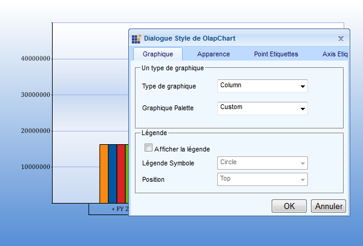

::: {style="DISPLAY: none"}
{#d2h_url_template}{#d2h_package_url style="WIDTH: 0px; DISPLAY: none; HEIGHT: 0px"}
:::

::::: {#nsbanner .d2h_main_nsbanner style="BORDER-BOTTOM: #999999 1px solid; POSITION: relative; PADDING-BOTTOM: 0px; BACKGROUND-COLOR: transparent; PADDING-LEFT: 0px; PADDING-RIGHT: 0px; DISPLAY: none; BORDER-TOP: #999999 1px solid; PADDING-TOP: 0px; LEFT: 0px"}
:::: {#TitleRow .d2h_main_titlerow style="PADDING-BOTTOM: 4px; BACKGROUND-COLOR: transparent; PADDING-LEFT: 22px; WIDTH: 100%; PADDING-RIGHT: 10px; DISPLAY: none; PADDING-TOP: 4px"}
::: {#ienav .d2h_main_ienav style="DISPLAY: none"}
{#D2HPrevious .D2HPreviousEnabled}  {#D2HNext .D2HNextEnabled}
:::
::::
:::::

::::: {#nstext .d2h_main_nstext style="PADDING-BOTTOM: 10px; BACKGROUND-COLOR: transparent; PADDING-LEFT: 22px; PADDING-RIGHT: 10px; HEIGHT: 100%; OVERFLOW: auto; PADDING-TOP: 5px" hasuserbackground="true" valign="bottom"}
::: {#d2h_breadcrumbs .d2h_breadcrumbs}
[Essential Studio User Guide Documentation](ms-xhelp:///?Id=12457748-09e3-4d74-a240-8e049cedf030){.d2h_breadcrumbsNormal}[ \> ]{.d2h_breadcrumbsLinkSeparator}[Business Intelligence Edition](ms-xhelp:///?Id=fdf33dd8-62b2-47b9-ad7b-fc50e590bca5){.d2h_breadcrumbsNormal}[ \> ]{.d2h_breadcrumbsLinkSeparator}[Essential BI ASP.NET](ms-xhelp:///?Id=99c6694e-59c3-4c59-abb5-ce9ce9a948bc){.d2h_breadcrumbsNormal}[ \> ]{.d2h_breadcrumbsLinkSeparator}[Essential BI Chart]{.d2h_breadcrumbsContentsOnly}[ \> ]{.d2h_breadcrumbsLinkSeparator}[Concepts and Features](ms-xhelp:///?Id=be4e11fe-e0a1-44d7-aa3a-05cf8b78bdb8){.d2h_breadcrumbsNormal}
:::

## Localization {#localization style="tab-stops: 0pt"}

Localization is a key feature that targets its global usage. OlapDataManager can be set to the specific locale and the OlapChart can be rendered with the localized string on control based on the culture set on the OlapDataManager.

OLAP Base allows overriding default format strings of OlapCube with the culture based format string. This can be done by setting the "OverrideDefaultFormatStrings" property to true.

**Use Case Scenarios**

Localization helps the user to create an application that targets several cultures.

 

{border="0"}

*[Figure ]{style="FONT-SIZE: 9pt"}[48]{style="FONT-SIZE: 9pt"}[ Localized OlapChart]{style="FONT-SIZE: 9pt"}[]{style="FONT-SIZE: 9pt"}*

 

**Sample Link**

A sample is available at the following location:

**..\\Syncfusion\\EssentialStudio\\\<VersionNumber\>\\BI\\Web\\OlapChart.Web\\Samples\\3.5\\OlapChart\\Localization\\Localization Demo**

[]{style="COLOR: #c00000"} 

**[4.7.1      Adding]{style="COLOR: #4e84c4; FONT-SIZE: 14pt"}[ Localization]{style="COLOR: #4e84c4; FONT-SIZE: 14pt"}[ to an Application ]{style="COLOR: #4e84c4; FONT-SIZE: 14pt"}**

Localization can be achieved by following the steps given below:

[1.     ]{style="FONT-FAMILY: 'Calibri','sans-serif'"}OlapChart localization is fully based on the resource (.resx) file generation. Prepare a translated version of the strings tabulated below and update it in the resource (.resx) file.

[]{style="COLOR: #c00000"} 

::: {align="center"}
  ---------------------------------------------- -----------------------------------------------------
  **[Localization Key]{style="COLOR: white"}**   **[Strings to be localized]{style="COLOR: white"}**
  Appearance                                     Appearance
  AxisLabels                                     Axis Labels
  BackColor                                      Back Color
  BackgroundStyle                                Background Style
  Cancel                                         Cancel
  Chart                                          Chart
  ChartPalette                                   Chart Palette
  ChartStyle                                     Chart Style
  ChartSymbol                                    Chart Symbol
  ChartType                                      Chart Type
  DataPointValue                                 Data-Point Value
  ExpanderVisibility                             Expander Visibility
  False                                          False
  FontColor                                      Font Color
  FontFamily                                     Font Family
  FontStyle                                      Font Style
  ForeColor                                      Fore Color
  GradientStyle                                  Gradient Style
  InteriorStyle                                  Interior Style
  Legend                                         Legend
  LegendSymbol                                   Legend Symbol
  OK                                             OK
  OlapChartStyleDialog                           OlapChart Style Dialog
  PointLabels                                    Point Labels
  Position                                       Position
  ShowLegend                                     Show Legend
  SymbolVisibility                               Symbol Visibility
  True                                           True
  XAxis                                          X-Axis
  YAxis                                          Y-Axis
  ---------------------------------------------- -----------------------------------------------------
:::

 

[5.   ]{style="FONT-FAMILY: 'Arial','sans-serif'"}Name the resource file as "**OlapChart.*\<locale string representation\>*.resx**". For example, French culture can be written as *"OlapChart.fr-FR.resx"* and place the resource file in the "App_GlobalResources" folder of the web site.

[6.   ]{style="FONT-FAMILY: 'Arial','sans-serif'"}Change the culture setting of the web page through OlapDataManger by using the following code:

**** 

+--------------------------------------------------------------------------------------------------------------------------------------------------------------------------------------------------------+
| **[\[CS\]]{style="FONT-FAMILY: 'Courier New'"}**[]{style="FONT-FAMILY: 'Courier New'; COLOR: blue"}                                                                                                    |
|                                                                                                                                                                                                        |
| [var]{style="FONT-FAMILY: 'Courier New'; COLOR: blue"}[ olapDataManager = [new]{style="COLOR: blue"} [OlapDataManager]{style="COLOR: #2b91af"}(connectionString);]{style="FONT-FAMILY: 'Courier New'"} |
|                                                                                                                                                                                                        |
| [olapDataManager.Culture = [new]{style="COLOR: blue"} System.Globalization.[CultureInfo]{style="COLOR: #2b91af"}([\"fr-FR\"]{style="COLOR: #a31515"});]{style="FONT-FAMILY: 'Courier New'"}            |
|                                                                                                                                                                                                        |
| [olapDataManager.OverrideDefaultFormatStrings = [true]{style="COLOR: blue"};]{style="FONT-FAMILY: 'Courier New'"}                                                                                      |
|                                                                                                                                                                                                        |
| [this]{style="FONT-FAMILY: 'Courier New'; COLOR: blue"}[.OlapChart1.OlapDataManager = olapDataManager;]{style="FONT-FAMILY: 'Courier New'"}                                                            |
|                                                                                                                                                                                                        |
| [this]{style="FONT-FAMILY: 'Courier New'; COLOR: blue"}[.OlapChart1.DataBind();]{style="FONT-FAMILY: 'Courier New'"}[]{style="FONT-FAMILY: Consolas; FONT-SIZE: 10.5pt"}                               |
+--------------------------------------------------------------------------------------------------------------------------------------------------------------------------------------------------------+

 

+-------------------------------------------------------------------------------------------------------------------------------------------------------------------------------------------------------+
| **[\[VB\]]{style="FONT-FAMILY: 'Courier New'"}**[]{style="FONT-FAMILY: 'Courier New'; COLOR: blue"}                                                                                                   |
|                                                                                                                                                                                                       |
| [Dim]{style="FONT-FAMILY: 'Courier New'; COLOR: blue"}[ olapDataManager = [New ]{style="COLOR: blue"}[OlapDataManager]{style="COLOR: #2b91af"}(connectionString)]{style="FONT-FAMILY: 'Courier New'"} |
|                                                                                                                                                                                                       |
| [olapDataManager.Culture = [New]{style="COLOR: blue"} System.Globalization.[CultureInfo]{style="COLOR: #2b91af"}([\"fr-FR\"]{style="COLOR: #a31515"})]{style="FONT-FAMILY: 'Courier New'"}            |
|                                                                                                                                                                                                       |
| [olapDataManager.OverrideDefaultFormatStrings = [True]{style="COLOR: blue"}]{style="FONT-FAMILY: 'Courier New'"}                                                                                      |
|                                                                                                                                                                                                       |
| [Me.OlapChart1.OlapDataManager = olapDataManager]{style="FONT-FAMILY: 'Courier New'"}                                                                                                                 |
|                                                                                                                                                                                                       |
| [Me]{style="FONT-FAMILY: 'Courier New'; COLOR: blue"}[.OlapChart1.DataBind()]{style="FONT-FAMILY: 'Courier New'"}[]{style="FONT-FAMILY: Consolas; FONT-SIZE: 10.5pt"}                                 |
+-------------------------------------------------------------------------------------------------------------------------------------------------------------------------------------------------------+

 

[]{#related-topics}
:::::
