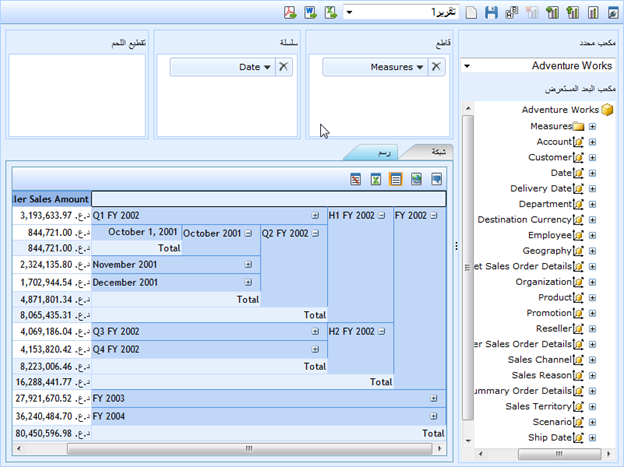

::: {style="DISPLAY: none"}
{#d2h_url_template}{#d2h_package_url style="WIDTH: 0px; DISPLAY: none; HEIGHT: 0px"}
:::

::::: {#nsbanner .d2h_main_nsbanner style="BORDER-BOTTOM: #999999 1px solid; POSITION: relative; PADDING-BOTTOM: 0px; BACKGROUND-COLOR: transparent; PADDING-LEFT: 0px; PADDING-RIGHT: 0px; DISPLAY: none; BORDER-TOP: #999999 1px solid; PADDING-TOP: 0px; LEFT: 0px"}
:::: {#TitleRow .d2h_main_titlerow style="PADDING-BOTTOM: 4px; BACKGROUND-COLOR: transparent; PADDING-LEFT: 22px; WIDTH: 100%; PADDING-RIGHT: 10px; DISPLAY: none; PADDING-TOP: 4px"}
::: {#ienav .d2h_main_ienav style="DISPLAY: none"}
{#D2HPrevious .D2HPreviousEnabled}  {#D2HNext .D2HNextEnabled}
:::
::::
:::::

:::: {#nstext .d2h_main_nstext style="PADDING-BOTTOM: 10px; BACKGROUND-COLOR: transparent; PADDING-LEFT: 22px; PADDING-RIGHT: 10px; HEIGHT: 100%; OVERFLOW: auto; PADDING-TOP: 5px" hasuserbackground="true" valign="bottom"}
::: {#d2h_breadcrumbs .d2h_breadcrumbs}
[Essential Studio User Guide Documentation](ms-xhelp:///?Id=12457748-09e3-4d74-a240-8e049cedf030){.d2h_breadcrumbsNormal}[ \> ]{.d2h_breadcrumbsLinkSeparator}[Business Intelligence Edition](ms-xhelp:///?Id=fdf33dd8-62b2-47b9-ad7b-fc50e590bca5){.d2h_breadcrumbsNormal}[ \> ]{.d2h_breadcrumbsLinkSeparator}[Essential BI ASP.NET](ms-xhelp:///?Id=99c6694e-59c3-4c59-abb5-ce9ce9a948bc){.d2h_breadcrumbsNormal}[ \> ]{.d2h_breadcrumbsLinkSeparator}[Essential BI Client]{.d2h_breadcrumbsContentsOnly}[ \> ]{.d2h_breadcrumbsLinkSeparator}[Concepts and Features](ms-xhelp:///?Id=01073408-6fb5-4943-a653-da9fd3358a53){.d2h_breadcrumbsNormal}
:::

## Localization {#localization style="TEXT-ALIGN: justify; LINE-HEIGHT: 115%; tab-stops: 0pt"}

Localization is a key feature that targets its global usage. OlapDataManager can be set to the specific locale and the OlapClient can be rendered with the localized string on control based on the culture set on the OlapDataManager.

OLAP Base allows overriding default format strings of OlapCube with the culture based format string. This can be acheived by setting the "OverrideDefaultFormatStrings" property to *true*.

Use Case Scenarios

Localization helps the user to create an application that targets several cultures.[]{style="COLOR: #c00000"}

{border="0"}

Figure 50 Localized OlapClient[]{style="COLOR: #c00000"}

Sample Link

A sample is available at the following location:

**..\\Syncfusion\\EssentialStudio\\\<VersionNumber\>\\BI\\Web\\OlapClient.Web\\Samples\\3.5\\OlapClient\\Localization\\Localization Demo**

More:

[ ]{#related-topics}

[{border="0" align="absMiddle"}Adding Localization to an Application](ms-xhelp:///?Id=762b49f9-2f2e-496a-9e3f-b267a477b45e){style="TEXT-DECORATION: none"}
::::
