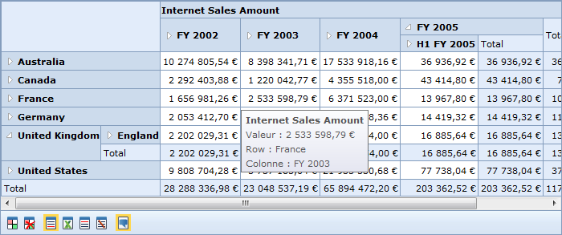

::: {style="DISPLAY: none"}
{#d2h_url_template}{#d2h_package_url style="WIDTH: 0px; DISPLAY: none; HEIGHT: 0px"}
:::

::::: {#nsbanner .d2h_main_nsbanner style="BORDER-BOTTOM: #999999 1px solid; POSITION: relative; PADDING-BOTTOM: 0px; BACKGROUND-COLOR: transparent; PADDING-LEFT: 0px; PADDING-RIGHT: 0px; DISPLAY: none; BORDER-TOP: #999999 1px solid; PADDING-TOP: 0px; LEFT: 0px"}
:::: {#TitleRow .d2h_main_titlerow style="PADDING-BOTTOM: 4px; BACKGROUND-COLOR: transparent; PADDING-LEFT: 22px; WIDTH: 100%; PADDING-RIGHT: 10px; DISPLAY: none; PADDING-TOP: 4px"}
::: {#ienav .d2h_main_ienav style="DISPLAY: none"}
{#D2HPrevious .D2HPreviousEnabled}  {#D2HNext .D2HNextEnabled}
:::
::::
:::::

::: {#nstext .d2h_main_nstext style="PADDING-BOTTOM: 10px; BACKGROUND-COLOR: transparent; PADDING-LEFT: 22px; PADDING-RIGHT: 10px; HEIGHT: 100%; OVERFLOW: auto; PADDING-TOP: 5px" hasuserbackground="true" valign="bottom"}
## Localization {#localization style="tab-stops: 0pt"}

Localization is a key feature that targets its global usage. OlapDataManager can be set to the specific locale and the OlapGrid control can be rendered with the localized strings in the control based on the culture set on the OlapDataManager.

OLAP base allows overriding default format strings of an OLAP cube with the culture-based format string. This can be achieved by setting the **OverrideDefaultFormatStrings** property to **true**. ***[]{style="COLOR: red"}***

Use Case Scenarios

Localization helps users create an application that targets several locales.[]{style="COLOR: #c00000"}

[{border="0"}]{style="COLOR: #c00000"}

Figure 34: Localized OlapGrid[]{style="COLOR: #c00000"}

Sample Link

A sample is available at the following location:

..\\Syncfusion\\EssentialStudio\\\<VersionNumber\>\\BI\\Web\\OlapGrid.Web\\Samples\\3.5\\OlapGrid\\Localization\\Localization Demo

[]{style="COLOR: #c00000"} 

More:

[ ]{#related-topics}

[{border="0" align="absMiddle"}Adding Localization to an Application](ms-xhelp:///?Id=58f8ad1a-8223-4ad3-989f-4a08cccd9f54){style="TEXT-DECORATION: none"}
:::
