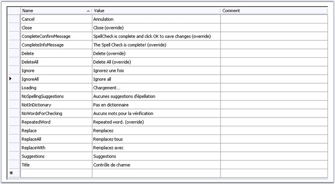
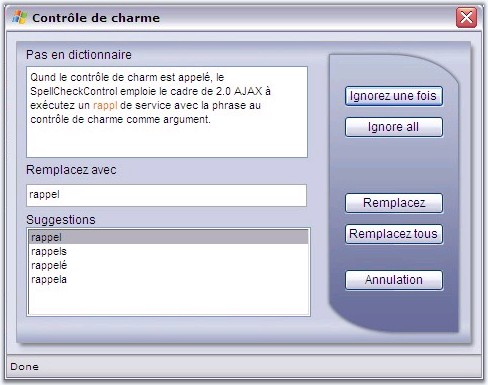

::: {style="DISPLAY: none"}
{#d2h_url_template}{#d2h_package_url style="WIDTH: 0px; DISPLAY: none; HEIGHT: 0px"}
:::

::::: {.d2h_secondary_topic style="PADDING-BOTTOM: 10pt; MARGIN: 0pt; PADDING-LEFT: 0pt; PADDING-RIGHT: 0pt; PADDING-TOP: 0pt"}
##### Localization {#localization style="MARGIN-LEFT: 1.8pt; tab-stops: 1.8pt"}

[]{style="FONT-FAMILY: 'Trebuchet MS','sans-serif'; COLOR: #15428b; FONT-SIZE: 9pt"} 

To create your own localization for the SpellCheckControl, follow the below given steps.

[]{style="FONT-FAMILY: 'Trebuchet MS','sans-serif'; COLOR: #15428b; FONT-SIZE: 9pt"} 

1.   Create the App_Global Resources folder in the root of your Web application.

2.   Create the SpellCheck.fr.resx file into it.

3.   The **English(en-US)** is the default dictionary that is employed, which can be customized by providing the dictionary in \'.dic\' format. The lexicon being used must be placed under a folder, and corresponding path must be set using the **DictionaryPath** property.

[]{style="FONT-FAMILY: 'Trebuchet MS','sans-serif'; COLOR: #15428b; FONT-SIZE: 9pt"} 

+----------------------------------------------------------------------------------------------------------------------------------------------------------------------------------------------------------------------------------------------------------------------------------------------------------------------------------------------------------------------------------------------------------------------------------------------------------------------------------------------------------------------------------------------------------------------------------------------------------------------------------------------------------------+
| [\<]{style="FONT-FAMILY: 'Courier New'; COLOR: blue; FONT-SIZE: 9pt"}[cc1]{style="FONT-FAMILY: 'Courier New'; COLOR: #a31515; FONT-SIZE: 9pt"}[:]{style="FONT-FAMILY: 'Courier New'; COLOR: blue; FONT-SIZE: 9pt"}[SpellCheckControl]{style="FONT-FAMILY: 'Courier New'; COLOR: #a31515; FONT-SIZE: 9pt"}[ [ID]{style="COLOR: red"}[=\"SpellCheckControl1\"]{style="COLOR: blue"} [DictionaryPath]{style="COLOR: red"}[=\"App_Code/fr-FR.dic\"]{style="COLOR: blue"} [runat]{style="COLOR: red"}[=\"server\"]{style="COLOR: blue"} [EnableViewState]{style="COLOR: red"}[=\"False\"]{style="COLOR: blue"}]{style="FONT-FAMILY: 'Courier New'; FONT-SIZE: 9pt"} |
|                                                                                                                                                                                                                                                                                                                                                                                                                                                                                                                                                                                                                                                                |
| [ShowSpellCheckButton]{style="FONT-FAMILY: 'Courier New'; COLOR: red; FONT-SIZE: 9pt"}[=\"False\"]{style="FONT-FAMILY: 'Courier New'; COLOR: blue; FONT-SIZE: 9pt"}[ [\>]{style="COLOR: blue"}]{style="FONT-FAMILY: 'Courier New'; FONT-SIZE: 9pt"}                                                                                                                                                                                                                                                                                                                                                                                                            |
|                                                                                                                                                                                                                                                                                                                                                                                                                                                                                                                                                                                                                                                                |
| [\</]{style="FONT-FAMILY: 'Courier New'; COLOR: blue; FONT-SIZE: 9pt"}[cc1]{style="FONT-FAMILY: 'Courier New'; COLOR: #a31515; FONT-SIZE: 9pt"}[:]{style="FONT-FAMILY: 'Courier New'; COLOR: blue; FONT-SIZE: 9pt"}[SpellCheckControl]{style="FONT-FAMILY: 'Courier New'; COLOR: #a31515; FONT-SIZE: 9pt"}[\>]{style="FONT-FAMILY: 'Courier New'; COLOR: blue; FONT-SIZE: 9pt"}                                                                                                                                                                                                                                                                                |
+----------------------------------------------------------------------------------------------------------------------------------------------------------------------------------------------------------------------------------------------------------------------------------------------------------------------------------------------------------------------------------------------------------------------------------------------------------------------------------------------------------------------------------------------------------------------------------------------------------------------------------------------------------------+

[]{style="FONT-FAMILY: 'Trebuchet MS','sans-serif'; COLOR: #15428b; FONT-SIZE: 9pt"} 

4.   All resx files contain two columns: **Name** and **Value**. You need to localize the strings in the Value column of this resx file.

[]{style="FONT-FAMILY: 'Trebuchet MS','sans-serif'; COLOR: #15428b; FONT-SIZE: 9pt"} 

{border="0"}

[]{style="FONT-FAMILY: 'Trebuchet MS','sans-serif'; COLOR: #15428b; FONT-SIZE: 9pt"} 

5.   Run the application.

[]{style="FONT-FAMILY: 'Trebuchet MS','sans-serif'; COLOR: #15428b; FONT-SIZE: 9pt"} 

{border="0"}

 

 

[]{#p155} 

 

::: {align="center"}
  ---------------------------------------- ---------------------------------------------------------------------------------------------
  Properties                               Description
  AfterCallbackResponseProcessedScript     Specifies the script that will be executed after callback result gets processed.
  AfterCallbackScript                      Specifies the script that will be executed after a callback request is sent to the server.
  BeforeCallBackResponseProcessingScript   Specifies the script that will be executed before callback result gets processed.
  BeforeCallbackScript                     Specifies the script that will be executed before a callback request is sent to the server.
  ---------------------------------------- ---------------------------------------------------------------------------------------------
:::

[]{style="FONT-FAMILY: 'Segoe UI','sans-serif'; COLOR: black; FONT-SIZE: 9pt"} 

::: {align="center"}
  ----------------- --------------------------------------------------------------------------------------------------------------------------
  Properties        Description
  EnableCallbacks   Specifies whether control refresh operations should be performed via callback or postback.
  EnablePostbacks   Specifies that control refresh operations should be performed via postback. EnableCallbacks should then be set to false.
  ----------------- --------------------------------------------------------------------------------------------------------------------------
:::

[]{#related-topics}
:::::
