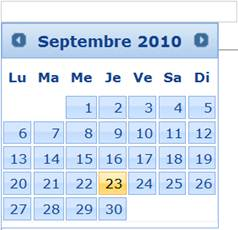

::: {style="DISPLAY: none"}
{#d2h_url_template}{#d2h_package_url style="WIDTH: 0px; DISPLAY: none; HEIGHT: 0px"}
:::

:::::::: {.d2h_secondary_topic style="PADDING-BOTTOM: 10pt; MARGIN: 0pt; PADDING-LEFT: 0pt; PADDING-RIGHT: 0pt; PADDING-TOP: 0pt"}
#### Localization {#localization style="tab-stops: 0pt"}

DatePicker provides localization support so that users can localize the calendar language and format for which the default language is English. DatePicker includes built-in support for languages.

 

Use Case Scenarios

Localization is the key feature that provides solutions to global customers.

 

 

{border="0"}

Figure 111: DatePicker in French Culture

 

Adding Localization[ ]{style="COLOR: red"}to an Application

Localization in DatePicker can be customized by using two ways, namely:

[·      ]{style="FONT-FAMILY: Symbol"}DatePickerBuilder

[·      ]{style="FONT-FAMILY: Symbol"}DatePickerModel

 

Using DatePickerBuilder

To customize Localization in DatePicker by using DatePickerBuilder:

1.   Create a **View**.

2.   In the **View**, invoke the **DatePicker** helper with the control ID.

3.   Set the **Localize** method, to add the name of the culture from the **Languages** collection.

 

 

::: {align="center"}
+-----------------------------------------------------------------------------------------------------------------------------------------------------------------------------------------------------------------------------------------------------------------------------------------------------------------------+
| **[\[ASPXView\[aspx\]]{style="FONT-FAMILY: 'Courier New'"}**                                                                                                                                                                                                                                                          |
|                                                                                                                                                                                                                                                                                                                       |
| [\<%]{style="FONT-FAMILY: 'Courier New'; BACKGROUND: yellow"}[=]{style="FONT-FAMILY: 'Courier New'; COLOR: blue"}[Html.Syncfusion().DatePicker([\"myDatePicker\"]{style="COLOR: #a31515"})]{style="FONT-FAMILY: 'Courier New'"}                                                                                       |
|                                                                                                                                                                                                                                                                                                                       |
| [.**Localize(**]{style="FONT-FAMILY: 'Courier New'"}[Languages]{style="FONT-FAMILY: 'Courier New'; COLOR: #2b91af"}[.French_Swiss]{style="FONT-FAMILY: 'Courier New'"}**[)]{style="FONT-FAMILY: 'Courier New'"}**[ %\>]{style="FONT-FAMILY: 'Courier New'; BACKGROUND: yellow"}[]{style="FONT-FAMILY: 'Courier New'"} |
+-----------------------------------------------------------------------------------------------------------------------------------------------------------------------------------------------------------------------------------------------------------------------------------------------------------------------+
:::

[]{style="FONT-FAMILY: 'Calibri','sans-serif'"} 

 

::: {align="center"}
+------------------------------------------------------------------------------------------------------------------------------------------------------------------------------------------------------------------------------------------------------------------------------------------------------------------------------------------------------------------------+
| **[View\[cshtml\]]{style="FONT-FAMILY: 'Courier New'"}**                                                                                                                                                                                                                                                                                                               |
|                                                                                                                                                                                                                                                                                                                                                                        |
| [\@{]{style="FONT-FAMILY: 'Courier New'; BACKGROUND: yellow"}[ ]{style="FONT-FAMILY: 'Courier New'; COLOR: blue"}[Html.Syncfusion().DatePicker([\"myDatePicker\"]{style="COLOR: #a31515"})]{style="FONT-FAMILY: 'Courier New'"}                                                                                                                                        |
|                                                                                                                                                                                                                                                                                                                                                                        |
| [.**Localize(**]{style="FONT-FAMILY: 'Courier New'"}[Languages]{style="FONT-FAMILY: 'Courier New'; COLOR: #2b91af"}[.French_Swiss]{style="FONT-FAMILY: 'Courier New'"}**[)]{style="FONT-FAMILY: 'Courier New'"}**[.Render()**;**]{style="FONT-FAMILY: 'Courier New'"}[}]{style="FONT-FAMILY: 'Courier New'; BACKGROUND: yellow"}[]{style="FONT-FAMILY: 'Courier New'"} |
+------------------------------------------------------------------------------------------------------------------------------------------------------------------------------------------------------------------------------------------------------------------------------------------------------------------------------------------------------------------------+
:::

[]{style="FONT-FAMILY: 'Calibri','sans-serif'"} 

4.   Build and run the application.

{border="0"}

Figure 112: DatePicker in French Culture

Using DatePickerModel

To customize Localization in DatePicker by using DatePickerModel:

1.   In the **Controller**, create an object for the **DatePickerModel** class.

2.   Set the **Localize** property.

3.   Assign the **DatePickerModel** class to the **ViewData**.

 

::: {align="center"}
+------------------------------------------------------------------------------------------------------------------------------------------------------------------------------+
| [      **\[Controller\]**]{style="FONT-FAMILY: 'Courier New'"}                                                                                                               |
|                                                                                                                                                                              |
| [        [public]{style="COLOR: blue"} [ActionResult]{style="COLOR: #2b91af"} Index()]{style="FONT-FAMILY: 'Courier New'"}                                                   |
|                                                                                                                                                                              |
| [        {]{style="FONT-FAMILY: 'Courier New'"}                                                                                                                              |
|                                                                                                                                                                              |
| [            [DatePickerModel]{style="COLOR: #2b91af"} dtModel = [new]{style="COLOR: blue"} [DatePickerModel]{style="COLOR: #2b91af"}()]{style="FONT-FAMILY: 'Courier New'"} |
|                                                                                                                                                                              |
| [            {]{style="FONT-FAMILY: 'Courier New'"}                                                                                                                          |
|                                                                                                                                                                              |
| [                Localize=[Languages]{style="COLOR: #2b91af"}.French_Swiss]{style="FONT-FAMILY: 'Courier New'"}                                                              |
|                                                                                                                                                                              |
| [            };]{style="FONT-FAMILY: 'Courier New'"}                                                                                                                         |
|                                                                                                                                                                              |
| [            ViewData\[[\"myDtModel\"]{style="COLOR: #a31515"}\] = dtModel;]{style="FONT-FAMILY: 'Courier New'"}                                                             |
|                                                                                                                                                                              |
| [            [return]{style="COLOR: blue"} View();]{style="FONT-FAMILY: 'Courier New'"}                                                                                      |
|                                                                                                                                                                              |
| [        }]{style="FONT-FAMILY: 'Courier New'"}                                                                                                                              |
+------------------------------------------------------------------------------------------------------------------------------------------------------------------------------+
:::

**[]{style="FONT-FAMILY: 'Calibri','sans-serif'"}** 

4.   Create a **View**.

5.   In the **View**, invoke the **DatePicker** helper with the control ID.

6.   From the **ViewData**, assign the **DatePickerModel** class to the **DatePicker** helper.

 

::: {align="center"}
+--------------------------------------------------------------------------------------------------------------------------------------------------------------------------------------------------------------------------------------------------------------------------------------------------------------------------------------------------------------------------------------------------------------------------------------------------------------------------------------------------------------------------------------------------------------------------------------------------+
| **[View\[ASPX\]]{style="FONT-FAMILY: 'Courier New'"}**                                                                                                                                                                                                                                                                                                                                                                                                                                                                                                                                           |
|                                                                                                                                                                                                                                                                                                                                                                                                                                                                                                                                                                                                  |
| **[]{style="FONT-FAMILY: 'Courier New'"}**                                                                                                                                                                                                                                                                                                                                                                                                                                                                                                                                                       |
|                                                                                                                                                                                                                                                                                                                                                                                                                                                                                                                                                                                                  |
| [\<%]{style="FONT-FAMILY: 'Courier New'; BACKGROUND: yellow"}[=]{style="FONT-FAMILY: 'Courier New'; COLOR: blue"}[ Html]{style="FONT-FAMILY: 'Courier New'"}[.Syncfusion()]{style="FONT-FAMILY: 'Courier New'"}[.DatePicker([\"]{style="COLOR: #a31515"}]{style="FONT-FAMILY: 'Courier New'"}[myDatePicker]{style="FONT-FAMILY: 'Courier New'; COLOR: #a31515"}[\"]{style="FONT-FAMILY: 'Courier New'; COLOR: #a31515"}[, ([DatePickerModel]{style="COLOR: #2b91af"})ViewData\[[\"myDtModel\"]{style="COLOR: #a31515"}\]) [%\>]{style="BACKGROUND: yellow"}]{style="FONT-FAMILY: 'Courier New'"} |
+--------------------------------------------------------------------------------------------------------------------------------------------------------------------------------------------------------------------------------------------------------------------------------------------------------------------------------------------------------------------------------------------------------------------------------------------------------------------------------------------------------------------------------------------------------------------------------------------------+
:::

 

 

 

::: {align="center"}
+------------------------------------------------------------------------------------------------------------------------------------------------------------------------------------------------------------------------------------------------------------------------------------------------------------------------------------------------------------------------------------------------------------------------------------------------------------------------------------------------------------------------------------------------------+
| **[View\[cshtml\]]{style="FONT-FAMILY: 'Courier New'"}**                                                                                                                                                                                                                                                                                                                                                                                                                                                                                             |
|                                                                                                                                                                                                                                                                                                                                                                                                                                                                                                                                                      |
| **[]{style="FONT-FAMILY: 'Courier New'"}**                                                                                                                                                                                                                                                                                                                                                                                                                                                                                                           |
|                                                                                                                                                                                                                                                                                                                                                                                                                                                                                                                                                      |
| [\@{]{style="FONT-FAMILY: 'Courier New'; BACKGROUND: yellow"}[ Html]{style="FONT-FAMILY: 'Courier New'"}[.Syncfusion()]{style="FONT-FAMILY: 'Courier New'"}[.DatePicker([\"]{style="COLOR: #a31515"}]{style="FONT-FAMILY: 'Courier New'"}[myDatePicker]{style="FONT-FAMILY: 'Courier New'; COLOR: #a31515"}[\"]{style="FONT-FAMILY: 'Courier New'; COLOR: #a31515"}[, ([DatePickerModel]{style="COLOR: #2b91af"})ViewData\[[\"myDtModel\"]{style="COLOR: #a31515"}\]).Render(); [}]{style="BACKGROUND: yellow"}]{style="FONT-FAMILY: 'Courier New'"} |
+------------------------------------------------------------------------------------------------------------------------------------------------------------------------------------------------------------------------------------------------------------------------------------------------------------------------------------------------------------------------------------------------------------------------------------------------------------------------------------------------------------------------------------------------------+
:::

 

[]{style="FONT-FAMILY: 'Calibri','sans-serif'"} 

7.   Build and run the application.

 

{border="0"}

Figure 113: DatePicker in French Culture

 

Properties

The property of the Localization feature in DatePicker is described in the following tabulation:

 

 

  ---------- ------------------------------------------ ------------- ----------- -----------------
  Name       Description                                Type          Data Type   Reference links
  Localize   Gets or sets the culture for DatePicker.   Server-side   Languages   Not applicable
  ---------- ------------------------------------------ ------------- ----------- -----------------

[]{style="FONT-FAMILY: 'Calibri','sans-serif'; COLOR: black"} 

Sample Link

To view a sample:

1.   Open the Tools Sample Browser from the dashboard. (Refer to the Samples and Location chapter.)

2.   Navigate to **Tools.Mvc** -\> **DatePicker** -\> **Localization Demo**.

**[]{style="COLOR: red"}** 

[]{style="FONT-FAMILY: 'Calibri','sans-serif'"} 

[]{#related-topics}
::::::::
