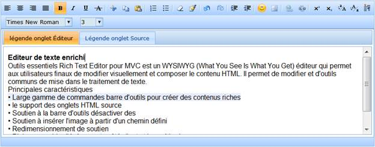
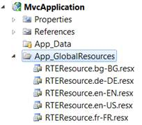
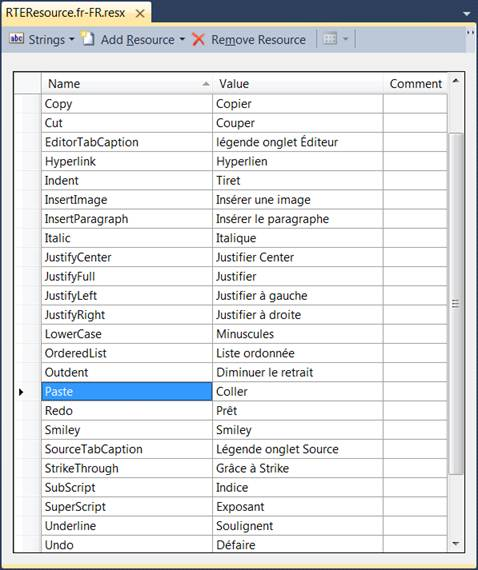

::: {style="DISPLAY: none"}
{#d2h_url_template}{#d2h_package_url style="WIDTH: 0px; DISPLAY: none; HEIGHT: 0px"}
:::

::::::::::::: {.d2h_secondary_topic style="PADDING-BOTTOM: 10pt; MARGIN: 0pt; PADDING-LEFT: 0pt; PADDING-RIGHT: 0pt; PADDING-TOP: 0pt"}
#### Localization {#localization style="tab-stops: 0pt"}

Localization is the process of providing controls in different cultures to help users to easily set their own culture.

RichTextEditor provides localization support so that users can customize their User Interface (UI). Resource files contain the settings for different cultures, which are important for localizing an application.

 

Use Case Scenarios

 

Localization is the key feature that provides solutions to global customers.

 

{border="0"}

Figure 209: RichTextEditor in French Culture

Adding Localization to an Application

Localization in RichTextEditor can be customized by using two ways, namely:

[·      ]{style="FONT-FAMILY: Symbol"}RichTextEditorBuilder

[·      ]{style="FONT-FAMILY: Symbol"}RichTextEditorModel

 

Adding Resource Files

To localize the RichTextEditor control, you need to create a resource file for each culture. The following steps should be performed when localizing strings for your culture:

1.   Add the resource (.resx) files in the **App_GlobalResources** folder for different cultures.

2.   Name the resource files in the **RTEResource.\[culture\].resx** format.

 

**Examples**

[·      ]{style="FONT-FAMILY: Symbol"}RTEResource.de-DE.resx - A resource file for the German culture.

[·      ]{style="FONT-FAMILY: Symbol"}RTEResource.fr-FR.resx - A resource file for the French culture.

[]{style="FONT-FAMILY: 'Calibri','sans-serif'"} 

{border="0"}

Figure 210: App_GlobalResources Folder

 

The following screen shot shows a resource file in the French culture:

[]{style="FONT-FAMILY: 'Calibri','sans-serif'"} 

{border="0"}

Figure 211: Resource File in French Culture[]{style="FONT-FAMILY: 'Calibri','sans-serif'"}

Using RichTextEditorBuilder

To customize Localization in RichTextEditor by using RichTextEditorBuilder:

1.   Create a **View**.

2.   In the **View**, invoke the **RichTextEditor** helper with the control ID.

3.   Set the **Localize** method, to add the name of the culture.

**[]{style="FONT-FAMILY: 'Calibri','sans-serif'"}** 

::: {align="center"}
+-----------------------------------------------------------------------------------------------------------------------------------------------------------------------------------------------------------------------------------------+
| **View\[ASPX\]**                                                                                                                                                                                                                        |
|                                                                                                                                                                                                                                         |
|                                                                                                                                                                                                                                         |
|                                                                                                                                                                                                                                         |
| [\<%]{style="FONT-FAMILY: 'Courier New'; BACKGROUND: yellow"}[=]{style="FONT-FAMILY: 'Courier New'; COLOR: blue"}[Html.Syncfusion().RichTextEditor([\"myRichTextEditor\"]{style="COLOR: #a31515"})]{style="FONT-FAMILY: 'Courier New'"} |
|                                                                                                                                                                                                                                         |
| [.**Localize("fr-FR")**]{style="FONT-FAMILY: 'Courier New'"}                                                                                                                                                                            |
|                                                                                                                                                                                                                                         |
| **[      ]{style="FONT-FAMILY: 'Courier New'"}**[ %\>]{style="FONT-FAMILY: 'Courier New'; BACKGROUND: yellow"}[]{style="FONT-FAMILY: 'Courier New'"}                                                                                    |
+-----------------------------------------------------------------------------------------------------------------------------------------------------------------------------------------------------------------------------------------+
:::

**[]{style="FONT-FAMILY: 'Calibri','sans-serif'"}** 

::: {align="center"}
+--------------------------------------------------------------------------------------------------------------------------------------------------------------------------------------+
| **View\[cshtml\]**                                                                                                                                                                   |
|                                                                                                                                                                                      |
|                                                                                                                                                                                      |
|                                                                                                                                                                                      |
| [\@{]{style="FONT-FAMILY: 'Courier New'; BACKGROUND: yellow"}[ Html.Syncfusion().RichTextEditor([\"myRichTextEditor\"]{style="COLOR: #a31515"})]{style="FONT-FAMILY: 'Courier New'"} |
|                                                                                                                                                                                      |
| [.**Localize("fr-FR")**.Render();]{style="FONT-FAMILY: 'Courier New'"}                                                                                                               |
|                                                                                                                                                                                      |
| **[      ]{style="FONT-FAMILY: 'Courier New'"}**[}]{style="FONT-FAMILY: 'Courier New'; BACKGROUND: yellow"}[]{style="FONT-FAMILY: 'Courier New'"}                                    |
+--------------------------------------------------------------------------------------------------------------------------------------------------------------------------------------+
:::

 

 

4.   By default, the current culture is set to "en-US". You can check the current culture from "System.Threading.Thread.CurrentThread.CurrentUICulture". The current culture can be changed by using the **CurrentUICulture** property, as shown in the following code snippet.

 

::: {align="center"}
+------------------------------------------------------------------------------------------------------------------------------------------------------------------------------------------------------------------------------------------------------------------+
| **[\[Controller\]]{style="FONT-FAMILY: 'Courier New'; COLOR: black"}**                                                                                                                                                                                           |
|                                                                                                                                                                                                                                                                  |
| [        [public]{style="COLOR: blue"} [ActionResult]{style="COLOR: #2b91af"} Index()]{style="FONT-FAMILY: 'Courier New'"}                                                                                                                                       |
|                                                                                                                                                                                                                                                                  |
| [        {]{style="FONT-FAMILY: 'Courier New'"}                                                                                                                                                                                                                  |
|                                                                                                                                                                                                                                                                  |
| [            System.Threading.[Thread]{style="COLOR: #2b91af"}.CurrentThread.CurrentUICulture = [new]{style="COLOR: blue"} System.Globalization.[CultureInfo]{style="COLOR: #2b91af"}([\"fr-FR\"]{style="COLOR: #a31515"});]{style="FONT-FAMILY: 'Courier New'"} |
|                                                                                                                                                                                                                                                                  |
| [            [return]{style="COLOR: blue"} View();]{style="FONT-FAMILY: 'Courier New'"}[]{style="FONT-FAMILY: 'Courier New'"}                                                                                                                                    |
+------------------------------------------------------------------------------------------------------------------------------------------------------------------------------------------------------------------------------------------------------------------+
:::

 

5.   By default, the resource file for a specific culture is obtained from the **App_GlobalResources** directory. However, the location of the resource file can be changed by using the **LocalizationPath** property, as shown in the following code snippet.

 

::: {align="center"}
+-----------------------------------------------------------------------------------------------------------------------------------------------------------------------------------------------------------------------------------------+
| **View\[ASPX\]**                                                                                                                                                                                                                        |
|                                                                                                                                                                                                                                         |
|                                                                                                                                                                                                                                         |
|                                                                                                                                                                                                                                         |
| [\<%]{style="FONT-FAMILY: 'Courier New'; BACKGROUND: yellow"}[=]{style="FONT-FAMILY: 'Courier New'; COLOR: blue"}[Html.Syncfusion().RichTextEditor([\"myRichTextEditor\"]{style="COLOR: #a31515"})]{style="FONT-FAMILY: 'Courier New'"} |
|                                                                                                                                                                                                                                         |
| [.**Localize("fr-FR")**]{style="FONT-FAMILY: 'Courier New'"}                                                                                                                                                                            |
|                                                                                                                                                                                                                                         |
| [.**LocalizationPath("\~/Resources")**]{style="FONT-FAMILY: 'Courier New'"}                                                                                                                                                             |
|                                                                                                                                                                                                                                         |
| **[      ]{style="FONT-FAMILY: 'Courier New'"}**[ %\>]{style="FONT-FAMILY: 'Courier New'; BACKGROUND: yellow"}[]{style="FONT-FAMILY: 'Courier New'"}                                                                                    |
+-----------------------------------------------------------------------------------------------------------------------------------------------------------------------------------------------------------------------------------------+
:::

 

::: {align="center"}
+--------------------------------------------------------------------------------------------------------------------------------------------------------------------------------------+
| **View\[cshtml\]**                                                                                                                                                                   |
|                                                                                                                                                                                      |
| [\@{]{style="FONT-FAMILY: 'Courier New'; BACKGROUND: yellow"}[ Html.Syncfusion().RichTextEditor([\"myRichTextEditor\"]{style="COLOR: #a31515"})]{style="FONT-FAMILY: 'Courier New'"} |
|                                                                                                                                                                                      |
| [.**Localize("fr-FR")**]{style="FONT-FAMILY: 'Courier New'"}                                                                                                                         |
|                                                                                                                                                                                      |
| [.**LocalizationPath("\~/Resources")**.Render();]{style="FONT-FAMILY: 'Courier New'"}                                                                                                |
|                                                                                                                                                                                      |
| **[      ]{style="FONT-FAMILY: 'Courier New'"}**[}]{style="FONT-FAMILY: 'Courier New'; BACKGROUND: yellow"}[]{style="FONT-FAMILY: 'Courier New'"}                                    |
+--------------------------------------------------------------------------------------------------------------------------------------------------------------------------------------+
:::

 

6.   Build and run the application.

 

{border="0"}

Figure 212: RichTextEditor in French Culture

Using RichTextEditorModel

To customize Localization in RichTextEditor by using RichTextEditorModel:

1.   In the **Controller**, create an object for the **RichTextEditorModel** class.

2.   Set the **Localize** property, to add the name of the culture.

 

::: {align="center"}
+---------------------------------------------------------------------------------------------------------------------------------------------------------------------------------------+
| **[\[Controller\]]{style="FONT-FAMILY: 'Courier New'"}**                                                                                                                              |
|                                                                                                                                                                                       |
| [        [public]{style="COLOR: blue"} [ActionResult]{style="COLOR: #2b91af"} Index()]{style="FONT-FAMILY: 'Courier New'"}                                                            |
|                                                                                                                                                                                       |
| [        {]{style="FONT-FAMILY: 'Courier New'"}                                                                                                                                       |
|                                                                                                                                                                                       |
| [            [RichTextEditorModel]{style="COLOR: #2b91af"} rteModel = [new]{style="COLOR: blue"} [RichTextEditorModel]{style="COLOR: #2b91af"}()]{style="FONT-FAMILY: 'Courier New'"} |
|                                                                                                                                                                                       |
| [            {]{style="FONT-FAMILY: 'Courier New'"}                                                                                                                                   |
|                                                                                                                                                                                       |
| [                Localize = [\"fr-FR"]{style="COLOR: #a31515"}]{style="FONT-FAMILY: 'Courier New'"}                                                                                   |
|                                                                                                                                                                                       |
| [            };]{style="FONT-FAMILY: 'Courier New'"}                                                                                                                                  |
|                                                                                                                                                                                       |
| [            ViewData\[[\"myRTEModel\"]{style="COLOR: #a31515"}\] = rteModel;]{style="FONT-FAMILY: 'Courier New'"}                                                                    |
|                                                                                                                                                                                       |
| [            [return]{style="COLOR: blue"} View();]{style="FONT-FAMILY: 'Courier New'"}                                                                                               |
|                                                                                                                                                                                       |
| [        }]{style="FONT-FAMILY: 'Courier New'"}                                                                                                                                       |
|                                                                                                                                                                                       |
| []{style="FONT-FAMILY: 'Courier New'"}                                                                                                                                                |
+---------------------------------------------------------------------------------------------------------------------------------------------------------------------------------------+
:::

 

3.   By default, the resource file for a specific culture is obtained from the **App_GlobalResources** directory. However, the location of the resource file can be changed by using the **LocalizationPath** property, as shown in the following code snippet.

 

::: {align="center"}
+---------------------------------------------------------------------------------------------------------------------------------------------------------------------------------------+
| **[\[Controller\]]{style="FONT-FAMILY: 'Courier New'"}**                                                                                                                              |
|                                                                                                                                                                                       |
| [        [public]{style="COLOR: blue"} [ActionResult]{style="COLOR: #2b91af"} Index()]{style="FONT-FAMILY: 'Courier New'"}                                                            |
|                                                                                                                                                                                       |
| [        {]{style="FONT-FAMILY: 'Courier New'"}                                                                                                                                       |
|                                                                                                                                                                                       |
| [            [RichTextEditorModel]{style="COLOR: #2b91af"} rteModel = [new]{style="COLOR: blue"} [RichTextEditorModel]{style="COLOR: #2b91af"}()]{style="FONT-FAMILY: 'Courier New'"} |
|                                                                                                                                                                                       |
| [            {]{style="FONT-FAMILY: 'Courier New'"}                                                                                                                                   |
|                                                                                                                                                                                       |
| [                Localize = [\"fr-FR\"]{style="COLOR: #a31515"},]{style="FONT-FAMILY: 'Courier New'"}                                                                                 |
|                                                                                                                                                                                       |
| [                LocalizationPath = [\"\~/Resources\"]{style="COLOR: #a31515"},]{style="FONT-FAMILY: 'Courier New'"}                                                                  |
|                                                                                                                                                                                       |
| [            };]{style="FONT-FAMILY: 'Courier New'"}                                                                                                                                  |
|                                                                                                                                                                                       |
| [            ViewData\[[\"myRTEModel\"]{style="COLOR: #a31515"}\] = rteModel;[]{style="COLOR: #a31515"}]{style="FONT-FAMILY: 'Courier New'"}                                          |
|                                                                                                                                                                                       |
| [            [return]{style="COLOR: blue"} View();]{style="FONT-FAMILY: 'Courier New'"}                                                                                               |
|                                                                                                                                                                                       |
| [        }]{style="FONT-FAMILY: 'Courier New'"}                                                                                                                                       |
+---------------------------------------------------------------------------------------------------------------------------------------------------------------------------------------+
:::

 

4.   By default, the current culture is set to "en-US". You can check the current culture from "System.Threading.Thread.CurrentThread.CurrentUICulture". The current culture can be changed by using the **CurrentUICulture** property, as shown in the following code snippet.

 

::: {align="center"}
+------------------------------------------------------------------------------------------------------------------------------------------------------------------------------------------------------------------------------------------------------------------+
| **[\[Controller\]]{style="FONT-FAMILY: 'Courier New'; COLOR: black"}**                                                                                                                                                                                           |
|                                                                                                                                                                                                                                                                  |
| [        [public]{style="COLOR: blue"} [ActionResult]{style="COLOR: #2b91af"} Index()]{style="FONT-FAMILY: 'Courier New'"}                                                                                                                                       |
|                                                                                                                                                                                                                                                                  |
| [        {]{style="FONT-FAMILY: 'Courier New'"}                                                                                                                                                                                                                  |
|                                                                                                                                                                                                                                                                  |
| [            System.Threading.[Thread]{style="COLOR: #2b91af"}.CurrentThread.CurrentUICulture = [new]{style="COLOR: blue"} System.Globalization.[CultureInfo]{style="COLOR: #2b91af"}([\"fr-FR\"]{style="COLOR: #a31515"});]{style="FONT-FAMILY: 'Courier New'"} |
|                                                                                                                                                                                                                                                                  |
| [            [return]{style="COLOR: blue"} View();]{style="FONT-FAMILY: 'Courier New'"}                                                                                                                                                                          |
|                                                                                                                                                                                                                                                                  |
| [        }]{style="FONT-FAMILY: 'Courier New'"}                                                                                                                                                                                                                  |
+------------------------------------------------------------------------------------------------------------------------------------------------------------------------------------------------------------------------------------------------------------------+
:::

 

5.   Create a **View**.

6.   In the **View**, invoke the **RichTextEditor** helper with the control ID.

7.   From the **ViewData**, assign the **RichTextEditorModel** class to the **RichTextEditor** helper.

**[]{style="FONT-FAMILY: 'Calibri','sans-serif'"}** 

::: {align="center"}
+------------------------------------------------------------------------------------------------------------------------------------------------------------------------------------------------------------------------------------------------------------------------------------------------------------------------------------------------------------------------------------------------------------------------------------------------------------+
| **View\[ASPX\]**                                                                                                                                                                                                                                                                                                                                                                                                                                           |
|                                                                                                                                                                                                                                                                                                                                                                                                                                                            |
|                                                                                                                                                                                                                                                                                                                                                                                                                                                            |
|                                                                                                                                                                                                                                                                                                                                                                                                                                                            |
| [\<%]{style="FONT-FAMILY: 'Courier New'; BACKGROUND: yellow"}[=]{style="FONT-FAMILY: 'Courier New'; COLOR: blue"}[Html.Syncfusion().RichTextEditor([\"myRichTextEditor\",]{style="COLOR: #a31515"}]{style="FONT-FAMILY: 'Courier New'"}[ ([RichTextEditorModel]{style="COLOR: #2b91af"})ViewData\[[\"myRTEModel\"]{style="COLOR: #a31515"}\]]{style="FONT-FAMILY: 'Courier New'"}[)[ %\>]{style="BACKGROUND: yellow"}]{style="FONT-FAMILY: 'Courier New'"} |
+------------------------------------------------------------------------------------------------------------------------------------------------------------------------------------------------------------------------------------------------------------------------------------------------------------------------------------------------------------------------------------------------------------------------------------------------------------+
:::

 

::: {align="center"}
+----------------------------------------------------------------------------------------------------------------------------------------------------------------------------------------------------------------------------------------------------------------------------------------------------------------------------------------------------------------------------------------------------------------+
| **View\[cshtml\]**                                                                                                                                                                                                                                                                                                                                                                                             |
|                                                                                                                                                                                                                                                                                                                                                                                                                |
|                                                                                                                                                                                                                                                                                                                                                                                                                |
|                                                                                                                                                                                                                                                                                                                                                                                                                |
| [\@{]{style="FONT-FAMILY: 'Courier New'; BACKGROUND: yellow"}[ Html.Syncfusion().RichTextEditor([\"myRichTextEditor\",]{style="COLOR: #a31515"}]{style="FONT-FAMILY: 'Courier New'"}[ ([RichTextEditorModel]{style="COLOR: #2b91af"})ViewData\[[\"myRTEModel\"]{style="COLOR: #a31515"}\]]{style="FONT-FAMILY: 'Courier New'"}[).Render();[}]{style="BACKGROUND: yellow"}]{style="FONT-FAMILY: 'Courier New'"} |
+----------------------------------------------------------------------------------------------------------------------------------------------------------------------------------------------------------------------------------------------------------------------------------------------------------------------------------------------------------------------------------------------------------------+
:::

 

8.   Build and run the application.

 

{border="0"}

Figure 213: RichTextEditor in French Culture

Properties

The properties of the Localization feature in RichTextEditor are described in the following tabulation:

 

  ------------------ ------------------------------------------------- ------------- ----------- -----------------
  Name               Description                                       Type          Data Type   Reference links
  Localize           Gets or sets the culture for RichTextEditor.      Server-side   string      Not applicable
  LocalizationPath   Gets or sets the location of the resource file.   Server-side   string      Not applicable
  ------------------ ------------------------------------------------- ------------- ----------- -----------------

[]{style="FONT-FAMILY: 'Calibri','sans-serif'; COLOR: black"} 

[]{style="FONT-FAMILY: 'Calibri','sans-serif'; COLOR: black"} 

Sample Link

To view a sample:

1.   Open the Tools Sample Browser from the dashboard. (Refer to the Samples and Location chapter.)

2.   Navigate to **Tools.Mvc** -\> **RichTextEditor** -\> **Localization Demo**.

***[]{style="FONT-FAMILY: 'Calibri','sans-serif'"}*** 

[]{#related-topics}
:::::::::::::
