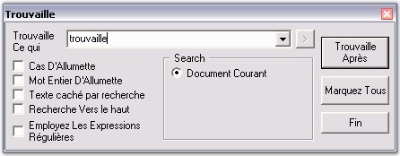
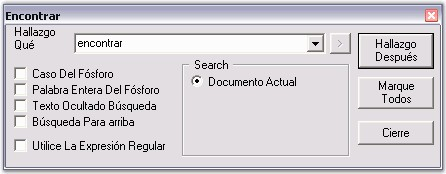
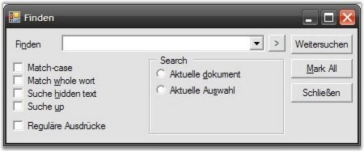

::: {style="DISPLAY: none"}
{#d2h_url_template}{#d2h_package_url style="WIDTH: 0px; DISPLAY: none; HEIGHT: 0px"}
:::

::::: {#nsbanner .d2h_main_nsbanner style="BORDER-BOTTOM: #999999 1px solid; POSITION: relative; PADDING-BOTTOM: 0px; BACKGROUND-COLOR: transparent; PADDING-LEFT: 0px; PADDING-RIGHT: 0px; DISPLAY: none; BORDER-TOP: #999999 1px solid; PADDING-TOP: 0px; LEFT: 0px"}
:::: {#TitleRow .d2h_main_titlerow style="PADDING-BOTTOM: 4px; BACKGROUND-COLOR: transparent; PADDING-LEFT: 22px; WIDTH: 100%; PADDING-RIGHT: 10px; DISPLAY: none; PADDING-TOP: 4px"}
::: {#ienav .d2h_main_ienav style="DISPLAY: none"}
{#D2HPrevious .D2HPreviousEnabled}  {#D2HNext .D2HNextEnabled}
:::
::::
:::::

:::: {#nstext .d2h_main_nstext style="PADDING-BOTTOM: 10px; BACKGROUND-COLOR: transparent; PADDING-LEFT: 22px; PADDING-RIGHT: 10px; HEIGHT: 100%; OVERFLOW: auto; PADDING-TOP: 5px" hasuserbackground="true" valign="bottom"}
::: {#d2h_breadcrumbs .d2h_breadcrumbs}
[Essential Studio User Guide Documentation](ms-xhelp:///?Id=12457748-09e3-4d74-a240-8e049cedf030){.d2h_breadcrumbsNormal}[ \> ]{.d2h_breadcrumbsLinkSeparator}[User Interface Edition](ms-xhelp:///?Id=c29296b7-531c-413b-a0ec-488ca1f7f669){.d2h_breadcrumbsNormal}[ \> ]{.d2h_breadcrumbsLinkSeparator}[Essential Windows](ms-xhelp:///?Id=e60759d8-47a4-4570-9d7a-16a68d63f2ea){.d2h_breadcrumbsNormal}[ \> ]{.d2h_breadcrumbsLinkSeparator}[Essential Edit]{.d2h_breadcrumbsContentsOnly}[ \> ]{.d2h_breadcrumbsLinkSeparator}[Concepts And Features](ms-xhelp:///?Id=7c39cee6-8434-4711-a18e-efaba8ac85c0){.d2h_breadcrumbsNormal}
:::

## Localization and Globalization {#localization-and-globalization style="tab-stops: 0pt"}

[]{style="FONT-FAMILY: 'Trebuchet MS','sans-serif'; COLOR: #15428b; FONT-SIZE: 9pt"} 

In the age of globalization, the market for all goods become more and more internationalized, enforcing the need to provide information in a variety of languages. This is especially true for the software market, where the product itself consists of exclusive localizable information. Translation and customization of software involves a variety of specialists such as programmers, translators, localization engineers, quality assurance (QA) specialists and project managers. International users of computer software expect their software to talk to them in their own language. This is not only a matter of convenience or of national pride, but a matter of productivity. Users who understand a product fully will be more skilled in handling it, and will avoid making mistakes. So, users will prefer applications in their language and adapted to their cultural environment.

[]{style="FONT-FAMILY: 'Trebuchet MS','sans-serif'; COLOR: #15428b; FONT-SIZE: 9pt"} 

The following images shows how the Find dialog in Edit Control is localized to French and Spanish.

[]{style="FONT-FAMILY: 'Trebuchet MS','sans-serif'; COLOR: #15428b; FONT-SIZE: 9pt"} 

{border="0"}

Figure 78: Find dialog localized to French

[]{style="FONT-FAMILY: 'Trebuchet MS','sans-serif'; COLOR: #15428b; FONT-SIZE: 9pt"} 

{border="0"}

Figure 79: Find dialog localized to Spanish

[]{style="FONT-FAMILY: 'Trebuchet MS','sans-serif'; COLOR: #15428b; FONT-SIZE: 9pt"} 

Edit Control supports complete localization of all the dialog boxes associated with it to any desired language. The Neutral Resource files for the Edit Control is available in the directory - \\Edit.Windows\\Src\\LocalizationSet. Follow the steps below to localize the Neutral Resources files.

[]{style="FONT-FAMILY: 'Trebuchet MS','sans-serif'; COLOR: #15428b; FONT-SIZE: 9pt"} 

1.   The neutral resource of every Syncfusion Edit Control is present in the Localization folder of Edit.Windows source code. Assume that C:\\Program Files\\ is the installation path for the Syncfusion components. Here is the path:

 

***C:\\Program Files\\Syncfusion\\Essential Studio\\x.x.x.x\\Windows\\Edit.Windows\\Src\\LocalizationSet v1.1***

 

2.   Inside the LocalizationSet folder, there will be a number of resource files corresponding to the various dialog boxes of the Edit Control package. These resources will contain the form representation of English (Default & Neutral) culture.

[]{style="FONT-FAMILY: 'Trebuchet MS','sans-serif'; COLOR: #15428b; FONT-SIZE: 9pt"} 

3.   Open WinRes from the following location:

 

**C:\\Program Files\\Microsoft Visual Studio 8\\SDK\\v2.0\\bin\\winRes.exe**

 

4.   WinRes is used to work with the Windows Forms resources. The ResEdit tool cannot be used to edit Windows Forms resources because it can be used to work with image and string based resources only.

[]{style="FONT-FAMILY: 'Trebuchet MS','sans-serif'; COLOR: #15428b; FONT-SIZE: 9pt"} 

5.   Open the resources using the WinRes utility, and replace the English strings with the culture equivalent.

[]{style="FONT-FAMILY: 'Trebuchet MS','sans-serif'; COLOR: #15428b; FONT-SIZE: 9pt"} 

For example, the following figure shows the Syncfusion.Windows.Forms.Edit.Dialogs.frmFindDialog.resources file that is opened in the WinRes tool, showing strings in German (strings are converted using some language converter).

[]{style="FONT-FAMILY: 'Trebuchet MS','sans-serif'; COLOR: #15428b; FONT-SIZE: 9pt"} 

{border="0"}

Figure 80: Replacing strings in English to German by using the WinRes Utility

[]{style="FONT-FAMILY: 'Trebuchet MS','sans-serif'; COLOR: #15428b; FONT-SIZE: 9pt"} 

6.   Click File \--\> SaveAs, and select the Culture to be localized (in this case German - German). Now, a new resource file with the name Syncfusion.Windows.Forms.Edit.Dialogs.frmFindDialog.de-DE.resources will be added to the source path.

[]{style="FONT-FAMILY: 'Trebuchet MS','sans-serif'; COLOR: #15428b; FONT-SIZE: 9pt"} 

7.   Similarly, repeat the process for other resources and save them.

[]{style="FONT-FAMILY: 'Trebuchet MS','sans-serif'; COLOR: #15428b; FONT-SIZE: 9pt"} 

8.   Now, in the Visual Studio.NET 2005 Command Prompt, type the following command, and then press ENTER. Make sure that you have the sf.publicsnk file from the Localization folder.

[]{style="FONT-FAMILY: 'Trebuchet MS','sans-serif'; COLOR: #15428b; FONT-SIZE: 9pt"} 

  -------------------------------------------------------------------------------------------------------------------------------------------------------------------------------------------------------------------------------------------
  [al /t:lib /culture:de-DE /out:Syncfusion.Edit.Windows.resources.dll /v:1.0.0.0 /delay+ /keyf:sf.publicsnk /embed: Syncfusion.Windows.Forms.Edit.Dialogs.frmFindDialog.de-DE.resources]{style="FONT-FAMILY: 'Courier New'; COLOR: black"}
  -------------------------------------------------------------------------------------------------------------------------------------------------------------------------------------------------------------------------------------------

[]{style="FONT-FAMILY: 'Trebuchet MS','sans-serif'; COLOR: #15428b; FONT-SIZE: 9pt"} 

9.   Press ENTER. Make sure that you have the sf.publicsnk file from the Localization folder.

[]{style="FONT-FAMILY: 'Trebuchet MS','sans-serif'; COLOR: #15428b; FONT-SIZE: 9pt"} 

10.  The version (1.0.0.0) that you specify for these DLLs in the above al command, should be based on the SatelliteContractVersionAttribute setting in the product AssemblyInfo.cs file in Edit source. Note that the incorrect version won\'t localize the assembly properly.

[]{style="FONT-FAMILY: 'Trebuchet MS','sans-serif'; COLOR: #15428b; FONT-SIZE: 9pt"} 

11.  On successful execution, an Assembly file named Syncfusion.Edit.Windows.resources.dll will be created.

[]{style="FONT-FAMILY: 'Trebuchet MS','sans-serif'; COLOR: #15428b; FONT-SIZE: 9pt"} 

12.  Finally, mark this satellite DLL for verification skipping (since it is has not been signed with the same strong-name as the product assembly), as follows.

[]{style="FONT-FAMILY: 'Trebuchet MS','sans-serif'; COLOR: #15428b; FONT-SIZE: 9pt"} 

  ---------------------------------------------------------------------------------------------------
  [sn --Vr Syncfusion.Edit.Windows.resources.dll]{style="FONT-FAMILY: 'Courier New'; COLOR: black"}
  ---------------------------------------------------------------------------------------------------

[]{style="FONT-FAMILY: 'Trebuchet MS','sans-serif'; COLOR: #15428b; FONT-SIZE: 9pt"} 

13.  Now, drop this DLL into an appropriate subdirectory under your EXE\'s directory (bin\\Debug\\), based on the naming conventions that are enforced in .NET. You should create a folder named "de-DE" under bin/Debug if this DLL contains resources from the German (Germany) culture.

[]{style="FONT-FAMILY: 'Trebuchet MS','sans-serif'; COLOR: #15428b; FONT-SIZE: 9pt"} 

14.  Finally, you should specify your application to fetch the German resources during run time. To change the UI culture of the current thread, add the following code in the Forms constructor before the InitializeComponent().

[]{style="FONT-FAMILY: 'Trebuchet MS','sans-serif'; COLOR: #15428b; FONT-SIZE: 9pt"} 

  --------------------------------------------------------------------------------------------------------------------------------------------------------------------------------------------------------------------------------------------------------------------------------------------------------------------------------------------------------------------------------
  [System.Threading.Thread.CurrentThread.CurrentUICulture = ]{style="FONT-FAMILY: 'Courier New'; COLOR: black"}[new]{style="FONT-FAMILY: 'Courier New'; COLOR: blue"}[ System.Globalization.CultureInfo(]{style="FONT-FAMILY: 'Courier New'; COLOR: black"}[\"de-DE\"]{style="FONT-FAMILY: 'Courier New'; COLOR: maroon"}[); ]{style="FONT-FAMILY: 'Courier New'; COLOR: black"}
  --------------------------------------------------------------------------------------------------------------------------------------------------------------------------------------------------------------------------------------------------------------------------------------------------------------------------------------------------------------------------------

[]{style="FONT-FAMILY: 'Trebuchet MS','sans-serif'; COLOR: #15428b; FONT-SIZE: 9pt"} 

15.  Now, run your application that contains the Syncfusion Edit Control, and open the Find dialog box. You will see the dialog box in German.

[]{style="FONT-FAMILY: 'Trebuchet MS','sans-serif'; COLOR: #15428b; FONT-SIZE: 9pt"} 

{border="0"}

Figure 81: Find dialog box localized to German

[]{#p109} 

[]{#related-topics}
::::
