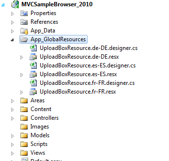
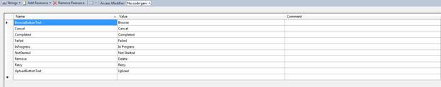
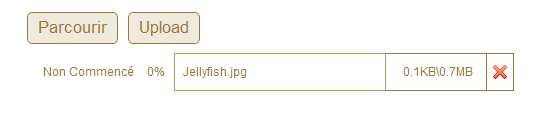

::: {style="DISPLAY: none"}
{#d2h_url_template}{#d2h_package_url style="WIDTH: 0px; DISPLAY: none; HEIGHT: 0px"}
:::

::::::: {.d2h_secondary_topic style="PADDING-BOTTOM: 10pt; MARGIN: 0pt; PADDING-LEFT: 0pt; PADDING-RIGHT: 0pt; PADDING-TOP: 0pt"}
##### Localization support {#localization-support style="tab-stops: 0pt"}

[Localization is the process of customizing the User Interface (UI) as locale-specific, in order to display regional data i.e. in a language and culture specific to a particular country or region.]{style="BACKGROUND: white"}

[This helps to provide IT solutions to global customers in their native languages.]{style="BACKGROUND: white"}

[Localization is done with the help of localized resources by the control. UploadBox provides an inherent support to localize its UI.]{style="BACKGROUND: white"}

 

**Server side Properties**

*[]{style="BACKGROUND: white; COLOR: black; FONT-SIZE: 9pt"}* 

::: {align="center"}
+------------------+-------------------------------------------------------------------------+-------------+-----------------------------------------------------------------------------+------------------+
| **Property**     | **Description**                                                         | **Type**    | **Value it accepts**                                                        | **Dependencies** |
+------------------+-------------------------------------------------------------------------+-------------+-----------------------------------------------------------------------------+------------------+
| Localize         | Get or set the localization culture of Grid                             | String      | A string containing the name of the target System.Globalization.CultureInfo | NA               |
+------------------+-------------------------------------------------------------------------+-------------+-----------------------------------------------------------------------------+------------------+
| LocalizationPath | Get or set the localization resource path of the resource file location | String      | Any string value.                                                           | Localize         |
|                  |                                                                         |             |                                                                             |                  |
|                  |                                                                         |             | Default : "\~/App_GlobalResources"                                          |                  |
+------------------+-------------------------------------------------------------------------+-------------+-----------------------------------------------------------------------------+------------------+
:::

**[]{style="BACKGROUND: white; COLOR: black"}** 

**[Using UploadBox Builder ]{style="BACKGROUND: white; COLOR: black"}**

[To enable localization feature using UploadBox Builder:]{style="BACKGROUND: white; COLOR: black"}

[]{style="BACKGROUND: white; COLOR: black"} 

1.   Create a model in the application

2.   Create a strongly typed view

3.   [Create a folder named **App_GlobalResources** in the application and create your own localization resource (.resx) file in this folder.]{style="BACKGROUND: white"}

[]{style="BACKGROUND: white; COLOR: black"} 

[{border="0"}]{style="BACKGROUND: white"}[]{style="FONT-FAMILY: 'Calibri','sans-serif'; FONT-SIZE: 11pt"}

Figure 333: App_GlobalResource Folder

[]{style="BACKGROUND: white; COLOR: black"} 

[]{style="BACKGROUND: white; COLOR: black"} 

[In order to create a new localization resource file, download the default localization file from the following location, rename it and then use Visual Studio to edit the values.]{style="BACKGROUND: white; COLOR: black"}

[]{style="BACKGROUND: white; COLOR: black"} 

[[UploadBoxResource.zip]{style="FONT-FAMILY: 'Arial','sans-serif'; BACKGROUND: white; COLOR: blue"}](http://www.syncfusion.com/uploads/redirect.aspx?&team=support&file=UploadBoxResource-1690666839.zip)[]{style="BACKGROUND: white; COLOR: black"}

[]{style="BACKGROUND: white; COLOR: black"} 

[The default English localization file is shown in the following screenshot:]{style="BACKGROUND: white; COLOR: black"}

[ {border="0"}]{style="BACKGROUND: white"}[]{style="FONT-FAMILY: 'Calibri','sans-serif'; FONT-SIZE: 11pt"}

Figure 334: Resource File for English Culture

[]{style="BACKGROUND: white; COLOR: black"} 

[]{style="BACKGROUND: white; COLOR: black"} 

[]{style="BACKGROUND: white; COLOR: black"} 

[]{style="BACKGROUND: white; COLOR: black"} 

***[{border="0"}]{style="BACKGROUND: white; COLOR: black; FONT-SIZE: 9pt"}**[Note: The name of the localization file should be in the format UploadBoxResource.\[culture\].resx. For example : \"]{style="BACKGROUND: white; COLOR: black; FONT-SIZE: 9pt"}*** ***[UploadBoxResource.fr-FR.resx \"]{style="BACKGROUND: white; COLOR: black; FONT-SIZE: 9pt"}***

[]{style="BACKGROUND: white; COLOR: black"} 

1.   [Create the UploadBox control in **View** and configure its properties.]{style="BACKGROUND: white"}

2.   [In the controller return to view.]{style="BACKGROUND: white"}

[]{style="BACKGROUND: white"} 

+-------------------------------------------------------------------------------------------------------------------------------------------------------------------------------------------------------------------------------------------------+
| **[\[C#\]]{style="FONT-FAMILY: 'Courier New'"}**[]{style="FONT-FAMILY: 'Courier New'"}                                                                                                                                                          |
|                                                                                                                                                                                                                                                 |
| [ [ ]{style="BACKGROUND: #f0f0f0; COLOR: black"}[public]{style="BACKGROUND: #f0f0f0; COLOR: blue"}[ ]{style="BACKGROUND: #f0f0f0; COLOR: black"}[ActionResult]{style="BACKGROUND: #f0f0f0; COLOR: #2b91af"}[ Index()\                           |
|    {\                                                                                                                                                                                                                                           |
| \                                                                                                                                                                                                                                               |
| ]{style="BACKGROUND: #f0f0f0; COLOR: black"}]{style="FONT-FAMILY: 'Courier New'"}                                                                                                                                                               |
|                                                                                                                                                                                                                                                 |
| [\                                                                                                                                                                                                                                              |
|         ]{style="FONT-FAMILY: 'Courier New'; BACKGROUND: #f0f0f0; COLOR: black"}[return]{style="FONT-FAMILY: 'Courier New'; BACKGROUND: #f0f0f0; COLOR: blue"}[ View();]{style="FONT-FAMILY: 'Courier New'; BACKGROUND: #f0f0f0; COLOR: black"} |
|                                                                                                                                                                                                                                                 |
| [   }]{style="FONT-FAMILY: 'Courier New'; BACKGROUND: #f0f0f0; COLOR: black"}                                                                                                                                                                   |
+-------------------------------------------------------------------------------------------------------------------------------------------------------------------------------------------------------------------------------------------------+

[]{style="BACKGROUND: white; COLOR: black"} 

[Specifying the culture using **Localize**() method:]{style="BACKGROUND: white"}

[]{style="BACKGROUND: white; COLOR: black"} 

::: {align="center"}
+---------------------------------------------------------------------------------------------------------------------------------------------------------------------------------------------------------------------+
| **[\[ASPX\]]{style="FONT-FAMILY: 'Courier New'"}**                                                                                                                                                                  |
|                                                                                                                                                                                                                     |
| **[]{style="FONT-FAMILY: 'Courier New'"}**                                                                                                                                                                          |
|                                                                                                                                                                                                                     |
| [            [\<%]{style="BACKGROUND: yellow"}[=]{style="COLOR: blue"} Html.Syncfusion().UploadBox([\"upload\"]{style="COLOR: #a31515"})]{style="FONT-FAMILY: 'Courier New'"}[]{style="FONT-FAMILY: 'Courier New'"} |
|                                                                                                                                                                                                                     |
| [                             .AsyncUpload]{style="FONT-FAMILY: 'Courier New'"}                                                                                                                                     |
|                                                                                                                                                                                                                     |
| [                             (]{style="FONT-FAMILY: 'Courier New'"}                                                                                                                                                |
|                                                                                                                                                                                                                     |
| [                                 s =\> s.AutoUpload([false]{style="COLOR: blue"})]{style="FONT-FAMILY: 'Courier New'"}                                                                                             |
|                                                                                                                                                                                                                     |
| [                                     .SaveAction([\"Save\"]{style="COLOR: #a31515"}, [\"uploadbox\"]{style="COLOR: #a31515"})]{style="FONT-FAMILY: 'Courier New'"}                                                 |
|                                                                                                                                                                                                                     |
| [                                     .RemoveAction([\"Remove\"]{style="COLOR: #a31515"}, [\"uploadbox\"]{style="COLOR: #a31515"})]{style="FONT-FAMILY: 'Courier New'"}                                             |
|                                                                                                                                                                                                                     |
| [                             ).AutoFormat([Skins]{style="COLOR: #2b91af"}.Sandune)]{style="FONT-FAMILY: 'Courier New'"}                                                                                            |
|                                                                                                                                                                                                                     |
| [                           .Localize([\"fr-FR\"]{style="COLOR: #a31515"})]{style="FONT-FAMILY: 'Courier New'"}                                                                                                     |
|                                                                                                                                                                                                                     |
| [                           .LocalizationPath([\"\~/Content\"]{style="COLOR: #a31515"})  [%\>]{style="BACKGROUND: yellow"}]{style="FONT-FAMILY: 'Courier New'"}                                                     |
+---------------------------------------------------------------------------------------------------------------------------------------------------------------------------------------------------------------------+
:::

[]{style="BACKGROUND: white; COLOR: black"} 

3.   [Run the application. The control will appear as shown below:]{style="BACKGROUND: white"}

[]{style="BACKGROUND: white; COLOR: black"} 

[{border="0"}]{style="BACKGROUND: white"}[]{style="FONT-FAMILY: 'Calibri','sans-serif'; FONT-SIZE: 11pt"}

Figure 335: UploadBoxWith French Culture

 

**Using UploadBoxPropertiesModel:[]{style="FONT-FAMILY: 'Calibri','sans-serif'; FONT-SIZE: 11pt"}**

[  ]{style="FONT-FAMILY: 'Courier New'; BACKGROUND: white; COLOR: black"}[]{style="BACKGROUND: white; COLOR: black"}

[To enable localization feature using UploadBoxPropertiesModel:]{style="BACKGROUND: white; COLOR: black"}

1.   [Follow the first two steps that are listed under the **Using UploadBox Builder** method.]{style="BACKGROUND: white"}

2.   [Then, add the following code in the **View **page, to create the UploadBox control in the View.]{style="BACKGROUND: white"}

[]{style="BACKGROUND: white; COLOR: black"} 

::: {align="center"}
+------------------------------------------------------------------------------------------------------------------------------------------------------------------------------------------------------------------------------------------------------------+
| **[\[ASPX\]]{style="FONT-FAMILY: 'Courier New'"}**[]{style="FONT-FAMILY: 'Courier New'"}                                                                                                                                                                   |
|                                                                                                                                                                                                                                                            |
| [   [\<%]{style="BACKGROUND: yellow"}[=]{style="COLOR: blue"} Html.Syncfusion().UploadBox([\"uploadbox\"]{style="COLOR: #a31515"}, ([UploadBoxModel]{style="COLOR: #2b91af"})Model) [%\>]{style="BACKGROUND: yellow"}]{style="FONT-FAMILY: 'Courier New'"} |
+------------------------------------------------------------------------------------------------------------------------------------------------------------------------------------------------------------------------------------------------------------+
:::

[]{style="BACKGROUND: white; COLOR: black"} 

+--------------------------------------------------------------------------------------------------------------------------------------------------------------------------------------------------------------------------------------------------------------------------------------------------------------------------------------------------------------------+
| **[\[Razor\]]{style="FONT-FAMILY: 'Courier New'"}**[]{style="FONT-FAMILY: 'Courier New'"}                                                                                                                                                                                                                                                                          |
|                                                                                                                                                                                                                                                                                                                                                                    |
| [     [@(]{style="BACKGROUND: yellow"} [new]{style="COLOR: blue"} [HtmlString]{style="COLOR: #2b91af"}(Html.Syncfusion().UploadBox([\"upload\"]{style="COLOR: #a31515"},([UploadBoxModel]{style="COLOR: #2b91af"})Model).ToString())[)]{style="BACKGROUND: yellow"}]{style="FONT-FAMILY: 'Courier New'"}[]{style="FONT-FAMILY: 'Courier New'; BACKGROUND: yellow"} |
|                                                                                                                                                                                                                                                                                                                                                                    |
| []{style="FONT-FAMILY: 'Courier New'; BACKGROUND: yellow"}                                                                                                                                                                                                                                                                                                         |
+--------------------------------------------------------------------------------------------------------------------------------------------------------------------------------------------------------------------------------------------------------------------------------------------------------------------------------------------------------------------+

[]{style="BACKGROUND: white; COLOR: black"} 

3.   [You can specify the culture information, as shown in the previous section- **Using UploadBox Builder.**]{style="BACKGROUND: white"}

4.   [Create an UploadBoxModel in the Index method, and use Localize property to specify the culture details.]{style="BACKGROUND: white"}

[]{style="BACKGROUND: white"} 

::: {align="center"}
+---------------------------------------------------------------------------------------------------------------------------------------------------------------------------+
| **[\[Controller\]]{style="FONT-FAMILY: 'Courier New'"}**[]{style="FONT-FAMILY: 'Courier New'"}                                                                            |
|                                                                                                                                                                           |
| [        [public]{style="COLOR: blue"} [ActionResult]{style="COLOR: #2b91af"} Index()]{style="FONT-FAMILY: 'Courier New'"}[]{style="FONT-FAMILY: 'Courier New'"}          |
|                                                                                                                                                                           |
| [        {]{style="FONT-FAMILY: 'Courier New'"}                                                                                                                           |
|                                                                                                                                                                           |
| [    ]{style="FONT-FAMILY: 'Courier New'"}                                                                                                                                |
|                                                                                                                                                                           |
| [            [UploadBoxModel]{style="COLOR: #2b91af"} model = [new]{style="COLOR: blue"} [UploadBoxModel]{style="COLOR: #2b91af"}();]{style="FONT-FAMILY: 'Courier New'"} |
|                                                                                                                                                                           |
| [         [//  ..]{style="COLOR: green"}]{style="FONT-FAMILY: 'Courier New'"}                                                                                             |
|                                                                                                                                                                           |
| []{style="FONT-FAMILY: 'Courier New'"}                                                                                                                                    |
|                                                                                                                                                                           |
| [            model.Localize = [\"fr-FR\"]{style="COLOR: #a31515"};]{style="FONT-FAMILY: 'Courier New'"}                                                                   |
|                                                                                                                                                                           |
| [            model.LocalizationPath = [\"\~/Content\"]{style="COLOR: #a31515"};]{style="FONT-FAMILY: 'Courier New'"}                                                      |
|                                                                                                                                                                           |
| [            [return]{style="COLOR: blue"} View(model);]{style="FONT-FAMILY: 'Courier New'"}                                                                              |
|                                                                                                                                                                           |
| []{style="FONT-FAMILY: 'Courier New'"}                                                                                                                                    |
|                                                                                                                                                                           |
| [        }]{style="FONT-FAMILY: 'Courier New'"}                                                                                                                           |
|                                                                                                                                                                           |
| []{style="FONT-FAMILY: 'Courier New'"}                                                                                                                                    |
+---------------------------------------------------------------------------------------------------------------------------------------------------------------------------+
:::

[]{style="BACKGROUND: white; COLOR: black"} 

[]{style="BACKGROUND: white; COLOR: black"} 

5.   [Run the application. The output you get will be as follows:]{style="BACKGROUND: white"}

[]{style="BACKGROUND: white; COLOR: black"} 

[{border="0"}]{style="BACKGROUND: white"}[]{style="FONT-FAMILY: 'Calibri','sans-serif'; FONT-SIZE: 11pt"}

Figure 336: UploadBox with French Culture

[]{style="BACKGROUND: white; COLOR: black"} 

[]{#related-topics}
:::::::
