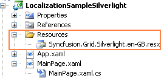
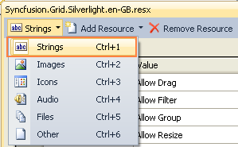
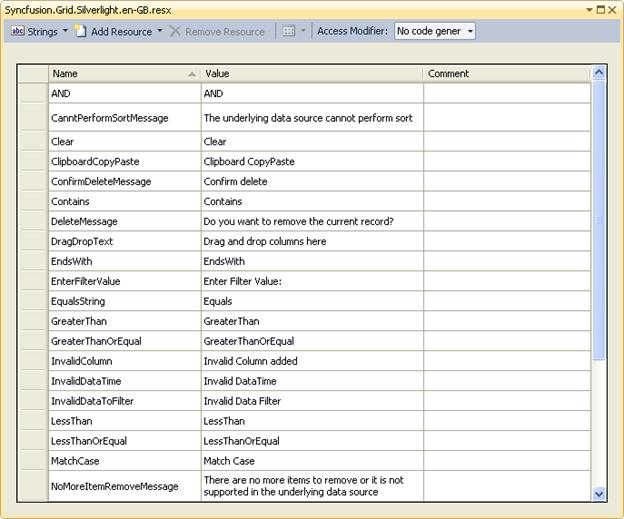

::: {style="DISPLAY: none"}
{#d2h_url_template}{#d2h_package_url style="WIDTH: 0px; DISPLAY: none; HEIGHT: 0px"}
:::

::::: {#nsbanner .d2h_main_nsbanner style="BORDER-BOTTOM: #999999 1px solid; POSITION: relative; PADDING-BOTTOM: 0px; BACKGROUND-COLOR: transparent; PADDING-LEFT: 0px; PADDING-RIGHT: 0px; DISPLAY: none; BORDER-TOP: #999999 1px solid; PADDING-TOP: 0px; LEFT: 0px"}
:::: {#TitleRow .d2h_main_titlerow style="PADDING-BOTTOM: 4px; BACKGROUND-COLOR: transparent; PADDING-LEFT: 22px; WIDTH: 100%; PADDING-RIGHT: 10px; DISPLAY: none; PADDING-TOP: 4px"}
::: {#ienav .d2h_main_ienav style="DISPLAY: none"}
{#D2HPrevious .D2HPreviousEnabled}  {#D2HNext .D2HNextEnabled}
:::
::::
:::::

::::: {#nstext .d2h_main_nstext style="PADDING-BOTTOM: 10px; BACKGROUND-COLOR: transparent; PADDING-LEFT: 22px; PADDING-RIGHT: 10px; HEIGHT: 100%; OVERFLOW: auto; PADDING-TOP: 5px" hasuserbackground="true" valign="bottom"}
::: {#d2h_breadcrumbs .d2h_breadcrumbs}
[Essential Studio User Guide Documentation](ms-xhelp:///?Id=12457748-09e3-4d74-a240-8e049cedf030){.d2h_breadcrumbsNormal}[ \> ]{.d2h_breadcrumbsLinkSeparator}[User Interface Edition](ms-xhelp:///?Id=c29296b7-531c-413b-a0ec-488ca1f7f669){.d2h_breadcrumbsNormal}[ \> ]{.d2h_breadcrumbsLinkSeparator}[Essential Silverlight](ms-xhelp:///?Id=66221bd1-ba2e-43c2-94a7-618f50e01d24){.d2h_breadcrumbsNormal}[ \> ]{.d2h_breadcrumbsLinkSeparator}[Essential Grid]{.d2h_breadcrumbsContentsOnly}[ \> ]{.d2h_breadcrumbsLinkSeparator}[Concepts and Features](ms-xhelp:///?Id=8126789d-b192-4c3c-9e36-f0119f12b8b9){.d2h_breadcrumbsNormal}[ \> ]{.d2h_breadcrumbsLinkSeparator}[Grid Data Control](ms-xhelp:///?Id=274d1d61-9e05-49c5-b342-4e032fc4daa1){.d2h_breadcrumbsNormal}
:::

### Localization Support {#localization-support style="tab-stops: 0pt"}

Localization is the process of making your application to multi-lingual by formatting content according to Culture. This involves configuring the application for the specific languages. Culture is the combination of Language and the Location (e.g. En-US is the Culture for English spoken at United States; En-GB is the Culture for English spoken at Great Britain). Syncfusion Grid allows you to set custom resource through Resx file. You can simply give the string values in resource file for a specific Culture and set the Culture in his application. The given string values will be set to the Grid which does not affect the Code Block of the Grid.

[]{#_Use_Case_Scenarios}[]{#_Adding_<FEATURE_NAME>}**[]{style="FONT-FAMILY: 'Trebuchet MS','sans-serif'; COLOR: #15428b; FONT-SIZE: 9pt"}** 

Adding Localization to an Application

The following steps explain the implementation of the Localization support to an application.

[]{style="FONT-FAMILY: 'Trebuchet MS','sans-serif'; COLOR: #15428b; FONT-SIZE: 9pt"} 

1.   Create an application

 

Create a Silverlight application and add GridDataControl to it.

[]{style="FONT-FAMILY: 'Trebuchet MS','sans-serif'; COLOR: #15428b; FONT-SIZE: 9pt"} 

2.   Create a Resource File

 

Create a folder named Resources in the application. Create a resource file (Resx file) and name it as Syncfusion.Grid.Silverlight. \<your culture info name\>.resx

Example: Syncfusion.Grid.Silverlight.en-GB.resx. It is mandatory to use this naming convention.

The following screenshot explains the same.

 

{border="0"}

Figure 184: Adding Resource file to the Application.

 

 

3.   Selecting the String option in the Resource file.

Select the String option in the Resource file. The following screenshot explains the same.

 

{border="0"}

Figure 185: Selecting and adding String Resources to the Resource file of the Application.

 

Enter the Name and Value. The Names used in the Grid is given in the [Property]{style="COLOR: windowtext; TEXT-DECORATION: none; text-underline: none"} table mentioned below.

The following screenshot explains the same.

{border="0"}

Figure 186: Screenshot of the filled String Resources (Language: Britain English)

 

4.   Set the CultureInfo to the application

 

Assign the CultureInfo to the application before the **InitializeComponent()** method is being called. Now your application is set to the Britain English CultureInfo.

 

The following code snippet explains the implementation of the same.

**** 

+--------------------------------------------------------------------------------------------------------------------------------------------------------------------------------------------------------------------------------------------------------------------------------+
| **[\[C#\]]{style="FONT-FAMILY: 'Courier New'"}**                                                                                                                                                                                                                               |
|                                                                                                                                                                                                                                                                                |
| **[]{style="FONT-FAMILY: 'Courier New'"}**                                                                                                                                                                                                                                     |
|                                                                                                                                                                                                                                                                                |
| [        [public]{style="COLOR: blue"} MainWindow()]{style="FONT-FAMILY: 'Courier New'"}                                                                                                                                                                                       |
|                                                                                                                                                                                                                                                                                |
| [        {]{style="FONT-FAMILY: 'Courier New'"}                                                                                                                                                                                                                                |
|                                                                                                                                                                                                                                                                                |
| [            System.Threading.[Thread]{style="COLOR: #2b91af"}.CurrentThread.CurrentUICulture = [new]{style="COLOR: blue"}               System.Globalization.[CultureInfo]{style="COLOR: #2b91af"}([\"en-GB\"]{style="COLOR: #a31515"});]{style="FONT-FAMILY: 'Courier New'"} |
|                                                                                                                                                                                                                                                                                |
| []{style="FONT-FAMILY: 'Courier New'"}                                                                                                                                                                                                                                         |
|                                                                                                                                                                                                                                                                                |
| [            InitializeComponent();]{style="FONT-FAMILY: 'Courier New'"}                                                                                                                                                                                                       |
|                                                                                                                                                                                                                                                                                |
| [        }]{style="FONT-FAMILY: 'Courier New'"}                                                                                                                                                                                                                                |
+--------------------------------------------------------------------------------------------------------------------------------------------------------------------------------------------------------------------------------------------------------------------------------+

 

5.   Add Supported Cultures to the Application

 

To add Supported Cultures, follow the below steps:

[·      ]{style="FONT-FAMILY: Symbol"}In the Solution Explorer, right-click application project and choose "**Unload Project**" from the Context Menu. The project will then be unavailable.

[·      ]{style="FONT-FAMILY: Symbol"}Right click the project again, and select the Edit \<ProjectName\>.csproj option.

[·      ]{style="FONT-FAMILY: Symbol"}**Example:** LocalizationSampleSilverlight.csproj

[·      ]{style="FONT-FAMILY: Symbol"}In the .csproj file, find the \<SupportedCultures\>\</SupportedCultures\> tags. Default the tags will be empty. So, add the cultures you want to be supported, separating each with a semicolon if many.

[·      ]{style="FONT-FAMILY: Symbol"}**Example:** \<SupportedCultures\>en-GB;de;hi;es;it;Ja\</SupportedCultures\>

[·      ]{style="FONT-FAMILY: Symbol"}Save the project and Reload it by right clicking the \<ProjectName\>.csproj and choose Reload \<ProjectName\>.csproj.

[]{#_Properties} 

[Properties]{#PropertiesLocalicationGDC}

Table 18: Localization Property Table

::: {align="center"}
  ------------------------------- ---------------------------------------------------- -------- ----------- -----------------
  Property                        Description                                          Type     Data Type   Reference links
  AND                             Sets the string for AND                              static   string      \-
  CanntPerformSortMessage         Sets the string for CanntPerformSortMessage          static   string      \-
  ClipboardCopyPaste              Sets the string for ClipboardCopyPaste               static   string      \-
  Clear                           Sets the string for Clear                            static   string      \-
  ColumnFormat                    Sets the string for ColumnFormat                     static   string      \-
  ConfirmDeleteMessage            Sets the string for ConfirmDeleteMessage             static   string      \-
  Contains                        Sets the string for Contains                         static   string      \-
  CurrentPageText                 Sets the string for CurrentPageText                  static   string      \-
  DeleteMessage                   Sets the string for DeleteMessage                    static   string      \-
  DragDropText                    Sets the string for DragDropText                     static   string      \-
  EndsWith                        Sets the string for EndsWith                         static   string      \-
  EnterFilterValue                Sets the string for EnterFilterValue                 static   string      \-
  Equals                          Sets the string for Equals                           static   string      \-
  GreaterThan                     Sets the string for GreaterThan                      static   string      \-
  GreaterThanOrEqual              Sets the string for GreaterThanOrEqual               static   string      \-
  InvalidColumn                   Sets the string for InvalidColumn                    static   string      \-
  InvalidDataTime                 Sets the string for InvalidDataTime                  static   string      \-
  InvalidDataToFilter             Sets the string for InvalidDataToFilter              static   string      \-
  LessThan                        Sets the string for LessThan                         static   string      \-
  LessThanOrEqual                 Sets the string for LessThanOrEqual                  static   string      \-
  MatchCase                       Sets the string for MatchCase                        static   string      \-
  NoMoreItemRemoveMessage         Sets the string for NoMoreItemRemoveMessage          static   string      \-
  None                            Sets the string for None                             static   string      \-
  NoRecordsfound                  Sets the string for NoRecordsfound                   static   string      \-
  NotEnoughSpaceMessage           Sets the string for NotEnoughSpaceMessage            static   string      \-
  NotEquals                       Sets the string for NotEquals                        static   string      \-
  NotSupportDeletingItemMessage   Sets the string for  NotSupportDeletingItemMessage   static   string      \-
  OR                              Sets the string for OR                               static   string      \-
  SelectAllFilter                 Sets the string for SelectAllFilter                  static   string      \-
  StartsWith                      Sets the string for StartsWith                       static   string      \-
  ------------------------------- ---------------------------------------------------- -------- ----------- -----------------
:::

[]{style="FONT-FAMILY: 'Calibri','sans-serif'; COLOR: black"} 

Sample Link

[[http://www.syncfusion.com/uploads/redirect.aspx?&team=support&file=LocalizationSampleSilverlight2110978758.zip]{.UGHyperlink}](http://www.syncfusion.com/uploads/redirect.aspx?&team=support&file=LocalizationSampleSilverlight2110978758.zip)[]{.UGHyperlink}

[]{style="FONT-FAMILY: 'Microsoft Sans Serif','sans-serif'; FONT-SIZE: 8.5pt"} 

[]{#related-topics}
:::::
