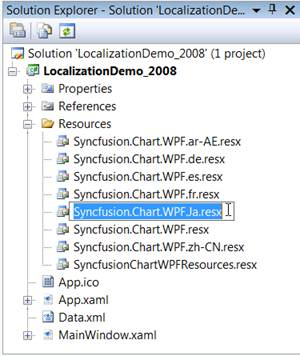
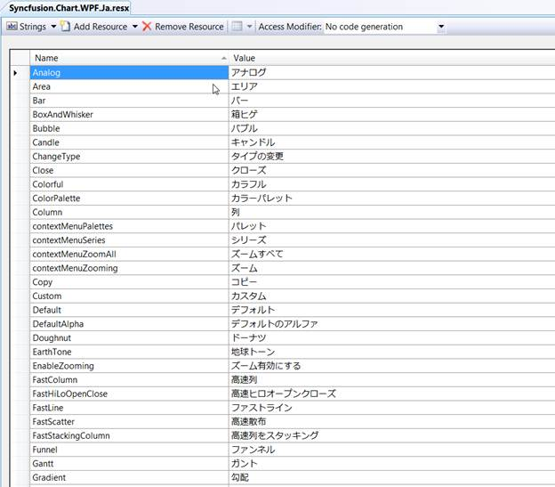
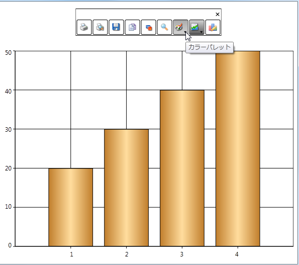

::: {style="DISPLAY: none"}
{#d2h_url_template}{#d2h_package_url style="WIDTH: 0px; DISPLAY: none; HEIGHT: 0px"}
:::

:::: {.d2h_secondary_topic style="PADDING-BOTTOM: 10pt; MARGIN: 0pt; PADDING-LEFT: 0pt; PADDING-RIGHT: 0pt; PADDING-TOP: 0pt"}
#### Localization Support {#localization-support style="tab-stops: 0pt"}

Localization is the process of making your application multi-lingual, by formatting content according to cultures. This involves configuring the application for a specific language. Culture is the combination of language and location (e.g. En-US is the culture for English spoken in  United States; En-GB is the culture for English spoken in  Great Britain). Syncfusion Chart allows you to set custom resource through the Resx file. You can simply give the string values in the resource file for a specific culture and set the culture in the application. The given string values will be set to the Chart, which does not affect the Code Block of the chart. 

 

Use Case Scenario

The Essential Chart WPF can be localized according to the native language. It thus helps you to use the Chart more effectively.

 

Adding Localization to an Application

The following steps explain the implementation of Localization support in applications.

 

Creating an Application

Create a WPF application and add Chart control to it.

 

Creating a Resource File

To create a Resource file:

1.   Create a folder named **Resources** in the application.

2.   Create a resource file (Resx file) and name it Syncfusion.Chart.Wpf\<*your culture info name*\>.resx E.g. Syncfusion.Chart.WPF.Ja.resx

Use the prescribed naming convention as it is mandatory.

The following screenshot explains the addition of a Resource file to the application.

[]{style="FONT-FAMILY: 'Trebuchet MS','sans-serif'; COLOR: #15428b; FONT-SIZE: 9pt"} 

{border="0"}

Figure 265: Adding a Resource File to the Application

[]{style="COLOR: #15428b"} 

Enter the "Name" and "Value" in the Resource file.

The String Property names used in the  Chart are given in the [[Properties]{.UGHyperlink}]() table. This is explained in the following screenshot.

{border="0"}

Figure 266: Screenshot of the filled String Resources (Language:  Japanese)

 

Setting the Culture Information in the Application

The culture information should be set in the application before the InitializeComponent() method is called. Now, the application is set to Japanese Culture info. The following code snippet explains the implementation of this.

**** 

+---------------------------------------------------------------------------------------------------------------------------------------------------------------------------------------------------------------------------------------------------+
| **[\[C#\]]{style="FONT-FAMILY: 'Courier New'"}**                                                                                                                                                                                                  |
|                                                                                                                                                                                                                                                   |
| []{style="FONT-FAMILY: 'Courier New'"}                                                                                                                                                                                                            |
|                                                                                                                                                                                                                                                   |
| []{style="FONT-FAMILY: 'Courier New'; COLOR: blue"}                                                                                                                                                                                               |
|                                                                                                                                                                                                                                                   |
| [System.Threading.[Thread]{style="COLOR: #2b91af"}.CurrentThread.CurrentUICulture = [new]{style="COLOR: blue"} System.Globalization.[CultureInfo]{style="COLOR: #2b91af"}([\"ja\"]{style="COLOR: #a31515"});]{style="FONT-FAMILY: 'Courier New'"} |
|                                                                                                                                                                                                                                                   |
| []{style="FONT-FAMILY: 'Courier New'"}                                                                                                                                                                                                            |
+---------------------------------------------------------------------------------------------------------------------------------------------------------------------------------------------------------------------------------------------------+

 

{border="0"}

Figure 267: Localization Support

 

[]{#_Properties}Table 178: Localization Property Table

::: {align="center"}
  Property               Description                                             Type     Data Type
  ---------------------- ------------------------------------------------------- -------- -----------
  Analog                 Sets the string for the Analog property                 static   string
  Area                   Sets the string for the Area property                   static   string
  Bar                    Sets the string for the Bar property                    static   string
  BoxAndWhisker          Sets the string for the Box and Whisker property        static   string
  Bubble                 Sets the string for the Bubble property                 static   string
  Candle                 Sets the string for the Candle property                 static   string
  ChangeType             Sets the string for the ChangeType property             static   string
  Close                  Sets the string for the Close property                  static   string
  Colorful               Sets the string for the Colorful property               static   string
  ColorPalette           Sets the string for the ColorPalette property           static   string
  Column                 Sets the string for the Column property                 static   string
  contextMenuPalettes    Sets the string for the ContextMenuPalette property     static   string
  contextMenuSeries      Sets the string for the ContextMenuSeries property      static   string
  contextMenuZoomAll     Sets the string for the ContextMenuZoomAll property     static   string
  contextMenuZooming     Sets the string for the ContextmenuZooming  property    static   string
  Copy                   Sets the string for the Copy property                   static   string
  Custom                 Sets the string for the Custom property                 static   string
  Default                Sets the string for the Default property                static   string
  DefaultAlpha           Sets the string for the DefaultAlpha property           static   string
  Doughnut               Sets the string for the Dhoughnut property              static   string
  EarthTone              Sets the string for the EarthTone property              static   string
  EnableZooming          Sets the string for the EnableZooming property          static   string
  FastColumn             Sets the string for the FastColumn property             static   string
  FastHiLoOpenClose      Sets the string for the FastHiLoOpenClose property      static   string
  FastLine               Sets the string for the FastLine property               static   string
  FastScatter            Sets the string for the FastScatter property            static   string
  FastStackingColumn     Sets the string for the FastStackingColumn property     static   string
  Funnel                 Sets the string for the Funnel property                 static   string
  Gantt                  Sets the string for the Gantt property                  static   string
  Gradient               Sets the string for the Gradient property               static   string
  Grayscale              Sets the string for the GrayScale property              static   string
  HiLo                   Sets the string for the HiLo property                   static   string
  HiLoArea               Sets the string for the HiLoArea property               static   string
  HiLoOpenClose          Sets the string for the HiLoOpenClose property          static   string
  Histogram              Sets the string for the Histogram property              static   string
  Kagi                   Sets the string for Kagi property                       static   string
  LegendWindowCancel     Sets the string for the LegendWindowControl property    static   string
  LegendWindowCheckBox   Sets the string for the LegendWindowCheckBox property   static   string
  LegendWindowIcon       Sets the string for the LegendWindowIcon property       static   string
  LegendWindowOK         Sets the string for the legendWindowOk property         static   string
  LegendWindowTitle      Sets the string for the LegendWindowTiltle property     static   string
  Line                   Sets the string for the Line property                   static   string
  Nature                 Sets the string for the Nature property                 static   string
  Office2007Black        Sets the string for the Office2007Black property        static   string
  Office2007Blue         Sets the string for the Office2007Blue property         static   string
  Office2007Silver       Sets the string for the Office2007Silver property       static   string
  Palette1               Sets the string for the Palette1 property               static   string
  Palette2               Sets the string for the Palette2 property               static   string
  Palette3               Sets the string for the Palette3 property               static   string
  Palette4               Sets the string for the Palette4 property               static   string
  Palette5               Sets the string for the Palette5 property               static   string
  Palette6               Sets the string for the Palette6 property               static   string
  Palette7               Sets the string for the Palette7 property               static   string
  Palette8               Sets the string for the Palette8 property               static   string
  Panning                Sets the string for the Panning property                static   string
  Pastel                 Sets the string for the Pastel property                 static   string
  Pie                    Sets the string for the Pie property                    static   string
  PointAndFigure         Sets the string for the PointAndFigure property         static   string
  Polar                  Sets the string for the Polar property                  static   string
  printDialogAdvanced    Sets the string for the PrintDialogAdvanced property    static   string
:::

[]{style="FONT-FAMILY: 'Calibri','sans-serif'; COLOR: black"} 

Sample Link

To run the UI WPF Chart samples:

1.   Open Essential Studio Dashboard by selecting Start -\> Program -\> Syncfusion-\> Essential Studio \<\<Version Number\>\> -\> Dashboard.

2.   Click Run locally installed samples from the WPF drop-down list on the User Interface pane.

3.   Select Chart on the sample browser.

4.   Select User Interaction -\> Localization Demo on the Essential Chart pane and click the Run Sample button.

To open the sample projects:

1.   Go to the following sample location in your system: 

2.   "\<sample installation location\>\\Syncfusion\\EssentialStudio\\Version Number \\WPF\\Chart.WPF\\Samples\\3.5\\WindowsSamples\\User Interaction\\Localization Demo"

3.   This location contains two sub folders CS and VB.  You can open the sample projects from the respective folders based on your application developing language.

[]{#related-topics}
::::
