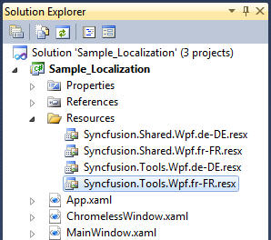
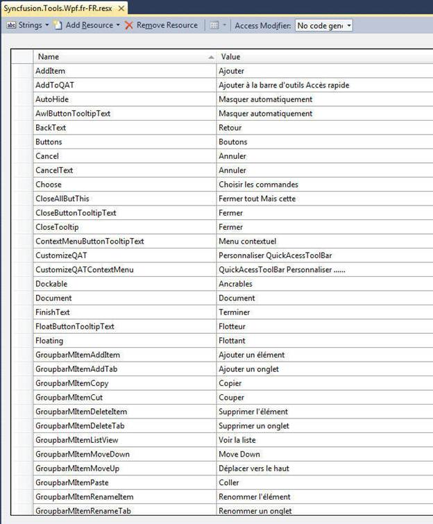
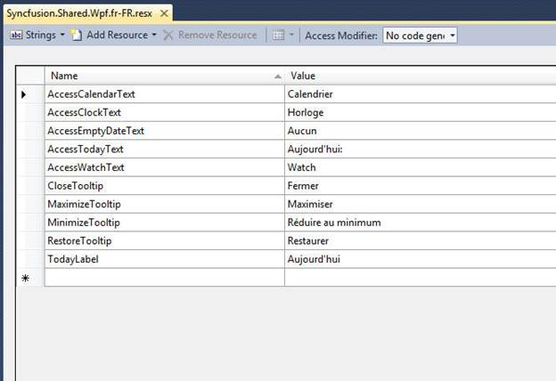
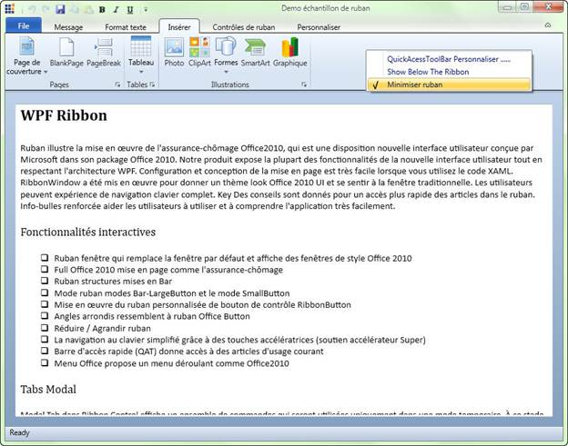

::: {style="DISPLAY: none"}
{#d2h_url_template}{#d2h_package_url style="WIDTH: 0px; DISPLAY: none; HEIGHT: 0px"}
:::

::::: {#nsbanner .d2h_main_nsbanner style="BORDER-BOTTOM: #999999 1px solid; POSITION: relative; PADDING-BOTTOM: 0px; BACKGROUND-COLOR: transparent; PADDING-LEFT: 0px; PADDING-RIGHT: 0px; DISPLAY: none; BORDER-TOP: #999999 1px solid; PADDING-TOP: 0px; LEFT: 0px"}
:::: {#TitleRow .d2h_main_titlerow style="PADDING-BOTTOM: 4px; BACKGROUND-COLOR: transparent; PADDING-LEFT: 22px; WIDTH: 100%; PADDING-RIGHT: 10px; DISPLAY: none; PADDING-TOP: 4px"}
::: {#ienav .d2h_main_ienav style="DISPLAY: none"}
{#D2HPrevious .D2HPreviousEnabled}  {#D2HNext .D2HNextEnabled}
:::
::::
:::::

:::::: {#nstext .d2h_main_nstext style="PADDING-BOTTOM: 10px; BACKGROUND-COLOR: transparent; PADDING-LEFT: 22px; PADDING-RIGHT: 10px; HEIGHT: 100%; OVERFLOW: auto; PADDING-TOP: 5px" hasuserbackground="true" valign="bottom"}
::: {#d2h_breadcrumbs .d2h_breadcrumbs}
[Essential Studio User Guide Documentation](ms-xhelp:///?Id=12457748-09e3-4d74-a240-8e049cedf030){.d2h_breadcrumbsNormal}[ \> ]{.d2h_breadcrumbsLinkSeparator}[User Interface Edition](ms-xhelp:///?Id=c29296b7-531c-413b-a0ec-488ca1f7f669){.d2h_breadcrumbsNormal}[ \> ]{.d2h_breadcrumbsLinkSeparator}[Essential WPF](ms-xhelp:///?Id=7f4f82c5-151c-4262-94d0-75c4626c77bc){.d2h_breadcrumbsNormal}[ \> ]{.d2h_breadcrumbsLinkSeparator}[Essential Tools]{.d2h_breadcrumbsContentsOnly}[ \> ]{.d2h_breadcrumbsLinkSeparator}[Tools WPF Controls](ms-xhelp:///?Id=2ea58a12-9426-4a63-96b4-89eb80232c2c){.d2h_breadcrumbsNormal}
:::

## Localization Support {#localization-support style="tab-stops: 0pt"}

Localization is the process of making your application multi-lingual, by formatting content according to cultures. This involves configuring the application for a specific language. Culture is the combination of language and location (e.g. En-US is the culture for English spoken in  United States; En-GB is the culture for English spoken in  Great Britain). Syncfusion Tools allows you to set custom resource through the Resx file. You can simply give the string values in the resource file for a specific culture and set the culture in the application. The given string values will be set to the Tools controls, which does not affect the Code Block.

[]{style="FONT-FAMILY: 'Times New Roman','serif'; FONT-SIZE: 11pt"} 

Use Case Scenario

The Essential Tools WPF controls can be localized according to the native language. It thus helps you to use the Tools controls more effectively. 

 

Properties, Methods and Events Tables

 

**Properties**

*[]{style="FONT-SIZE: 9pt"}* 

*[]{style="FONT-SIZE: 9pt"}* 

Table 14: Syncfusion.Tools.Wpf Localization Property Table

::: {align="center"}
+----------------------------------------------------+--------------------------------------------------------------------------------------------------------+-----------------+-----------------+
| Property                                           | Description                                                                                            | Type            | Data Type       |
+====================================================+========================================================================================================+=================+=================+
| AddItem[]{style="FONT-SIZE: 12pt"}                 | Sets the string for Add button content in Ribbon QAT customization dialog window                       | static          | string          |
+----------------------------------------------------+--------------------------------------------------------------------------------------------------------+-----------------+-----------------+
| AddToQAT[]{style="FONT-SIZE: 12pt"}                | Sets the string for the AddToQAT context menu item in Ribbon                                           | static          | string          |
+----------------------------------------------------+--------------------------------------------------------------------------------------------------------+-----------------+-----------------+
| AutoHide[]{style="FONT-SIZE: 12pt"}                | Sets the string for AutoHide context menu item in Docking Manager                                      | static          | string          |
+----------------------------------------------------+--------------------------------------------------------------------------------------------------------+-----------------+-----------------+
| AwlButtonTooltipText[]{style="FONT-SIZE: 12pt"}    | Sets the string for the ToolTip of Auto Hide button in Docking Manager                                 | static          | string          |
+----------------------------------------------------+--------------------------------------------------------------------------------------------------------+-----------------+-----------------+
| BackText[]{style="FONT-SIZE: 12pt"}                | Sets the string for the Back button content in Wizard control.                                         | static          | string          |
+----------------------------------------------------+--------------------------------------------------------------------------------------------------------+-----------------+-----------------+
| Buttons[]{style="FONT-SIZE: 12pt"}                 | Sets the string for Group Bar Buttons   Menu Item                                                      | static          | string          |
+----------------------------------------------------+--------------------------------------------------------------------------------------------------------+-----------------+-----------------+
| Cancel[]{style="FONT-SIZE: 12pt"}                  | Sets the string for the Cancel button content in Ribbon QAT customization dialog window                | static          | string          |
+----------------------------------------------------+--------------------------------------------------------------------------------------------------------+-----------------+-----------------+
| CancelText[]{style="FONT-SIZE: 12pt"}              | Sets the string for the Cancel button content in Wizard control.                                       | static          | string          |
+----------------------------------------------------+--------------------------------------------------------------------------------------------------------+-----------------+-----------------+
| Choose[]{style="FONT-SIZE: 12pt"}                  | Sets the string for Choose commands in Ribbon QAT customization dialog window.                         | static          | string          |
+----------------------------------------------------+--------------------------------------------------------------------------------------------------------+-----------------+-----------------+
| CloseAllButThis[]{style="FONT-SIZE: 12pt"}         | Sets the string for CloseAllButThis context menu item in Docking Manager and Document Container        | static          | string          |
+----------------------------------------------------+--------------------------------------------------------------------------------------------------------+-----------------+-----------------+
| CloseButtonTooltipText[]{style="FONT-SIZE: 12pt"}  | Sets the string for ToolTip of Close button in Docking Manager                                         | static          | string          |
+----------------------------------------------------+--------------------------------------------------------------------------------------------------------+-----------------+-----------------+
| CloseTooltip[]{style="FONT-SIZE: 12pt"}            | Sets the string for the ToolTip of Close button in Ribbon Window                                       | static          | string          |
+----------------------------------------------------+--------------------------------------------------------------------------------------------------------+-----------------+-----------------+
| ContextMenuButton                                  | Sets the string for the ToolTip of Content Menu button in Docking Manager                              | static          | string          |
|                                                    |                                                                                                        |                 |                 |
| TooltipText[]{style="FONT-SIZE: 12pt"}             |                                                                                                        |                 |                 |
+----------------------------------------------------+--------------------------------------------------------------------------------------------------------+-----------------+-----------------+
| CustomizeQAT[]{style="FONT-SIZE: 12pt"}            | Sets the string for Customize the Quick Access Toolbar Text in Ribbon                                  | static          | string          |
+----------------------------------------------------+--------------------------------------------------------------------------------------------------------+-----------------+-----------------+
| CustomizeQATContextMenu[]{style="FONT-SIZE: 12pt"} | Sets the string for the CustomizeQAT context menu item in Ribbon                                       | static          | string          |
+----------------------------------------------------+--------------------------------------------------------------------------------------------------------+-----------------+-----------------+
| Dockable                                           | Sets the string for the Dockable context menu item in Docking Manager                                  | static          | string          |
+----------------------------------------------------+--------------------------------------------------------------------------------------------------------+-----------------+-----------------+
| Document                                           | Sets the string for the Document context menu item in Document Container                               | static          | string          |
+----------------------------------------------------+--------------------------------------------------------------------------------------------------------+-----------------+-----------------+
| FinishText                                         | Sets the string for the Finish button content in Wizard control                                        | static          | string          |
+----------------------------------------------------+--------------------------------------------------------------------------------------------------------+-----------------+-----------------+
| FloatButtonTooltipText                             | Sets the string for the ToolTip of Float button in Docking Manager                                     | static          | string          |
+----------------------------------------------------+--------------------------------------------------------------------------------------------------------+-----------------+-----------------+
| Floating                                           | Sets the string for the Floating context menu item in Docking Manager                                  | static          | string          |
+----------------------------------------------------+--------------------------------------------------------------------------------------------------------+-----------------+-----------------+
| GroupbarMItemAddItem                               | Sets the string for the Add Item context menu item in Group Bar                                        | static          | string          |
+----------------------------------------------------+--------------------------------------------------------------------------------------------------------+-----------------+-----------------+
| GroupbarMItemAddTab                                | Sets the string for the Add Tab context menu item in Group Bar                                         | static          | string          |
+----------------------------------------------------+--------------------------------------------------------------------------------------------------------+-----------------+-----------------+
| GroupbarMItemCopy                                  | Sets the string for the Copy context menu item in Group Bar                                            | static          | string          |
+----------------------------------------------------+--------------------------------------------------------------------------------------------------------+-----------------+-----------------+
| GroupbarMItemCut                                   | Sets the string for the Cut context menu item in Group Bar                                             | static          | string          |
+----------------------------------------------------+--------------------------------------------------------------------------------------------------------+-----------------+-----------------+
| GroupbarMItemDeleteItem                            | Sets the string for the Delete Item context menu item in Group Bar                                     | static          | string          |
+----------------------------------------------------+--------------------------------------------------------------------------------------------------------+-----------------+-----------------+
| GroupbarMItemDeleteTab                             | Sets the string for the Delete Tab context menu item in Group Bar                                      | static          | string          |
+----------------------------------------------------+--------------------------------------------------------------------------------------------------------+-----------------+-----------------+
| GroupbarMItemListView                              | Sets the string for the List View context menu item in Group Bar                                       | static          | string          |
+----------------------------------------------------+--------------------------------------------------------------------------------------------------------+-----------------+-----------------+
| GroupbarMItemMoveDown                              | Sets the string for the Move Down context menu item in Group Bar                                       | static          | string          |
+----------------------------------------------------+--------------------------------------------------------------------------------------------------------+-----------------+-----------------+
| GroupbarMItemMoveUp                                | Sets the string for the Move Up context menu item in Group Bar                                         | static          | string          |
+----------------------------------------------------+--------------------------------------------------------------------------------------------------------+-----------------+-----------------+
| GroupbarMItemPaste                                 | Sets the string for the Paste context menu item in Group Bar                                           | static          | string          |
+----------------------------------------------------+--------------------------------------------------------------------------------------------------------+-----------------+-----------------+
| GroupbarMItemRenameItem                            | Sets the string for the Rename Item context menu item in Group Bar                                     | static          | string          |
+----------------------------------------------------+--------------------------------------------------------------------------------------------------------+-----------------+-----------------+
| GroupbarMItemRenameTab                             | Sets the string for the Rename Tab context menu item in Group Bar                                      | static          | string          |
+----------------------------------------------------+--------------------------------------------------------------------------------------------------------+-----------------+-----------------+
| GroupbarMItemSortAsc                               | Sets the string for the Sort Asc context menu item in Group Bar                                        | static          | string          |
+----------------------------------------------------+--------------------------------------------------------------------------------------------------------+-----------------+-----------------+
| GroupbarMItemSortDec                               | Sets the string for the Sort Dec context menu item in Group Bar                                        | static          | string          |
+----------------------------------------------------+--------------------------------------------------------------------------------------------------------+-----------------+-----------------+
| HelpText                                           | Sets the string for the Help button content in Wizard control.                                         | static          | string          |
+----------------------------------------------------+--------------------------------------------------------------------------------------------------------+-----------------+-----------------+
| Hide                                               | Sets the string for Hide context menu item in Docking Manager                                          | static          | string          |
+----------------------------------------------------+--------------------------------------------------------------------------------------------------------+-----------------+-----------------+
| MaximizeRibbon                                     | Sets the string for the Maximize the Ribbon caption.                                                   | static          | string          |
+----------------------------------------------------+--------------------------------------------------------------------------------------------------------+-----------------+-----------------+
| MaximizeTooltip                                    | Sets the string for the ToolTip of Maximize button in Ribbon Window                                    | static          | String          |
+----------------------------------------------------+--------------------------------------------------------------------------------------------------------+-----------------+-----------------+
| MDIClose                                           | Sets the string for the Close context menu item in Document Container                                  | static          | string          |
+----------------------------------------------------+--------------------------------------------------------------------------------------------------------+-----------------+-----------------+
| MDIDockable                                        | Sets the string for the MDIDockable context menu item in Document Container                            | static          | string          |
+----------------------------------------------------+--------------------------------------------------------------------------------------------------------+-----------------+-----------------+
| MDIDocument                                        | Sets the string for the MDIDocument context menu item in Document Container                            | static          | string          |
+----------------------------------------------------+--------------------------------------------------------------------------------------------------------+-----------------+-----------------+
| MDIFloating                                        | Sets the string for the MDIFloating context menu item in Document Container                            | static          | string          |
+----------------------------------------------------+--------------------------------------------------------------------------------------------------------+-----------------+-----------------+
| MDIMaximize                                        | Sets the string for the Maximize context menu item in Document Container                               | static          | string          |
+----------------------------------------------------+--------------------------------------------------------------------------------------------------------+-----------------+-----------------+
| MDIMinimize                                        | Sets the string for the Minimize context menu item in Document Container                               | static          | string          |
+----------------------------------------------------+--------------------------------------------------------------------------------------------------------+-----------------+-----------------+
| MDIMove                                            | Sets the string for the Move context menu item in Document Container                                   | static          | string          |
+----------------------------------------------------+--------------------------------------------------------------------------------------------------------+-----------------+-----------------+
| MDIResize                                          | Sets the string for the Resize context menu item in Document Container                                 | static          | string          |
+----------------------------------------------------+--------------------------------------------------------------------------------------------------------+-----------------+-----------------+
| MDIRestore                                         | Sets the string for the Restore context menu item in Document Container                                | static          | string          |
+----------------------------------------------------+--------------------------------------------------------------------------------------------------------+-----------------+-----------------+
| MenuItemCancel                                     | Sets the string for the Cancel context menu item in Document Container                                 | static          | string          |
+----------------------------------------------------+--------------------------------------------------------------------------------------------------------+-----------------+-----------------+
| MinimizeRibbon                                     | Sets the string for the MinimizeRibbon context menu item in Ribbon                                     | static          | string          |
+----------------------------------------------------+--------------------------------------------------------------------------------------------------------+-----------------+-----------------+
| MinimizeTooltip                                    | Sets the string for the ToolTip of Minimize button in Ribbon Window                                    | static          | string          |
+----------------------------------------------------+--------------------------------------------------------------------------------------------------------+-----------------+-----------------+
| Modify                                             | Sets the string for the Modify button content in Ribbon QAT customization dialog window                | static          | string          |
+----------------------------------------------------+--------------------------------------------------------------------------------------------------------+-----------------+-----------------+
| MoveToNextTabGroup                                 | Sets the string for MoveToNextTabGroup context menu item in Docking Manager and Document Container     | static          | string          |
+----------------------------------------------------+--------------------------------------------------------------------------------------------------------+-----------------+-----------------+
| MoveToPreviousTabGroup                             | Sets the string for MoveToPreviousTabGroup context menu item in Docking Manager and Document Container | static          | string          |
+----------------------------------------------------+--------------------------------------------------------------------------------------------------------+-----------------+-----------------+
| NewHorizontalTabGroup                              | Sets the string for NewHorizontalTabGroup context menu item in Docking Manager and Document Container  | static          | string          |
+----------------------------------------------------+--------------------------------------------------------------------------------------------------------+-----------------+-----------------+
| NewTabgroup                                        | Sets the string for NewTabgGroup context menu item in Docking Manager and Document Container           | static          | string          |
+----------------------------------------------------+--------------------------------------------------------------------------------------------------------+-----------------+-----------------+
| NewVerticalTabGroup                                | Sets the string for NewVerticalTabGroup context menu item in Docking Manager and Document Container    | static          | string          |
+----------------------------------------------------+--------------------------------------------------------------------------------------------------------+-----------------+-----------------+
| NextText                                           | Sets the string for the Next button content in Wizard control                                          | static          | string          |
+----------------------------------------------------+--------------------------------------------------------------------------------------------------------+-----------------+-----------------+
| Ok                                                 | Sets the string for the OK button content in QAT Customization dialog window in Ribbon                 | static          | string          |
+----------------------------------------------------+--------------------------------------------------------------------------------------------------------+-----------------+-----------------+
| Options                                            | Sets the string for the Options property                                                               | static          | string          |
+----------------------------------------------------+--------------------------------------------------------------------------------------------------------+-----------------+-----------------+
| QAT                                                | Sets the string for Quick Access Toolbar Text in QAT customization dialog window in Ribbon             | static          | string          |
+----------------------------------------------------+--------------------------------------------------------------------------------------------------------+-----------------+-----------------+
| QATAllCommandsCaption                              | Sets the string for All Commands Text in the Combo box of QAT customization dialog window in Ribbon    | static          | string          |
+----------------------------------------------------+--------------------------------------------------------------------------------------------------------+-----------------+-----------------+
| QATDuplicateAlert                                  | Sets the string for the Duplicate QAT item Alert message in QAT customization dialog window in Ribbon  | static          | string          |
+----------------------------------------------------+--------------------------------------------------------------------------------------------------------+-----------------+-----------------+
| QATMoreCommands                                    | Sets the string for More Commands context menu item in QAT dropdown in Ribbon                          | static          | string          |
+----------------------------------------------------+--------------------------------------------------------------------------------------------------------+-----------------+-----------------+
| QATResetContent                                    | Sets the string for the Reset QAT message in QAT customization dialog window in Ribbon                 | static          | string          |
+----------------------------------------------------+--------------------------------------------------------------------------------------------------------+-----------------+-----------------+
| QATResetTitle                                      | Sets the string for the Reset QAT window Title in QAT customization dialog window in Ribbon            | static          | string          |
+----------------------------------------------------+--------------------------------------------------------------------------------------------------------+-----------------+-----------------+
| QATRibbonMenuCaption                               | Sets the string for Ribbon Menu Text in the Combo box of QAT customization dialog window in Ribbon     | static          | string          |
+----------------------------------------------------+--------------------------------------------------------------------------------------------------------+-----------------+-----------------+
| QATShowAbove                                       | Sets the string for More Commands context menu item in QAT dropdown in Ribbon                          | static          | string          |
+----------------------------------------------------+--------------------------------------------------------------------------------------------------------+-----------------+-----------------+
| QATShowBelow                                       | Sets the string for More Commands context menu item in QAT dropdown in Ribbon                          | static          | string          |
+----------------------------------------------------+--------------------------------------------------------------------------------------------------------+-----------------+-----------------+
| QATTabCaption                                      | Sets the string for Tab Text, which is used in the combo box in Ribbon QAT customization dialog window | static          | string          |
+----------------------------------------------------+--------------------------------------------------------------------------------------------------------+-----------------+-----------------+
| RemoveFromQAT                                      | Sets the string for Remove from Quick Access Toolbar context menu item in Ribbon                       | static          | string          |
+----------------------------------------------------+--------------------------------------------------------------------------------------------------------+-----------------+-----------------+
| RemoveItem                                         | Sets the string for Remove button content in Ribbon QAT customization dialog window                    | static          | string          |
+----------------------------------------------------+--------------------------------------------------------------------------------------------------------+-----------------+-----------------+
| Reset                                              | Sets the string for Reset button content in Ribbon QAT customization dialog window                     | static          | string          |
+----------------------------------------------------+--------------------------------------------------------------------------------------------------------+-----------------+-----------------+
| RestoreTooltip                                     | Sets the string for the ToolTip of Restore button in Ribbon Window                                     | static          | string          |
+----------------------------------------------------+--------------------------------------------------------------------------------------------------------+-----------------+-----------------+
| Showfewerbuttons                                   | Sets the string for Group Bar Showfewerbuttons  Menu Item                                              | static          | string          |
+----------------------------------------------------+--------------------------------------------------------------------------------------------------------+-----------------+-----------------+
| Showmorebuttons                                    | Sets the string for Group Bar Showmorebuttons   Menu Item                                              | static          | string          |
+----------------------------------------------------+--------------------------------------------------------------------------------------------------------+-----------------+-----------------+
| ShowQATBelow                                       | Sets the string for Show QAT Below Check box of QAT customization dialog window in Ribbon              | static          | string          |
+----------------------------------------------------+--------------------------------------------------------------------------------------------------------+-----------------+-----------------+
| Tabbed                                             | Sets the string for Tabbed context menu item in Docking Manager                                        | static          | string          |
+----------------------------------------------------+--------------------------------------------------------------------------------------------------------+-----------------+-----------------+
| TabClose                                           | Sets the string for Close context menu\                                                                | static          | string          |
|                                                    | item in Docking Manager and Document Container                                                         |                 |                 |
+----------------------------------------------------+--------------------------------------------------------------------------------------------------------+-----------------+-----------------+
| TabCloseAll                                        | Sets the string for CloseAll context menu item in Docking Manager and Document Container               | static          | string          |
+----------------------------------------------------+--------------------------------------------------------------------------------------------------------+-----------------+-----------------+
:::

**[]{style="FONT-FAMILY: 'Times New Roman','serif'; FONT-SIZE: 11pt"}** 

[]{style="FONT-FAMILY: 'Times New Roman','serif'; FONT-SIZE: 11pt"} 

Table 15: Syncfusion.Shared.Wpf Localization Property Table

::: {align="center"}
  Property                                         Description                                                               Type     Data Type
  ------------------------------------------------ ------------------------------------------------------------------------- -------- -----------
  AccessCalendarText[]{style="FONT-SIZE: 12pt"}    Sets the string for the Calendar Text in DateTimeEdit                     static   string
  AccessClockText[]{style="FONT-SIZE: 12pt"}       Sets the string for the Clock Text in DateTimeEdit                        static   string
  AccessEmptyDateText[]{style="FONT-SIZE: 12pt"}   Sets the string for the Empty Date  Text in DateTimeEdit                  static   string
  AccessTodayText[]{style="FONT-SIZE: 12pt"}       Sets the string for the Today Text in Calendar                            static   string
  AccessWatchText[]{style="FONT-SIZE: 12pt"}       Sets the string for the Watch Text in DateTimeEdit                        static   string
  CloseTooltip[]{style="FONT-SIZE: 12pt"}          Sets the string for the ToolTip of Close button in Chromeless Window      static   string
  MaximizeTooltip[]{style="FONT-SIZE: 12pt"}       Sets the string for the ToolTip of Maximize button in Ribbon Window       static   string
  MinimizeTooltip[]{style="FONT-SIZE: 12pt"}       Sets the string for the ToolTip of Minimize button in Chromeless Window   static   string
  RestoreTooltip[]{style="FONT-SIZE: 12pt"}        Sets the string for the ToolTip of Restore button in Chromeless Window    static   string
  TodayLabel[]{style="FONT-SIZE: 12pt"}            Sets the string for the Today Label in DateTimeEdit                       static   string
:::

 

Adding Localization to an Application

The following steps explain the implementation of Localization support in applications. 

 

Creating an Application

Create a WPF application and add Tools controls.  

 

Creating a Resource File

To create a Resource file:

1.   Create a folder named **Resources** in the application.

2.   Create a resource file (Resx file) and name it Syncfusion.Tools.Wpf\<*your culture info name*\>.resx E.g. Syncfusion.Tools.Wpf.fr-FR.resx

[]{style="FONT-FAMILY: 'Times New Roman','serif'; FONT-SIZE: 11pt"} 

In case you used Shared dll controls in the applciation, then create one more Resx file Syncfusion.Shared.Wpf\<*your culture info name*\>.resx

Eg: Syncfusion.Shared.Wpf.fr-FR.resx

[]{style="FONT-FAMILY: 'Times New Roman','serif'; FONT-SIZE: 11pt"} 

Use the prescribed naming convention as it is mandatory. The following screenshot explains the addition of a Resource file to the application.

[]{style="FONT-FAMILY: 'Times New Roman','serif'; FONT-SIZE: 11pt"} 

{border="0"}

Figure 646: Adding a Resource File to the Application

**[]{style="FONT-FAMILY: 'Times New Roman','serif'; FONT-SIZE: 11pt"}** 

[]{style="FONT-FAMILY: 'Times New Roman','serif'; FONT-SIZE: 11pt"} 

3.   Enter the "Name" and "Value" in the Resource file.

The String Property names used in Tools.Wpf controls are given in the Properties table. This is explained in the following screenshot.

{border="0"}

Figure 647: Screenshot of the filled String Resources (Tools.Wpf)

[]{style="FONT-FAMILY: 'Times New Roman','serif'; FONT-SIZE: 11pt"} 

The String Property names used in Shared.Wpf controls are given in the Properties table. This is explained in the following screenshot.

[]{style="FONT-FAMILY: 'Times New Roman','serif'; FONT-SIZE: 11pt"} 

[{border="0"}]{style="FONT-FAMILY: 'Times New Roman','serif'; FONT-SIZE: 11pt"}

Figure 648: Screenshot of the filled String Resources (Shared.Wpf)[]{style="FONT-FAMILY: 'Times New Roman','serif'; FONT-SIZE: 11pt"}

*[]{style="FONT-SIZE: 9pt"}* 

[]{style="FONT-FAMILY: 'Times New Roman','serif'; FONT-SIZE: 11pt"} 

Setting the Culture Information in the Application

The culture information should be set in the application before the InitializeComponent() method is called. Now, the application is set to French Culture info. The following code snippet explains the implementation of this.

[]{style="FONT-FAMILY: 'Times New Roman','serif'; FONT-SIZE: 11pt"} 

+------------------------------------------------------------------------------------------------------------------------------------------------------------------------------------------------------------------------------------------------------------------------------------------------------------------------------------------------------------------------------------------------------+
| **[\[C#\]]{style="FONT-FAMILY: 'Times New Roman','serif'; FONT-SIZE: 11pt"}**                                                                                                                                                                                                                                                                                                                        |
|                                                                                                                                                                                                                                                                                                                                                                                                      |
| []{style="FONT-FAMILY: 'Times New Roman','serif'; FONT-SIZE: 11pt"}                                                                                                                                                                                                                                                                                                                                  |
|                                                                                                                                                                                                                                                                                                                                                                                                      |
| [System.Threading.[Thread]{style="COLOR: #2b91af"}.CurrentThread.CurrentUICulture =   [new]{style="COLOR: blue"} System.Globalization.[CultureInfo]{style="COLOR: #2b91af"}([\"fr-FR\"]{style="COLOR: #a31515"});]{style="FONT-FAMILY: 'Courier New'; FONT-SIZE: 9.5pt"}[ ]{style="FONT-FAMILY: 'Times New Roman','serif'; FONT-SIZE: 11pt"}[]{style="FONT-FAMILY: 'Courier New'; FONT-SIZE: 9.5pt"} |
+------------------------------------------------------------------------------------------------------------------------------------------------------------------------------------------------------------------------------------------------------------------------------------------------------------------------------------------------------------------------------------------------------+

[]{style="FONT-FAMILY: 'Times New Roman','serif'; FONT-SIZE: 11pt"} 

[]{style="FONT-FAMILY: 'Times New Roman','serif'; FONT-SIZE: 11pt"} 

[]{style="FONT-FAMILY: 'Times New Roman','serif'; FONT-SIZE: 11pt"} 

**[]{style="FONT-FAMILY: 'Times New Roman','serif'; FONT-SIZE: 11pt"}** 

{border="0"}

Figure 649: Localization Support

 

 

[]{#related-topics}
::::::
