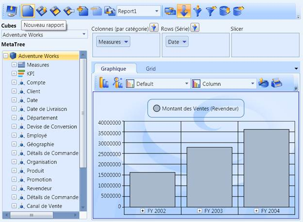
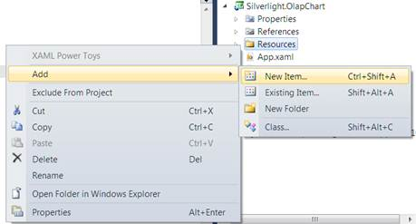
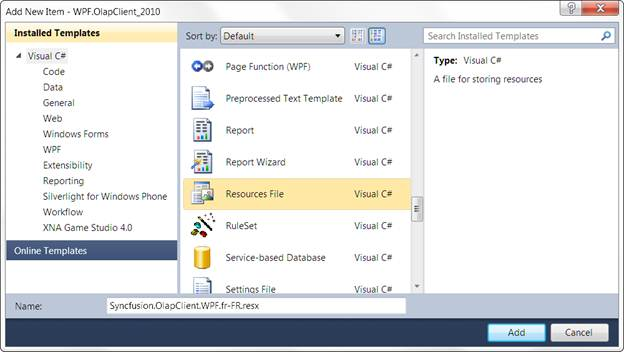
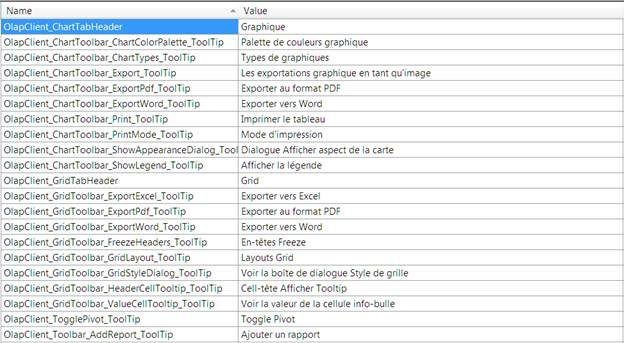

::: {style="DISPLAY: none"}
{#d2h_url_template} {#d2h_package_url style="WIDTH: 0px; DISPLAY: none; HEIGHT: 0px"}
:::

::::: {#nsbanner .d2h_main_nsbanner style="BORDER-BOTTOM: #999999 1px solid; POSITION: relative; PADDING-BOTTOM: 0px; BACKGROUND-COLOR: transparent; PADDING-LEFT: 0px; PADDING-RIGHT: 0px; DISPLAY: none; BORDER-TOP: #999999 1px solid; PADDING-TOP: 0px; LEFT: 0px"}
:::: {#TitleRow .d2h_main_titlerow style="PADDING-BOTTOM: 4px; BACKGROUND-COLOR: transparent; PADDING-LEFT: 22px; WIDTH: 100%; PADDING-RIGHT: 10px; DISPLAY: none; PADDING-TOP: 4px"}
::: {#ienav .d2h_main_ienav style="DISPLAY: none"}
{#D2HPrevious .D2HPreviousEnabled}  {#D2HNext .D2HNextEnabled}
:::
::::
:::::

:::::::::::: {#nstext .d2h_main_nstext style="PADDING-BOTTOM: 10px; BACKGROUND-COLOR: transparent; PADDING-LEFT: 22px; PADDING-RIGHT: 10px; HEIGHT: 100%; OVERFLOW: auto; PADDING-TOP: 5px" hasuserbackground="true" valign="bottom"}
::: {#d2h_breadcrumbs .d2h_breadcrumbs}
[Essential Studio User Guide Documentation](ms-xhelp:///?Id=12457748-09e3-4d74-a240-8e049cedf030){.d2h_breadcrumbsNormal} [ \> ]{.d2h_breadcrumbsLinkSeparator} [Business Intelligence Edition](ms-xhelp:///?Id=fdf33dd8-62b2-47b9-ad7b-fc50e590bca5){.d2h_breadcrumbsNormal} [ \> ]{.d2h_breadcrumbsLinkSeparator} [Essential BI WPF](ms-xhelp:///?Id=41e3d586-d922-4a01-8272-679fe4ae7343){.d2h_breadcrumbsNormal} [ \> ]{.d2h_breadcrumbsLinkSeparator} [Essential BI Client]{.d2h_breadcrumbsContentsOnly} [ \> ]{.d2h_breadcrumbsLinkSeparator} [Concepts and Features](ms-xhelp:///?Id=ac4d4da8-25e2-4317-98b8-e507a1eb5062){.d2h_breadcrumbsNormal}
:::

## Localization Support {#localization-support style="tab-stops: 0pt"}

Localization is the key feature for providing IT solutions targeted at global users. Essential BI OLAP Client for WPF allows user to localize the control to a specific locale. The following document briefly explains the step by step procedure to localize an OLAP Client for WPF control.

 

Use Case Scenarios

Localization helps the user to create an application that targets several cultures.

{border="0"}

Figure 75: OlapClient.WPF control localized to French language.[]{style="COLOR: black"}

**[]{style="FONT-FAMILY: 'Trebuchet MS','sans-serif'; COLOR: #15428b; FONT-SIZE: 9pt"}**  

Localizing an OLAP Client in an Application

The OLAP Client for WPF supports "**resx"** based localization. The following steps need to be performed, in order to localize the control.

Translation

Resource File and File name conventions

\<SupportedCultures\> Tag inclusion into the project file

Specifying the CurrentUICulture

[]{style="FONT-FAMILY: 'Trebuchet MS','sans-serif'; COLOR: #15428b; FONT-SIZE: 9pt"} 

See Also:

**[]{style="FONT-FAMILY: 'Trebuchet MS','sans-serif'; COLOR: #15428b; FONT-SIZE: 9pt"}**  

[Getting Started]{.UGHyperlink} []{.UGHyperlink}

**[]{style="FONT-FAMILY: 'Trebuchet MS','sans-serif'; COLOR: #15428b; FONT-SIZE: 9pt"}**  

Translation

The first step in localization is translating the strings that can be localized to the destination locale. Basically, OlapClient.WPF contains control assemblies such as OlapChart.WPF and OlapGrid.WPF and tools assemblies such as OlapShared.WPF and OlapTools.WPF within it. So, it is mandatory to localize those assemblies as well. The following tables contain the Localization Keys and the Strings to be localized for OlapClient.WPF, OlapChart.WPF, OlapGrid.WPF, OlapShared.WPF and OlapTools.WPF assemblies. Translate the second column in each table, which contains the strings to be localized to the target locale.

 

::: {style="BORDER-BOTTOM: windowtext 1pt solid; BORDER-LEFT: medium none; PADDING-BOTTOM: 1pt; MARGIN-TOP: 9pt; PADDING-LEFT: 0pt; PADDING-RIGHT: 0pt; MARGIN-BOTTOM: 9pt; BORDER-TOP: windowtext 1pt solid; BORDER-RIGHT: medium none; PADDING-TOP: 1pt"}
{border="0"}Note: Localization Key field should be same for the all locales. Do not translate it.
:::

 

Table 1: Localization Strings Table for OlapClient.WPF

::: {align="center"}
  Localization Key                                       Strings to be localized
  ------------------------------------------------------ ------------------------------
  OlapClient_ChartTabHeader                              Chart
  OlapClient_ChartToolbar_ChartColorPalette_ToolTip      Chart Color Palette
  OlapClient_ChartToolbar_ChartTypes_ToolTip             Chart Types
  OlapClient_ChartToolbar_Export_ToolTip                 Exports Chart as an Image
  OlapClient_ChartToolbar_ExportPdf_ToolTip              Export to Pdf
  OlapClient_ChartToolbar_ExportWord_ToolTip             Export to Word
  OlapClient_ChartToolbar_Print_ToolTip                  Print Chart
  OlapClient_ChartToolbar_PrintMode_ToolTip              Print Mode
  OlapClient_ChartToolbar_ShowAppearanceDialog_ToolTip   Show Chart Appearance Dialog
  OlapClient_ChartToolbar_ShowLegend_ToolTip             Show Legend
  OlapClient_ColumnAxis_HeaderText                       Columns (Categorical)
  OlapClient_ColumnRowSubsetFilter_ToolTip               Subset Filter
  OlapClient_Connect_Dlg_Browse                          Browse
  OlapClient_Connect_Dlg_Cancel                          Cancel
  OlapClient_Connect_Dlg_Connection_String_Header        Connection String
  OlapClient_Connect_Dlg_Credential                      Credential
  OlapClient_Connect_Dlg_Data_Source_Header              Data source
  OlapClient_Connect_Dlg_DatabaseName                    Database Name:
  OlapClient_Connect_Dlg_EnterCredential_Header          Enter credentials
  OlapClient_Connect_Dlg_Header                          Server options
  OlapClient_Connect_Dlg_Offline_Cube_Header             Offline Cube
  OlapClient_Connect_Dlg_Ok                              Ok
  OlapClient_Connect_Dlg_Password                        Password:
  OlapClient_Connect_Dlg_Server_Header                   Server
  OlapClient_Connect_Dlg_ServerName                      Server Name:
  OlapClient_Connect_Dlg_User_Name                       User Name:
  OlapClient_ConnectOptions_Dlg_Title                    Connection Option
  OlapClient_CubeDimensionBrowser_HeaderText             MetaTree
  OlapClient_CubeSeletor_HeaderText                      Cubes
  OlapClient_CubeSeletor_ToolTip                         Cube Selector
  OlapClient_GridTabHeader                               Grid
  OlapClient_GridToolbar_ExportExcel_ToolTip             Export to Excel
  OlapClient_GridToolbar_ExportPdf_ToolTip               Export to Pdf
  OlapClient_GridToolbar_ExportWord_ToolTip              Export to Word
  OlapClient_GridToolbar_FreezeHeaders_ToolTip           Freeze Headers
  OlapClient_GridToolbar_GridLayout_ToolTip              Grid Layouts
  OlapClient_GridToolbar_GridStyleDialog_ToolTip         Show Grid Style Dialog
  OlapClient_GridToolbar_HeaderCellTooltip_ToolTip       Show Header Cell Tooltip
  OlapClient_GridToolbar_ValueCellTooltip_ToolTip        Show Value Cell ToolTip
  OlapClient_ReportName_Dlg_ReportName                   Report Name
  OlapClient_RowAxis_HeaderText                          Rows (Series)
  OlapClient_SlicerAxis_HeaderText                       Slicer
  OlapClient_TogglePivot_ToolTip                         Toggle Pivot
  OlapClient_Toolbar_AddReport_ToolTip                   Add Report
  OlapClient_Toolbar_ColumnFilter_ToolTip                Column Filter
  OlapClient_Toolbar_ConnectionOption_ToolTip            Connect to Server
  OlapClient_Toolbar_LoadReport_ToolTip                  Load Report
  OlapClient_Toolbar_NewReport_ToolTip                   New Report
  OlapClient_Toolbar_RemoveReport_ToolTip                Remove Report
  OlapClient_Toolbar_RenameReport_ToolTip                Rename Report
  OlapClient_Toolbar_ReportList_ToolTip                  Report List
  OlapClient_Toolbar_RowFilter_ToolTip                   Row Filter
  OlapClient_Toolbar_SaveAsReport_ToolTip                Save As Report
  OlapClient_Toolbar_SaveReport_ToolTip                  Save Report
  OlapClient_Toolbar_ShowExpanders_ToolTip               Show Expanders
  OlapClient_Toolbar_SortingColumn_ToolTip               Sorting Column
  OlapClient_Toolbar_SortingRow_ToolTip                  Sorting Row
:::

 

Table 2: Localization Strings Table for OlapChart.WPF

::: {align="center"}
  Localization Key                            Strings to be localized
  ------------------------------------------- -------------------------
  OlapChart_Dialog_Appearance_Tab             Appearance
  OlapChart_Dialog_Axis_Tab                   Axis Labels
  OlapChart_Dialog_AxisLabel_FontColor        Font Color
  OlapChart_Dialog_AxisLabel_FontFace         Font Face
  OlapChart_Dialog_AxisLabel_FontStyle        Font Style
  OlapChart_Dialog_BackgroundStyle_Header     Background Style
  OlapChart_Dialog_BorderColor                Color:
  OlapChart_Dialog_BorderStyle_Header         Border Style
  OlapChart_Dialog_BorderWidth                Width:
  OlapChart_Dialog_CancleButton               Cancel
  OlapChart_Dialog_Chart_Tab                  Chart
  OlapChart_Dialog_ChartBackground            Chart Control:
  OlapChart_Dialog_ChartInterior              Chart Interior:
  OlapChart_Dialog_ChartPalette               Chart Palette:
  OlapChart_Dialog_ChartStyle_Header          Chart Style
  OlapChart_Dialog_ChartType                  Chart Type:
  OlapChart_Dialog_CircleAsSymbol             Circle
  OlapChart_Dialog_LabelVisibility_Header     Label Visibility
  OlapChart_Dialog_LegendCheckBoxVisiblity    Show CheckBox
  OlapChart_Dialog_LegendPosition             Position:
  OlapChart_Dialog_Legends_Header             Legends
  OlapChart_Dialog_LegendVisibility           Show Legend
  OlapChart_Dialog_OkButton                   Ok
  OlapChart_Dialog_Point_Labels_Tab           Point Labels
  OlapChart_Dialog_RectanglAsSymbol           Rectangle
  OlapChart_Dialog_SeriesNameAsLabelContent   Series Name
  OlapChart_Dialog_SymbolVisibility_Header    Symbol Visibility
  OlapChart_Dialog_Title                      Chart Appearance Dialog
  OlapChart_Dialog_TriangleAsSymbol           Triangle
  OlapChart_Dialog_XAxis_Header               X Axis
  OlapChart_Dialog_XValueAsLabelContent       X Value
  OlapChart_Dialog_Yaxis_Header               Y Axis
  OlapChart_Dialog_YValueAsLabelContent       Y Value
:::

 

Table 3: Localization Strings Table for OlapGrid.WPF

::: {align="center"}
  Localization Key                   Strings to be localized
  ---------------------------------- -------------------------
  OlapGrid_Column_Tooltip            Columns :
  OlapGrid_Dialog_Background_Color   Background Color
  OlapGrid_Dialog_Cancel             Cancel
  OlapGrid_Dialog_CellStyles         Cell Styles
  OlapGrid_Dialog_ColumnHeader       Column Header
  OlapGrid_Dialog_ColumnSummary      Column Summary
  OlapGrid_Dialog_Font_Color         Font Color
  OlapGrid_Dialog_Font_Name          Font Name
  OlapGrid_Dialog_Font_Size          Font Size
  OlapGrid_Dialog_Font_Style         Font Style
  OlapGrid_Dialog_Foreground_Color   Foreground Color
  OlapGrid_Dialog_HeaderFont         Header Font
  OlapGrid_Dialog_HeaderStyle        Header Style
  OlapGrid_Dialog_Ok                 Ok
  OlapGrid_Dialog_RowHeader          Row Header
  OlapGrid_Dialog_RowSummary         Row Summary
  OlapGrid_Dialog_SummaryFont        Summary Font
  OlapGrid_Dialog_SummaryStyle       Summary Style
  OlapGrid_Dialog_Title              Apply Style
  OlapGrid_Measure_Tooltip           Measure :
  OlapGrid_Row_Tooltip               Rows:
  OlapGrid_Value_Tooltip             Values :
:::

 

Table 4: Localization Strings Table for OlapShared.WPF

::: {align="center"}
  Localization Key                                       Strings to be localized
  ------------------------------------------------------ -------------------------
  OlapTools_FilterSorting_Dlg_Cancel                     Cancel
  OlapTools_FilterSorting_Dlg_EmptyResult_Header         Empty Results
  OlapTools_FilterSorting_Dlg_Filter_Tab                 Filter
  OlapTools_FilterSorting_Dlg_Filter1_Header             Filter 1
  OlapTools_FilterSorting_Dlg_Filter2_Header             Filter 2
  OlapTools_FilterSorting_Dlg_FilterEmptyColumns         Filter Empty Columns
  OlapTools_FilterSorting_Dlg_FilterEmptyRows            Filter Empty Rows
  OlapTools_FilterSorting_Dlg_FilterOn                   Filter On
  OlapTools_FilterSorting_Dlg_FilterOnValue              Value
  OlapTools_FilterSorting_Dlg_Header                     Filtering and Sorting
  OlapTools_FilterSorting_Dlg_OnColumn                   On Column
  OlapTools_FilterSorting_Dlg_OnRow                      On Row
  OlapTools_FilterSorting_Dlg_Sort_Header                Sort
  OlapTools_FilterSorting_Dlg_Sort_Preserver_Hierarchy   Preserve Hierarchy
  OlapTools_FilterSorting_Dlg_SortAsc                    Ascending
  OlapTools_FilterSorting_Dlg_SortDesc                   Descending
  OlapTools_FilterSorting_Dlg_Sorting_Tab                Sorting
  OlapTools_FilterSorting_Dlg_SortingOn                  Sorting On
  OlapTools_FilterSorting_Dlg_Update                     Update
  OlapTools_FilterSorting_FilterCondition                Condition
:::

 

 

Table 5: Localization Strings Table for OlapTools.WPF

::: {align="center"}
  ----------------------------------------------- ----------------------------------------
  Localization Key                                Strings to be localized
  OlapTools_Editor_Cancel                         Cancel
  OlapTools_Editor_Ok                             Ok
  OlapTools_Editor_SplitButton_Delete_ToolTip     Delete
  OlapTools_Editor_SplitButton_MoveDown_ToolTip   Move Down
  OlapTools_Editor_SplitButton_MoveUp_ToolTip     Move Up
  OlapTools_MeasureEditor_Remove_ContextMenu      Remove
  OlapTools_MeasureEditor_Title                   Measure Editor
  OlapTools_MemberEditor_CheckAll_UnCheckAll      Check / UnCheck All
  OlapTools_MemberEditor_Title                    Member Editor
  OlapTools_SubsetFilter_DropDown_Text            Max number of records to be displayed.
  ----------------------------------------------- ----------------------------------------
:::

 

Resource File and File Name Conventions

After translating the strings that can be localized, perform the following in the application:

1.   Right-click the project file to create a new folder in the project.

2.   Select **Add-\> New Folder**.

3.   Re-name the folder as **Resources**.

***[]{style="LAYOUT-GRID-MODE: line; FONT-FAMILY: 'Trebuchet MS','sans-serif'; COLOR: #15428b; FONT-SIZE: 9pt"}***  

::: {style="BORDER-BOTTOM: windowtext 1pt solid; BORDER-LEFT: medium none; PADDING-BOTTOM: 1pt; MARGIN-TOP: 9pt; PADDING-LEFT: 0pt; PADDING-RIGHT: 0pt; MARGIN-BOTTOM: 9pt; BORDER-TOP: windowtext 1pt solid; BORDER-RIGHT: medium none; PADDING-TOP: 1pt"}
{border="0"}Note: The folder name should strictly be Resources.
:::

4.   Now, right-click the **Resources folder** to create a new resource file in the **Visual Studio** project file.

5.   Navigate to **Add -\> New Item**.

[]{style="FONT-FAMILY: 'Myriad Pro','sans-serif'"} 

{border="0"}

Figure 76: Add New Item ContextMenu

[]{style="FONT-FAMILY: 'Calibri','sans-serif'"} 

The Add New Item dialog will display.

{border="0"}

Figure 77: Add Item Dialog

[]{style="FONT-FAMILY: 'Trebuchet MS','sans-serif'; COLOR: #15428b; FONT-SIZE: 9pt"} 

6.   Select **Resources File** from the list. Name the resource file: **Syncfusion.OlapClient.WPF.fr-FR.resx** then click **Add**.

***[]{style="LAYOUT-GRID-MODE: line; FONT-FAMILY: 'Trebuchet MS','sans-serif'; COLOR: #15428b; FONT-SIZE: 9pt"}***  

::: {style="BORDER-BOTTOM: windowtext 1pt solid; BORDER-LEFT: medium none; PADDING-BOTTOM: 1pt; MARGIN-TOP: 9pt; PADDING-LEFT: 0pt; PADDING-RIGHT: 0pt; MARGIN-BOTTOM: 9pt; BORDER-TOP: windowtext 1pt solid; BORDER-RIGHT: medium none; PADDING-TOP: 1pt"}
{border="0"}Note: The resource file name should strictly be in the format  "Syncfusion.OlapClient.WPF.\<\<Culture Code\>\>.resx".
:::

***[]{style="LAYOUT-GRID-MODE: line; FONT-FAMILY: 'Trebuchet MS','sans-serif'; COLOR: #15428b; FONT-SIZE: 9pt"}***  

Examples:

[·      ]{style="FONT-FAMILY: Symbol"}Syncfusion.OlapClient.WPF.es.resx

[·      ]{style="FONT-FAMILY: Symbol"}Syncfusion.OlapClient.WPF.ja-JP.resx

[·      ]{style="FONT-FAMILY: Symbol"}Syncfusion.OlapClient.WPF.it-IT.resx

**[]{style="FONT-FAMILY: 'Trebuchet MS','sans-serif'; COLOR: #15428b; FONT-SIZE: 9pt"}**  

Similarly, for **OlapChart.WPF** assembly, add one more new resource file. Name the resource file **Syncfusion.OlapChart.WPF.fr-FR.resx**.

 

For **OlapGrid.WPF** assembly, add one more new resource file. Name the resource file **Syncfusion.OlapGrid.WPF.fr-FR.resx**.

 

For **OlapShared.WPF** assembly, add one more new resource file. Name the resource file **Syncfusion.OlapShared.WPF.fr-FR.resx**.

 

For **OlapTools.WPF** assembly, add one more new resource file. Name the resource file **Syncfusion.OlapTools.WPF.fr-FR.resx**.

Now, the new resource file is included successfully.

7.   Copy and paste the translated locale to the resource file created in the earlier step.

[]{style="FONT-FAMILY: 'Trebuchet MS','sans-serif'; COLOR: #15428b; FONT-SIZE: 9pt"} 

{border="0"}

Figure 78: A Sample Resource File After Localization

[]{style="FONT-FAMILY: 'Calibri','sans-serif'"} 

\<SupportedCultures\> Tag Inclusion into the Project File

In Silverlight, we need to specify the list of supported cultures using the **\<SupportedCultures\>** tag in the project file. To specify the supported cultures in a project file, perform the following steps:

1.   Go to **Solution Explorer**, Right-click the project file and select **Unload**.

2.   Again, right click the project file and select **Edit**. Now, the project files will appear in the XML editor in Visual Studio.

3.   Find the tag **\<SupportedCultures\>** andthenspecify the culture code, which is already appended in the resource file name.

**[]{style="FONT-FAMILY: 'Trebuchet MS','sans-serif'; COLOR: #15428b; FONT-SIZE: 9pt"}**  

Example: \<SupportedCultures\>fr-FR\<SupportedCultures\>

You can specify multiple cultures as well, by using the (;) semi-colon operator to separate the culture codes.

Example:\<SupportedCultures\>en-US;fr;fr-FR;ru;ru-RU;\</SupportedCultures\>

4.   Now, right click the project name and select **Reload**.

Now, the supported cultures are included in the project file.

**[]{style="FONT-FAMILY: 'Trebuchet MS','sans-serif'; COLOR: #15428b; FONT-SIZE: 9pt"}**  

Specifying the CurrentUICulture

Now, you need to specify the CurrentUICulture of the application. We can specify the CurrentUICulture either from Application_Startup in App.XMAL.csor from the constructor on the MainPage (If you are specifying the current culture on the main page, then make sure, this is assigned before calling the InitializeComponent method). The following code snippets describe the two variations.

 

+---------------------------------------------------------------------------------------------------------------------------------------------------------------------------------------------------------------------------------------------------------------------------------------------------------------------------------+
| **[\[C#\]]{style="FONT-FAMILY: 'Courier New'"}**                                                                                                                                                                                                                                                                                |
|                                                                                                                                                                                                                                                                                                                                 |
| **[]{style="FONT-FAMILY: 'Courier New'"}**                                                                                                                                                                                                                                                                                      |
|                                                                                                                                                                                                                                                                                                                                 |
| [public]{style="FONT-FAMILY: 'Courier New'; COLOR: blue"} [ MainPage() ]{style="FONT-FAMILY: 'Courier New'; COLOR: black"}                                                                                                                                                                                                      |
|                                                                                                                                                                                                                                                                                                                                 |
| [{ ]{style="FONT-FAMILY: 'Courier New'; COLOR: black"}                                                                                                                                                                                                                                                                          |
|                                                                                                                                                                                                                                                                                                                                 |
| [     System.Threading.]{style="FONT-FAMILY: 'Courier New'; COLOR: black"} [Thread]{style="FONT-FAMILY: 'Courier New'; COLOR: #2b91af"} [.CurrentThread.CurrentCulture =]{style="FONT-FAMILY: 'Courier New'; COLOR: black"}                                                                                                     |
|                                                                                                                                                                                                                                                                                                                                 |
| [     ]{style="FONT-FAMILY: 'Courier New'; COLOR: black"} [new]{style="FONT-FAMILY: 'Courier New'; COLOR: blue"} [ System.Globalization.]{style="FONT-FAMILY: 'Courier New'; COLOR: black"} [CultureInfo]{style="FONT-FAMILY: 'Courier New'; COLOR: #2b91af"} [(\"fr-FR\"); ]{style="FONT-FAMILY: 'Courier New'; COLOR: black"} |
|                                                                                                                                                                                                                                                                                                                                 |
| []{style="FONT-FAMILY: 'Courier New'; COLOR: black"}                                                                                                                                                                                                                                                                            |
|                                                                                                                                                                                                                                                                                                                                 |
| [     System.Threading.]{style="FONT-FAMILY: 'Courier New'; COLOR: black"} [Thread]{style="FONT-FAMILY: 'Courier New'; COLOR: #2b91af"} [.CurrentThread.CurrentUICulture =]{style="FONT-FAMILY: 'Courier New'; COLOR: black"}                                                                                                   |
|                                                                                                                                                                                                                                                                                                                                 |
| [     ]{style="FONT-FAMILY: 'Courier New'; COLOR: black"} [new]{style="FONT-FAMILY: 'Courier New'; COLOR: blue"} [ System.Globalization.]{style="FONT-FAMILY: 'Courier New'; COLOR: black"} [CultureInfo]{style="FONT-FAMILY: 'Courier New'; COLOR: #2b91af"} [(\"fr-FR\"); ]{style="FONT-FAMILY: 'Courier New'; COLOR: black"} |
|                                                                                                                                                                                                                                                                                                                                 |
| []{style="FONT-FAMILY: 'Courier New'; COLOR: black"}                                                                                                                                                                                                                                                                            |
|                                                                                                                                                                                                                                                                                                                                 |
| [     InitializeComponent(); ]{style="FONT-FAMILY: 'Courier New'; COLOR: black"}                                                                                                                                                                                                                                                |
|                                                                                                                                                                                                                                                                                                                                 |
| [} ]{style="FONT-FAMILY: 'Courier New'"}                                                                                                                                                                                                                                                                                        |
|                                                                                                                                                                                                                                                                                                                                 |
| []{style="FONT-FAMILY: 'Courier New'"}                                                                                                                                                                                                                                                                                          |
+---------------------------------------------------------------------------------------------------------------------------------------------------------------------------------------------------------------------------------------------------------------------------------------------------------------------------------+

 

+--------------------------------------------------------------------------------------------------------------------------------------------------------------------------------------------------------------------------------------------------------------------------------------------------------------------------------------------------------------------------+
| **[\[VB\]]{style="FONT-FAMILY: 'Courier New'"}**                                                                                                                                                                                                                                                                                                                         |
|                                                                                                                                                                                                                                                                                                                                                                          |
| []{style="FONT-FAMILY: 'Courier New'"}                                                                                                                                                                                                                                                                                                                                   |
|                                                                                                                                                                                                                                                                                                                                                                          |
| [Public]{style="FONT-FAMILY: 'Courier New'; COLOR: blue"} [ [Sub]{style="COLOR: blue"} [New]{style="COLOR: blue"}()]{style="FONT-FAMILY: 'Courier New'"}                                                                                                                                                                                                                 |
|                                                                                                                                                                                                                                                                                                                                                                          |
| [       System.Threading.]{style="FONT-FAMILY: 'Courier New'"} [Thread]{style="FONT-FAMILY: 'Courier New'; COLOR: #2b91af"} [.CurrentThread.CurrentCulture = [New]{style="COLOR: blue"} System.Globalization.]{style="FONT-FAMILY: 'Courier New'"} [CultureInfo]{style="FONT-FAMILY: 'Courier New'; COLOR: #2b91af"} [(\"fr-FR\")]{style="FONT-FAMILY: 'Courier New'"}   |
|                                                                                                                                                                                                                                                                                                                                                                          |
| []{style="FONT-FAMILY: 'Courier New'"}                                                                                                                                                                                                                                                                                                                                   |
|                                                                                                                                                                                                                                                                                                                                                                          |
| [       System.Threading.]{style="FONT-FAMILY: 'Courier New'"} [Thread]{style="FONT-FAMILY: 'Courier New'; COLOR: #2b91af"} [.CurrentThread.CurrentUICulture = [New]{style="COLOR: blue"} System.Globalization.]{style="FONT-FAMILY: 'Courier New'"} [CultureInfo]{style="FONT-FAMILY: 'Courier New'; COLOR: #2b91af"} [(\"fr-FR\")]{style="FONT-FAMILY: 'Courier New'"} |
|                                                                                                                                                                                                                                                                                                                                                                          |
| []{style="FONT-FAMILY: 'Courier New'"}                                                                                                                                                                                                                                                                                                                                   |
|                                                                                                                                                                                                                                                                                                                                                                          |
| [       InitializeComponent()]{style="FONT-FAMILY: 'Courier New'"}                                                                                                                                                                                                                                                                                                       |
|                                                                                                                                                                                                                                                                                                                                                                          |
| [End]{style="FONT-FAMILY: 'Courier New'; COLOR: blue"} [ [Sub]{style="COLOR: blue"} ]{style="FONT-FAMILY: 'Courier New'"} []{style="FONT-FAMILY: 'Courier New'"}                                                                                                                                                                                                         |
+--------------------------------------------------------------------------------------------------------------------------------------------------------------------------------------------------------------------------------------------------------------------------------------------------------------------------------------------------------------------------+

 

(Or)

 

+-----------------------------------------------------------------------------------------------------------------------------------------------------------------------------------------------------------------------------------------------------------------------------------------------------------------------------------------------------------------------------------------------------------------------------------------------------------------------------------------------------------+
| **[\[C#\]]{style="FONT-FAMILY: 'Courier New'"}**                                                                                                                                                                                                                                                                                                                                                                                                                                                          |
|                                                                                                                                                                                                                                                                                                                                                                                                                                                                                                           |
| **[]{style="FONT-FAMILY: 'Courier New'"}**                                                                                                                                                                                                                                                                                                                                                                                                                                                                |
|                                                                                                                                                                                                                                                                                                                                                                                                                                                                                                           |
| [private]{style="FONT-FAMILY: 'Courier New'; COLOR: blue"} []{style="FONT-FAMILY: 'Courier New'; COLOR: black"} [void]{style="FONT-FAMILY: 'Courier New'; COLOR: blue"} [ Application_Startup(]{style="FONT-FAMILY: 'Courier New'; COLOR: black"} [object]{style="FONT-FAMILY: 'Courier New'; COLOR: blue"} [ sender, ]{style="FONT-FAMILY: 'Courier New'; COLOR: black"} [StartupEventArgs]{style="FONT-FAMILY: 'Courier New'; COLOR: #2b91af"} [ e) ]{style="FONT-FAMILY: 'Courier New'; COLOR: black"} |
|                                                                                                                                                                                                                                                                                                                                                                                                                                                                                                           |
| [{ ]{style="FONT-FAMILY: 'Courier New'; COLOR: black"}                                                                                                                                                                                                                                                                                                                                                                                                                                                    |
|                                                                                                                                                                                                                                                                                                                                                                                                                                                                                                           |
| [    System.Threading.]{style="FONT-FAMILY: 'Courier New'; COLOR: black"} [Thread]{style="FONT-FAMILY: 'Courier New'; COLOR: #2b91af"} [.CurrentThread.CurrentUICulture = ]{style="FONT-FAMILY: 'Courier New'; COLOR: black"}                                                                                                                                                                                                                                                                             |
|                                                                                                                                                                                                                                                                                                                                                                                                                                                                                                           |
| [    ]{style="FONT-FAMILY: 'Courier New'; COLOR: black"} [new]{style="FONT-FAMILY: 'Courier New'; COLOR: blue"} [ System.Globalization.]{style="FONT-FAMILY: 'Courier New'; COLOR: black"} [CultureInfo]{style="FONT-FAMILY: 'Courier New'; COLOR: #2b91af"} [(\"fr-FR\"); ]{style="FONT-FAMILY: 'Courier New'; COLOR: black"}                                                                                                                                                                            |
|                                                                                                                                                                                                                                                                                                                                                                                                                                                                                                           |
| []{style="FONT-FAMILY: 'Courier New'; COLOR: black"}                                                                                                                                                                                                                                                                                                                                                                                                                                                      |
|                                                                                                                                                                                                                                                                                                                                                                                                                                                                                                           |
| [    System.Threading.]{style="FONT-FAMILY: 'Courier New'; COLOR: black"} [Thread]{style="FONT-FAMILY: 'Courier New'; COLOR: #2b91af"} [.CurrentThread.CurrentUICulture = ]{style="FONT-FAMILY: 'Courier New'; COLOR: black"}                                                                                                                                                                                                                                                                             |
|                                                                                                                                                                                                                                                                                                                                                                                                                                                                                                           |
| [    ]{style="FONT-FAMILY: 'Courier New'; COLOR: black"} [new]{style="FONT-FAMILY: 'Courier New'; COLOR: blue"} [ System.Globalization.]{style="FONT-FAMILY: 'Courier New'; COLOR: black"} [CultureInfo]{style="FONT-FAMILY: 'Courier New'; COLOR: #2b91af"} [(\"fr-FR\"); ]{style="FONT-FAMILY: 'Courier New'; COLOR: black"}                                                                                                                                                                            |
|                                                                                                                                                                                                                                                                                                                                                                                                                                                                                                           |
| []{style="FONT-FAMILY: 'Courier New'; COLOR: black"}                                                                                                                                                                                                                                                                                                                                                                                                                                                      |
|                                                                                                                                                                                                                                                                                                                                                                                                                                                                                                           |
| [    ]{style="FONT-FAMILY: 'Courier New'; COLOR: black"} [this]{style="FONT-FAMILY: 'Courier New'; COLOR: blue"} [.RootVisual = ]{style="FONT-FAMILY: 'Courier New'; COLOR: black"} [new]{style="FONT-FAMILY: 'Courier New'; COLOR: blue"} []{style="FONT-FAMILY: 'Courier New'; COLOR: black"} [MainPage]{style="FONT-FAMILY: 'Courier New'; COLOR: #2b91af"} [(); ]{style="FONT-FAMILY: 'Courier New'; COLOR: black"}                                                                                   |
|                                                                                                                                                                                                                                                                                                                                                                                                                                                                                                           |
| [} ]{style="FONT-FAMILY: 'Courier New'"}                                                                                                                                                                                                                                                                                                                                                                                                                                                                  |
|                                                                                                                                                                                                                                                                                                                                                                                                                                                                                                           |
| []{style="FONT-FAMILY: 'Courier New'"}                                                                                                                                                                                                                                                                                                                                                                                                                                                                    |
+-----------------------------------------------------------------------------------------------------------------------------------------------------------------------------------------------------------------------------------------------------------------------------------------------------------------------------------------------------------------------------------------------------------------------------------------------------------------------------------------------------------+

 

+----------------------------------------------------------------------------------------------------------------------------------------------------------------------------------------------------------------------------------------------------------------------------------------------------------------------------------------------------------------------------------------------------------------------+
| **[\[VB\]]{style="FONT-FAMILY: 'Courier New'"}**                                                                                                                                                                                                                                                                                                                                                                     |
|                                                                                                                                                                                                                                                                                                                                                                                                                      |
| []{style="FONT-FAMILY: 'Courier New'"}                                                                                                                                                                                                                                                                                                                                                                               |
|                                                                                                                                                                                                                                                                                                                                                                                                                      |
| [Private]{style="FONT-FAMILY: 'Courier New'; COLOR: blue"} [ [Sub]{style="COLOR: blue"} Application_Startup([ByVal]{style="COLOR: blue"} sender [As]{style="COLOR: blue"}[Object]{style="COLOR: blue"}, [ByVal]{style="COLOR: blue"} e [As]{style="COLOR: blue"}]{style="FONT-FAMILY: 'Courier New'"} [StartupEventArgs]{style="FONT-FAMILY: 'Courier New'; COLOR: #2b91af"} [)]{style="FONT-FAMILY: 'Courier New'"} |
|                                                                                                                                                                                                                                                                                                                                                                                                                      |
| [      System.Threading.]{style="FONT-FAMILY: 'Courier New'"} [Thread]{style="FONT-FAMILY: 'Courier New'; COLOR: #2b91af"} [.CurrentThread.CurrentUICulture = [New]{style="COLOR: blue"} System.Globalization.]{style="FONT-FAMILY: 'Courier New'"} [CultureInfo]{style="FONT-FAMILY: 'Courier New'; COLOR: #2b91af"} [(\"fr-FR\")]{style="FONT-FAMILY: 'Courier New'"}                                              |
|                                                                                                                                                                                                                                                                                                                                                                                                                      |
| []{style="FONT-FAMILY: 'Courier New'"}                                                                                                                                                                                                                                                                                                                                                                               |
|                                                                                                                                                                                                                                                                                                                                                                                                                      |
| [      System.Threading.]{style="FONT-FAMILY: 'Courier New'"} [Thread]{style="FONT-FAMILY: 'Courier New'; COLOR: #2b91af"} [.CurrentThread.CurrentUICulture = [New]{style="COLOR: blue"} System.Globalization.]{style="FONT-FAMILY: 'Courier New'"} [CultureInfo]{style="FONT-FAMILY: 'Courier New'; COLOR: #2b91af"} [(\"fr-FR\")]{style="FONT-FAMILY: 'Courier New'"}                                              |
|                                                                                                                                                                                                                                                                                                                                                                                                                      |
| []{style="FONT-FAMILY: 'Courier New'"}                                                                                                                                                                                                                                                                                                                                                                               |
|                                                                                                                                                                                                                                                                                                                                                                                                                      |
| [      [Me]{style="COLOR: blue"}.RootVisual = [New]{style="COLOR: blue"}]{style="FONT-FAMILY: 'Courier New'"} [MainPage]{style="FONT-FAMILY: 'Courier New'; COLOR: #2b91af"} [()]{style="FONT-FAMILY: 'Courier New'"}                                                                                                                                                                                                |
|                                                                                                                                                                                                                                                                                                                                                                                                                      |
| [End]{style="FONT-FAMILY: 'Courier New'; COLOR: blue"} [ [Sub]{style="COLOR: blue"} ]{style="FONT-FAMILY: 'Courier New'"} []{style="FONT-FAMILY: 'Courier New'"}                                                                                                                                                                                                                                                     |
+----------------------------------------------------------------------------------------------------------------------------------------------------------------------------------------------------------------------------------------------------------------------------------------------------------------------------------------------------------------------------------------------------------------------+

[]{style="FONT-FAMILY: 'Calibri','sans-serif'"} 

[]{#related-topics}
::::::::::::
