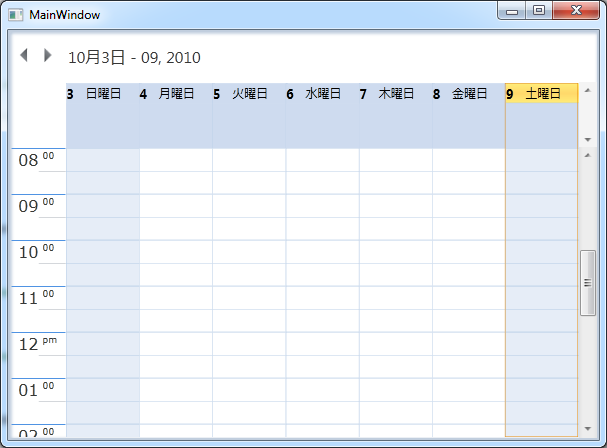

::: {style="DISPLAY: none"}
{#d2h_url_template}{#d2h_package_url style="WIDTH: 0px; DISPLAY: none; HEIGHT: 0px"}
:::

::::: {#nsbanner .d2h_main_nsbanner style="BORDER-BOTTOM: #999999 1px solid; POSITION: relative; PADDING-BOTTOM: 0px; BACKGROUND-COLOR: transparent; PADDING-LEFT: 0px; PADDING-RIGHT: 0px; DISPLAY: none; BORDER-TOP: #999999 1px solid; PADDING-TOP: 0px; LEFT: 0px"}
:::: {#TitleRow .d2h_main_titlerow style="PADDING-BOTTOM: 4px; BACKGROUND-COLOR: transparent; PADDING-LEFT: 22px; WIDTH: 100%; PADDING-RIGHT: 10px; DISPLAY: none; PADDING-TOP: 4px"}
::: {#ienav .d2h_main_ienav style="DISPLAY: none"}
{#D2HPrevious .D2HPreviousEnabled}  {#D2HNext .D2HNextEnabled}
:::
::::
:::::

:::: {#nstext .d2h_main_nstext style="PADDING-BOTTOM: 10px; BACKGROUND-COLOR: transparent; PADDING-LEFT: 22px; PADDING-RIGHT: 10px; HEIGHT: 100%; OVERFLOW: auto; PADDING-TOP: 5px" hasuserbackground="true" valign="bottom"}
::: {#d2h_breadcrumbs .d2h_breadcrumbs}
[Essential Studio User Guide Documentation](ms-xhelp:///?Id=12457748-09e3-4d74-a240-8e049cedf030){.d2h_breadcrumbsNormal}[ \> ]{.d2h_breadcrumbsLinkSeparator}[User Interface Edition](ms-xhelp:///?Id=c29296b7-531c-413b-a0ec-488ca1f7f669){.d2h_breadcrumbsNormal}[ \> ]{.d2h_breadcrumbsLinkSeparator}[Essential Silverlight](ms-xhelp:///?Id=66221bd1-ba2e-43c2-94a7-618f50e01d24){.d2h_breadcrumbsNormal}[ \> ]{.d2h_breadcrumbsLinkSeparator}[Essential Schedule]{.d2h_breadcrumbsContentsOnly}[ \> ]{.d2h_breadcrumbsLinkSeparator}[Schedule Control](ms-xhelp:///?Id=641660d5-c458-4c5d-9615-332d1a8eb458){.d2h_breadcrumbsNormal}
:::

## Localization Support for Schedule Control {#localization-support-for-schedule-control style="tab-stops: 0pt"}

 

Localization is the process of customizing the User Interface (UI) based on a culture that is specific to a particular country or region, in order to display regional data. Culture is a schema, which holds all the information about varying standards such as langauage, DateTime information, currency, speed and other physical matrics. The culture is represented by a unique string. For example, "en-US" for US English and "fr" for French(common).

Localization is the key feature that provides solutions to global customers with the help of localized resource files provided by the control**.** Essential schedule supports Localization and you can create the resource file for any culture and it can be applied in Schedule.

**[]{style="FONT-FAMILY: 'Trebuchet MS','sans-serif'; COLOR: #15428b; FONT-SIZE: 9pt"}** 

Advantages of Localization

The following are the advantages of Localization.

Controls can be embedded in applications deployed in any culture (e.g. en-US is the Culture for English spoken in United States; en-GB is the Culture for English spoken in  United Kingdom or Great Britain).

Provides details and information in the native languages of users.

**[]{style="FONT-FAMILY: 'Trebuchet MS','sans-serif'; COLOR: #15428b; FONT-SIZE: 9pt"}** 

User Scenarios

Localization makes your application multi-lingual by formatting content according to the culture. This involves configuring the application for specific languages. Culture is the combination of Language and the Location. Syncfusion Schedule allows you to set custom resource through Resx file. The user can simply give the string values in a resource file for a specific culture and set it in his application. The given string values will be set accordingly in the schedule control. The appointment windows, message boxes and other alert windows are displayed with text in the local language (culture). If the application is deployed in Japanese culture, then the Schedule Control will display its contents in Japanese language.

[]{style="FONT-FAMILY: 'Trebuchet MS','sans-serif'; COLOR: #15428b; FONT-SIZE: 9pt"} 

{border="0"}

 

Figure 58: Schedule Control in Japanese Culture.

[**[]{style="FONT-FAMILY: 'Trebuchet MS','sans-serif'; COLOR: #15428b; FONT-SIZE: 9pt"}**]{#ResourceNamesanditsDefaultValues} 

More:

[ ]{#related-topics}

[{border="0" align="absMiddle"}Resource Names and its Default Values](ms-xhelp:///?Id=714d5f07-6cc2-4405-bef2-4de6d7ff28e4){style="TEXT-DECORATION: none"}
::::
