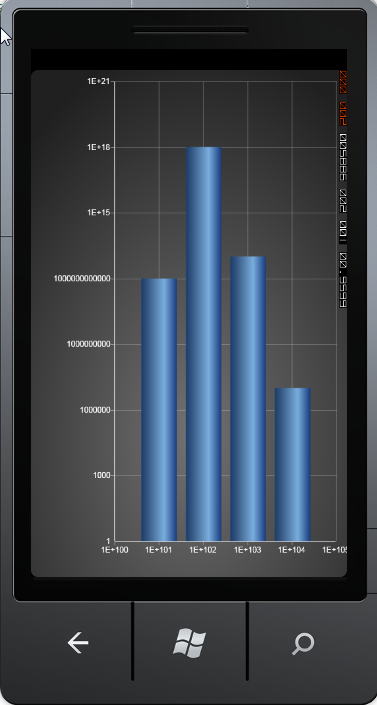

::: {style="DISPLAY: none"}
{#d2h_url_template}{#d2h_package_url style="WIDTH: 0px; DISPLAY: none; HEIGHT: 0px"}
:::

:::: {.d2h_secondary_topic style="PADDING-BOTTOM: 10pt; MARGIN: 0pt; PADDING-LEFT: 0pt; PADDING-RIGHT: 0pt; PADDING-TOP: 0pt"}
#### Logarithmic Axis support {#logarithmic-axis-support style="tab-stops: 0pt"}

[]{#p102} 

Essential Chart Windows Phone now allows you to add logarithmic values for chart WindowsPhone.

 

Adding Logarithmic Values for Chart WindowsPhone

Add logarithmic values for chart WindowsPhone, by using the following code:

+----------------------------------------------------------------------------------------------------------------------------------------------------------------------------------------------------------------------------------------------------------------------------------------------------------------------------------------------------------------------------------------------------------------------------------------------------------------------------------------------------------------------------------------------------------------------------------------------------------------------------------------------------------------------------------------------------------------------------------------------------------------------------------------------------------------------------------------------------------------------------------------------------------------------------------------------------------------+
| **[\[Xaml\]]{style="FONT-FAMILY: 'Times New Roman','serif'; FONT-SIZE: 12pt"}[ ]{style="FONT-FAMILY: 'Times New Roman','serif'; FONT-SIZE: 12pt"}**                                                                                                                                                                                                                                                                                                                                                                                                                                                                                                                                                                                                                                                                                                                                                                                                            |
|                                                                                                                                                                                                                                                                                                                                                                                                                                                                                                                                                                                                                                                                                                                                                                                                                                                                                                                                                                |
| []{style="FONT-FAMILY: 'Times New Roman','serif'; FONT-SIZE: 12pt"}                                                                                                                                                                                                                                                                                                                                                                                                                                                                                                                                                                                                                                                                                                                                                                                                                                                                                            |
|                                                                                                                                                                                                                                                                                                                                                                                                                                                                                                                                                                                                                                                                                                                                                                                                                                                                                                                                                                |
| [\<]{style="FONT-FAMILY: 'Calibri','sans-serif'; COLOR: blue"}[syncfusion]{style="FONT-FAMILY: 'Calibri','sans-serif'; COLOR: #a31515"}[:]{style="FONT-FAMILY: 'Calibri','sans-serif'; COLOR: blue"}[ChartArea.PrimaryAxis]{style="FONT-FAMILY: 'Calibri','sans-serif'; COLOR: #a31515"}[\>]{style="FONT-FAMILY: 'Calibri','sans-serif'; COLOR: blue"}                                                                                                                                                                                                                                                                                                                                                                                                                                                                                                                                                                                                         |
|                                                                                                                                                                                                                                                                                                                                                                                                                                                                                                                                                                                                                                                                                                                                                                                                                                                                                                                                                                |
| [                ]{style="FONT-FAMILY: 'Times New Roman','serif'; COLOR: #a31515"}[              ]{style="FONT-FAMILY: 'Calibri','sans-serif'; COLOR: #a31515"}[\<]{style="FONT-FAMILY: 'Calibri','sans-serif'; COLOR: blue"}[syncfusion]{style="FONT-FAMILY: 'Calibri','sans-serif'; COLOR: #a31515"}[:]{style="FONT-FAMILY: 'Calibri','sans-serif'; COLOR: blue"}[ChartAxis]{style="FONT-FAMILY: 'Calibri','sans-serif'; COLOR: #a31515"}[ IsAutoSetRange]{style="FONT-FAMILY: 'Calibri','sans-serif'; COLOR: red"}[=\"True\"]{style="FONT-FAMILY: 'Calibri','sans-serif'; COLOR: blue"}[ IsLogarithmic]{style="FONT-FAMILY: 'Calibri','sans-serif'; COLOR: red"}[=\"True\"]{style="FONT-FAMILY: 'Calibri','sans-serif'; COLOR: blue"}[ IsLogarithmicLabels]{style="FONT-FAMILY: 'Calibri','sans-serif'; COLOR: red"}[=\"True\"]{style="FONT-FAMILY: 'Calibri','sans-serif'; COLOR: blue"}[       ]{style="FONT-FAMILY: 'Calibri','sans-serif'; COLOR: red"} |
|                                                                                                                                                                                                                                                                                                                                                                                                                                                                                                                                                                                                                                                                                                                                                                                                                                                                                                                                                                |
| [                                LogarithmicBase]{style="FONT-FAMILY: 'Calibri','sans-serif'; COLOR: red"}[=\"10\"/\>]{style="FONT-FAMILY: 'Calibri','sans-serif'; COLOR: blue"}                                                                                                                                                                                                                                                                                                                                                                                                                                                                                                                                                                                                                                                                                                                                                                               |
|                                                                                                                                                                                                                                                                                                                                                                                                                                                                                                                                                                                                                                                                                                                                                                                                                                                                                                                                                                |
| [               ]{style="FONT-FAMILY: 'Calibri','sans-serif'; COLOR: #a31515"}[\</]{style="FONT-FAMILY: 'Calibri','sans-serif'; COLOR: blue"}[syncfusion]{style="FONT-FAMILY: 'Calibri','sans-serif'; COLOR: #a31515"}[:]{style="FONT-FAMILY: 'Calibri','sans-serif'; COLOR: blue"}[ChartArea.PrimaryAxis]{style="FONT-FAMILY: 'Calibri','sans-serif'; COLOR: #a31515"}[\>]{style="FONT-FAMILY: 'Calibri','sans-serif'; COLOR: blue"}                                                                                                                                                                                                                                                                                                                                                                                                                                                                                                                          |
|                                                                                                                                                                                                                                                                                                                                                                                                                                                                                                                                                                                                                                                                                                                                                                                                                                                                                                                                                                |
| []{style="FONT-FAMILY: 'Times New Roman','serif'; FONT-SIZE: 12pt"}                                                                                                                                                                                                                                                                                                                                                                                                                                                                                                                                                                                                                                                                                                                                                                                                                                                                                            |
|                                                                                                                                                                                                                                                                                                                                                                                                                                                                                                                                                                                                                                                                                                                                                                                                                                                                                                                                                                |
| [                ]{style="FONT-FAMILY: 'Times New Roman','serif'; COLOR: #a31515"}[\<]{style="FONT-FAMILY: 'Calibri','sans-serif'; COLOR: blue"}[syncfusion]{style="FONT-FAMILY: 'Calibri','sans-serif'; COLOR: #a31515"}[:]{style="FONT-FAMILY: 'Calibri','sans-serif'; COLOR: blue"}[ChartArea.SecondaryAxis]{style="FONT-FAMILY: 'Calibri','sans-serif'; COLOR: #a31515"}[\>]{style="FONT-FAMILY: 'Calibri','sans-serif'; COLOR: blue"}                                                                                                                                                                                                                                                                                                                                                                                                                                                                                                                     |
|                                                                                                                                                                                                                                                                                                                                                                                                                                                                                                                                                                                                                                                                                                                                                                                                                                                                                                                                                                |
| [                          ]{style="FONT-FAMILY: 'Calibri','sans-serif'; COLOR: #a31515"}[\<]{style="FONT-FAMILY: 'Calibri','sans-serif'; COLOR: blue"}[syncfusion]{style="FONT-FAMILY: 'Calibri','sans-serif'; COLOR: #a31515"}[:]{style="FONT-FAMILY: 'Calibri','sans-serif'; COLOR: blue"}[ChartAxis]{style="FONT-FAMILY: 'Calibri','sans-serif'; COLOR: #a31515"}[ IsAutoSetRange]{style="FONT-FAMILY: 'Calibri','sans-serif'; COLOR: red"}[=\"True\"]{style="FONT-FAMILY: 'Calibri','sans-serif'; COLOR: blue"}[ IsLogarithmic]{style="FONT-FAMILY: 'Calibri','sans-serif'; COLOR: red"}[=\"True\"]{style="FONT-FAMILY: 'Calibri','sans-serif'; COLOR: blue"}[ IsLogarithmicLabels]{style="FONT-FAMILY: 'Calibri','sans-serif'; COLOR: red"}[=\"True\"]{style="FONT-FAMILY: 'Calibri','sans-serif'; COLOR: blue"}[           ]{style="FONT-FAMILY: 'Calibri','sans-serif'; COLOR: red"}                                                                   |
|                                                                                                                                                                                                                                                                                                                                                                                                                                                                                                                                                                                                                                                                                                                                                                                                                                                                                                                                                                |
| [                                LogarithmicBase]{style="FONT-FAMILY: 'Calibri','sans-serif'; COLOR: red"}[=\"10\"/\>]{style="FONT-FAMILY: 'Calibri','sans-serif'; COLOR: blue"}                                                                                                                                                                                                                                                                                                                                                                                                                                                                                                                                                                                                                                                                                                                                                                               |
|                                                                                                                                                                                                                                                                                                                                                                                                                                                                                                                                                                                                                                                                                                                                                                                                                                                                                                                                                                |
| [                ]{style="FONT-FAMILY: 'Times New Roman','serif'; COLOR: #a31515"}[\</]{style="FONT-FAMILY: 'Calibri','sans-serif'; COLOR: blue"}[syncfusion]{style="FONT-FAMILY: 'Calibri','sans-serif'; COLOR: #a31515"}[:]{style="FONT-FAMILY: 'Calibri','sans-serif'; COLOR: blue"}[ChartArea.SecondaryAxis]{style="FONT-FAMILY: 'Calibri','sans-serif'; COLOR: #a31515"}[\>]{style="FONT-FAMILY: 'Calibri','sans-serif'; COLOR: blue"}                                                                                                                                                                                                                                                                                                                                                                                                                                                                                                                    |
+----------------------------------------------------------------------------------------------------------------------------------------------------------------------------------------------------------------------------------------------------------------------------------------------------------------------------------------------------------------------------------------------------------------------------------------------------------------------------------------------------------------------------------------------------------------------------------------------------------------------------------------------------------------------------------------------------------------------------------------------------------------------------------------------------------------------------------------------------------------------------------------------------------------------------------------------------------------+

[]{style="FONT-FAMILY: 'Times New Roman','serif'; COLOR: blue"} 

+------------------------------------------------------------------------------------------------------------------------------------------------------------------------------------------------------------------------------+
| [\[C#\] ]{style="FONT-FAMILY: 'Times New Roman','serif'; FONT-SIZE: 12pt"}                                                                                                                                                   |
|                                                                                                                                                                                                                              |
| []{style="FONT-FAMILY: 'Times New Roman','serif'"}                                                                                                                                                                           |
|                                                                                                                                                                                                                              |
| [MyChart.Areas\[0\].PrimaryAxis.IsLogarithmic]{style="FONT-FAMILY: 'Calibri','sans-serif'; COLOR: black"}[ = true]{style="FONT-FAMILY: 'Calibri','sans-serif'; COLOR: blue"}[;]{style="FONT-FAMILY: 'Calibri','sans-serif'"} |
|                                                                                                                                                                                                                              |
| [                ]{style="FONT-FAMILY: 'Times New Roman','serif'"}[MyChart.Areas\[0\].PrimaryAxis.LogarithmicBase = [Math]{style="COLOR: #2b91af"}.E;]{style="FONT-FAMILY: 'Calibri','sans-serif'"}                          |
|                                                                                                                                                                                                                              |
| [                MyChart.Areas\[0\].PrimaryAxis.IsLogarithmicLabels = [true]{style="COLOR: blue"};]{style="FONT-FAMILY: 'Calibri','sans-serif'"}                                                                             |
|                                                                                                                                                                                                                              |
| []{style="FONT-FAMILY: 'Times New Roman','serif'; FONT-SIZE: 12pt"}                                                                                                                                                          |
|                                                                                                                                                                                                                              |
| [                ]{style="FONT-FAMILY: 'Times New Roman','serif'"}[MyChart.Areas\[0\].SecondaryAxis.IsLogarithmic = [true]{style="COLOR: blue"};]{style="FONT-FAMILY: 'Calibri','sans-serif'"}                               |
|                                                                                                                                                                                                                              |
| [                MyChart.Areas\[0\].SecondaryAxis.LogarithmicBase = 10;]{style="FONT-FAMILY: 'Calibri','sans-serif'"}                                                                                                        |
|                                                                                                                                                                                                                              |
| [                MyChart.Areas\[0\].SecondaryAxis.IsLogarithmicLabels = [true]{style="COLOR: blue"};]{style="FONT-FAMILY: 'Calibri','sans-serif'"}                                                                           |
+------------------------------------------------------------------------------------------------------------------------------------------------------------------------------------------------------------------------------+

[]{style="COLOR: #15428b"} 

When the code runs, the following output displays.

[]{style="COLOR: #15428b"} 

{border="0"}

Figure 102 : Logarithmic Values[]{style="COLOR: #15428b"}

 

The following table contains the property details of the table:

[]{style="COLOR: #15428b"} 

::: {align="center"}
  ---------------------- --------------------------------------------------- --------------------- ------------------
  Name of the Property   Description                                         Type of Property      Value It Returns
  IsLogarithmic          Checks if the logarithmic is set or not             Dependency Property   Bool
  LogarithmicBase        Gets the base for the Logarithm                     Dependency Property   Double
  IsLogarithmicLabels    Checks if the logarithmic labels need to be added   Dependency Property   Bool
  ---------------------- --------------------------------------------------- --------------------- ------------------
:::

[]{#related-topics}
::::
