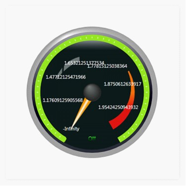

::: {style="DISPLAY: none"}
{#d2h_url_template}{#d2h_package_url style="WIDTH: 0px; DISPLAY: none; HEIGHT: 0px"}
:::

::: {.d2h_secondary_topic style="PADDING-BOTTOM: 10pt; MARGIN: 0pt; PADDING-LEFT: 0pt; PADDING-RIGHT: 0pt; PADDING-TOP: 0pt"}
##### Logarithmic Scale {#logarithmic-scale style="tab-stops: 0pt"}

Essential Circular gauge for WPF supports logarithmic label ticks. To enable this set **IsLogarithmic** property to **true**, and specifying a valid **LogBase** value. The value of the **LabelTick** is calculated based on the **LogBase**.

[]{style="FONT-FAMILY: 'Trebuchet MS','sans-serif'; COLOR: #15428b; FONT-SIZE: 9pt"} 

Set the logarithmic scale for a Circular gauge, by using the following code.

[]{style="FONT-FAMILY: 'Trebuchet MS','sans-serif'; COLOR: #15428b; FONT-SIZE: 9pt"} 

+------------------------------------------------------------------------------------------------------------------------------------------------------------------------------------------------------------------------------------------------------------------------------------------------------------------------------------------------------------------------------------------------------------------------------------------------------------------------------------------------------------------------------------------------------------------------------------------------------------+
| **[\[XAML\]]{style="FONT-FAMILY: 'Courier New'"}**                                                                                                                                                                                                                                                                                                                                                                                                                                                                                                                                                         |
|                                                                                                                                                                                                                                                                                                                                                                                                                                                                                                                                                                                                            |
| **[]{style="FONT-FAMILY: Consolas; FONT-SIZE: 12pt"}**                                                                                                                                                                                                                                                                                                                                                                                                                                                                                                                                                     |
|                                                                                                                                                                                                                                                                                                                                                                                                                                                                                                                                                                                                            |
| [\<]{style="FONT-FAMILY: Consolas; COLOR: blue"}[syncfusion]{style="FONT-FAMILY: Consolas; COLOR: #a31515"}[:]{style="FONT-FAMILY: Consolas; COLOR: blue"}[CircularLabelTick]{style="FONT-FAMILY: Consolas; COLOR: #a31515"}[ DistanceFromScale]{style="FONT-FAMILY: Consolas; COLOR: red"}[=\"5\"]{style="FONT-FAMILY: Consolas; COLOR: blue"}[ FontSize]{style="FONT-FAMILY: Consolas; COLOR: red"}[=\"11\"]{style="FONT-FAMILY: Consolas; COLOR: blue"}[ Name]{style="FONT-FAMILY: Consolas; COLOR: red"}[=\"labelTick\"]{style="FONT-FAMILY: Consolas; COLOR: blue"}[ ]{style="FONT-FAMILY: Consolas"} |
|                                                                                                                                                                                                                                                                                                                                                                                                                                                                                                                                                                                                            |
| [  TickPlacement]{style="FONT-FAMILY: Consolas; COLOR: red"}[=\"Inside\"]{style="FONT-FAMILY: Consolas; COLOR: blue"}[ TickStyle]{style="FONT-FAMILY: Consolas; COLOR: red"}[=\"MajorTick\"]{style="FONT-FAMILY: Consolas; COLOR: blue"}[ [IsLogarithmic]{style="COLOR: red"}[=\"True\"]{style="COLOR: blue"}[ LogBase]{style="COLOR: red"}[=\"10\"\>]{style="COLOR: blue"}]{style="FONT-FAMILY: Consolas"}                                                                                                                                                                                                |
|                                                                                                                                                                                                                                                                                                                                                                                                                                                                                                                                                                                                            |
| [\</]{style="FONT-FAMILY: Consolas; COLOR: blue"}[syncfusion]{style="FONT-FAMILY: Consolas; COLOR: #a31515"}[:]{style="FONT-FAMILY: Consolas; COLOR: blue"}[CircularLabelTick]{style="FONT-FAMILY: Consolas; COLOR: #a31515"}[\>]{style="FONT-FAMILY: Consolas; COLOR: blue"}                                                                                                                                                                                                                                                                                                                              |
+------------------------------------------------------------------------------------------------------------------------------------------------------------------------------------------------------------------------------------------------------------------------------------------------------------------------------------------------------------------------------------------------------------------------------------------------------------------------------------------------------------------------------------------------------------------------------------------------------------+

 

+-------------------------------------------------------------------------------------------------------------------------------------------------------------------------------------------+
| **[\[C#\]]{style="FONT-FAMILY: 'Courier New'"}**                                                                                                                                          |
|                                                                                                                                                                                           |
| **[]{style="FONT-FAMILY: Consolas; FONT-SIZE: 12pt"}**                                                                                                                                    |
|                                                                                                                                                                                           |
| [CircularLabelTick]{style="FONT-FAMILY: Consolas; COLOR: #2b91af"}[ labeltick = [new]{style="COLOR: blue"} [CircularLabelTick]{style="COLOR: #2b91af"}();]{style="FONT-FAMILY: Consolas"} |
|                                                                                                                                                                                           |
| [labeltick.DistanceFromScale = 5;]{style="FONT-FAMILY: Consolas"}                                                                                                                         |
|                                                                                                                                                                                           |
| [labeltick.FontSize = 11;]{style="FONT-FAMILY: Consolas"}                                                                                                                                 |
|                                                                                                                                                                                           |
| [labeltick.TickPlacement = [ScalePlacement]{style="COLOR: #2b91af"}.Inside;]{style="FONT-FAMILY: Consolas"}                                                                               |
|                                                                                                                                                                                           |
| [labeltick.TickStyle = [TickStyle]{style="COLOR: #2b91af"}.MajorTick;]{style="FONT-FAMILY: Consolas"}                                                                                     |
|                                                                                                                                                                                           |
| [labeltick.IsLogarithmic = [true]{style="COLOR: blue"};]{style="FONT-FAMILY: Consolas"}                                                                                                   |
|                                                                                                                                                                                           |
| [labeltick.LogBase = 10;]{style="FONT-FAMILY: Consolas"}                                                                                                                                  |
+-------------------------------------------------------------------------------------------------------------------------------------------------------------------------------------------+

 

Run the code. Figure 1 illustrates the output.

{border="0"}

Figure 32: Logarthmic Scale with logbase-2

[]{#p29} 

[]{#related-topics}
:::
