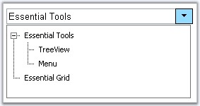
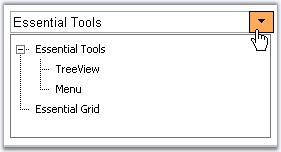
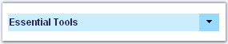
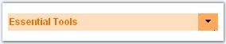
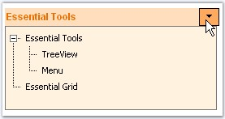

::: {style="DISPLAY: none"}
{#d2h_url_template}{#d2h_package_url style="WIDTH: 0px; DISPLAY: none; HEIGHT: 0px"}
:::

::::::: {.d2h_secondary_topic style="PADDING-BOTTOM: 10pt; MARGIN: 0pt; PADDING-LEFT: 0pt; PADDING-RIGHT: 0pt; PADDING-TOP: 0pt"}
##### Look and Feel Settings {#look-and-feel-settings style="tab-stops: 0pt"}

 

This section discusses the pre-defined styles that can be applied for the control and the css styles that can be applied for the various sections of the GenericDropDown control in the following topics.

 

###### 5.1.5.2.5.1 AutoFormat Styles {#autoformat-styles style="tab-stops: 0pt"}

[]{style="FONT-FAMILY: 'Trebuchet MS','sans-serif'; COLOR: #15428b; FONT-SIZE: 9pt"} 

The GenericDropDown control provides pre-defined set of styles that can be applied to your control just on a click of the button. You can set the desired look and feel for the control that includes some popular styles too.

Right-clicking the control and selecting the \'Auto Format\...\' option opens the following Auto Format dialog box.

[]{style="FONT-FAMILY: 'Trebuchet MS','sans-serif'; COLOR: #15428b; FONT-SIZE: 9pt"} 

{border="0"}

[]{style="FONT-FAMILY: 'Trebuchet MS','sans-serif'; COLOR: #15428b; FONT-SIZE: 9pt"} 

The left pane lists the various pre-defined style scheme that are available. The right pane shows the preview of the currently selected scheme. Select the required style and click OK to apply the selected scheme to the control.

[]{style="FONT-FAMILY: 'Trebuchet MS','sans-serif'; COLOR: #15428b; FONT-SIZE: 9pt"} 

Example of a popular look and feel

[]{style="FONT-FAMILY: 'Trebuchet MS','sans-serif'; COLOR: #15428b; FONT-SIZE: 9pt"} 

The following image shows the control with **White Brick** style setting.

[]{style="FONT-FAMILY: 'Trebuchet MS','sans-serif'; COLOR: #15428b; FONT-SIZE: 9pt"} 

{border="0"}

 Figure 101

###### 5.1.5.2.5.2 CSS Styles {#css-styles style="tab-stops: 0pt"}

[]{style="FONT-FAMILY: 'Trebuchet MS','sans-serif'; COLOR: #15428b; FONT-SIZE: 9pt"} 

The look and feel of the control can be customized by using the CSS properties to enrich the appearance settings which has been discussed below.

[]{style="FONT-FAMILY: 'Trebuchet MS','sans-serif'; COLOR: #15428b; FONT-SIZE: 9pt"} 

Customizing the Button

[  ]{style="FONT-FAMILY: 'Trebuchet MS','sans-serif'; COLOR: #15428b; FONT-SIZE: 9pt"}

The button image on the right of the control can be customized and styles can be set by using **ButtonCssClass** and **ButtonHoverCssClass** properties.

[]{style="FONT-FAMILY: 'Trebuchet MS','sans-serif'; COLOR: #15428b; FONT-SIZE: 9pt"} 

::: {align="center"}
  --------------------- -----------------------------------------------------------------------
  Property              Description
  ButtonCssClass        Specifies the css definitions to apply to the button\'s html element.
  ButtonHoverCssClass   Specifies the css definitions to apply for the button on mouse over.
  --------------------- -----------------------------------------------------------------------
:::

[]{style="FONT-FAMILY: 'Trebuchet MS','sans-serif'; COLOR: #15428b; FONT-SIZE: 9pt"} 

{border="0"}

[]{style="FONT-FAMILY: 'Trebuchet MS','sans-serif'; COLOR: #15428b; FONT-SIZE: 9pt"} 

Figure 102: Styles applied to the Button

[]{style="FONT-FAMILY: 'Trebuchet MS','sans-serif'; COLOR: #15428b; FONT-SIZE: 9pt"} 

{border="0"}

**[]{style="COLOR: black; FONT-SIZE: 8pt"}** 

Figure 103: Styles applied for Button Hover

[           ]{style="FONT-FAMILY: 'Trebuchet MS','sans-serif'; COLOR: #15428b; FONT-SIZE: 9pt"}

CSS definitions used for the button and during mouse hover are shown below. These CSS definitions must be set to the above discussed properties to apply the styles to the button.

[]{style="FONT-FAMILY: 'Trebuchet MS','sans-serif'; COLOR: #15428b; FONT-SIZE: 9pt"} 

+--------------------------------------------------------------------------------------------------------------------------------------------------------------------------------------------------------------------------+
| [.BtnCSS]{style="FONT-FAMILY: 'Courier New'; COLOR: maroon; FONT-SIZE: 9pt"}                                                                                                                                             |
|                                                                                                                                                                                                                          |
| [{]{style="FONT-FAMILY: 'Courier New'; FONT-SIZE: 9pt"}                                                                                                                                                                  |
|                                                                                                                                                                                                                          |
| [  border]{style="FONT-FAMILY: 'Courier New'; COLOR: red; FONT-SIZE: 9pt"}[:[1px]{style="COLOR: blue"} [solid]{style="COLOR: blue"} [#A0DEFF]{style="COLOR: blue"};]{style="FONT-FAMILY: 'Courier New'; FONT-SIZE: 9pt"} |
|                                                                                                                                                                                                                          |
| [  [width]{style="COLOR: red"}:[25px]{style="COLOR: blue"};]{style="FONT-FAMILY: 'Courier New'; FONT-SIZE: 9pt"}                                                                                                         |
|                                                                                                                                                                                                                          |
| [  [cursor]{style="COLOR: red"}:[pointer]{style="COLOR: blue"};]{style="FONT-FAMILY: 'Courier New'; FONT-SIZE: 9pt"}                                                                                                     |
|                                                                                                                                                                                                                          |
| [  [background-Color]{style="COLOR: red"}:[#A0DEFF]{style="COLOR: blue"};]{style="FONT-FAMILY: 'Courier New'; FONT-SIZE: 9pt"}                                                                                           |
|                                                                                                                                                                                                                          |
| [}]{style="FONT-FAMILY: 'Courier New'; FONT-SIZE: 9pt"}                                                                                                                                                                  |
|                                                                                                                                                                                                                          |
| []{style="FONT-FAMILY: 'Courier New'; COLOR: maroon; FONT-SIZE: 9pt"}                                                                                                                                                    |
|                                                                                                                                                                                                                          |
| [.BtnHoverCSS]{style="FONT-FAMILY: 'Courier New'; COLOR: maroon; FONT-SIZE: 9pt"}                                                                                                                                        |
|                                                                                                                                                                                                                          |
| [{]{style="FONT-FAMILY: 'Courier New'; FONT-SIZE: 9pt"}                                                                                                                                                                  |
|                                                                                                                                                                                                                          |
| [  border]{style="FONT-FAMILY: 'Courier New'; COLOR: red; FONT-SIZE: 9pt"}[:[1px]{style="COLOR: blue"} [solid]{style="COLOR: blue"} [#FFB26A]{style="COLOR: blue"};]{style="FONT-FAMILY: 'Courier New'; FONT-SIZE: 9pt"} |
|                                                                                                                                                                                                                          |
| [  [width]{style="COLOR: red"}:[25px]{style="COLOR: blue"};]{style="FONT-FAMILY: 'Courier New'; FONT-SIZE: 9pt"}                                                                                                         |
|                                                                                                                                                                                                                          |
| [  [cursor]{style="COLOR: red"}:[pointer]{style="COLOR: blue"};]{style="FONT-FAMILY: 'Courier New'; FONT-SIZE: 9pt"}                                                                                                     |
|                                                                                                                                                                                                                          |
| [  [background-Color]{style="COLOR: red"}:[#FFB26A]{style="COLOR: blue"};]{style="FONT-FAMILY: 'Courier New'; FONT-SIZE: 9pt"}                                                                                           |
|                                                                                                                                                                                                                          |
| [}]{style="FONT-FAMILY: 'Courier New'; FONT-SIZE: 9pt"}                                                                                                                                                                  |
+--------------------------------------------------------------------------------------------------------------------------------------------------------------------------------------------------------------------------+

[]{style="FONT-FAMILY: 'Trebuchet MS','sans-serif'; COLOR: #15428b; FONT-SIZE: 9pt"} 

Customizing the TextBox

[]{style="FONT-FAMILY: 'Trebuchet MS','sans-serif'; COLOR: #15428b; FONT-SIZE: 9pt"} 

The TextBox can be customized by using the style properties **TextBoxCssClass**, **TextHoverCssClass** which helps to set different styles for the text and textbox.

[]{style="FONT-FAMILY: 'Trebuchet MS','sans-serif'; COLOR: #15428b; FONT-SIZE: 9pt"} 

{border="0"}

[]{style="FONT-FAMILY: 'Trebuchet MS','sans-serif'; COLOR: #15428b; FONT-SIZE: 9pt"} 

Figure 104: Styles applied to the TextBox

[]{style="FONT-FAMILY: 'Trebuchet MS','sans-serif'; COLOR: #15428b; FONT-SIZE: 9pt"} 

{border="0"}

[                ]{style="FONT-FAMILY: 'Trebuchet MS','sans-serif'; COLOR: #15428b; FONT-SIZE: 9pt"}

Figure 105: Styles applied for TextBox Hover

**[]{style="COLOR: black; FONT-SIZE: 8pt"}** 

::: {align="center"}
  ---------------------- -----------------------------------------------------------------------------
  Property               Description
  TextBoxCssClass        Specifies the css definitions to apply to the Text container.
  TextBoxHoverCssClass   Specifies the css definitions to apply to the text container on mouse over.
  ---------------------- -----------------------------------------------------------------------------
:::

**[]{style="COLOR: black; FONT-SIZE: 8pt"}** 

CSS definitions used for the text box and during mouse hover are shown below. These CSS definitions must be set to the above discussed properties to apply the styles to both text and the textbox.

[]{style="FONT-FAMILY: 'Trebuchet MS','sans-serif'; COLOR: #15428b; FONT-SIZE: 9pt"} 

+--------------------------------------------------------------------------------------------------------------------------------------------------------------------------------+
| [.TextBoxCSS]{style="FONT-FAMILY: 'Courier New'; COLOR: maroon; FONT-SIZE: 9pt"}                                                                                               |
|                                                                                                                                                                                |
| [{]{style="FONT-FAMILY: 'Courier New'; FONT-SIZE: 9pt"}                                                                                                                        |
|                                                                                                                                                                                |
| [  [color]{style="COLOR: red"}:[#333365]{style="COLOR: blue"};]{style="FONT-FAMILY: 'Courier New'; FONT-SIZE: 9pt"}                                                            |
|                                                                                                                                                                                |
| [  [font-name]{style="COLOR: red"}:[tahoma]{style="COLOR: blue"};]{style="FONT-FAMILY: 'Courier New'; FONT-SIZE: 9pt"}                                                         |
|                                                                                                                                                                                |
| [  [font-size]{style="COLOR: red"}:[12px]{style="COLOR: blue"};]{style="FONT-FAMILY: 'Courier New'; FONT-SIZE: 9pt"}                                                           |
|                                                                                                                                                                                |
| [  [font-weight]{style="COLOR: red"}:[bold]{style="COLOR: blue"};]{style="FONT-FAMILY: 'Courier New'; FONT-SIZE: 9pt"}                                                         |
|                                                                                                                                                                                |
| [  [background-Color]{style="COLOR: red"}:[#d0f0ff]{style="COLOR: blue"};]{style="FONT-FAMILY: 'Courier New'; FONT-SIZE: 9pt"}                                                 |
|                                                                                                                                                                                |
| [  [border]{style="COLOR: red"}:[1px]{style="COLOR: blue"} [solid]{style="COLOR: blue"} [#d0f0ff]{style="COLOR: blue"};  ]{style="FONT-FAMILY: 'Courier New'; FONT-SIZE: 9pt"} |
|                                                                                                                                                                                |
| [}]{style="FONT-FAMILY: 'Courier New'; FONT-SIZE: 9pt"}                                                                                                                        |
|                                                                                                                                                                                |
| [.TextBoxHoverCSS]{style="FONT-FAMILY: 'Courier New'; COLOR: maroon; FONT-SIZE: 9pt"}                                                                                          |
|                                                                                                                                                                                |
| [{]{style="FONT-FAMILY: 'Courier New'; FONT-SIZE: 9pt"}                                                                                                                        |
|                                                                                                                                                                                |
| [  [color]{style="COLOR: red"}:[#ee7a03]{style="COLOR: blue"};]{style="FONT-FAMILY: 'Courier New'; FONT-SIZE: 9pt"}                                                            |
|                                                                                                                                                                                |
| [  [font-name]{style="COLOR: red"}:[tahoma]{style="COLOR: blue"};]{style="FONT-FAMILY: 'Courier New'; FONT-SIZE: 9pt"}                                                         |
|                                                                                                                                                                                |
| [  [font-size]{style="COLOR: red"}:[12px]{style="COLOR: blue"};]{style="FONT-FAMILY: 'Courier New'; FONT-SIZE: 9pt"}                                                           |
|                                                                                                                                                                                |
| [  [font-weight]{style="COLOR: red"}:[bold]{style="COLOR: blue"};]{style="FONT-FAMILY: 'Courier New'; FONT-SIZE: 9pt"}                                                         |
|                                                                                                                                                                                |
| [  [background-Color]{style="COLOR: red"}:[#ffe1c4]{style="COLOR: blue"};]{style="FONT-FAMILY: 'Courier New'; FONT-SIZE: 9pt"}                                                 |
|                                                                                                                                                                                |
| [  [border]{style="COLOR: red"}:[1px]{style="COLOR: blue"} [solid]{style="COLOR: blue"} [#ffe1c4]{style="COLOR: blue"};  ]{style="FONT-FAMILY: 'Courier New'; FONT-SIZE: 9pt"} |
|                                                                                                                                                                                |
| [}]{style="FONT-FAMILY: 'Courier New'; FONT-SIZE: 9pt"}                                                                                                                        |
+--------------------------------------------------------------------------------------------------------------------------------------------------------------------------------+

[]{style="FONT-FAMILY: 'Trebuchet MS','sans-serif'; COLOR: #15428b; FONT-SIZE: 9pt"} 

Customizing the TextBox elements

[]{style="FONT-FAMILY: 'Trebuchet MS','sans-serif'; COLOR: #15428b; FONT-SIZE: 9pt"} 

Styles can be applied to the outer html elements of the text box by using the properties **ControlRootCssClass**, **ContainerHoverCSSClass** and **ContainerTableCssClass**. These properties can be used to apply styles to the various structured layers of the text box.

[]{style="FONT-FAMILY: 'Trebuchet MS','sans-serif'; COLOR: #15428b; FONT-SIZE: 9pt"} 

::: {align="center"}
+-----------------------------------+-------------------------------------------------------------------------------+
|                                   |                                                                               |
|                                   |                                                                               |
| Property                          | Description                                                                   |
+-----------------------------------+-------------------------------------------------------------------------------+
| ContainerHoverCSSClass            | Specifies the css definitions to apply to the container table on mouse hover. |
+-----------------------------------+-------------------------------------------------------------------------------+
| ContainerTableCssClass            | Specifies the css definitions to apply to the container table.                |
+-----------------------------------+-------------------------------------------------------------------------------+
| ControlRootCSSClass               | Specifies the css definitions to use for the root elements of the control.    |
+-----------------------------------+-------------------------------------------------------------------------------+
:::

[]{style="FONT-FAMILY: 'Trebuchet MS','sans-serif'; COLOR: #15428b; FONT-SIZE: 9pt"} 

Customizing the Popup Container

[]{style="FONT-FAMILY: 'Trebuchet MS','sans-serif'; COLOR: #15428b; FONT-SIZE: 9pt"} 

The **PopupCSSClass** can be used to apply different styles to the container that pops up on button click.

[]{style="FONT-FAMILY: 'Trebuchet MS','sans-serif'; COLOR: #15428b; FONT-SIZE: 9pt"} 

{border="0"}

[]{style="FONT-FAMILY: 'Trebuchet MS','sans-serif'; COLOR: #15428b; FONT-SIZE: 9pt"} 

Figure 106: Styles applied to the Pop-up Container

[]{style="FONT-FAMILY: 'Trebuchet MS','sans-serif'; COLOR: #15428b; FONT-SIZE: 9pt"} 

::: {align="center"}
  --------------- ----------------------------------------------------------------------------------
  Property        Description
  PopupCssClass   Specifies the css definitions to apply to the control container\'s html element.
  --------------- ----------------------------------------------------------------------------------
:::

 

[]{#p167} 

[]{#related-topics}
:::::::
