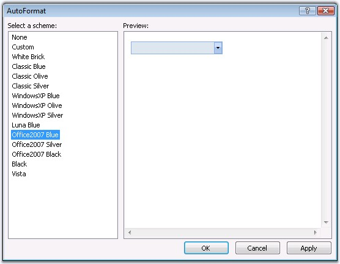
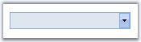

::: {style="DISPLAY: none"}
{#d2h_url_template}{#d2h_package_url style="WIDTH: 0px; DISPLAY: none; HEIGHT: 0px"}
:::

::: {.d2h_secondary_topic style="PADDING-BOTTOM: 10pt; MARGIN: 0pt; PADDING-LEFT: 0pt; PADDING-RIGHT: 0pt; PADDING-TOP: 0pt"}
##### Look and Feel Settings {#look-and-feel-settings style="tab-stops: 0pt"}

[]{style="FONT-FAMILY: 'Trebuchet MS','sans-serif'; COLOR: #15428b; FONT-SIZE: 9pt"} 

This section discusses the pre-defined styles that can be applied for the control and the css styles that can be applied for various sections of the MultiSelectionDropDown control in the following topics.

[]{style="FONT-FAMILY: 'Trebuchet MS','sans-serif'; COLOR: #15428b; FONT-SIZE: 9pt"} 

[·      ]{style="FONT-FAMILY: Symbol"}AutoFormat Styles

[·      ]{style="FONT-FAMILY: Symbol"}CSS Styles

[]{style="FONT-FAMILY: 'Trebuchet MS','sans-serif'; COLOR: #15428b; FONT-SIZE: 9pt"} 

The MultiSelectionDropDown control provides pre-defined set of styles that can be applied to your control on the click of a button. You can set the desired look and feel for the control that includes some popular styles too. Right-clicking the control and selecting the \'Auto Format\...\' option opens the following **Auto Format** dialog box.

[]{style="FONT-FAMILY: 'Trebuchet MS','sans-serif'; COLOR: #15428b; FONT-SIZE: 9pt"} 

{border="0"}

Figure 131

[]{style="FONT-FAMILY: 'Trebuchet MS','sans-serif'; COLOR: #15428b; FONT-SIZE: 9pt"} 

The left pane lists the various pre-defined styles\' schemes that are available. The right pane shows the preview of the currently selected scheme. Select the required style, and click **OK** to apply the selected scheme to the control.

 

The following image shows the MultiSelectionDropDown control with **White Brick** style setting.

[]{style="FONT-FAMILY: 'Trebuchet MS','sans-serif'; COLOR: #15428b; FONT-SIZE: 9pt"} 

{border="0"}

Figure 132

 

[]{#related-topics}
:::
