::: {style="DISPLAY: none"}
{#d2h_url_template}{#d2h_package_url style="WIDTH: 0px; DISPLAY: none; HEIGHT: 0px"}
:::

:::::::::: {.d2h_secondary_topic style="PADDING-BOTTOM: 10pt; MARGIN: 0pt; PADDING-LEFT: 0pt; PADDING-RIGHT: 0pt; PADDING-TOP: 0pt"}
##### Look and Feel Settings {#look-and-feel-settings style="tab-stops: 0pt"}

 

The look and feel of the treeview can be controlled using AutoFormat options and also by defining custom ItemLook instances in ItemLooks collection or by editing default ItemLook settings in DefaultItemLook and DefaultDisabledItemLook properties.

 

The topics discussed are given below.

[]{#p290} 

###### 5.3.1.2.13.1        AutoFormat Styles {#autoformat-styles style="tab-stops: 0pt"}

[]{style="FONT-FAMILY: 'Trebuchet MS','sans-serif'; COLOR: #15428b; FONT-SIZE: 9pt"} 

The TreeView control provides pre-defined set of styles that can be applied to your control just on a click of the button. You can set the desired look and feel for the control that includes some popular styles too.

 

The Autoformat window can be opened by right clicking the control and selecting the \'Auto Format\...\' option opens the following Auto Format dialog box.

[]{style="FONT-FAMILY: 'Trebuchet MS','sans-serif'; COLOR: #15428b; FONT-SIZE: 9pt"} 

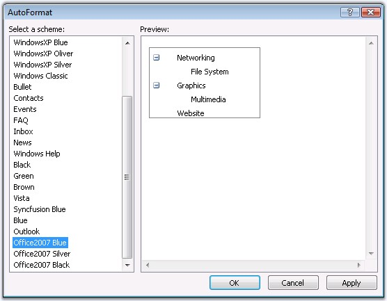{border="0"}

Figure 193

[]{style="FONT-FAMILY: 'Trebuchet MS','sans-serif'; COLOR: #15428b; FONT-SIZE: 9pt"} 

The left pane lists the various pre-defined style scheme that are available. The right pane shows the preview of the currently selected scheme. Select the required style and click OK to apply the selected scheme to the control.

[]{style="FONT-FAMILY: 'Trebuchet MS','sans-serif'; COLOR: #15428b; FONT-SIZE: 9pt"} 

Example of a popular look and feel

[]{style="FONT-FAMILY: 'Trebuchet MS','sans-serif'; COLOR: #15428b; FONT-SIZE: 9pt"} 

The following image shows the TreeView with **MSDN** style setting.

[]{style="FONT-FAMILY: 'Trebuchet MS','sans-serif'; COLOR: #15428b; FONT-SIZE: 9pt"} 

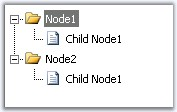{border="0"}

Figure 194

[]{style="FONT-FAMILY: 'Trebuchet MS','sans-serif'; COLOR: black"} 

The new built-in format skins added for TreeView are as follows.

[]{style="FONT-FAMILY: 'Trebuchet MS','sans-serif'; COLOR: #15428b; FONT-SIZE: 9pt"} 

[·      ]{style="FONT-FAMILY: Symbol"}Outlook

[]{style="FONT-FAMILY: 'Trebuchet MS','sans-serif'; COLOR: #15428b; FONT-SIZE: 9pt"} 

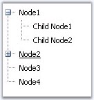{border="0"}

Figure 195

[]{style="FONT-FAMILY: 'Trebuchet MS','sans-serif'; COLOR: #15428b; FONT-SIZE: 9pt"} 

[·      ]{style="FONT-FAMILY: Symbol"}Vista

[]{style="FONT-FAMILY: 'Trebuchet MS','sans-serif'; COLOR: #15428b; FONT-SIZE: 9pt"} 

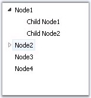{border="0"}

Figure 196

 

[]{style="FONT-FAMILY: 'Trebuchet MS','sans-serif'; COLOR: #15428b; FONT-SIZE: 9pt"} 

[·      ]{style="FONT-FAMILY: Symbol"}Blue

[]{style="FONT-FAMILY: 'Trebuchet MS','sans-serif'; COLOR: #15428b; FONT-SIZE: 9pt"} 

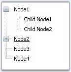{border="0"}

Figure 197

 

[]{style="FONT-FAMILY: 'Trebuchet MS','sans-serif'; COLOR: #15428b; FONT-SIZE: 9pt"} 

[·      ]{style="FONT-FAMILY: Symbol"}Black

[]{style="FONT-FAMILY: 'Trebuchet MS','sans-serif'; COLOR: #15428b; FONT-SIZE: 9pt"} 

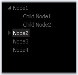{border="0"}

Figure 198

 

[]{style="FONT-FAMILY: 'Trebuchet MS','sans-serif'; COLOR: #15428b; FONT-SIZE: 9pt"} 

[·      ]{style="FONT-FAMILY: Symbol"}Brown

[]{style="FONT-FAMILY: 'Trebuchet MS','sans-serif'; COLOR: #15428b; FONT-SIZE: 9pt"} 

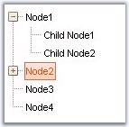{border="0"}

Figure 199

[]{style="FONT-FAMILY: 'Trebuchet MS','sans-serif'; COLOR: #15428b; FONT-SIZE: 9pt"} 

[·      ]{style="FONT-FAMILY: Symbol"}Green

[]{style="FONT-FAMILY: 'Trebuchet MS','sans-serif'; COLOR: #15428b; FONT-SIZE: 9pt"} 

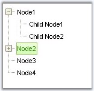{border="0"}

Figure 200

 

###### []{#_ItemLook_Settings}5.3.1.2.13.2        ItemLook Settings {#itemlook-settings style="tab-stops: 0pt"}

 

 

The ItemLooks Collection Editor contains Default property settings that includes the default look and disabled looks, and Custom properties that allows you to customize the look and feel accordingly.

 

The ItemLooks properties are given below.

 

::: {align="center"}
+-------------------+-------------------------------------------------------------------------------------------------------------+
| Property          | Description                                                                                                 |
+-------------------+-------------------------------------------------------------------------------------------------------------+
| ID                | Specifies the id of the item looks settings.                                                                |
+-------------------+-------------------------------------------------------------------------------------------------------------+
| LeftImageHeight   | Specifies the height of the left image.                                                                     |
+-------------------+-------------------------------------------------------------------------------------------------------------+
| LeftImageWidth    | Specifies the width of the right image.                                                                     |
+-------------------+-------------------------------------------------------------------------------------------------------------+
| RightImageHeight  | Specifies the height of the right image.                                                                    |
+-------------------+-------------------------------------------------------------------------------------------------------------+
| RightImageWidth   | Specifies the width of the right image.                                                                     |
+-------------------+-------------------------------------------------------------------------------------------------------------+
| TextPaddingBottom | Specifies the space in pixels around the node text.                                                         |
+-------------------+                                                                                                             |
| TextPaddingLeft   |                                                                                                             |
+-------------------+                                                                                                             |
| TextPaddingRight  |                                                                                                             |
+-------------------+                                                                                                             |
| TextPaddingTop    |                                                                                                             |
+-------------------+-------------------------------------------------------------------------------------------------------------+
| StateDataActive   | Specifies the various look and feel options for different states such as default, active, hover and expand. |
+-------------------+                                                                                                             |
| StateDataDefault  |                                                                                                             |
+-------------------+                                                                                                             |
| StateDataExpanded |                                                                                                             |
+-------------------+                                                                                                             |
| StateDataHover    |                                                                                                             |
+-------------------+-------------------------------------------------------------------------------------------------------------+
:::

 

The ID specifies the id of the look. The text padding and the image\'s height and width can be set for the tree nodes.

The StateDefault, StateActive, StatePushed and StateHover categories contain the following CSS class properties that define styles for treeview nodes.

 

::: {align="center"}
  ----------------------------- ----------------------------------------------------------------
  Property                      Description
  CheckBoxCellCSSClass          Specifies styles for the cell containing the checkbox.
  CheckBoxCssClass              Specifies styles for the checkbox.
  ItemCSSClass                  Specifies styles for the items.
  LeftImageCellCSSClass         Specifies styles for the left image.
  LeftImageContainerCSSClass    Specifies styles for the left image container.
  LeftImageCSSClass             Specifies styles for the left image.
  LeftImageUrl                  Specifies the path of the left image to be used for the node.
  RightImageCellCSSClass        Specifies styles for the cell holding the arrow image.
  RightImageContainerCSSClass   Specifies styles for the right image container.
  RightImageCSSClass            Specifies styles for the right image.
  RightImageUrl                 Specifies the path of the right image to be used for the node.
  TextCellCssClass              Specifies the styles for the cell holding the text.
  TextContainerCssClass         Specifies the styles for the container for the text cell.
  ----------------------------- ----------------------------------------------------------------
:::

 

Images to the left and right of the text can be set, by assigning the respective image name to the corresponding property of the look. Make sure to set the ImageBaseUrl property of the TreeView.

 

Note: The ImageBaseUrl property allows you to specify the path from where the images have to be obtained. By default it is set to \'images\' folder. You can either create a folder called \'images\' and add all the images to be set using the item looks, else use a custom folder and rename the ImageBaseUrl property.

 

The styles can be applied to individual nodes by setting the id of the look to the Look and LookDisabled (for disabled nodes with Disabled property set to True) properties of the required tree nodes in the Designer dialog box. This way the styles will be applied only to those nodes.

 

::: {align="center"}
  --------------- ---------------------------------------------------
  Item Property   Description
  Look            Specifies the look for a node.
  LookDisabled    Specifies the look for an item in disabled state.
  --------------- ---------------------------------------------------
:::

 

See Also

 

[CSS Styles]{.UGHyperlink}[, ]{.UGHyperlink}[Default Looks]{.UGHyperlink}[, ]{.UGHyperlink}[Custom Looks]{.UGHyperlink}[]{.UGHyperlink}

[]{#p292} 

[]{#_Default_Looks}5.3.1.2.13.2.1     Default Looks

[]{style="FONT-FAMILY: 'Trebuchet MS','sans-serif'; COLOR: #15428b; FONT-SIZE: 9pt"} 

Setting styles for Active and Disabled states

[]{style="FONT-FAMILY: 'Trebuchet MS','sans-serif'; COLOR: #15428b; FONT-SIZE: 9pt"} 

TreeView comes with some default look and feels that requires you to apply just by assigning the styles. It also enables to set looks for items in active and disabled states. Styles applied for these states can be default styles or for some actions like node expand and mouse hover.

[]{style="FONT-FAMILY: 'Trebuchet MS','sans-serif'; COLOR: #15428b; FONT-SIZE: 9pt"} 

{border="0"}

Figure 201

[]{style="FONT-FAMILY: 'Trebuchet MS','sans-serif'; COLOR: #15428b; FONT-SIZE: 9pt"} 

The below sample code snippets define the default styles for the items in active state on expanding the nodes, on mouse over and the default style settings for the treeview nodes, and the default disabled style.

[]{style="FONT-FAMILY: 'Trebuchet MS','sans-serif'; COLOR: #15428b; FONT-SIZE: 9pt"} 

+---------------------------------------------------------------------------------------------------------------------------------------------------------------------------------------------------------------------------------------------------------------------------------------------------------------------------------------------------------------------------------------------------------------------------------------------------------------------------------------------------------------------------------------------------------------------------------------------------------------------------------------------------------------------------------------------------------------------------------------------------------------------------------------------------------------------------------------------------------------------------------------------------------------------------------------------------------------------------------------------------------------------------------------------------------------------------------------------------------------------------------------------------------------------------------------------------------------------------------------------------------------------------------------------------------+
| **[\[aspx\]]{style="FONT-FAMILY: 'Courier New'; FONT-SIZE: 9pt"}**                                                                                                                                                                                                                                                                                                                                                                                                                                                                                                                                                                                                                                                                                                                                                                                                                                                                                                                                                                                                                                                                                                                                                                                                                                      |
|                                                                                                                                                                                                                                                                                                                                                                                                                                                                                                                                                                                                                                                                                                                                                                                                                                                                                                                                                                                                                                                                                                                                                                                                                                                                                                         |
| []{style="FONT-FAMILY: 'Courier New'; COLOR: blue; FONT-SIZE: 9pt"}                                                                                                                                                                                                                                                                                                                                                                                                                                                                                                                                                                                                                                                                                                                                                                                                                                                                                                                                                                                                                                                                                                                                                                                                                                     |
|                                                                                                                                                                                                                                                                                                                                                                                                                                                                                                                                                                                                                                                                                                                                                                                                                                                                                                                                                                                                                                                                                                                                                                                                                                                                                                         |
| [\<]{style="FONT-FAMILY: 'Courier New'; COLOR: blue; FONT-SIZE: 9pt"}[DefaultItemLookDisabled]{style="FONT-FAMILY: 'Courier New'; COLOR: maroon; FONT-SIZE: 9pt"}[\>]{style="FONT-FAMILY: 'Courier New'; COLOR: blue; FONT-SIZE: 9pt"}                                                                                                                                                                                                                                                                                                                                                                                                                                                                                                                                                                                                                                                                                                                                                                                                                                                                                                                                                                                                                                                                  |
|                                                                                                                                                                                                                                                                                                                                                                                                                                                                                                                                                                                                                                                                                                                                                                                                                                                                                                                                                                                                                                                                                                                                                                                                                                                                                                         |
| [  [\<]{style="COLOR: blue"}[StateDataActive]{style="COLOR: maroon"} [LeftImageCellCSSClass ]{style="COLOR: red"}[= \"tvImgCell\"]{style="COLOR: blue"} [ItemRowCSSClass ]{style="COLOR: red"}[= \"tvItemRow\"]{style="COLOR: blue"} [LeftImageCSSClass ]{style="COLOR: red"}[= \"tvImg\"]{style="COLOR: blue"} [ItemCSSClass ]{style="COLOR: red"}[= \"tvItemDisabled\"]{style="COLOR: blue"} [CheckBoxCellCSSClass ]{style="COLOR: red"}[= \"tvCheckCell\"]{style="COLOR: blue"} [RightImageCSSClass ]{style="COLOR: red"}[= \"tvArr\"]{style="COLOR: blue"} [TextCellCSSClass ]{style="COLOR: red"}[= \"tvTextCell\"]{style="COLOR: blue"} [CheckBoxCSSClass ]{style="COLOR: red"}[= \"tvCheck\"]{style="COLOR: blue"} [RightImageContainerCSSClass ]{style="COLOR: red"}[= \"tvArrCont\"]{style="COLOR: blue"} [RightImageCellCSSClass ]{style="COLOR: red"}[= \"tvArrCell\"]{style="COLOR: blue"} [LeftImageContainerCSSClass ]{style="COLOR: red"}[= \"tvImgCont\"]{style="COLOR: blue"} [TextContainerCSSClass ]{style="COLOR: red"}[= \"tvTextCont\"\>\</]{style="COLOR: blue"}[StateDataActive]{style="COLOR: maroon"}[\>]{style="COLOR: blue"}]{style="FONT-FAMILY: 'Courier New'; FONT-SIZE: 9pt"}                                                                                           |
|                                                                                                                                                                                                                                                                                                                                                                                                                                                                                                                                                                                                                                                                                                                                                                                                                                                                                                                                                                                                                                                                                                                                                                                                                                                                                                         |
| [  ]{style="FONT-FAMILY: 'Courier New'; FONT-SIZE: 9pt"}                                                                                                                                                                                                                                                                                                                                                                                                                                                                                                                                                                                                                                                                                                                                                                                                                                                                                                                                                                                                                                                                                                                                                                                                                                                |
|                                                                                                                                                                                                                                                                                                                                                                                                                                                                                                                                                                                                                                                                                                                                                                                                                                                                                                                                                                                                                                                                                                                                                                                                                                                                                                         |
| [  \<]{style="FONT-FAMILY: 'Courier New'; COLOR: blue; FONT-SIZE: 9pt"}[StateDataHover]{style="FONT-FAMILY: 'Courier New'; COLOR: maroon; FONT-SIZE: 9pt"}[ [LeftImageCellCSSClass ]{style="COLOR: red"}[= \"tvImgCell\"]{style="COLOR: blue"} [ItemRowCSSClass ]{style="COLOR: red"}[= \"tvItemRow\"]{style="COLOR: blue"} [LeftImageCSSClass ]{style="COLOR: red"}[= \"tvImg\"]{style="COLOR: blue"} [ItemCSSClass ]{style="COLOR: red"}[= \"tvItemDisabled\"]{style="COLOR: blue"} [CheckBoxCellCSSClass ]{style="COLOR: red"}[= \"tvCheckCell\"]{style="COLOR: blue"} [RightImageCSSClass ]{style="COLOR: red"}[= \"tvArr\"]{style="COLOR: blue"} [TextCellCSSClass ]{style="COLOR: red"}[= \"tvTextCell\"]{style="COLOR: blue"} [CheckBoxCSSClass ]{style="COLOR: red"}[= \"tvCheck\"]{style="COLOR: blue"} [RightImageContainerCSSClass ]{style="COLOR: red"}[= \"tvArrCont\"]{style="COLOR: blue"} [RightImageCellCSSClass ]{style="COLOR: red"}[= \"tvArrCell\"]{style="COLOR: blue"} [LeftImageContainerCSSClass ]{style="COLOR: red"}[= \"tvImgCont\"]{style="COLOR: blue"} [TextContainerCSSClass ]{style="COLOR: red"}[= \"tvTextCont\"\>\</]{style="COLOR: blue"}[StateDataHover]{style="COLOR: maroon"}[\>]{style="COLOR: blue"}]{style="FONT-FAMILY: 'Courier New'; FONT-SIZE: 9pt"}     |
|                                                                                                                                                                                                                                                                                                                                                                                                                                                                                                                                                                                                                                                                                                                                                                                                                                                                                                                                                                                                                                                                                                                                                                                                                                                                                                         |
| [  ]{style="FONT-FAMILY: 'Courier New'; FONT-SIZE: 9pt"}                                                                                                                                                                                                                                                                                                                                                                                                                                                                                                                                                                                                                                                                                                                                                                                                                                                                                                                                                                                                                                                                                                                                                                                                                                                |
|                                                                                                                                                                                                                                                                                                                                                                                                                                                                                                                                                                                                                                                                                                                                                                                                                                                                                                                                                                                                                                                                                                                                                                                                                                                                                                         |
| [  \<]{style="FONT-FAMILY: 'Courier New'; COLOR: blue; FONT-SIZE: 9pt"}[StateDataDefault]{style="FONT-FAMILY: 'Courier New'; COLOR: maroon; FONT-SIZE: 9pt"}[ [LeftImageCellCSSClass ]{style="COLOR: red"}[= \"tvImgCell\"]{style="COLOR: blue"} [ItemRowCSSClass ]{style="COLOR: red"}[= \"tvItemRow\"]{style="COLOR: blue"} [LeftImageCSSClass ]{style="COLOR: red"}[= \"tvImg\"]{style="COLOR: blue"} [ItemCSSClass ]{style="COLOR: red"}[= \"tvItemDisabled\"]{style="COLOR: blue"} [CheckBoxCellCSSClass ]{style="COLOR: red"}[= \"tvCheckCell\"]{style="COLOR: blue"} [RightImageCSSClass ]{style="COLOR: red"}[= \"tvArr\"]{style="COLOR: blue"} [TextCellCSSClass ]{style="COLOR: red"}[= \"tvTextCell\"]{style="COLOR: blue"} [CheckBoxCSSClass ]{style="COLOR: red"}[= \"tvCheck\"]{style="COLOR: blue"} [RightImageContainerCSSClass ]{style="COLOR: red"}[= \"tvArrCont\"]{style="COLOR: blue"} [RightImageCellCSSClass ]{style="COLOR: red"}[= \"tvArrCell\"]{style="COLOR: blue"} [LeftImageContainerCSSClass ]{style="COLOR: red"}[= \"tvImgCont\"]{style="COLOR: blue"} [TextContainerCSSClass ]{style="COLOR: red"}[= \"tvTextCont\"\>\</]{style="COLOR: blue"}[StateDataDefault]{style="COLOR: maroon"}[\>]{style="COLOR: blue"}]{style="FONT-FAMILY: 'Courier New'; FONT-SIZE: 9pt"} |
|                                                                                                                                                                                                                                                                                                                                                                                                                                                                                                                                                                                                                                                                                                                                                                                                                                                                                                                                                                                                                                                                                                                                                                                                                                                                                                         |
| [\</]{style="FONT-FAMILY: 'Courier New'; COLOR: blue; FONT-SIZE: 9pt"}[DefaultItemLookDisabled]{style="FONT-FAMILY: 'Courier New'; COLOR: maroon; FONT-SIZE: 9pt"}[\>]{style="FONT-FAMILY: 'Courier New'; COLOR: blue; FONT-SIZE: 9pt"}                                                                                                                                                                                                                                                                                                                                                                                                                                                                                                                                                                                                                                                                                                                                                                                                                                                                                                                                                                                                                                                                 |
+---------------------------------------------------------------------------------------------------------------------------------------------------------------------------------------------------------------------------------------------------------------------------------------------------------------------------------------------------------------------------------------------------------------------------------------------------------------------------------------------------------------------------------------------------------------------------------------------------------------------------------------------------------------------------------------------------------------------------------------------------------------------------------------------------------------------------------------------------------------------------------------------------------------------------------------------------------------------------------------------------------------------------------------------------------------------------------------------------------------------------------------------------------------------------------------------------------------------------------------------------------------------------------------------------------+

[]{style="FONT-FAMILY: 'Trebuchet MS','sans-serif'; COLOR: #15428b; FONT-SIZE: 9pt"} 

[·      ]{style="FONT-FAMILY: Symbol"}Note that the default CSS style sheet used by the treeview control is available at the following location:**/Syncfusion/Resources/Toolsweb/CSS/treeview_default.css**.[ ]{style="COLOR: black"}This CSS file defines the following CSS styles.

[]{style="FONT-FAMILY: 'Trebuchet MS','sans-serif'; COLOR: #15428b; FONT-SIZE: 9pt"} 

+----------------------------------------------------------------------------------------------------------------------------------------------------------------------------------------------------------------+
| **[\[StyleSheet\]]{style="FONT-FAMILY: 'Courier New'; FONT-SIZE: 9pt"}**                                                                                                                                       |
|                                                                                                                                                                                                                |
| []{style="FONT-FAMILY: 'Courier New'; COLOR: blue; FONT-SIZE: 9pt"}                                                                                                                                            |
|                                                                                                                                                                                                                |
| [.tvView]{style="FONT-FAMILY: 'Courier New'; COLOR: maroon; FONT-SIZE: 9pt"}                                                                                                                                   |
|                                                                                                                                                                                                                |
| [{]{style="FONT-FAMILY: 'Courier New'; FONT-SIZE: 9pt"}                                                                                                                                                        |
|                                                                                                                                                                                                                |
| [        [border]{style="COLOR: red"}: [1px]{style="COLOR: blue"} [solid]{style="COLOR: blue"} [gray]{style="COLOR: blue"};]{style="FONT-FAMILY: 'Courier New'; FONT-SIZE: 9pt"}                               |
|                                                                                                                                                                                                                |
| [        [padding-top]{style="COLOR: red"} : [4px]{style="COLOR: blue"};]{style="FONT-FAMILY: 'Courier New'; FONT-SIZE: 9pt"}                                                                                  |
|                                                                                                                                                                                                                |
| [}]{style="FONT-FAMILY: 'Courier New'; FONT-SIZE: 9pt"}                                                                                                                                                        |
|                                                                                                                                                                                                                |
| []{style="FONT-FAMILY: 'Courier New'; FONT-SIZE: 9pt"}                                                                                                                                                         |
|                                                                                                                                                                                                                |
| [.tvView]{style="FONT-FAMILY: 'Courier New'; COLOR: maroon; FONT-SIZE: 9pt"}[ [.tvTextCont]{style="COLOR: maroon"}]{style="FONT-FAMILY: 'Courier New'; FONT-SIZE: 9pt"}                                        |
|                                                                                                                                                                                                                |
| [{]{style="FONT-FAMILY: 'Courier New'; FONT-SIZE: 9pt"}                                                                                                                                                        |
|                                                                                                                                                                                                                |
| [        [font-family]{style="COLOR: red"}: [tahoma]{style="COLOR: blue"}; ]{style="FONT-FAMILY: 'Courier New'; FONT-SIZE: 9pt"}                                                                               |
|                                                                                                                                                                                                                |
| [        [font-size]{style="COLOR: red"}: [11px]{style="COLOR: blue"};]{style="FONT-FAMILY: 'Courier New'; FONT-SIZE: 9pt"}                                                                                    |
|                                                                                                                                                                                                                |
| [        [padding]{style="COLOR: red"}: [2px]{style="COLOR: blue"};]{style="FONT-FAMILY: 'Courier New'; FONT-SIZE: 9pt"}                                                                                       |
|                                                                                                                                                                                                                |
| [        [cursor]{style="COLOR: red"}: [default]{style="COLOR: blue"};]{style="FONT-FAMILY: 'Courier New'; FONT-SIZE: 9pt"}                                                                                    |
|                                                                                                                                                                                                                |
| [}]{style="FONT-FAMILY: 'Courier New'; FONT-SIZE: 9pt"}                                                                                                                                                        |
|                                                                                                                                                                                                                |
| []{style="FONT-FAMILY: 'Courier New'; FONT-SIZE: 9pt"}                                                                                                                                                         |
|                                                                                                                                                                                                                |
| [.tvView]{style="FONT-FAMILY: 'Courier New'; COLOR: maroon; FONT-SIZE: 9pt"}[ [.tvItemHover]{style="COLOR: maroon"} [.tvTextCont]{style="COLOR: maroon"}]{style="FONT-FAMILY: 'Courier New'; FONT-SIZE: 9pt"}  |
|                                                                                                                                                                                                                |
| [{]{style="FONT-FAMILY: 'Courier New'; FONT-SIZE: 9pt"}                                                                                                                                                        |
|                                                                                                                                                                                                                |
| [        [text-decoration]{style="COLOR: red"}:[underline]{style="COLOR: blue"};]{style="FONT-FAMILY: 'Courier New'; FONT-SIZE: 9pt"}                                                                          |
|                                                                                                                                                                                                                |
| [}]{style="FONT-FAMILY: 'Courier New'; FONT-SIZE: 9pt"}                                                                                                                                                        |
|                                                                                                                                                                                                                |
| []{style="FONT-FAMILY: 'Courier New'; FONT-SIZE: 9pt"}                                                                                                                                                         |
|                                                                                                                                                                                                                |
| [.tvView]{style="FONT-FAMILY: 'Courier New'; COLOR: maroon; FONT-SIZE: 9pt"}[ [.tvItemActive]{style="COLOR: maroon"} [.tvTextCont]{style="COLOR: maroon"}]{style="FONT-FAMILY: 'Courier New'; FONT-SIZE: 9pt"} |
|                                                                                                                                                                                                                |
| [{]{style="FONT-FAMILY: 'Courier New'; FONT-SIZE: 9pt"}                                                                                                                                                        |
|                                                                                                                                                                                                                |
| [        [color]{style="COLOR: red"}: [white]{style="COLOR: blue"};]{style="FONT-FAMILY: 'Courier New'; FONT-SIZE: 9pt"}                                                                                       |
|                                                                                                                                                                                                                |
| [}]{style="FONT-FAMILY: 'Courier New'; FONT-SIZE: 9pt"}                                                                                                                                                        |
|                                                                                                                                                                                                                |
| []{style="FONT-FAMILY: 'Courier New'; FONT-SIZE: 9pt"}                                                                                                                                                         |
|                                                                                                                                                                                                                |
| [.tvView]{style="FONT-FAMILY: 'Courier New'; COLOR: maroon; FONT-SIZE: 9pt"}[ [.tvItemActive]{style="COLOR: maroon"} [.tvTextCell]{style="COLOR: maroon"}]{style="FONT-FAMILY: 'Courier New'; FONT-SIZE: 9pt"} |
|                                                                                                                                                                                                                |
| [{]{style="FONT-FAMILY: 'Courier New'; FONT-SIZE: 9pt"}                                                                                                                                                        |
|                                                                                                                                                                                                                |
| [        [background-color]{style="COLOR: red"}: [gray]{style="COLOR: blue"};]{style="FONT-FAMILY: 'Courier New'; FONT-SIZE: 9pt"}                                                                             |
|                                                                                                                                                                                                                |
| [}]{style="FONT-FAMILY: 'Courier New'; FONT-SIZE: 9pt"}                                                                                                                                                        |
|                                                                                                                                                                                                                |
| []{style="FONT-FAMILY: 'Courier New'; FONT-SIZE: 9pt"}                                                                                                                                                         |
|                                                                                                                                                                                                                |
| [.tvView]{style="FONT-FAMILY: 'Courier New'; COLOR: maroon; FONT-SIZE: 9pt"}[ [.tvImgCell]{style="COLOR: maroon"}]{style="FONT-FAMILY: 'Courier New'; FONT-SIZE: 9pt"}                                         |
|                                                                                                                                                                                                                |
| [{]{style="FONT-FAMILY: 'Courier New'; FONT-SIZE: 9pt"}                                                                                                                                                        |
|                                                                                                                                                                                                                |
| [        [padding-right]{style="COLOR: red"}:[3px]{style="COLOR: blue"};]{style="FONT-FAMILY: 'Courier New'; FONT-SIZE: 9pt"}                                                                                  |
|                                                                                                                                                                                                                |
| [}]{style="FONT-FAMILY: 'Courier New'; FONT-SIZE: 9pt"}                                                                                                                                                        |
|                                                                                                                                                                                                                |
| []{style="FONT-FAMILY: 'Courier New'; FONT-SIZE: 9pt"}                                                                                                                                                         |
|                                                                                                                                                                                                                |
| [.tvView]{style="FONT-FAMILY: 'Courier New'; COLOR: maroon; FONT-SIZE: 9pt"}[ [.tvNodeEdit]{style="COLOR: maroon"}]{style="FONT-FAMILY: 'Courier New'; FONT-SIZE: 9pt"}                                        |
|                                                                                                                                                                                                                |
| [{]{style="FONT-FAMILY: 'Courier New'; FONT-SIZE: 9pt"}                                                                                                                                                        |
|                                                                                                                                                                                                                |
| [        [border]{style="COLOR: red"}:[1px]{style="COLOR: blue"} [gray]{style="COLOR: blue"} [solid]{style="COLOR: blue"};]{style="FONT-FAMILY: 'Courier New'; FONT-SIZE: 9pt"}                                |
|                                                                                                                                                                                                                |
| [        [font-family]{style="COLOR: red"}: [tahoma]{style="COLOR: blue"}; ]{style="FONT-FAMILY: 'Courier New'; FONT-SIZE: 9pt"}                                                                               |
|                                                                                                                                                                                                                |
| [        [font-size]{style="COLOR: red"}: [11px]{style="COLOR: blue"};]{style="FONT-FAMILY: 'Courier New'; FONT-SIZE: 9pt"}                                                                                    |
|                                                                                                                                                                                                                |
| [}]{style="FONT-FAMILY: 'Courier New'; FONT-SIZE: 9pt"}                                                                                                                                                        |
+----------------------------------------------------------------------------------------------------------------------------------------------------------------------------------------------------------------+

 

[]{#_Custom_Looks}5.3.1.2.13.2.2     Custom Looks

[]{style="FONT-FAMILY: 'Trebuchet MS','sans-serif'; COLOR: #15428b; FONT-SIZE: 9pt"} 

We can easily customize the default look of the treeview nodes. **Custom Looks** properties in **ItemLooks Collection Editor** allows you to apply custom looks to your treeview.

[]{style="FONT-FAMILY: 'Trebuchet MS','sans-serif'; COLOR: #15428b; FONT-SIZE: 9pt"} 

Using Designer

[]{style="FONT-FAMILY: 'Trebuchet MS','sans-serif'; COLOR: #15428b; FONT-SIZE: 9pt"} 

ItemLooks Editor lets you easily create the item looks for the items. If you create your own ItemLooks then this will override the default look.

[]{style="FONT-FAMILY: 'Trebuchet MS','sans-serif'; COLOR: #15428b; FONT-SIZE: 9pt"} 

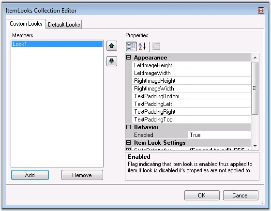{border="0"}

Figure 202

 

[]{style="FONT-FAMILY: 'Trebuchet MS','sans-serif'; COLOR: #15428b; FONT-SIZE: 9pt"} 

1.   Give the CSS class names in the appropriate CSS styles.

50.  Once you given the styles in the item look editor, in HTML view you can see the below code like this.

[]{style="FONT-FAMILY: 'Trebuchet MS','sans-serif'; COLOR: #15428b; FONT-SIZE: 9pt"} 

+--------------------------------------------------------------------------------------------------------------------------------------------------------------------------------------------------------------------------------------------------------------------------------------------------------------------------------------------------------------------------------------------------------------------------------------------------------------------------------------------------------------------------------------------------------------------------------------------------------------------------------------------+
| **[\[C#\]]{style="FONT-FAMILY: 'Courier New'; FONT-SIZE: 9pt"}**                                                                                                                                                                                                                                                                                                                                                                                                                                                                                                                                                                           |
|                                                                                                                                                                                                                                                                                                                                                                                                                                                                                                                                                                                                                                            |
| []{style="FONT-FAMILY: 'Courier New'; COLOR: blue; FONT-SIZE: 9pt"}                                                                                                                                                                                                                                                                                                                                                                                                                                                                                                                                                                        |
|                                                                                                                                                                                                                                                                                                                                                                                                                                                                                                                                                                                                                                            |
| [\<]{style="FONT-FAMILY: 'Courier New'; COLOR: blue; FONT-SIZE: 9pt"}[cc1]{style="FONT-FAMILY: 'Courier New'; COLOR: maroon; FONT-SIZE: 9pt"}[:]{style="FONT-FAMILY: 'Courier New'; COLOR: blue; FONT-SIZE: 9pt"}[treeview]{style="FONT-FAMILY: 'Courier New'; COLOR: maroon; FONT-SIZE: 9pt"}[ [id]{style="COLOR: red"}[=\"TreeView2\"]{style="COLOR: blue"} [runat]{style="COLOR: red"}[=\"server\"]{style="COLOR: blue"} [CssClass]{style="COLOR: red"}[=\"TreeView\"\>]{style="COLOR: blue"}]{style="FONT-FAMILY: 'Courier New'; FONT-SIZE: 9pt"}                                                                                      |
|                                                                                                                                                                                                                                                                                                                                                                                                                                                                                                                                                                                                                                            |
| [  [\<]{style="COLOR: blue"}[itemlooks]{style="COLOR: maroon"}[\>]{style="COLOR: blue"}]{style="FONT-FAMILY: 'Courier New'; FONT-SIZE: 9pt"}                                                                                                                                                                                                                                                                                                                                                                                                                                                                                               |
|                                                                                                                                                                                                                                                                                                                                                                                                                                                                                                                                                                                                                                            |
| [    [\<]{style="COLOR: blue"}[cc1]{style="COLOR: maroon"}[:]{style="COLOR: blue"}[TreeViewItemLook]{style="COLOR: maroon"} [ID]{style="COLOR: red"}[=\"Look1\"\>]{style="COLOR: blue"}]{style="FONT-FAMILY: 'Courier New'; FONT-SIZE: 9pt"}                                                                                                                                                                                                                                                                                                                                                                                               |
|                                                                                                                                                                                                                                                                                                                                                                                                                                                                                                                                                                                                                                            |
| [\<]{style="FONT-FAMILY: 'Courier New'; COLOR: blue; FONT-SIZE: 9pt"}[StateDataActive]{style="FONT-FAMILY: 'Courier New'; COLOR: maroon; FONT-SIZE: 9pt"}[ [ItemRowCSSClass ]{style="COLOR: red"}[= \"Act_ItemRowCss\"]{style="COLOR: blue"} [RightImageCSSClass ]{style="COLOR: red"}[= \"Act_RightImageCss\"]{style="COLOR: blue"} [LeftImageURL ]{style="COLOR: red"}[= \"folder.gif\"]{style="COLOR: blue"}  [TextContainerCSSClass ]{style="COLOR: red"}[= \"Act_TextCont\"\>  \</]{style="COLOR: blue"}[StateDataActive]{style="COLOR: maroon"}[\>]{style="COLOR: blue"}]{style="FONT-FAMILY: 'Courier New'; FONT-SIZE: 9pt"}        |
|                                                                                                                                                                                                                                                                                                                                                                                                                                                                                                                                                                                                                                            |
| [\<]{style="FONT-FAMILY: 'Courier New'; COLOR: blue; FONT-SIZE: 9pt"}[StateDataDefault]{style="FONT-FAMILY: 'Courier New'; COLOR: maroon; FONT-SIZE: 9pt"}[ [ItemRowCSSClass ]{style="COLOR: red"}[= \"Def_ItemRowCss\"]{style="COLOR: blue"} [RightImageCSSClass ]{style="COLOR: red"}[= \"Def_RightImageCss\"]{style="COLOR: blue"} [LeftImageURL ]{style="COLOR: red"}[= \"folder.gif\"]{style="COLOR: blue"} [TextContainerCSSClass ]{style="COLOR: red"}[= \"Def_TextCont\"\> \</]{style="COLOR: blue"}[StateDataDefault]{style="COLOR: maroon"}[\>]{style="COLOR: blue"}]{style="FONT-FAMILY: 'Courier New'; FONT-SIZE: 9pt"}        |
|                                                                                                                                                                                                                                                                                                                                                                                                                                                                                                                                                                                                                                            |
| [\<]{style="FONT-FAMILY: 'Courier New'; COLOR: blue; FONT-SIZE: 9pt"}[StateDataExpanded]{style="FONT-FAMILY: 'Courier New'; COLOR: maroon; FONT-SIZE: 9pt"}[ [ItemRowCSSClass ]{style="COLOR: red"}[= \"Def_ItemRowCss\"]{style="COLOR: blue"} [RightImageCSSClass ]{style="COLOR: red"}[= \"Def_RightImageCss\"]{style="COLOR: blue"} [LeftImageURL ]{style="COLOR: red"}[= \"folder_open.gif\"]{style="COLOR: blue"} [TextContainerCSSClass ]{style="COLOR: red"}[= \"Def_TextCont\"\> \</]{style="COLOR: blue"}[StateDataExpanded]{style="COLOR: maroon"}[\>]{style="COLOR: blue"}]{style="FONT-FAMILY: 'Courier New'; FONT-SIZE: 9pt"} |
|                                                                                                                                                                                                                                                                                                                                                                                                                                                                                                                                                                                                                                            |
| [\<]{style="FONT-FAMILY: 'Courier New'; COLOR: blue; FONT-SIZE: 9pt"}[StateDataHover]{style="FONT-FAMILY: 'Courier New'; COLOR: maroon; FONT-SIZE: 9pt"}[ [ItemRowCSSClass ]{style="COLOR: red"}[= \"Hov_ItemRowCss\"]{style="COLOR: blue"} [RightImageCSSClass ]{style="COLOR: red"}[= \"Hov_RightImageCss\"]{style="COLOR: blue"} [LeftImageURL ]{style="COLOR: red"}[= \"folder.gif\"]{style="COLOR: blue"} [TextContainerCSSClass ]{style="COLOR: red"}[= \"Hov_TextCont\"\> \</]{style="COLOR: blue"}[StateDataHover]{style="COLOR: maroon"}[\>]{style="COLOR: blue"}]{style="FONT-FAMILY: 'Courier New'; FONT-SIZE: 9pt"}            |
|                                                                                                                                                                                                                                                                                                                                                                                                                                                                                                                                                                                                                                            |
| [    [\</]{style="COLOR: blue"}[cc1]{style="COLOR: maroon"}[:]{style="COLOR: blue"}[TreeViewItemLook]{style="COLOR: maroon"}[\>]{style="COLOR: blue"}]{style="FONT-FAMILY: 'Courier New'; FONT-SIZE: 9pt"}                                                                                                                                                                                                                                                                                                                                                                                                                                 |
|                                                                                                                                                                                                                                                                                                                                                                                                                                                                                                                                                                                                                                            |
| [  [\</]{style="COLOR: blue"}[itemlooks]{style="COLOR: maroon"}[\>]{style="COLOR: blue"}]{style="FONT-FAMILY: 'Courier New'; FONT-SIZE: 9pt"}                                                                                                                                                                                                                                                                                                                                                                                                                                                                                              |
|                                                                                                                                                                                                                                                                                                                                                                                                                                                                                                                                                                                                                                            |
| [\</]{style="FONT-FAMILY: 'Courier New'; COLOR: blue; FONT-SIZE: 9pt"}[cc1]{style="FONT-FAMILY: 'Courier New'; COLOR: maroon; FONT-SIZE: 9pt"}[:]{style="FONT-FAMILY: 'Courier New'; COLOR: blue; FONT-SIZE: 9pt"}[treeview]{style="FONT-FAMILY: 'Courier New'; COLOR: maroon; FONT-SIZE: 9pt"}[\>]{style="FONT-FAMILY: 'Courier New'; COLOR: blue; FONT-SIZE: 9pt"}                                                                                                                                                                                                                                                                       |
+--------------------------------------------------------------------------------------------------------------------------------------------------------------------------------------------------------------------------------------------------------------------------------------------------------------------------------------------------------------------------------------------------------------------------------------------------------------------------------------------------------------------------------------------------------------------------------------------------------------------------------------------+

[]{style="FONT-FAMILY: 'Trebuchet MS','sans-serif'; COLOR: #15428b; FONT-SIZE: 9pt"} 

51.  Set the Look ID to **Look** property for the tree nodes to which the specified styles should be applied. To apply styles for the disabled nodes, set the look ID to the **LookDisabled** property.

[]{style="FONT-FAMILY: 'Trebuchet MS','sans-serif'; COLOR: #15428b; FONT-SIZE: 9pt"} 

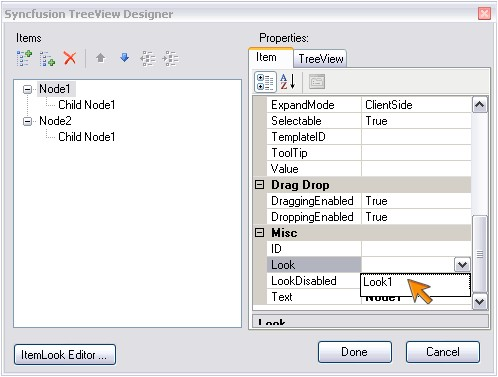{border="0"}

[]{style="FONT-FAMILY: 'Trebuchet MS','sans-serif'; COLOR: #15428b; FONT-SIZE: 9pt"} 

Figure 203: Designer image

[]{style="FONT-FAMILY: 'Trebuchet MS','sans-serif'; COLOR: #15428b; FONT-SIZE: 9pt"} 

Using Code

[]{style="FONT-FAMILY: 'Trebuchet MS','sans-serif'; COLOR: #15428b; FONT-SIZE: 9pt"} 

ItemLooks can be created and added to the treeview. Here we can see how the ItemLooks instance can be created and added programmatically. And these ItemLooks can be applied to the treeview items like below.

[]{style="FONT-FAMILY: 'Trebuchet MS','sans-serif'; COLOR: #15428b; FONT-SIZE: 9pt"} 

+---------------------------------------------------------------------------------------------------------------------------------------+
| **[\[C#\]]{style="FONT-FAMILY: 'Courier New'; FONT-SIZE: 9pt"}**                                                                      |
|                                                                                                                                       |
| []{style="FONT-FAMILY: 'Courier New'"}                                                                                                |
|                                                                                                                                       |
| [TreeViewItemLook look=[new]{style="COLOR: blue"} TreeViewItemLook();]{style="FONT-FAMILY: 'Courier New'; FONT-SIZE: 9pt"}            |
|                                                                                                                                       |
| [look.ID=[\"RootNodeLook\"]{style="COLOR: maroon"};]{style="FONT-FAMILY: 'Courier New'; FONT-SIZE: 9pt"}                              |
|                                                                                                                                       |
| [look.StateDataDefault.ItemCSSClass=[\"Def_ItemCss\"]{style="COLOR: maroon"};]{style="FONT-FAMILY: 'Courier New'; FONT-SIZE: 9pt"}    |
|                                                                                                                                       |
| [look.StateDataExpanded.ItemCSSClass = [\"Exp_ItemCss\"]{style="COLOR: maroon"};]{style="FONT-FAMILY: 'Courier New'; FONT-SIZE: 9pt"} |
|                                                                                                                                       |
| [look.StateDataHover.ItemCSSClass = [\"Hov_ItemCss\"]{style="COLOR: maroon"};]{style="FONT-FAMILY: 'Courier New'; FONT-SIZE: 9pt"}    |
|                                                                                                                                       |
| [TreeView1.ItemLooks.Add(RootItemsLook);]{style="FONT-FAMILY: 'Courier New'; FONT-SIZE: 9pt"}                                         |
|                                                                                                                                       |
| [TreeViewNode node= [new]{style="COLOR: blue"} TreeViewNode();]{style="FONT-FAMILY: 'Courier New'; FONT-SIZE: 9pt"}                   |
|                                                                                                                                       |
| [node.Text = [\"Essential Chart\"]{style="COLOR: maroon"};]{style="FONT-FAMILY: 'Courier New'; FONT-SIZE: 9pt"}                       |
|                                                                                                                                       |
| [node.Look=[\"RootNodeLook\"]{style="COLOR: maroon"};]{style="FONT-FAMILY: 'Courier New'; FONT-SIZE: 9pt"}                            |
+---------------------------------------------------------------------------------------------------------------------------------------+

[]{style="FONT-FAMILY: 'Trebuchet MS','sans-serif'; COLOR: #15428b; FONT-SIZE: 9pt"} 

+----------------------------------------------------------------------------------------------------------------------------------------------------------------------------------------------------------------------------------+
| **[\[VB\]]{style="FONT-FAMILY: 'Courier New'; FONT-SIZE: 9pt"}**                                                                                                                                                                 |
|                                                                                                                                                                                                                                  |
| []{style="FONT-FAMILY: 'Courier New'; FONT-SIZE: 9pt"}                                                                                                                                                                           |
|                                                                                                                                                                                                                                  |
| [Private]{style="FONT-FAMILY: 'Courier New'; COLOR: blue; FONT-SIZE: 9pt"}[ look [As]{style="COLOR: blue"} TreeViewItemLook = [New]{style="COLOR: blue"} TreeViewItemLook()]{style="FONT-FAMILY: 'Courier New'; FONT-SIZE: 9pt"} |
|                                                                                                                                                                                                                                  |
| [Private]{style="FONT-FAMILY: 'Courier New'; COLOR: blue; FONT-SIZE: 9pt"}[ look.ID=[\"RootNodeLook\"]{style="COLOR: maroon"}]{style="FONT-FAMILY: 'Courier New'; FONT-SIZE: 9pt"}                                               |
|                                                                                                                                                                                                                                  |
| [Private]{style="FONT-FAMILY: 'Courier New'; COLOR: blue; FONT-SIZE: 9pt"}[ look.StateDataDefault.ItemCSSClass=[\"Def_ItemCss\"]{style="COLOR: maroon"}]{style="FONT-FAMILY: 'Courier New'; FONT-SIZE: 9pt"}                     |
|                                                                                                                                                                                                                                  |
| [Private]{style="FONT-FAMILY: 'Courier New'; COLOR: blue; FONT-SIZE: 9pt"}[ look.StateDataExpanded.ItemCSSClass = [\"Exp_ItemCss\"]{style="COLOR: maroon"}]{style="FONT-FAMILY: 'Courier New'; FONT-SIZE: 9pt"}                  |
|                                                                                                                                                                                                                                  |
| [Private]{style="FONT-FAMILY: 'Courier New'; COLOR: blue; FONT-SIZE: 9pt"}[ look.StateDataHover.ItemCSSClass = [\"Hov_ItemCss\"]{style="COLOR: maroon"}]{style="FONT-FAMILY: 'Courier New'; FONT-SIZE: 9pt"}                     |
|                                                                                                                                                                                                                                  |
| [TreeView1.ItemLooks.Add(RootItemsLook)]{style="FONT-FAMILY: 'Courier New'; FONT-SIZE: 9pt"}                                                                                                                                     |
|                                                                                                                                                                                                                                  |
| [Private]{style="FONT-FAMILY: 'Courier New'; COLOR: blue; FONT-SIZE: 9pt"}[ node [As]{style="COLOR: blue"} TreeViewNode = [New]{style="COLOR: blue"} TreeViewNode()]{style="FONT-FAMILY: 'Courier New'; FONT-SIZE: 9pt"}         |
|                                                                                                                                                                                                                                  |
| [Private]{style="FONT-FAMILY: 'Courier New'; COLOR: blue; FONT-SIZE: 9pt"}[ node.Text = [\"Essential Chart\"]{style="COLOR: maroon"}]{style="FONT-FAMILY: 'Courier New'; FONT-SIZE: 9pt"}                                        |
|                                                                                                                                                                                                                                  |
| [Private]{style="FONT-FAMILY: 'Courier New'; COLOR: blue; FONT-SIZE: 9pt"}[ node.Look=[\"RootNodeLook\"]{style="COLOR: maroon"}]{style="FONT-FAMILY: 'Courier New'; FONT-SIZE: 9pt"}                                             |
+----------------------------------------------------------------------------------------------------------------------------------------------------------------------------------------------------------------------------------+

 

###### []{#_CSS_Styles_1}5.3.1.2.13.3        CSS Styles {#css-styles style="tab-stops: 0pt"}

[]{style="FONT-FAMILY: 'Trebuchet MS','sans-serif'; COLOR: #15428b; FONT-SIZE: 9pt"} 

The TreeView control comprises of distinct segments for which css style definitions can be set. The default styles of the layered treeview structure can be replaced with custom style settings by applying the css class names to the corresponding style properties.

[]{style="FONT-FAMILY: 'Trebuchet MS','sans-serif'; COLOR: #15428b; FONT-SIZE: 9pt"} 

Structure of TreeView control

[]{style="FONT-FAMILY: 'Trebuchet MS','sans-serif'; COLOR: #15428b; FONT-SIZE: 9pt"} 

The treeview structure consists of a single level of outer root segment and 2 item-level segments as shown below. Every item added to the treeview contains the item row segment for which styles can be applied using the appropriate properties.

[]{style="FONT-FAMILY: 'Trebuchet MS','sans-serif'; COLOR: #15428b; FONT-SIZE: 9pt"} 

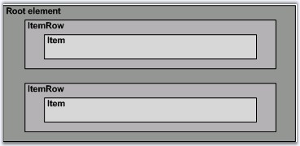{border="0"}

[]{style="FONT-FAMILY: 'Trebuchet MS','sans-serif'; COLOR: #15428b; FONT-SIZE: 9pt"} 

Figure 204: Structure of TreeView control

[]{style="FONT-FAMILY: 'Trebuchet MS','sans-serif'; COLOR: #15428b; FONT-SIZE: 9pt"} 

The below table lists the item-level segments and their corresponding **CSS** properties whose settings affect their styles.

[]{style="FONT-FAMILY: 'Trebuchet MS','sans-serif'; COLOR: #15428b; FONT-SIZE: 9pt"} 

::: {align="center"}
  -------------------- ----------------- --------------------------------
  Element              Property          Default Value (CSS Class Name)
  Root element         CSSClass          tvView
  Root panel element   ItemRowCSSClass   tvItemRow
  -------------------- ----------------- --------------------------------
:::

[]{style="FONT-FAMILY: 'Trebuchet MS','sans-serif'; COLOR: #15428b; FONT-SIZE: 9pt"} 

Customizing TreeView Root-level segments

[]{style="FONT-FAMILY: 'Trebuchet MS','sans-serif'; COLOR: #15428b; FONT-SIZE: 9pt"} 

To customize the look and feel of one of the above segments, simply create a custom css style and associate it with the CSS property corresponding to that segment.

[]{style="FONT-FAMILY: 'Trebuchet MS','sans-serif'; COLOR: #15428b; FONT-SIZE: 9pt"} 

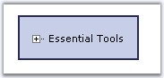{border="0"}

[]{style="FONT-FAMILY: 'Trebuchet MS','sans-serif'; COLOR: #15428b; FONT-SIZE: 9pt"} 

Figure 205: TreeView with css settings for the root elements

**[]{style="COLOR: black; FONT-SIZE: 8pt"}** 

The CSS properties set to the custom CSS values and the style definitions are shown below.

[]{style="FONT-FAMILY: 'Trebuchet MS','sans-serif'; COLOR: #15428b; FONT-SIZE: 9pt"} 

::: {align="center"}
  ----------------- -------------------------------
  Property          Value (Custom CSS Class Name)
  CSSClass          Def_CSSClass
  ItemRowCSSClass   Def_ItemRowCSS
  ----------------- -------------------------------
:::

[]{style="FONT-FAMILY: 'Trebuchet MS','sans-serif'; COLOR: black; FONT-SIZE: 9pt"} 

+---------------------------------------------------------------------------------------------------------------------------------------------------------------------------------+
| **[\[Css Styles\]]{style="FONT-FAMILY: 'Courier New'; COLOR: black; FONT-SIZE: 9pt"}**                                                                                          |
|                                                                                                                                                                                 |
| []{style="FONT-FAMILY: 'Courier New'; COLOR: maroon; FONT-SIZE: 9pt"}                                                                                                           |
|                                                                                                                                                                                 |
| [Def_CSSClass]{style="FONT-FAMILY: 'Courier New'; COLOR: maroon; FONT-SIZE: 9pt"}                                                                                               |
|                                                                                                                                                                                 |
| [{]{style="FONT-FAMILY: 'Courier New'; FONT-SIZE: 9pt"}                                                                                                                         |
|                                                                                                                                                                                 |
| [  [border]{style="COLOR: red"}: [#333365]{style="COLOR: blue"} [2px]{style="COLOR: blue"} [solid]{style="COLOR: blue"};  ]{style="FONT-FAMILY: 'Courier New'; FONT-SIZE: 9pt"} |
|                                                                                                                                                                                 |
| [  [cursor]{style="COLOR: red"}: [default]{style="COLOR: blue"};]{style="FONT-FAMILY: 'Courier New'; FONT-SIZE: 9pt"}                                                           |
|                                                                                                                                                                                 |
| [  [background-color]{style="COLOR: red"}:[#DBE2F2]{style="COLOR: blue"};]{style="FONT-FAMILY: 'Courier New'; FONT-SIZE: 9pt"}                                                  |
|                                                                                                                                                                                 |
| [}]{style="FONT-FAMILY: 'Courier New'; FONT-SIZE: 9pt"}                                                                                                                         |
|                                                                                                                                                                                 |
| [.Def_ItemRowCSS]{style="FONT-FAMILY: 'Courier New'; COLOR: maroon; FONT-SIZE: 9pt"}                                                                                            |
|                                                                                                                                                                                 |
| [{]{style="FONT-FAMILY: 'Courier New'; FONT-SIZE: 9pt"}                                                                                                                         |
|                                                                                                                                                                                 |
| [  [padding-top]{style="COLOR: red"}:[2px]{style="COLOR: blue"};]{style="FONT-FAMILY: 'Courier New'; FONT-SIZE: 9pt"}                                                           |
|                                                                                                                                                                                 |
| [}]{style="FONT-FAMILY: 'Courier New'; FONT-SIZE: 9pt"}                                                                                                                         |
+---------------------------------------------------------------------------------------------------------------------------------------------------------------------------------+

[]{style="FONT-FAMILY: 'Trebuchet MS','sans-serif'; COLOR: #15428b; FONT-SIZE: 9pt"} 

Structure of the treeview Item

**[]{style="FONT-FAMILY: 'Trebuchet MS','sans-serif'; COLOR: #15428b"}** 

A single tree item is segregated into different image and text sections, the look for all of which can again be controlled through their corresponding CSS property settings. An item consists of showline, check box, text, left and right image as shown below.

[]{style="FONT-FAMILY: 'Trebuchet MS','sans-serif'; COLOR: #15428b; FONT-SIZE: 9pt"} 

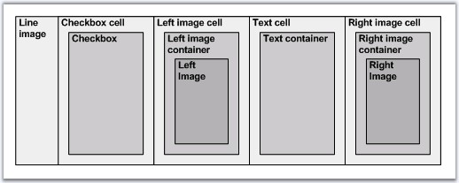{border="0"}

[]{style="FONT-FAMILY: 'Trebuchet MS','sans-serif'; COLOR: #15428b; FONT-SIZE: 9pt"} 

Figure 206: Structure of a treeview Item

[]{style="FONT-FAMILY: 'Trebuchet MS','sans-serif'; COLOR: #15428b; FONT-SIZE: 9pt"} 

The below table lists the item-level segments and their corresponding CSS properties whose settings affect their styles.

[]{style="FONT-FAMILY: 'Trebuchet MS','sans-serif'; COLOR: #15428b; FONT-SIZE: 9pt"} 

::: {align="center"}
  -------------------------- ----------------------------- --------------------------------
  Element                    Property                      Default Value (CSS Class Name)
  ControlRootTableCSSClass   ItemCSSClass                  tvItem
  Checkbox cell              CheckBocCellCssClass          tvCheckCell
  Checkbox                   CheckBoxCssClass              tvCheck
  Left image cell            LeftImageCellCSSClass         tvImgCell
  Left image container       LeftImageContainerCSSClass    tvImgCont
  Left image                 LeftImageCSSClass             tvImg
  Text cell                  TextCellCssClass              tvTextCell
  Text container             TextContainerCssClass         tvTextCont
  Right image cell           RightImageCellCSSClass        tvArrCell
  Right image container      RightImageContainerCSSClass   tvArrCont
  Right image                RightImageCSSClass            tvArr
  -------------------------- ----------------------------- --------------------------------
:::

[]{style="FONT-FAMILY: 'Trebuchet MS','sans-serif'; COLOR: black"} 

Customizing TreeView Item-level segments

[]{style="FONT-FAMILY: 'Trebuchet MS','sans-serif'; COLOR: #15428b; FONT-SIZE: 9pt"} 

The following section shows some custom styles applied on the different item-level segments and a screenshot of the resulting look.

[]{style="FONT-FAMILY: 'Trebuchet MS','sans-serif'; COLOR: #15428b; FONT-SIZE: 9pt"} 

::: {align="center"}
+---------------------------------------------------------------------------------------+-----------------------------+---------------------+-------------------------------------------------------------------------------------------------------------------------------------------------------------+
| Image                                                                                 | Property                    | Custom CSS Style    | CSS Definition                                                                                                                                              |
+---------------------------------------------------------------------------------------+-----------------------------+---------------------+-------------------------------------------------------------------------------------------------------------------------------------------------------------+
| []{style="FONT-FAMILY: 'Trebuchet MS','sans-serif'; COLOR: black"}                    | ItemCSSClass                | Def_ItemCSS         | [.Def_ItemCSS]{style="FONT-FAMILY: 'Courier New'; COLOR: maroon"}                                                                                           |
|                                                                                       |                             |                     |                                                                                                                                                             |
| 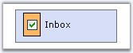{border="0"}                                            |                             |                     | [{]{style="FONT-FAMILY: 'Courier New'"}                                                                                                                     |
|                                                                                       |                             |                     |                                                                                                                                                             |
| []{style="FONT-FAMILY: 'Trebuchet MS','sans-serif'; COLOR: #15428b; FONT-SIZE: 9pt"}  |                             |                     | [  [padding-top]{style="COLOR: red"}:[3px]{style="COLOR: blue"};]{style="FONT-FAMILY: 'Courier New'"}                                                       |
|                                                                                       |                             |                     |                                                                                                                                                             |
| TreeView with style settings for checkbox                                             |                             |                     | [  [padding-left]{style="COLOR: red"}:[9px]{style="COLOR: blue"};]{style="FONT-FAMILY: 'Courier New'"}                                                      |
|                                                                                       |                             |                     |                                                                                                                                                             |
|                                                                                       |                             |                     | [  [padding-right]{style="COLOR: red"}:[5px]{style="COLOR: blue"};]{style="FONT-FAMILY: 'Courier New'"}                                                     |
|                                                                                       |                             |                     |                                                                                                                                                             |
|                                                                                       |                             |                     | [  [padding-bottom]{style="COLOR: red"}:[3px]{style="COLOR: blue"}; ]{style="FONT-FAMILY: 'Courier New'"}                                                   |
|                                                                                       |                             |                     |                                                                                                                                                             |
|                                                                                       |                             |                     | [}]{style="FONT-FAMILY: 'Courier New'"}                                                                                                                     |
|                                                                                       |                             |                     |                                                                                                                                                             |
|                                                                                       |                             |                     | [.CheckBoxCssClass]{style="FONT-FAMILY: 'Courier New'; COLOR: maroon"}                                                                                      |
|                                                                                       |                             |                     |                                                                                                                                                             |
|                                                                                       |                             |                     | [{  ]{style="FONT-FAMILY: 'Courier New'"}                                                                                                                   |
|                                                                                       |                             |                     |                                                                                                                                                             |
|                                                                                       |                             |                     | [  [background-color]{style="COLOR: red"}:[#ffbb6f]{style="COLOR: blue"}; ]{style="FONT-FAMILY: 'Courier New'"}                                             |
|                                                                                       |                             |                     |                                                                                                                                                             |
|                                                                                       |                             |                     | [  [border]{style="COLOR: red"}:[1px]{style="COLOR: blue"} [solid]{style="COLOR: blue"} [black]{style="COLOR: blue"}; ]{style="FONT-FAMILY: 'Courier New'"} |
|                                                                                       |                             |                     |                                                                                                                                                             |
|                                                                                       |                             |                     | [}]{style="FONT-FAMILY: 'Courier New'"}                                                                                                                     |
|                                                                                       |                             |                     |                                                                                                                                                             |
|                                                                                       |                             |                     | [.CheckBoxCellCssClass]{style="FONT-FAMILY: 'Courier New'; COLOR: maroon"}                                                                                  |
|                                                                                       |                             |                     |                                                                                                                                                             |
|                                                                                       |                             |                     | [{]{style="FONT-FAMILY: 'Courier New'"}                                                                                                                     |
|                                                                                       |                             |                     |                                                                                                                                                             |
|                                                                                       |                             |                     | [   [padding]{style="COLOR: red"}:[5px]{style="COLOR: blue"};         ]{style="FONT-FAMILY: 'Courier New'"}                                                 |
|                                                                                       |                             |                     |                                                                                                                                                             |
|                                                                                       |                             |                     | [}]{style="FONT-FAMILY: 'Courier New'"}                                                                                                                     |
|                                                                                       +-----------------------------+---------------------+                                                                                                                                                             |
|                                                                                       | CheckBoxCellCssClass        | Def_CheckBoxCellCSS |                                                                                                                                                             |
|                                                                                       +-----------------------------+---------------------+                                                                                                                                                             |
|                                                                                       | CheckBoxCssClas             | Def_CheckBoxCSS     |                                                                                                                                                             |
+---------------------------------------------------------------------------------------+-----------------------------+---------------------+-------------------------------------------------------------------------------------------------------------------------------------------------------------+
| []{style="FONT-FAMILY: 'Trebuchet MS','sans-serif'; COLOR: #15428b; FONT-SIZE: 9pt"}  | LeftImageCellCSSClass       | LeftImgCellCSS      | [.LeftImgCellCSS]{style="FONT-FAMILY: 'Courier New'; COLOR: maroon"}                                                                                        |
|                                                                                       |                             |                     |                                                                                                                                                             |
| 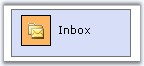{border="0"}                                            |                             |                     | [{]{style="FONT-FAMILY: 'Courier New'"}                                                                                                                     |
|                                                                                       |                             |                     |                                                                                                                                                             |
| []{style="FONT-FAMILY: 'Trebuchet MS','sans-serif'; COLOR: #15428b; FONT-SIZE: 9pt"}  |                             |                     | [  [border]{style="COLOR: red"}:[1px]{style="COLOR: blue"} [solid]{style="COLOR: blue"} [black]{style="COLOR: blue"}; ]{style="FONT-FAMILY: 'Courier New'"} |
|                                                                                       |                             |                     |                                                                                                                                                             |
| TreeView with style settings for left image                                           |                             |                     | [}]{style="FONT-FAMILY: 'Courier New'"}                                                                                                                     |
|                                                                                       |                             |                     |                                                                                                                                                             |
|                                                                                       |                             |                     | [.LeftImgContCSS]{style="FONT-FAMILY: 'Courier New'; COLOR: maroon"}                                                                                        |
|                                                                                       |                             |                     |                                                                                                                                                             |
|                                                                                       |                             |                     | [{]{style="FONT-FAMILY: 'Courier New'"}                                                                                                                     |
|                                                                                       |                             |                     |                                                                                                                                                             |
|                                                                                       |                             |                     | [  [background-color]{style="COLOR: red"}:[#ffbb6f]{style="COLOR: blue"}; ]{style="FONT-FAMILY: 'Courier New'"}                                             |
|                                                                                       |                             |                     |                                                                                                                                                             |
|                                                                                       |                             |                     | [  [padding]{style="COLOR: red"}:[6px]{style="COLOR: blue"};          ]{style="FONT-FAMILY: 'Courier New'"}                                                 |
|                                                                                       |                             |                     |                                                                                                                                                             |
|                                                                                       |                             |                     | [}]{style="FONT-FAMILY: 'Courier New'"}                                                                                                                     |
|                                                                                       |                             |                     |                                                                                                                                                             |
|                                                                                       |                             |                     | [.LeftImgCSS]{style="FONT-FAMILY: 'Courier New'; COLOR: maroon"}                                                                                            |
|                                                                                       |                             |                     |                                                                                                                                                             |
|                                                                                       |                             |                     | [{]{style="FONT-FAMILY: 'Courier New'"}                                                                                                                     |
|                                                                                       |                             |                     |                                                                                                                                                             |
|                                                                                       |                             |                     | [  [height]{style="COLOR: red"}:[17px]{style="COLOR: blue"};]{style="FONT-FAMILY: 'Courier New'"}                                                           |
|                                                                                       |                             |                     |                                                                                                                                                             |
|                                                                                       |                             |                     | [  [width]{style="COLOR: red"}:[16px]{style="COLOR: blue"};]{style="FONT-FAMILY: 'Courier New'"}                                                            |
|                                                                                       |                             |                     |                                                                                                                                                             |
|                                                                                       |                             |                     | [}]{style="FONT-FAMILY: 'Courier New'"}                                                                                                                     |
|                                                                                       +-----------------------------+---------------------+                                                                                                                                                             |
|                                                                                       | LeftImageContainerCSSClass  | LeftImgContCSS      |                                                                                                                                                             |
|                                                                                       +-----------------------------+---------------------+                                                                                                                                                             |
|                                                                                       | LeftImageCSSClass           | LeftImgCSS          |                                                                                                                                                             |
+---------------------------------------------------------------------------------------+-----------------------------+---------------------+-------------------------------------------------------------------------------------------------------------------------------------------------------------+
| []{style="FONT-FAMILY: 'Trebuchet MS','sans-serif'; COLOR: #15428b; FONT-SIZE: 9pt"}  | RightImageCellCSSClass      | RightImgCellCSS     | [.RightImgCellCSS]{style="FONT-FAMILY: 'Courier New'; COLOR: maroon"}                                                                                       |
|                                                                                       |                             |                     |                                                                                                                                                             |
| {border="0"}                                            |                             |                     | [{]{style="FONT-FAMILY: 'Courier New'"}                                                                                                                     |
|                                                                                       |                             |                     |                                                                                                                                                             |
| []{style="FONT-FAMILY: 'Trebuchet MS','sans-serif'; COLOR: #15428b; FONT-SIZE: 9pt"}  |                             |                     | [  [border]{style="COLOR: red"}:[1px]{style="COLOR: blue"} [solid]{style="COLOR: blue"} [black]{style="COLOR: blue"}; ]{style="FONT-FAMILY: 'Courier New'"} |
|                                                                                       |                             |                     |                                                                                                                                                             |
| TreeView with style settings for right image                                          |                             |                     | [}]{style="FONT-FAMILY: 'Courier New'"}                                                                                                                     |
|                                                                                       |                             |                     |                                                                                                                                                             |
|                                                                                       |                             |                     | [.RightImgContCSS]{style="FONT-FAMILY: 'Courier New'; COLOR: maroon"}                                                                                       |
|                                                                                       |                             |                     |                                                                                                                                                             |
|                                                                                       |                             |                     | [{]{style="FONT-FAMILY: 'Courier New'"}                                                                                                                     |
|                                                                                       |                             |                     |                                                                                                                                                             |
|                                                                                       |                             |                     | [  [background-color]{style="COLOR: red"}:[#ffbb6f]{style="COLOR: blue"}; ]{style="FONT-FAMILY: 'Courier New'"}                                             |
|                                                                                       |                             |                     |                                                                                                                                                             |
|                                                                                       |                             |                     | [  [padding]{style="COLOR: red"}:[6px]{style="COLOR: blue"};          ]{style="FONT-FAMILY: 'Courier New'"}                                                 |
|                                                                                       |                             |                     |                                                                                                                                                             |
|                                                                                       |                             |                     | [}]{style="FONT-FAMILY: 'Courier New'"}                                                                                                                     |
|                                                                                       |                             |                     |                                                                                                                                                             |
|                                                                                       |                             |                     | [.RightImgCSS]{style="FONT-FAMILY: 'Courier New'; COLOR: maroon"}                                                                                           |
|                                                                                       |                             |                     |                                                                                                                                                             |
|                                                                                       |                             |                     | [{]{style="FONT-FAMILY: 'Courier New'"}                                                                                                                     |
|                                                                                       |                             |                     |                                                                                                                                                             |
|                                                                                       |                             |                     | [  [height]{style="COLOR: red"}:[17px]{style="COLOR: blue"};]{style="FONT-FAMILY: 'Courier New'"}                                                           |
|                                                                                       |                             |                     |                                                                                                                                                             |
|                                                                                       |                             |                     | [  [width]{style="COLOR: red"}:[16px]{style="COLOR: blue"};]{style="FONT-FAMILY: 'Courier New'"}                                                            |
|                                                                                       |                             |                     |                                                                                                                                                             |
|                                                                                       |                             |                     | [}]{style="FONT-FAMILY: 'Courier New'"}                                                                                                                     |
|                                                                                       +-----------------------------+---------------------+                                                                                                                                                             |
|                                                                                       | RightImageContainerCSSClass | RightImgContCSS     |                                                                                                                                                             |
|                                                                                       +-----------------------------+---------------------+                                                                                                                                                             |
|                                                                                       | RightImageCSSClass          | RightImgCSS         |                                                                                                                                                             |
+---------------------------------------------------------------------------------------+-----------------------------+---------------------+-------------------------------------------------------------------------------------------------------------------------------------------------------------+
| []{style="FONT-FAMILY: 'Trebuchet MS','sans-serif'; COLOR: #15428b; FONT-SIZE: 9pt"}  | TextCellCssClass            | Def_TextCellCSS     | [.Def_TextCellCSS]{style="FONT-FAMILY: 'Courier New'; COLOR: maroon"}                                                                                       |
|                                                                                       |                             |                     |                                                                                                                                                             |
| 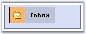{border="0"}                                            |                             |                     | [{]{style="FONT-FAMILY: 'Courier New'"}                                                                                                                     |
|                                                                                       |                             |                     |                                                                                                                                                             |
| []{style="FONT-FAMILY: 'Trebuchet MS','sans-serif'; COLOR: #15428b; FONT-SIZE: 9pt"}  |                             |                     | [  [padding]{style="COLOR: red"}:[10px]{style="COLOR: blue"};]{style="FONT-FAMILY: 'Courier New'"}                                                          |
|                                                                                       |                             |                     |                                                                                                                                                             |
| TreeView with style settings for text                                                 |                             |                     | [  [background-color]{style="COLOR: red"}:[#c0c9db]{style="COLOR: blue"}; ]{style="FONT-FAMILY: 'Courier New'"}                                             |
|                                                                                       |                             |                     |                                                                                                                                                             |
|                                                                                       |                             |                     | [}]{style="FONT-FAMILY: 'Courier New'"}                                                                                                                     |
|                                                                                       |                             |                     |                                                                                                                                                             |
|                                                                                       |                             |                     | [.Def_TextContCSS]{style="FONT-FAMILY: 'Courier New'; COLOR: maroon"}                                                                                       |
|                                                                                       |                             |                     |                                                                                                                                                             |
|                                                                                       |                             |                     | [{]{style="FONT-FAMILY: 'Courier New'"}                                                                                                                     |
|                                                                                       |                             |                     |                                                                                                                                                             |
|                                                                                       |                             |                     | [  [font-family]{style="COLOR: red"}:[Verdana]{style="COLOR: blue"};]{style="FONT-FAMILY: 'Courier New'"}                                                   |
|                                                                                       |                             |                     |                                                                                                                                                             |
|                                                                                       |                             |                     | [  [font-size]{style="COLOR: red"}:[11px]{style="COLOR: blue"};]{style="FONT-FAMILY: 'Courier New'"}                                                        |
|                                                                                       |                             |                     |                                                                                                                                                             |
|                                                                                       |                             |                     | [  [color]{style="COLOR: red"}:[black]{style="COLOR: blue"} ;  ]{style="FONT-FAMILY: 'Courier New'"}                                                        |
|                                                                                       |                             |                     |                                                                                                                                                             |
|                                                                                       |                             |                     | [  [font-weight]{style="COLOR: red"}:[bold]{style="COLOR: blue"};]{style="FONT-FAMILY: 'Courier New'"}                                                      |
|                                                                                       |                             |                     |                                                                                                                                                             |
|                                                                                       |                             |                     | [}]{style="FONT-FAMILY: 'Courier New'"}                                                                                                                     |
|                                                                                       +-----------------------------+---------------------+                                                                                                                                                             |
|                                                                                       | TextContainerCssClass       | Def_TextContCSS     |                                                                                                                                                             |
+---------------------------------------------------------------------------------------+-----------------------------+---------------------+-------------------------------------------------------------------------------------------------------------------------------------------------------------+
:::

[]{style="FONT-FAMILY: 'Trebuchet MS','sans-serif'; COLOR: #15428b; FONT-SIZE: 9pt"} 

See Also

[]{style="FONT-FAMILY: 'Trebuchet MS','sans-serif'; COLOR: #15428b; FONT-SIZE: 9pt"} 

[[ItemLook Settings]{.UGHyperlink}]()[, ]{.UGHyperlink}[[Default Looks]{.UGHyperlink}]()[, ]{.UGHyperlink}[[Custom Looks]{.UGHyperlink}]()[]{.UGHyperlink}

 

 

[]{#related-topics}
::::::::::
