::: {style="DISPLAY: none"}
{#d2h_url_template}{#d2h_package_url style="WIDTH: 0px; DISPLAY: none; HEIGHT: 0px"}
:::

:::::::::: {.d2h_secondary_topic style="PADDING-BOTTOM: 10pt; MARGIN: 0pt; PADDING-LEFT: 0pt; PADDING-RIGHT: 0pt; PADDING-TOP: 0pt"}
##### Look and Feel Settings {#look-and-feel-settings style="tab-stops: 0pt"}

 

The look and feel of Menu can be controlled by defining custom**[ ]{style="COLOR: black; FONT-SIZE: 8pt"}**ItemLook instances in ItemLooks collection or by editing default ItemLook settings in DefaultItemLook and DefaultDisabledItemLook properties.

[]{#p354} 

###### 5.4.1.2.15.1        AutoFormat Style Options {#autoformat-style-options style="tab-stops: 0pt"}

[]{style="FONT-FAMILY: 'Trebuchet MS','sans-serif'; COLOR: #15428b; FONT-SIZE: 9pt"} 

The Menu control provides pre-defined set of styles that can be applied to your control just on a click of the button. You can set the desired look and feel for the control that includes some popular styles too.

The Autoformat window can be opened by right clicking the control, and selecting the **Auto Format\...** option opens the following **Auto Format** dialog box.

[]{style="FONT-FAMILY: 'Trebuchet MS','sans-serif'; COLOR: #15428b; FONT-SIZE: 9pt"} 

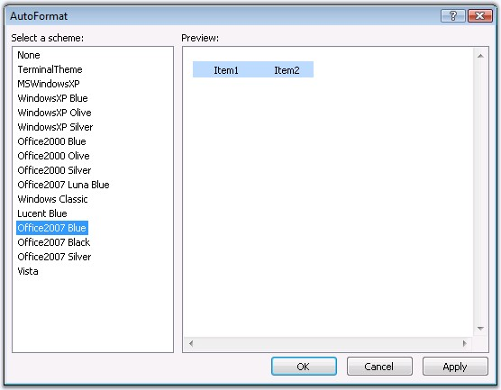{border="0"}

Figure 243

[]{style="FONT-FAMILY: 'Trebuchet MS','sans-serif'; COLOR: #15428b; FONT-SIZE: 9pt"} 

The leftpane lists the various pre-defined style schemes that are available. The right pane shows the preview of the currently selected scheme. Select the required style and click *OK* to apply the selected scheme to the control.

[]{style="FONT-FAMILY: 'Trebuchet MS','sans-serif'; COLOR: #15428b; FONT-SIZE: 9pt"} 

Example of a pre-defined look and feel

[]{style="FONT-FAMILY: 'Trebuchet MS','sans-serif'; COLOR: #15428b; FONT-SIZE: 9pt"} 

The following image shows the Menu with **Windows XP** style setting.

[]{style="FONT-FAMILY: 'Trebuchet MS','sans-serif'; COLOR: #15428b; FONT-SIZE: 9pt"} 

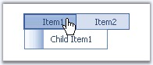{border="0"}

Figure 244

[]{style="FONT-FAMILY: 'Trebuchet MS','sans-serif'; COLOR: #15428b; FONT-SIZE: 9pt"} 

The new built-in format skins added for Menu are as follows.

[]{style="FONT-FAMILY: 'Trebuchet MS','sans-serif'; COLOR: #15428b; FONT-SIZE: 9pt"} 

[·      ]{style="FONT-FAMILY: Symbol"}Office2007 Black

[]{style="FONT-FAMILY: 'Trebuchet MS','sans-serif'; COLOR: #15428b; FONT-SIZE: 9pt"} 

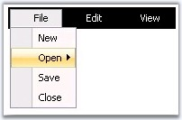{border="0"}

Figure 245

[]{style="FONT-FAMILY: 'Trebuchet MS','sans-serif'; COLOR: #15428b; FONT-SIZE: 9pt"} 

[·      ]{style="FONT-FAMILY: Symbol"}Office2007 Blue

[]{style="FONT-FAMILY: 'Trebuchet MS','sans-serif'; COLOR: #15428b; FONT-SIZE: 9pt"} 

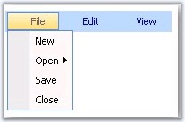{border="0"}

Figure 246

[]{style="FONT-FAMILY: 'Trebuchet MS','sans-serif'; COLOR: #15428b; FONT-SIZE: 9pt"} 

[·      ]{style="FONT-FAMILY: Symbol"}Office2007 Silver

[]{style="FONT-FAMILY: 'Trebuchet MS','sans-serif'; COLOR: #15428b; FONT-SIZE: 9pt"} 

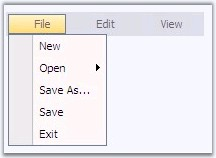{border="0"}

Figure 247

[]{style="FONT-FAMILY: 'Trebuchet MS','sans-serif'; COLOR: #15428b; FONT-SIZE: 9pt"} 

[·      ]{style="FONT-FAMILY: Symbol"}Vista

[]{style="FONT-FAMILY: 'Trebuchet MS','sans-serif'; COLOR: #15428b; FONT-SIZE: 9pt"} 

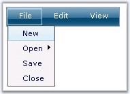{border="0"}

Figure 248

 

###### []{#_Item_Looks}5.4.1.2.15.2        Item Looks {#item-looks style="tab-stops: 0pt"}

 

The ItemLooks Collection Editor contains Default properties that allows to set default look and feel to the control and its disabled state, and Custom properties that allows you to customize the look and feel accordingly.

The ItemLooks properties are as follows.

 

::: {align="center"}
+-----------------------------------+-----------------------------------------------------------------------------------------------------+
| Property                          | Description                                                                                         |
+-----------------------------------+-----------------------------------------------------------------------------------------------------+
| ID                                | Specifies the id of the item looks settings.                                                        |
+-----------------------------------+-----------------------------------------------------------------------------------------------------+
| LeftImageHeight                   | Specifies the height of the left image.                                                             |
+-----------------------------------+-----------------------------------------------------------------------------------------------------+
| LeftImageWidth                    | Specifies the width of the left image.                                                              |
+-----------------------------------+-----------------------------------------------------------------------------------------------------+
| RightImageHeight                  | Specifies the height of the right image.                                                            |
+-----------------------------------+-----------------------------------------------------------------------------------------------------+
| RightImageWidth                   | Specifies the width of the right image.                                                             |
+-----------------------------------+-----------------------------------------------------------------------------------------------------+
| TextPaddingBottom                 | Specifies the space in pixels around the label (text) for menu items.                               |
|                                   |                                                                                                     |
|                                   |                                                                                                     |
+-----------------------------------+                                                                                                     |
| TextPaddingLeft                   |                                                                                                     |
+-----------------------------------+                                                                                                     |
| TextPaddingRight                  |                                                                                                     |
+-----------------------------------+                                                                                                     |
| TextPaddingTop                    |                                                                                                     |
+-----------------------------------+-----------------------------------------------------------------------------------------------------+
| StateDataDefault                  | Specifies the various look and feel options for different states such as default, expand and hover. |
+-----------------------------------+                                                                                                     |
| StateDataExpanded                 |                                                                                                     |
+-----------------------------------+                                                                                                     |
| StateDataHover                    |                                                                                                     |
+-----------------------------------+-----------------------------------------------------------------------------------------------------+
:::

 

ID specifies the id of the look. The text padding and the image height and width can be set for the tree nodes.

 

The StateDataDefault, StateDataExpanded and StateDataHover properties in ItemLook contains the following css class properties that defines the styles for the menu items.

 

::: {align="center"}
  ----------------------------------- --------------------------------------------------------------------------------------------------
               Property               Description
  ItemCSSClass                        Specifies the overall appearance and behavior of menu items.
  LeftImageCellCssClass               Specifies the class name of the css definitions to use for the cell holding the image.
  LeftImageContainerCSSClass          Specifies the class name of the css definitions to use for the container holding the left image.
  LeftImageCSSClass                   Specifies the class name of the css definitions to use for the left image.
  LeftImageURL                        Specifies url of the left image to be displayed on an item.
  RightImageCellCSSClass              Specifies the class name of the css definitions to use for the cell holding the arrow image.
  RightImageContainerCSSClass         Specifies the class name of the css definitions to use for the container of the arrow image.
  RightImageCSSClass                  Specifies the class name of the css definitions to use for the right image.
  RightImageURL                       Specifies url of the right image to be displayed on an item.
  TextCellCSSClass                    Specifies the class name of the css definitions to use for the cell holding the text.
  TextContainerCSSClass               Specifies the class name of the css definitions to use for the container of the textcell.
  ----------------------------------- --------------------------------------------------------------------------------------------------
:::

 

The styles can be applied to individual nodes by setting the id of the look to the Look and LookDisabled (for disabled nodes with Disabled property set to True) properties of the required menu items in the Designer dialog. This way the styles will be applied only to those items.

 

::: {align="center"}
  -------------- ----------------------------------------------------------
  Property       Description
  Look           Specifies the look to be applied for the items.
  LookDisabled   Specifies the look to be applied for the disabled items.
  -------------- ----------------------------------------------------------
:::

 

See Also

 

[Default Looks]{.UGHyperlink}[, ]{.UGHyperlink}[Custom Looks]{.UGHyperlink}[, ]{.UGHyperlink}[CSS Styles]{.UGHyperlink}[]{.UGHyperlink}

[]{#p356} 

[]{#_Default_Looks_1}5.4.1.2.15.2.1     Default Looks

[]{style="FONT-FAMILY: 'Trebuchet MS','sans-serif'; COLOR: #15428b; FONT-SIZE: 9pt"} 

Setting styles for Active and Disabled states

[]{style="FONT-FAMILY: 'Trebuchet MS','sans-serif'; COLOR: #15428b; FONT-SIZE: 9pt"} 

Menu comes with some default look and feels that can be applied just by assigning the styles. It also enables to set looks for items in active and disabled states. Styles applied for these states can be default styles or for the states like node expand and mouse hover.

[]{style="FONT-FAMILY: 'Trebuchet MS','sans-serif'; COLOR: #15428b; FONT-SIZE: 9pt"} 

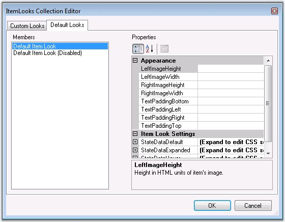{border="0"}

Figure 249

[]{style="FONT-FAMILY: 'Trebuchet MS','sans-serif'; COLOR: #15428b; FONT-SIZE: 9pt"} 

The below sample code snippet define the styles to use for the items in active state on expanding the nodes, on mouse over and the default style settings for all the menu items.

[]{style="FONT-FAMILY: 'Trebuchet MS','sans-serif'; COLOR: #15428b; FONT-SIZE: 9pt"} 

+--------------------------------------------------------------------------------------------------------------------------------------------------------------------------------------------------------------------------------------------------------------------------------------------------------------------------------------------------------------------------------------------------------------------------------------------------------------------------------------------------------------------------------------------------------------------------------------------------------------------------------------------------------------------------------------------------------------------------------------------------------------------------------------------------------------------------------------------------------------------------------------------------------------------------------------------------------------------------------------------------------------------------------------------------------------------------------------------------------------+
| [\<]{style="FONT-FAMILY: 'Courier New'; COLOR: blue; FONT-SIZE: 9pt"}[defaultitemlook]{style="FONT-FAMILY: 'Courier New'; COLOR: maroon; FONT-SIZE: 9pt"}[ [id]{style="COLOR: red"}[=\"Default Item Look\"\>]{style="COLOR: blue"}]{style="FONT-FAMILY: 'Courier New'; FONT-SIZE: 9pt"}                                                                                                                                                                                                                                                                                                                                                                                                                                                                                                                                                                                                                                                                                                                                                                                                                      |
|                                                                                                                                                                                                                                                                                                                                                                                                                                                                                                                                                                                                                                                                                                                                                                                                                                                                                                                                                                                                                                                                                                              |
| []{style="FONT-FAMILY: 'Courier New'; COLOR: blue; FONT-SIZE: 9pt"}                                                                                                                                                                                                                                                                                                                                                                                                                                                                                                                                                                                                                                                                                                                                                                                                                                                                                                                                                                                                                                          |
|                                                                                                                                                                                                                                                                                                                                                                                                                                                                                                                                                                                                                                                                                                                                                                                                                                                                                                                                                                                                                                                                                                              |
| [    \<!\-- StateDataExpanded - These default settings will be applied to the expanded menu items. \--\>]{style="FONT-FAMILY: 'Courier New'; FONT-SIZE: 9pt"}                                                                                                                                                                                                                                                                                                                                                                                                                                                                                                                                                                                                                                                                                                                                                                                                                                                                                                                                                |
|                                                                                                                                                                                                                                                                                                                                                                                                                                                                                                                                                                                                                                                                                                                                                                                                                                                                                                                                                                                                                                                                                                              |
| [    \<]{style="FONT-FAMILY: 'Courier New'; COLOR: blue; FONT-SIZE: 9pt"}[StateDataExpanded]{style="FONT-FAMILY: 'Courier New'; COLOR: maroon; FONT-SIZE: 9pt"}[ //blue//[LeftImageCellCSSClass ]{style="COLOR: red"}[= \"menuImgCell\"]{style="COLOR: blue"} [RightImageCellCSSClass ]{style="COLOR: red"}[= \"menuArrCell\"]{style="COLOR: blue"} [ItemCSSClass ]{style="COLOR: red"}[= \"menuPanelItem\"]{style="COLOR: blue"} [RightImageContainerCSSClass ]{style="COLOR: red"}[= \"menuArrCont\"]{style="COLOR: blue"} [TextContainerCSSClass ]{style="COLOR: red"}[= \"menuTextCont\" ]{style="COLOR: blue"}[TextCellCSSClass ]{style="COLOR: red"}[= \"menuTextCell\"]{style="COLOR: blue"} //pink//  [LeftImageContainerCSSClass ]{style="COLOR: red"}[= \"menuImgCont\" ]{style="COLOR: blue"}[RightImageCSSClass ]{style="COLOR: red"}[= \"menuArr\"]{style="COLOR: blue"} //image//[    LeftImageCSSClass ]{style="COLOR: red"}[= \"menuImg\"\>\</]{style="COLOR: blue"}[StateDataExpanded]{style="COLOR: maroon"}[\>]{style="COLOR: blue"}]{style="FONT-FAMILY: 'Courier New'; FONT-SIZE: 9pt"} |
|                                                                                                                                                                                                                                                                                                                                                                                                                                                                                                                                                                                                                                                                                                                                                                                                                                                                                                                                                                                                                                                                                                              |
| []{style="FONT-FAMILY: 'Courier New'; COLOR: blue; FONT-SIZE: 9pt"}                                                                                                                                                                                                                                                                                                                                                                                                                                                                                                                                                                                                                                                                                                                                                                                                                                                                                                                                                                                                                                          |
|                                                                                                                                                                                                                                                                                                                                                                                                                                                                                                                                                                                                                                                                                                                                                                                                                                                                                                                                                                                                                                                                                                              |
| [    \<!\-- ]{style="FONT-FAMILY: 'Courier New'; COLOR: blue; FONT-SIZE: 9pt"}[StateDataHover - These default settings will be applied to the menu item on hover. [\--\>]{style="COLOR: blue"}]{style="FONT-FAMILY: 'Courier New'; FONT-SIZE: 9pt"}                                                                                                                                                                                                                                                                                                                                                                                                                                                                                                                                                                                                                                                                                                                                                                                                                                                          |
|                                                                                                                                                                                                                                                                                                                                                                                                                                                                                                                                                                                                                                                                                                                                                                                                                                                                                                                                                                                                                                                                                                              |
| [    \<]{style="FONT-FAMILY: 'Courier New'; COLOR: blue; FONT-SIZE: 9pt"}[StateDataHover]{style="FONT-FAMILY: 'Courier New'; COLOR: maroon; FONT-SIZE: 9pt"}[ [LeftImageCellCSSClass ]{style="COLOR: red"}[= \"menuImgCell\"]{style="COLOR: blue"} [RightImageCellCSSClass ]{style="COLOR: red"}[= \"menuArrCell\"]{style="COLOR: blue"} [ItemCSSClass ]{style="COLOR: red"}[= \"menuPanelItem\"]{style="COLOR: blue"} [RightImageContainerCSSClass ]{style="COLOR: red"}[= \"menuArrCont\"]{style="COLOR: blue"} [TextContainerCSSClass ]{style="COLOR: red"}[= \"menuTextCont\"]{style="COLOR: blue"} [TextCellCSSClass ]{style="COLOR: red"}[= \"menuTextCell\"]{style="COLOR: blue"} [LeftImageContainerCSSClass ]{style="COLOR: red"}[= \"menuImgCont\"]{style="COLOR: blue"} [RightImageCSSClass ]{style="COLOR: red"}[= \"menuArr\"]{style="COLOR: blue"} [LeftImageCSSClass ]{style="COLOR: red"}[= \"menuImg\"\>\</]{style="COLOR: blue"}[StateDataHover]{style="COLOR: maroon"}[\>]{style="COLOR: blue"}]{style="FONT-FAMILY: 'Courier New'; FONT-SIZE: 9pt"}                                      |
|                                                                                                                                                                                                                                                                                                                                                                                                                                                                                                                                                                                                                                                                                                                                                                                                                                                                                                                                                                                                                                                                                                              |
| []{style="FONT-FAMILY: 'Courier New'; COLOR: blue; FONT-SIZE: 9pt"}                                                                                                                                                                                                                                                                                                                                                                                                                                                                                                                                                                                                                                                                                                                                                                                                                                                                                                                                                                                                                                          |
|                                                                                                                                                                                                                                                                                                                                                                                                                                                                                                                                                                                                                                                                                                                                                                                                                                                                                                                                                                                                                                                                                                              |
| [    \<!\-- ]{style="FONT-FAMILY: 'Courier New'; COLOR: blue; FONT-SIZE: 9pt"}[StateDataDefault - These default settings will be applied to all the menu items.[ \--\>]{style="COLOR: blue"}]{style="FONT-FAMILY: 'Courier New'; FONT-SIZE: 9pt"}                                                                                                                                                                                                                                                                                                                                                                                                                                                                                                                                                                                                                                                                                                                                                                                                                                                            |
|                                                                                                                                                                                                                                                                                                                                                                                                                                                                                                                                                                                                                                                                                                                                                                                                                                                                                                                                                                                                                                                                                                              |
| [    \<]{style="FONT-FAMILY: 'Courier New'; COLOR: blue; FONT-SIZE: 9pt"}[StateDataDefault]{style="FONT-FAMILY: 'Courier New'; COLOR: maroon; FONT-SIZE: 9pt"}[ [LeftImageCellCSSClass ]{style="COLOR: red"}[= \"menuImgCell\"]{style="COLOR: blue"} [RightImageCellCSSClass ]{style="COLOR: red"}[= \"menuArrCell\"]{style="COLOR: blue"} [ItemCSSClass ]{style="COLOR: red"}[= \"menuPanelItem\"]{style="COLOR: blue"} [RightImageContainerCSSClass ]{style="COLOR: red"}[= \"menuArrCont\"]{style="COLOR: blue"} [TextContainerCSSClass]{style="COLOR: red"}[=\"menuTextCont\"]{style="COLOR: blue"} [TextCellCSSClass ]{style="COLOR: red"}[= \"menuTextCell\"]{style="COLOR: blue"} [LeftImageContainerCSSClass ]{style="COLOR: red"}[= \"menuImgCont\"]{style="COLOR: blue"} [RightImageCSSClass ]{style="COLOR: red"}[= \"menuArr\"]{style="COLOR: blue"} [LeftImageCSSClass ]{style="COLOR: red"}[= \"menuImg\"\>\</]{style="COLOR: blue"}[StateDataDefault]{style="COLOR: maroon"}[\>]{style="COLOR: blue"}]{style="FONT-FAMILY: 'Courier New'; FONT-SIZE: 9pt"}                                    |
|                                                                                                                                                                                                                                                                                                                                                                                                                                                                                                                                                                                                                                                                                                                                                                                                                                                                                                                                                                                                                                                                                                              |
| []{style="FONT-FAMILY: 'Courier New'; COLOR: blue; FONT-SIZE: 9pt"}                                                                                                                                                                                                                                                                                                                                                                                                                                                                                                                                                                                                                                                                                                                                                                                                                                                                                                                                                                                                                                          |
|                                                                                                                                                                                                                                                                                                                                                                                                                                                                                                                                                                                                                                                                                                                                                                                                                                                                                                                                                                                                                                                                                                              |
| [\</]{style="FONT-FAMILY: 'Courier New'; COLOR: blue; FONT-SIZE: 9pt"}[defaultitemlook]{style="FONT-FAMILY: 'Courier New'; COLOR: maroon; FONT-SIZE: 9pt"}[\>]{style="FONT-FAMILY: 'Courier New'; COLOR: blue; FONT-SIZE: 9pt"}                                                                                                                                                                                                                                                                                                                                                                                                                                                                                                                                                                                                                                                                                                                                                                                                                                                                              |
+--------------------------------------------------------------------------------------------------------------------------------------------------------------------------------------------------------------------------------------------------------------------------------------------------------------------------------------------------------------------------------------------------------------------------------------------------------------------------------------------------------------------------------------------------------------------------------------------------------------------------------------------------------------------------------------------------------------------------------------------------------------------------------------------------------------------------------------------------------------------------------------------------------------------------------------------------------------------------------------------------------------------------------------------------------------------------------------------------------------+

[]{style="FONT-FAMILY: 'Trebuchet MS','sans-serif'; COLOR: #15428b; FONT-SIZE: 9pt"} 

See Also

[]{style="FONT-FAMILY: 'Trebuchet MS','sans-serif'; COLOR: #15428b; FONT-SIZE: 9pt"} 

[Custom Looks]{.UGHyperlink}[, ]{.UGHyperlink}[CSS Styles]{.UGHyperlink}[]{.UGHyperlink}

 

[]{#p357} 

[]{#_Custom_Looks_1}5.4.1.2.15.2.2     Custom Looks

[]{style="FONT-FAMILY: 'Trebuchet MS','sans-serif'; COLOR: #15428b; FONT-SIZE: 9pt"} 

We can easily customize the default look of the menu items. **Custom Looks** properties in **ItemLooks Collection Editor** allows you to apply custom looks to your menu items.

[]{style="FONT-FAMILY: 'Trebuchet MS','sans-serif'; COLOR: #15428b; FONT-SIZE: 9pt"} 

Using Designer

[]{style="FONT-FAMILY: 'Trebuchet MS','sans-serif'; COLOR: #15428b; FONT-SIZE: 9pt"} 

ItemLooks Editor lets you easily create the item looks for the items. If you create your own ItemLooks, then this will override the default looks.

[]{style="FONT-FAMILY: 'Trebuchet MS','sans-serif'; COLOR: #15428b; FONT-SIZE: 9pt"} 

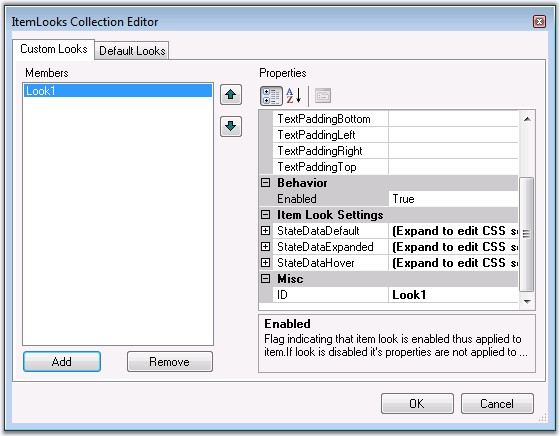{border="0"}

*[Figure ]{style="FONT-SIZE: 9pt"}[250]{style="FONT-SIZE: 9pt"}*

[]{style="FONT-FAMILY: 'Trebuchet MS','sans-serif'; COLOR: #15428b; FONT-SIZE: 9pt"} 

1.   Give the css class names in the appropriate css styles.

79.  Once you given the styles in the item look editor, in HTML view you can see the below code as shown below.

[]{style="FONT-FAMILY: 'Trebuchet MS','sans-serif'; COLOR: #15428b; FONT-SIZE: 9pt"} 

+----------------------------------------------------------------------------------------------------------------------------------------------------------------------------------------------------------------------------------------------------------------------------------------------------------------------------------------------------------------------------------------------------------------------------------------------------------------------------------------------------------------------------------------------------------------------------------------------------------------------------------------------------------------------------------------------------------------------------------------------------------------------------------------------------------------------------------------------------------------------------------------------------------------------------+
| [\<]{style="FONT-FAMILY: 'Courier New'; COLOR: blue; FONT-SIZE: 9pt"}[cc1]{style="FONT-FAMILY: 'Courier New'; COLOR: maroon; FONT-SIZE: 9pt"}[:]{style="FONT-FAMILY: 'Courier New'; COLOR: blue; FONT-SIZE: 9pt"}[Menu]{style="FONT-FAMILY: 'Courier New'; COLOR: maroon; FONT-SIZE: 9pt"}[ [id]{style="COLOR: red"}[=\"Menu1\"]{style="COLOR: blue"} [runat]{style="COLOR: red"}[=\"server\"]{style="COLOR: blue"} [style]{style="COLOR: red"}[=\"POSITION:]{style="COLOR: blue"}[ ]{style="COLOR: red"}[absolute\"]{style="COLOR: blue"} [ImageFilesPath]{style="COLOR: red"}[=\"images\"]{style="COLOR: blue"} [DynamicPanelCSSClass]{style="COLOR: red"}[=\"menuPanel\"]{style="COLOR: blue"}[   StaticPanelCSSClass]{style="COLOR: red"}[=\"menuRootPanel\"]{style="COLOR: blue"}[ CustomCSS]{style="COLOR: red"}[=\"css/menuStyle.css\"\>]{style="COLOR: blue"}]{style="FONT-FAMILY: 'Courier New'; FONT-SIZE: 9pt"} |
|                                                                                                                                                                                                                                                                                                                                                                                                                                                                                                                                                                                                                                                                                                                                                                                                                                                                                                                            |
| [ [\<]{style="COLOR: blue"}[ITEMLOOKS]{style="COLOR: maroon"}[\>]{style="COLOR: blue"}]{style="FONT-FAMILY: 'Courier New'; FONT-SIZE: 9pt"}                                                                                                                                                                                                                                                                                                                                                                                                                                                                                                                                                                                                                                                                                                                                                                                |
|                                                                                                                                                                                                                                                                                                                                                                                                                                                                                                                                                                                                                                                                                                                                                                                                                                                                                                                            |
| [    [\<]{style="COLOR: blue"}[cc1]{style="COLOR: maroon"}[:]{style="COLOR: blue"}[MenuItemLook]{style="COLOR: maroon"} [id]{style="COLOR: red"}[=\"Look1\"\>]{style="COLOR: blue"}]{style="FONT-FAMILY: 'Courier New'; FONT-SIZE: 9pt"}                                                                                                                                                                                                                                                                                                                                                                                                                                                                                                                                                                                                                                                                                   |
|                                                                                                                                                                                                                                                                                                                                                                                                                                                                                                                                                                                                                                                                                                                                                                                                                                                                                                                            |
| [         [\<]{style="COLOR: blue"}[STATEDATADEFAULT]{style="COLOR: maroon"} [ItemCSSClass]{style="COLOR: red"}[=\"menuPanelItem\"\>\</]{style="COLOR: blue"}[STATEDATADEFAULT]{style="COLOR: maroon"}[\>]{style="COLOR: blue"}]{style="FONT-FAMILY: 'Courier New'; FONT-SIZE: 9pt"}                                                                                                                                                                                                                                                                                                                                                                                                                                                                                                                                                                                                                                       |
|                                                                                                                                                                                                                                                                                                                                                                                                                                                                                                                                                                                                                                                                                                                                                                                                                                                                                                                            |
| [         [\<]{style="COLOR: blue"}[STATEDATAEXPANDED]{style="COLOR: maroon"} [ItemCSSClass]{style="COLOR: red"}[=\"menuPanelItem_Expanded\"\>\</]{style="COLOR: blue"}[STATEDATAEXPANDED]{style="COLOR: maroon"}[\>]{style="COLOR: blue"}]{style="FONT-FAMILY: 'Courier New'; FONT-SIZE: 9pt"}                                                                                                                                                                                                                                                                                                                                                                                                                                                                                                                                                                                                                            |
|                                                                                                                                                                                                                                                                                                                                                                                                                                                                                                                                                                                                                                                                                                                                                                                                                                                                                                                            |
| [         [\<]{style="COLOR: blue"}[STATEDATAHOVER]{style="COLOR: maroon"} [ItemCSSClass]{style="COLOR: red"}[=\"menuPanelItem_Hover\"\>\</]{style="COLOR: blue"}[STATEDATAHOVER]{style="COLOR: maroon"}[\>]{style="COLOR: blue"}]{style="FONT-FAMILY: 'Courier New'; FONT-SIZE: 9pt"}                                                                                                                                                                                                                                                                                                                                                                                                                                                                                                                                                                                                                                     |
|                                                                                                                                                                                                                                                                                                                                                                                                                                                                                                                                                                                                                                                                                                                                                                                                                                                                                                                            |
| [    [\</]{style="COLOR: blue"}[cc1]{style="COLOR: maroon"}[:]{style="COLOR: blue"}[MenuItemLook]{style="COLOR: maroon"}[\>]{style="COLOR: blue"}]{style="FONT-FAMILY: 'Courier New'; FONT-SIZE: 9pt"}                                                                                                                                                                                                                                                                                                                                                                                                                                                                                                                                                                                                                                                                                                                     |
|                                                                                                                                                                                                                                                                                                                                                                                                                                                                                                                                                                                                                                                                                                                                                                                                                                                                                                                            |
| [    [\<]{style="COLOR: blue"}[cc1]{style="COLOR: maroon"}[:]{style="COLOR: blue"}[MenuItemLook]{style="COLOR: maroon"} [id]{style="COLOR: red"}[=\"Look2\"\>]{style="COLOR: blue"}]{style="FONT-FAMILY: 'Courier New'; FONT-SIZE: 9pt"}                                                                                                                                                                                                                                                                                                                                                                                                                                                                                                                                                                                                                                                                                   |
|                                                                                                                                                                                                                                                                                                                                                                                                                                                                                                                                                                                                                                                                                                                                                                                                                                                                                                                            |
| [         [\<]{style="COLOR: blue"}[STATEDATADEFAULT]{style="COLOR: maroon"} [ItemCSSClass]{style="COLOR: red"}[=\"menuRootPanelItem\"\>\</]{style="COLOR: blue"}[STATEDATADEFAULT]{style="COLOR: maroon"}[\>]{style="COLOR: blue"}]{style="FONT-FAMILY: 'Courier New'; FONT-SIZE: 9pt"}                                                                                                                                                                                                                                                                                                                                                                                                                                                                                                                                                                                                                                   |
|                                                                                                                                                                                                                                                                                                                                                                                                                                                                                                                                                                                                                                                                                                                                                                                                                                                                                                                            |
| [         [\<]{style="COLOR: blue"}[STATEDATAEXPANDED]{style="COLOR: maroon"} [ItemCSSClass]{style="COLOR: red"}[=\"menuRootPanelItem_Expanded\"\>\</]{style="COLOR: blue"}[STATEDATAEXPANDED]{style="COLOR: maroon"}[\>]{style="COLOR: blue"}]{style="FONT-FAMILY: 'Courier New'; FONT-SIZE: 9pt"}                                                                                                                                                                                                                                                                                                                                                                                                                                                                                                                                                                                                                        |
|                                                                                                                                                                                                                                                                                                                                                                                                                                                                                                                                                                                                                                                                                                                                                                                                                                                                                                                            |
| [         [\<]{style="COLOR: blue"}[STATEDATAHOVER]{style="COLOR: maroon"} [ItemCSSClass]{style="COLOR: red"}[=\"menuRootPanelItem_Hover\"\>\</]{style="COLOR: blue"}[STATEDATAHOVER]{style="COLOR: maroon"}[\>]{style="COLOR: blue"}]{style="FONT-FAMILY: 'Courier New'; FONT-SIZE: 9pt"}                                                                                                                                                                                                                                                                                                                                                                                                                                                                                                                                                                                                                                 |
|                                                                                                                                                                                                                                                                                                                                                                                                                                                                                                                                                                                                                                                                                                                                                                                                                                                                                                                            |
| [    [\</]{style="COLOR: blue"}[cc1]{style="COLOR: maroon"}[:]{style="COLOR: blue"}[MenuItemLook]{style="COLOR: maroon"}[\>]{style="COLOR: blue"}]{style="FONT-FAMILY: 'Courier New'; FONT-SIZE: 9pt"}                                                                                                                                                                                                                                                                                                                                                                                                                                                                                                                                                                                                                                                                                                                     |
|                                                                                                                                                                                                                                                                                                                                                                                                                                                                                                                                                                                                                                                                                                                                                                                                                                                                                                                            |
| [    [\<]{style="COLOR: blue"}[cc1]{style="COLOR: maroon"}[:]{style="COLOR: blue"}[MenuItemLook]{style="COLOR: maroon"} [id]{style="COLOR: red"}[=\"LookSep\"\>]{style="COLOR: blue"}]{style="FONT-FAMILY: 'Courier New'; FONT-SIZE: 9pt"}                                                                                                                                                                                                                                                                                                                                                                                                                                                                                                                                                                                                                                                                                 |
|                                                                                                                                                                                                                                                                                                                                                                                                                                                                                                                                                                                                                                                                                                                                                                                                                                                                                                                            |
| [          [\<]{style="COLOR: blue"}[STATEDATADEFAULT]{style="COLOR: maroon"} [ItemCSSClass]{style="COLOR: red"}[=\"menuSep\"\>\</]{style="COLOR: blue"}[STATEDATADEFAULT]{style="COLOR: maroon"}[\>]{style="COLOR: blue"}]{style="FONT-FAMILY: 'Courier New'; FONT-SIZE: 9pt"}                                                                                                                                                                                                                                                                                                                                                                                                                                                                                                                                                                                                                                            |
|                                                                                                                                                                                                                                                                                                                                                                                                                                                                                                                                                                                                                                                                                                                                                                                                                                                                                                                            |
| [    [\</]{style="COLOR: blue"}[cc1]{style="COLOR: maroon"}[:]{style="COLOR: blue"}[MenuItemLook]{style="COLOR: maroon"}[\>]{style="COLOR: blue"}]{style="FONT-FAMILY: 'Courier New'; FONT-SIZE: 9pt"}                                                                                                                                                                                                                                                                                                                                                                                                                                                                                                                                                                                                                                                                                                                     |
|                                                                                                                                                                                                                                                                                                                                                                                                                                                                                                                                                                                                                                                                                                                                                                                                                                                                                                                            |
| [ [\</]{style="COLOR: blue"}[ITEMLOOKS]{style="COLOR: maroon"}[\>]{style="COLOR: blue"}]{style="FONT-FAMILY: 'Courier New'; FONT-SIZE: 9pt"}                                                                                                                                                                                                                                                                                                                                                                                                                                                                                                                                                                                                                                                                                                                                                                               |
|                                                                                                                                                                                                                                                                                                                                                                                                                                                                                                                                                                                                                                                                                                                                                                                                                                                                                                                            |
| [\</]{style="FONT-FAMILY: 'Courier New'; COLOR: blue; FONT-SIZE: 9pt"}[cc1]{style="FONT-FAMILY: 'Courier New'; COLOR: maroon; FONT-SIZE: 9pt"}[:]{style="FONT-FAMILY: 'Courier New'; COLOR: blue; FONT-SIZE: 9pt"}[Menu]{style="FONT-FAMILY: 'Courier New'; COLOR: maroon; FONT-SIZE: 9pt"}[\>]{style="FONT-FAMILY: 'Courier New'; COLOR: blue; FONT-SIZE: 9pt"}[ ]{style="FONT-FAMILY: 'Courier New'; FONT-SIZE: 9pt"}                                                                                                                                                                                                                                                                                                                                                                                                                                                                                                    |
+----------------------------------------------------------------------------------------------------------------------------------------------------------------------------------------------------------------------------------------------------------------------------------------------------------------------------------------------------------------------------------------------------------------------------------------------------------------------------------------------------------------------------------------------------------------------------------------------------------------------------------------------------------------------------------------------------------------------------------------------------------------------------------------------------------------------------------------------------------------------------------------------------------------------------+

[]{style="FONT-FAMILY: 'Trebuchet MS','sans-serif'; COLOR: #15428b; FONT-SIZE: 9pt"} 

80.  Set the Look ID to **Look** property of the menu item to apply the specified styles to the menu item.

[]{style="FONT-FAMILY: 'Trebuchet MS','sans-serif'; COLOR: #15428b; FONT-SIZE: 9pt"} 

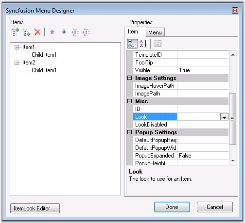{border="0"}

**[]{style="FONT-FAMILY: 'Trebuchet MS','sans-serif'; COLOR: #15428b; FONT-SIZE: 9pt"}** 

Figure 251: Designer image

[]{style="FONT-FAMILY: 'Trebuchet MS','sans-serif'; COLOR: #15428b; FONT-SIZE: 9pt"} 

Using Code

[]{style="FONT-FAMILY: 'Trebuchet MS','sans-serif'; COLOR: #15428b; FONT-SIZE: 9pt"} 

Unlimited number of ItemLooks can be created and added to the menu. Here we can see how the ItemLooks instance can be created and added programmatically. These ItemLooks can then be applied to the menu items.

[]{style="FONT-FAMILY: 'Trebuchet MS','sans-serif'; COLOR: #15428b; FONT-SIZE: 9pt"} 

+-------------------------------------------------------------------------------------------------------------------------+
| **[\[C#\]]{style="FONT-FAMILY: 'Courier New'; FONT-SIZE: 9pt"}**                                                        |
|                                                                                                                         |
| []{style="FONT-FAMILY: 'Courier New'; FONT-SIZE: 9pt"}                                                                  |
|                                                                                                                         |
| [MenuItemLook look=[new]{style="COLOR: blue"} MenuItemLook();]{style="FONT-FAMILY: 'Courier New'; FONT-SIZE: 9pt"}      |
|                                                                                                                         |
| [look.ID=\"RootItemsLook\";]{style="FONT-FAMILY: 'Courier New'; FONT-SIZE: 9pt"}                                        |
|                                                                                                                         |
| [look.StateDataDefault.ItemCSSClass=\"menuPanelItem\";]{style="FONT-FAMILY: 'Courier New'; FONT-SIZE: 9pt"}             |
|                                                                                                                         |
| [look.StateDataExpanded.ItemCSSClass = \"menuPanelItem_Expanded\";]{style="FONT-FAMILY: 'Courier New'; FONT-SIZE: 9pt"} |
|                                                                                                                         |
| [look.StateDataHover.ItemCSSClass = \"menuPanelItem_Hover\";]{style="FONT-FAMILY: 'Courier New'; FONT-SIZE: 9pt"}       |
|                                                                                                                         |
| [Menu1.ItemLooks.Add(RootItemsLook);]{style="FONT-FAMILY: 'Courier New'; FONT-SIZE: 9pt"}                               |
|                                                                                                                         |
| [MenuItem item= [new]{style="COLOR: blue"} MenuItem();]{style="FONT-FAMILY: 'Courier New'; FONT-SIZE: 9pt"}             |
|                                                                                                                         |
| [item.Text = \"Essential Chart\";]{style="FONT-FAMILY: 'Courier New'; FONT-SIZE: 9pt"}                                  |
|                                                                                                                         |
| [item.Look=\"RootItemsLook\";]{style="FONT-FAMILY: 'Courier New'; FONT-SIZE: 9pt"}                                      |
+-------------------------------------------------------------------------------------------------------------------------+

[]{style="FONT-FAMILY: 'Trebuchet MS','sans-serif'; COLOR: #15428b; FONT-SIZE: 9pt"} 

+----------------------------------------------------------------------------------------------------------------------------------------------------------------------------------------------------------------------------+
| **[\[VB\]]{style="FONT-FAMILY: 'Courier New'; FONT-SIZE: 9pt"}**                                                                                                                                                           |
|                                                                                                                                                                                                                            |
| []{style="FONT-FAMILY: 'Courier New'; FONT-SIZE: 9pt"}                                                                                                                                                                     |
|                                                                                                                                                                                                                            |
| [Private]{style="FONT-FAMILY: 'Courier New'; COLOR: blue; FONT-SIZE: 9pt"}[ look [As]{style="COLOR: blue"} MenuItemLook = [New]{style="COLOR: blue"} MenuItemLook()]{style="FONT-FAMILY: 'Courier New'; FONT-SIZE: 9pt"}   |
|                                                                                                                                                                                                                            |
| [Private]{style="FONT-FAMILY: 'Courier New'; COLOR: blue; FONT-SIZE: 9pt"}[ look.ID=[\"RootItemsLook\"]{style="COLOR: maroon"}]{style="FONT-FAMILY: 'Courier New'; FONT-SIZE: 9pt"}                                        |
|                                                                                                                                                                                                                            |
| [Private]{style="FONT-FAMILY: 'Courier New'; COLOR: blue; FONT-SIZE: 9pt"}[ look.StateDataDefault.ItemCSSClass=[\"menuPanelItem\"]{style="COLOR: maroon"}]{style="FONT-FAMILY: 'Courier New'; FONT-SIZE: 9pt"}             |
|                                                                                                                                                                                                                            |
| [Private]{style="FONT-FAMILY: 'Courier New'; COLOR: blue; FONT-SIZE: 9pt"}[ look.StateDataExpanded.ItemCSSClass = [\"menuPanelItem_Expanded\"]{style="COLOR: maroon"}]{style="FONT-FAMILY: 'Courier New'; FONT-SIZE: 9pt"} |
|                                                                                                                                                                                                                            |
| [Private]{style="FONT-FAMILY: 'Courier New'; COLOR: blue; FONT-SIZE: 9pt"}[ look.StateDataHover.ItemCSSClass = [\"menuPanelItem_Hover\"]{style="COLOR: maroon"}]{style="FONT-FAMILY: 'Courier New'; FONT-SIZE: 9pt"}       |
|                                                                                                                                                                                                                            |
| [Menu1.ItemLooks.Add(RootItemsLook)]{style="FONT-FAMILY: 'Courier New'; FONT-SIZE: 9pt"}                                                                                                                                   |
|                                                                                                                                                                                                                            |
| [Private]{style="FONT-FAMILY: 'Courier New'; COLOR: blue; FONT-SIZE: 9pt"}[ item [As]{style="COLOR: blue"} MenuItem = [New]{style="COLOR: blue"} MenuItem()]{style="FONT-FAMILY: 'Courier New'; FONT-SIZE: 9pt"}           |
|                                                                                                                                                                                                                            |
| [Private]{style="FONT-FAMILY: 'Courier New'; COLOR: blue; FONT-SIZE: 9pt"}[ item.Text = [\"Essential Chart\"]{style="COLOR: maroon"}]{style="FONT-FAMILY: 'Courier New'; FONT-SIZE: 9pt"}                                  |
|                                                                                                                                                                                                                            |
| [Private]{style="FONT-FAMILY: 'Courier New'; COLOR: blue; FONT-SIZE: 9pt"}[ item.Look=[\"RootItemsLook\"]{style="COLOR: maroon"}]{style="FONT-FAMILY: 'Courier New'; FONT-SIZE: 9pt"}                                      |
+----------------------------------------------------------------------------------------------------------------------------------------------------------------------------------------------------------------------------+

[]{style="FONT-FAMILY: 'Trebuchet MS','sans-serif'; COLOR: #15428b; FONT-SIZE: 9pt"} 

See Also

[]{style="FONT-FAMILY: 'Trebuchet MS','sans-serif'; COLOR: #15428b; FONT-SIZE: 9pt"} 

[[Default Looks]{.UGHyperlink}]()[, ]{.UGHyperlink}[CSS Styles]{.UGHyperlink}[]{.UGHyperlink}

 

###### []{#_CSS_Styles_2}5.4.1.2.15.3        CSS Styles {#css-styles style="tab-stops: 0pt"}

[]{style="FONT-FAMILY: 'Trebuchet MS','sans-serif'; COLOR: #15428b; FONT-SIZE: 9pt"} 

The Menu control comprises of distinct segments for which css style definitions can be set. The default styles of the layered menu structure can be replaced with custom style settings by applying the css class names to the corresponding style properties.

[]{style="FONT-FAMILY: 'Trebuchet MS','sans-serif'; COLOR: #15428b; FONT-SIZE: 9pt"} 

Structure of Menu control

[]{style="FONT-FAMILY: 'Trebuchet MS','sans-serif'; COLOR: #15428b; FONT-SIZE: 9pt"} 

The menu structure consists of 2 panel-level and 1 item-level segments as shown in the below image. Static panel segment applies only for static menu which will have its items displayed by default. Dynamic panel segment applies only for dynamic menu, which will be expanded to display its items only on mouse over.

[]{style="FONT-FAMILY: 'Trebuchet MS','sans-serif'; COLOR: #15428b; FONT-SIZE: 9pt"} 

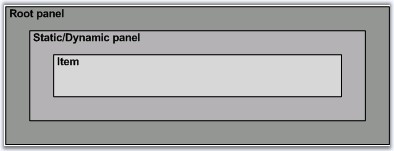{border="0"}

**[]{style="FONT-FAMILY: 'Trebuchet MS','sans-serif'; COLOR: #15428b; FONT-SIZE: 9pt"}** 

Figure 252: Structure of Menu control

[]{style="FONT-FAMILY: 'Trebuchet MS','sans-serif'; COLOR: #15428b; FONT-SIZE: 9pt"} 

The below table lists the panel-level segments and their corresponding CSS properties whose settings affect their styles.

[]{style="FONT-FAMILY: 'Trebuchet MS','sans-serif'; COLOR: #15428b; FONT-SIZE: 9pt"} 

::: {align="center"}
  --------------- ---------------------- --------------------------------
  Element         Property               Default Value (CSS Class Name)
  Root panel      ControlRootCSSclass    menuRoot
  Static panel    StaticPanelCSSClass    menuStaticPanel
  Dynamic panel   DynamicPanelCSSClass   menuDynamicPanel
  --------------- ---------------------- --------------------------------
:::

[]{style="FONT-FAMILY: 'Trebuchet MS','sans-serif'; COLOR: #15428b; FONT-SIZE: 9pt"} 

Customizing Menu Root-level segments

[]{style="FONT-FAMILY: 'Trebuchet MS','sans-serif'; COLOR: #15428b; FONT-SIZE: 9pt"} 

To customize the look and feel of one of the above segments, simply create a custom css style and associate it with the CSS-property corresponding to that segment.

[]{style="FONT-FAMILY: 'Trebuchet MS','sans-serif'; COLOR: #15428b; FONT-SIZE: 9pt"} 

{border="0"}

**[]{style="FONT-FAMILY: 'Trebuchet MS','sans-serif'; COLOR: #15428b; FONT-SIZE: 9pt"}** 

Figure 253: Menu with css settings for the root elements

[]{style="FONT-FAMILY: 'Trebuchet MS','sans-serif'; COLOR: #15428b; FONT-SIZE: 9pt"} 

The css-properties set to the custom css values and the style definitions are shown below.

[]{style="FONT-FAMILY: 'Trebuchet MS','sans-serif'; COLOR: #15428b; FONT-SIZE: 9pt"} 

::: {align="center"}
  --------------------- -------------------------------
  Property              Value (Custom CSS Class Name)
  ControlRootCSSclass   RootElementCSS
  StaticPanelCSSClass   RootPanelElementCSS
  --------------------- -------------------------------
:::

[]{style="FONT-FAMILY: 'Trebuchet MS','sans-serif'; COLOR: #15428b; FONT-SIZE: 9pt"} 

+-----------------------------------------------------------------------------------------------------------------------------------------+
| **[\[Css Styles\]]{style="FONT-FAMILY: 'Courier New'; COLOR: black; FONT-SIZE: 9pt"}**                                                  |
|                                                                                                                                         |
| []{style="FONT-FAMILY: 'Courier New'; COLOR: maroon; FONT-SIZE: 9pt"}                                                                   |
|                                                                                                                                         |
| [.RootElementCSS]{style="FONT-FAMILY: 'Courier New'; COLOR: maroon; FONT-SIZE: 9pt"}                                                    |
|                                                                                                                                         |
| [{]{style="FONT-FAMILY: 'Courier New'; FONT-SIZE: 9pt"}                                                                                 |
|                                                                                                                                         |
| [  [padding]{style="COLOR: red"}:[20px]{style="COLOR: blue"}; ]{style="FONT-FAMILY: 'Courier New'; FONT-SIZE: 9pt"}                     |
|                                                                                                                                         |
| [  [background-color]{style="COLOR: red"}:[#333365]{style="COLOR: blue"};         ]{style="FONT-FAMILY: 'Courier New'; FONT-SIZE: 9pt"} |
|                                                                                                                                         |
| [}]{style="FONT-FAMILY: 'Courier New'; FONT-SIZE: 9pt"}                                                                                 |
|                                                                                                                                         |
| []{style="FONT-FAMILY: 'Courier New'; FONT-SIZE: 9pt"}                                                                                  |
|                                                                                                                                         |
| [.RootPanelElementCSS]{style="FONT-FAMILY: 'Courier New'; COLOR: maroon; FONT-SIZE: 9pt"}                                               |
|                                                                                                                                         |
| [{]{style="FONT-FAMILY: 'Courier New'; FONT-SIZE: 9pt"}                                                                                 |
|                                                                                                                                         |
| [  [padding]{style="COLOR: red"}:[20px]{style="COLOR: blue"}; ]{style="FONT-FAMILY: 'Courier New'; FONT-SIZE: 9pt"}                     |
|                                                                                                                                         |
| [  [background-color]{style="COLOR: red"}:[#f6f9ff]{style="COLOR: blue"};         ]{style="FONT-FAMILY: 'Courier New'; FONT-SIZE: 9pt"} |
|                                                                                                                                         |
| [}]{style="FONT-FAMILY: 'Courier New'; FONT-SIZE: 9pt"}                                                                                 |
+-----------------------------------------------------------------------------------------------------------------------------------------+

[]{style="FONT-FAMILY: 'Trebuchet MS','sans-serif'; COLOR: #15428b; FONT-SIZE: 9pt"} 

Structure of the menu item

[]{style="FONT-FAMILY: 'Trebuchet MS','sans-serif'; COLOR: #15428b; FONT-SIZE: 9pt"} 

A single menu item is segregated into different image and text sections, the look for all of which can again be controlled through their corresponding css-property settings. An item consists of a text and optionally an image that could be placed either to the left or to the right of the text.

[]{style="FONT-FAMILY: 'Trebuchet MS','sans-serif'; COLOR: #15428b; FONT-SIZE: 9pt"} 

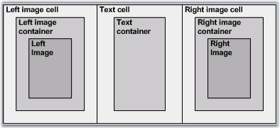{border="0"}

**[]{style="FONT-FAMILY: 'Trebuchet MS','sans-serif'; COLOR: #15428b; FONT-SIZE: 9pt"}** 

Figure 254: Structure of a menu Item

[]{style="FONT-FAMILY: 'Trebuchet MS','sans-serif'; COLOR: #15428b; FONT-SIZE: 9pt"} 

The below table lists the item-level segments and their corresponding CSS properties whose settings affect their styles.

[]{style="FONT-FAMILY: 'Trebuchet MS','sans-serif'; COLOR: #15428b; FONT-SIZE: 9pt"} 

::: {align="center"}
  ----------------------- ----------------------------- --------------------------------
  Element                 Property                      Default Value (CSS Class Name)
  Left image cell         LeftImageCellCSSClass         menuImgCell
  Left image container    LeftImageContainerCSSClass    menuImgCont
  Left image              LeftImageCSSClass             menuImg
  Text cell               TextCellCssClass              menuTextCell
  Text container          TextContainerCssClass         menuTextCont
  Right image cell        RightImageCellCSSClass        menuArrCell
  Right image container   RightImageContainerCSSClass   menuArrCont
  Right image             RightImageCSSClass            menuArr
  ----------------------- ----------------------------- --------------------------------
:::

[]{style="FONT-FAMILY: 'Trebuchet MS','sans-serif'; COLOR: #15428b; FONT-SIZE: 9pt"} 

**[]{style="FONT-FAMILY: 'Trebuchet MS','sans-serif'; COLOR: #15428b"}** 

Customizing Menu Item-level segments

[]{style="FONT-FAMILY: 'Trebuchet MS','sans-serif'; COLOR: #15428b; FONT-SIZE: 9pt"} 

The following section shows some custom styles applied on the different item-level segments and a screenshot of the resulting look.

[]{style="FONT-FAMILY: 'Trebuchet MS','sans-serif'; COLOR: #15428b; FONT-SIZE: 9pt"} 

::: {align="center"}
+---------------------------------------------------------------------+-----------------------------+------------------+----------------------------------------------------------------------------------------------------------------------------------------------------------------+
| Image                                                               | Property                    | Custom CSS Style | CSS Definition                                                                                                                                                 |
+=====================================================================+=============================+==================+================================================================================================================================================================+
| 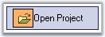{border="0"}                          | LeftImageCellCSSClass       | menuImgCell      | [.menuPanelItem]{style="FONT-FAMILY: 'Courier New'; COLOR: maroon"}[ [.menuImgCell]{style="COLOR: maroon"}]{style="FONT-FAMILY: 'Courier New'"}                |
|                                                                     |                             |                  |                                                                                                                                                                |
| []{style="FONT-FAMILY: 'Trebuchet MS','sans-serif'; COLOR: black"}  |                             |                  | [{]{style="FONT-FAMILY: 'Courier New'"}                                                                                                                        |
|                                                                     |                             |                  |                                                                                                                                                                |
| Menu with style settings for left image                             |                             |                  | [  [background-color]{style="COLOR: red"}:[#FFBB6F]{style="COLOR: blue"}; ]{style="FONT-FAMILY: 'Courier New'"}                                                |
|                                                                     |                             |                  |                                                                                                                                                                |
|                                                                     |                             |                  | [  [border]{style="COLOR: red"}:[1px]{style="COLOR: blue"} [solid]{style="COLOR: blue"} [black]{style="COLOR: blue"};]{style="FONT-FAMILY: 'Courier New'"}     |
|                                                                     |                             |                  |                                                                                                                                                                |
|                                                                     |                             |                  | [  [margin]{style="COLOR: red"}:[2px]{style="COLOR: blue"};]{style="FONT-FAMILY: 'Courier New'"}                                                               |
|                                                                     |                             |                  |                                                                                                                                                                |
|                                                                     |                             |                  | [}]{style="FONT-FAMILY: 'Courier New'"}                                                                                                                        |
|                                                                     |                             |                  |                                                                                                                                                                |
|                                                                     |                             |                  | [.menuPanelItem]{style="FONT-FAMILY: 'Courier New'; COLOR: maroon"}[ [.menuImgCont]{style="COLOR: maroon"}]{style="FONT-FAMILY: 'Courier New'"}                |
|                                                                     |                             |                  |                                                                                                                                                                |
|                                                                     |                             |                  | [{]{style="FONT-FAMILY: 'Courier New'"}                                                                                                                        |
|                                                                     |                             |                  |                                                                                                                                                                |
|                                                                     |                             |                  | [  [margin]{style="COLOR: red"}:[2px]{style="COLOR: blue"};]{style="FONT-FAMILY: 'Courier New'"}                                                               |
|                                                                     |                             |                  |                                                                                                                                                                |
|                                                                     |                             |                  | [}]{style="FONT-FAMILY: 'Courier New'"}                                                                                                                        |
|                                                                     |                             |                  |                                                                                                                                                                |
|                                                                     |                             |                  | [.menuPanelItem]{style="FONT-FAMILY: 'Courier New'; COLOR: maroon"}[ [.menuImg]{style="COLOR: maroon"}]{style="FONT-FAMILY: 'Courier New'"}                    |
|                                                                     |                             |                  |                                                                                                                                                                |
|                                                                     |                             |                  | [{]{style="FONT-FAMILY: 'Courier New'"}                                                                                                                        |
|                                                                     |                             |                  |                                                                                                                                                                |
|                                                                     |                             |                  | [  [width]{style="COLOR: red"}: [20px]{style="COLOR: blue"};]{style="FONT-FAMILY: 'Courier New'"}                                                              |
|                                                                     |                             |                  |                                                                                                                                                                |
|                                                                     |                             |                  | [  [height]{style="COLOR: red"}:[18px]{style="COLOR: blue"};]{style="FONT-FAMILY: 'Courier New'"}                                                              |
|                                                                     |                             |                  |                                                                                                                                                                |
|                                                                     |                             |                  | [}]{style="FONT-FAMILY: 'Courier New'"}                                                                                                                        |
|                                                                     +-----------------------------+------------------+                                                                                                                                                                |
|                                                                     | LeftImageContainerCSSClass  | menuImgCont      |                                                                                                                                                                |
|                                                                     +-----------------------------+------------------+                                                                                                                                                                |
|                                                                     | LeftImageCSSClass           | menuImg          |                                                                                                                                                                |
+---------------------------------------------------------------------+-----------------------------+------------------+----------------------------------------------------------------------------------------------------------------------------------------------------------------+
| 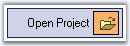{border="0"}                          | RightImageCellCSSClass      | menuArrCell      | .menuPanelItem .menuArrCell                                                                                                                                    |
|                                                                     |                             |                  |                                                                                                                                                                |
| []{style="FONT-FAMILY: 'Trebuchet MS','sans-serif'; COLOR: black"}  |                             |                  | {                                                                                                                                                              |
|                                                                     |                             |                  |                                                                                                                                                                |
| Menu with style settings for right image                            |                             |                  |   [background-color]{style="COLOR: red"}:[#FFBB6F]{style="COLOR: blue"};                                                                                       |
|                                                                     |                             |                  |                                                                                                                                                                |
|                                                                     |                             |                  |   [border]{style="COLOR: red"}:[1px]{style="COLOR: blue"} [solid]{style="COLOR: blue"} [black]{style="COLOR: blue"};                                           |
|                                                                     |                             |                  |                                                                                                                                                                |
|                                                                     |                             |                  |   [margin]{style="COLOR: red"}:[2px]{style="COLOR: blue"};                                                                                                     |
|                                                                     |                             |                  |                                                                                                                                                                |
|                                                                     |                             |                  | }                                                                                                                                                              |
|                                                                     |                             |                  |                                                                                                                                                                |
|                                                                     |                             |                  | .menuPanelItem .menuArrCont                                                                                                                                    |
|                                                                     |                             |                  |                                                                                                                                                                |
|                                                                     |                             |                  | {                                                                                                                                                              |
|                                                                     |                             |                  |                                                                                                                                                                |
|                                                                     |                             |                  |   [margin]{style="COLOR: red"}:[2px]{style="COLOR: blue"};                                                                                                     |
|                                                                     |                             |                  |                                                                                                                                                                |
|                                                                     |                             |                  | }                                                                                                                                                              |
|                                                                     |                             |                  |                                                                                                                                                                |
|                                                                     |                             |                  | .menuPanelItem .menuArr                                                                                                                                        |
|                                                                     |                             |                  |                                                                                                                                                                |
|                                                                     |                             |                  | {                                                                                                                                                              |
|                                                                     |                             |                  |                                                                                                                                                                |
|                                                                     |                             |                  |   [width]{style="COLOR: red"}: [20px]{style="COLOR: blue"};                                                                                                    |
|                                                                     |                             |                  |                                                                                                                                                                |
|                                                                     |                             |                  |   [height]{style="COLOR: red"}:[18px]{style="COLOR: blue"};                                                                                                    |
|                                                                     |                             |                  |                                                                                                                                                                |
|                                                                     |                             |                  | }                                                                                                                                                              |
|                                                                     +-----------------------------+------------------+                                                                                                                                                                |
|                                                                     | RightImageContainerCSSClass | menuArrCont      |                                                                                                                                                                |
|                                                                     +-----------------------------+------------------+                                                                                                                                                                |
|                                                                     | RightImageCSSClass          | menuArr          |                                                                                                                                                                |
+---------------------------------------------------------------------+-----------------------------+------------------+----------------------------------------------------------------------------------------------------------------------------------------------------------------+
| 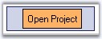{border="0"}                          | TextCellCssClass            | menuTextCell     | [.menuPanelItem]{style="FONT-FAMILY: 'Courier New'; COLOR: maroon"}[ [.menuTextCell]{style="COLOR: maroon"}]{style="FONT-FAMILY: 'Courier New'"}               |
|                                                                     |                             |                  |                                                                                                                                                                |
| []{style="FONT-FAMILY: 'Trebuchet MS','sans-serif'; COLOR: black"}  |                             |                  | [{]{style="FONT-FAMILY: 'Courier New'"}                                                                                                                        |
|                                                                     |                             |                  |                                                                                                                                                                |
| Menu with style settings for text                                   |                             |                  | [  [font-family]{style="COLOR: red"}:[MS]{style="COLOR: blue"} [Sans]{style="COLOR: blue"} [Serif]{style="COLOR: blue"}; ]{style="FONT-FAMILY: 'Courier New'"} |
|                                                                     |                             |                  |                                                                                                                                                                |
|                                                                     |                             |                  | [  [font-size]{style="COLOR: red"}:[12px]{style="COLOR: blue"}; ]{style="FONT-FAMILY: 'Courier New'"}                                                          |
|                                                                     |                             |                  |                                                                                                                                                                |
|                                                                     |                             |                  | [  [width]{style="COLOR: red"}: [100%]{style="COLOR: blue"};]{style="FONT-FAMILY: 'Courier New'"}                                                              |
|                                                                     |                             |                  |                                                                                                                                                                |
|                                                                     |                             |                  | [ }        ]{style="FONT-FAMILY: 'Courier New'"}                                                                                                               |
|                                                                     |                             |                  |                                                                                                                                                                |
|                                                                     |                             |                  | [.menuPanelItem]{style="FONT-FAMILY: 'Courier New'; COLOR: maroon"}[ [.menuTextCont]{style="COLOR: maroon"}]{style="FONT-FAMILY: 'Courier New'"}               |
|                                                                     |                             |                  |                                                                                                                                                                |
|                                                                     |                             |                  | [{]{style="FONT-FAMILY: 'Courier New'"}                                                                                                                        |
|                                                                     |                             |                  |                                                                                                                                                                |
|                                                                     |                             |                  | [  [background-color]{style="COLOR: red"}:[#FFBB6F]{style="COLOR: blue"}; ]{style="FONT-FAMILY: 'Courier New'"}                                                |
|                                                                     |                             |                  |                                                                                                                                                                |
|                                                                     |                             |                  | [  [border]{style="COLOR: red"}:[1px]{style="COLOR: blue"} [solid]{style="COLOR: blue"} [black]{style="COLOR: blue"};]{style="FONT-FAMILY: 'Courier New'"}     |
|                                                                     |                             |                  |                                                                                                                                                                |
|                                                                     |                             |                  | [  [padding]{style="COLOR: red"}:[5px]{style="COLOR: blue"};]{style="FONT-FAMILY: 'Courier New'"}                                                              |
|                                                                     |                             |                  |                                                                                                                                                                |
|                                                                     |                             |                  | [}]{style="FONT-FAMILY: 'Courier New'"}                                                                                                                        |
|                                                                     +-----------------------------+------------------+                                                                                                                                                                |
|                                                                     | TextContainerCssClass       | menuTextCont     |                                                                                                                                                                |
+---------------------------------------------------------------------+-----------------------------+------------------+----------------------------------------------------------------------------------------------------------------------------------------------------------------+
:::

[]{style="FONT-FAMILY: 'Trebuchet MS','sans-serif'; COLOR: #15428b; FONT-SIZE: 9pt"} 

See Also

[]{style="FONT-FAMILY: 'Trebuchet MS','sans-serif'; COLOR: #15428b; FONT-SIZE: 9pt"} 

[[ItemLook Settings]{.UGHyperlink}]()[, ]{.UGHyperlink}[Image Settings]{.UGHyperlink}[]{.UGHyperlink}

 

[]{#related-topics}
::::::::::
