::: {style="DISPLAY: none"}
{#d2h_url_template}{#d2h_package_url style="WIDTH: 0px; DISPLAY: none; HEIGHT: 0px"}
:::

:::::::::::::: {.d2h_secondary_topic style="PADDING-BOTTOM: 10pt; MARGIN: 0pt; PADDING-LEFT: 0pt; PADDING-RIGHT: 0pt; PADDING-TOP: 0pt"}
##### Look and Feel Settings {#look-and-feel-settings style="tab-stops: 0pt"}

 

The look and feel of toolbar can be controlled by defining custom**[ ]{style="COLOR: black; FONT-SIZE: 8pt"}**ItemLook instances in ItemLooks collection or by editing default ItemLook settings in DefaultItemLook and DefaultDisabledItemLook properties.

 

The topics discussed are given below.

 

###### 5.4.2.2.11.1        AutoFormat Styles {#autoformat-styles style="tab-stops: 0pt"}

[]{style="FONT-FAMILY: 'Trebuchet MS','sans-serif'; COLOR: #15428b; FONT-SIZE: 9pt"} 

The ToolBar control provides pre-defined set of styles that can be applied to your control just on a click of the button. You can set the desired look and feel for the control that includes some popular styles too.

 

The Autoformat window can be opened by right clicking the control and selecting the **Auto Format\...** option opens the following **Auto Format** dialog box.

[]{style="FONT-FAMILY: 'Trebuchet MS','sans-serif'; COLOR: #15428b; FONT-SIZE: 9pt"} 

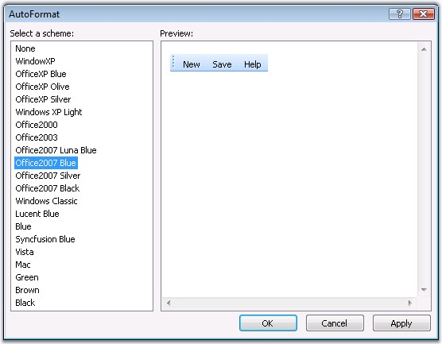{border="0"}

Figure 273: Autoformat Schemes

[]{style="FONT-FAMILY: 'Trebuchet MS','sans-serif'; COLOR: #15428b; FONT-SIZE: 9pt"} 

The left pane lists the various pre-defined style scheme that are available. The right pane shows the preview of the currently selected scheme. Select the required style and click *[OK]{style="FONT-SIZE: 8pt"}* to apply the selected scheme to the control.

[]{style="FONT-FAMILY: 'Trebuchet MS','sans-serif'; COLOR: #15428b; FONT-SIZE: 9pt"} 

Example of a popular look and feel

[]{style="FONT-FAMILY: 'Trebuchet MS','sans-serif'; COLOR: #15428b; FONT-SIZE: 9pt"} 

The following image shows the ToolBar with **OfficeXP Silver** style setting.

[]{style="FONT-FAMILY: 'Trebuchet MS','sans-serif'; COLOR: #15428b; FONT-SIZE: 9pt"} 

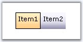{border="0"}

Figure 274[]{style="FONT-FAMILY: 'Trebuchet MS','sans-serif'; COLOR: #15428b"}

[]{style="FONT-FAMILY: 'Trebuchet MS','sans-serif'; COLOR: #15428b; FONT-SIZE: 9pt"} 

The new built-in format skins added for Toolbar are as follows.

[]{style="FONT-FAMILY: 'Trebuchet MS','sans-serif'; COLOR: #15428b; FONT-SIZE: 9pt"} 

[·      ]{style="FONT-FAMILY: Symbol"}Vista

[]{style="FONT-FAMILY: 'Trebuchet MS','sans-serif'; COLOR: #15428b; FONT-SIZE: 9pt"} 

{border="0"}

Figure 275

[]{style="FONT-FAMILY: 'Trebuchet MS','sans-serif'; COLOR: #15428b; FONT-SIZE: 9pt"} 

[·      ]{style="FONT-FAMILY: Symbol"}MAC

[]{style="FONT-FAMILY: 'Trebuchet MS','sans-serif'; COLOR: #15428b; FONT-SIZE: 9pt"} 

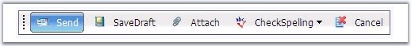{border="0"}

Figure 276

[]{style="FONT-FAMILY: 'Trebuchet MS','sans-serif'; COLOR: #15428b; FONT-SIZE: 9pt"} 

[·      ]{style="FONT-FAMILY: Symbol"}Blue

[]{style="FONT-FAMILY: 'Trebuchet MS','sans-serif'; COLOR: #15428b; FONT-SIZE: 9pt"} 

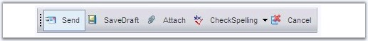{border="0"}

Figure 277

[]{style="FONT-FAMILY: 'Trebuchet MS','sans-serif'; COLOR: #15428b; FONT-SIZE: 9pt"} 

[·      ]{style="FONT-FAMILY: Symbol"}Black

[]{style="FONT-FAMILY: 'Trebuchet MS','sans-serif'; COLOR: #15428b; FONT-SIZE: 9pt"} 

{border="0"}

Figure 278

[]{style="FONT-FAMILY: 'Trebuchet MS','sans-serif'; COLOR: #15428b; FONT-SIZE: 9pt"} 

[·      ]{style="FONT-FAMILY: Symbol"}Brown

[]{style="FONT-FAMILY: 'Trebuchet MS','sans-serif'; COLOR: #15428b; FONT-SIZE: 9pt"} 

{border="0"}

Figure 279

[]{style="FONT-FAMILY: 'Trebuchet MS','sans-serif'; COLOR: #15428b; FONT-SIZE: 9pt"} 

[·      ]{style="FONT-FAMILY: Symbol"}Green

[]{style="FONT-FAMILY: 'Trebuchet MS','sans-serif'; COLOR: #15428b; FONT-SIZE: 9pt"} 

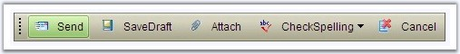{border="0"}

Figure 280

 

###### []{#_Item_Looks_2}5.4.2.2.11.2        Item Looks {#item-looks style="tab-stops: 0pt"}

 

The **ItemLooks Collection Editor** contains **Default** properties that allows to set default look and feel to the control and its disabled state, and **Custom** properties that allows you to customize the look and feel accordingly.

 

To override the default css settings or to apply custom looks, the **CustomCSS** property must be set to the style sheet where the styles are defined.

[]{style="FONT-FAMILY: 'Trebuchet MS','sans-serif'; COLOR: #15428b; FONT-SIZE: 9pt"} 

::: {align="center"}
  -------------------------- ---------------------------------------------------------------------------
           Property          Description
  CustomCSS                  Specifies the external css file where the custom CSS classes are defined.
  -------------------------- ---------------------------------------------------------------------------
:::

[]{style="FONT-FAMILY: 'Trebuchet MS','sans-serif'; COLOR: #15428b; FONT-SIZE: 9pt"} 

The ItemLooks properties are as follows.

**[]{style="FONT-FAMILY: 'Trebuchet MS','sans-serif'; COLOR: #15428b; FONT-SIZE: 9pt"}** 

::: {align="center"}
  -------------- ----------------------------------------------------------------------------------
  Property       Description
  ImageHeight    Specifies height of the image.
  ImageWidth     Specifies width of the image.
  ItemHeight     Specifies height of the toolbar item.
  ItemWidth      Specifies width of the toolbar item.
  Enabled        Specifies whether a look is enabled.
  StateActive    Specifies the style classes to be applied to the toolbar items in active state.
  StateDefault   Specifies the style classes to be applied to the toolbar items in default state.
  StateHover     Specifies the style classes to be applied to the toolbar items in hover state.
  StatePushed    Specifies the style classes to be applied to the toolbar items in pushed state.
  -------------- ----------------------------------------------------------------------------------
:::

[]{style="FONT-FAMILY: 'Trebuchet MS','sans-serif'; COLOR: #15428b; FONT-SIZE: 9pt"} 

**ID** specifies the id of the look. The height and width of the image and the item can be set for the toolbar items.

The **StateDefault**, **StateActive**, **StatePushed** and **StateHover** properties in ItemLook contains the following css class properties that defines the styles for the toolbar items.

[]{style="FONT-FAMILY: 'Trebuchet MS','sans-serif'; COLOR: #15428b; FONT-SIZE: 9pt"} 

::: {align="center"}
+-----------------------------------+---------------------------------------------------------------------------+
|                                   |                                                                           |
|                                   |                                                                           |
| Property                          | Description                                                               |
+-----------------------------------+---------------------------------------------------------------------------+
| ImageCellCSSClass                 | Specifies the css styles for the cell holding the leftimage.              |
+-----------------------------------+---------------------------------------------------------------------------+
| ImageContainerCSSClass            | Specifies the css styles for the container of the image.                  |
+-----------------------------------+---------------------------------------------------------------------------+
| ImageCSSClass                     | Specifies the css styles for the image of toolbar item.                   |
+-----------------------------------+---------------------------------------------------------------------------+
| ItemCSSClass                      | Specifies the css styles for toolbar items.                               |
+-----------------------------------+---------------------------------------------------------------------------+
| ImageURL                          | Specifies the url of the image that is to be displayed on a toolbar item. |
+-----------------------------------+---------------------------------------------------------------------------+
| TextCellCSSClass                  | Specifies the css styles for the cell holding the text.                   |
+-----------------------------------+---------------------------------------------------------------------------+
| TextCSSClass                      | Specifies the css styles for the text part of the toolbar item.           |
+-----------------------------------+---------------------------------------------------------------------------+
:::

[]{style="FONT-FAMILY: 'Trebuchet MS','sans-serif'; COLOR: #15428b; FONT-SIZE: 9pt"} 

The styles can be applied to individual items by setting the id of the look to the **Look** and **LookDisabled** property in the Designer dialog for the required menu items. This way the styles will be applied only to those items.

[]{style="FONT-FAMILY: 'Trebuchet MS','sans-serif'; COLOR: black"} 

::: {align="center"}
+-----------------------------------+---------------------------------------------------------------+
|                                   |                                                               |
|                                   |                                                               |
| Property                          | Description                                                   |
+-----------------------------------+---------------------------------------------------------------+
| Look                              | Specifies the styles for the toolbar items.                   |
+-----------------------------------+---------------------------------------------------------------+
| LookDisabled                      | Specifies the styles for the toolbar items in disabled state. |
+-----------------------------------+---------------------------------------------------------------+
:::

[]{style="FONT-FAMILY: 'Trebuchet MS','sans-serif'; COLOR: #15428b; FONT-SIZE: 9pt"} 

See Also

[]{style="FONT-FAMILY: 'Trebuchet MS','sans-serif'; COLOR: #15428b; FONT-SIZE: 9pt"} 

[CSS Styles]{.UGHyperlink}[]{.UGHyperlink}

 

[]{#_Default_Looks_3}5.4.2.2.11.2.1     []{#p382}Default Looks

[]{style="FONT-FAMILY: 'Trebuchet MS','sans-serif'; COLOR: #15428b; FONT-SIZE: 9pt"} 

The default looks used by the control is defined in the following properties that can also be edited in ItemLooks Collection Editor dialog.

[]{style="FONT-FAMILY: 'Trebuchet MS','sans-serif'; COLOR: #15428b; FONT-SIZE: 9pt"} 

[·      ]{style="FONT-FAMILY: Symbol"}DefaultItemLook

[·      ]{style="FONT-FAMILY: Symbol"}DefaultDisabledItemLook

[]{style="FONT-FAMILY: 'Trebuchet MS','sans-serif'; COLOR: #15428b; FONT-SIZE: 9pt"} 

The ItemLook Editor lets you define the **DefaultItemLook** to apply the default styles for the toolbar items and[ ]{style="COLOR: black"}**DefaultDisabledItemLook** for the items in disabled state.

[]{style="FONT-FAMILY: 'Trebuchet MS','sans-serif'; COLOR: #15428b; FONT-SIZE: 9pt"} 

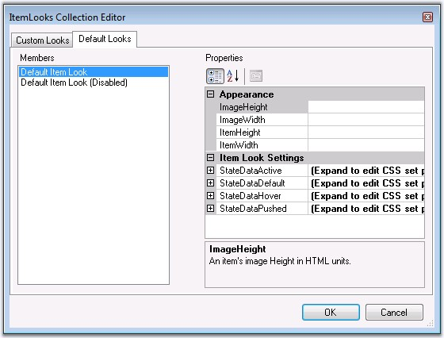{border="0"}

Figure 281

[]{style="FONT-FAMILY: 'Trebuchet MS','sans-serif'; COLOR: #15428b; FONT-SIZE: 9pt"} 

The code below shows a toolbar\'s Default ItemLooks and Default Disabled ItemLook collection that contains styles for the toolbar items in pushed, hover, active and default states. The StatePushed styles is applicable only for toggle button types. The aspx file will look as follows.

[]{style="FONT-FAMILY: 'Trebuchet MS','sans-serif'; COLOR: #15428b; FONT-SIZE: 9pt"} 

+-------------------------------------------------------------------------------------------------------------------------------------------------------------------------------------------------------------------------------------------------------------------------------------------------------------------------------------------------------------------------------------------------------------------------------------------------------------------------------------------------------------------------------------------------------------------------------------------------------------------------------------------------------------------------------------------------------------------------------------------------------------------------------------------------------------------------------------------+
| [\<]{style="FONT-FAMILY: 'Courier New'; COLOR: blue; FONT-SIZE: 9pt"}[DefaultItemLookDisabled]{style="FONT-FAMILY: 'Courier New'; COLOR: maroon; FONT-SIZE: 9pt"}[ [ID]{style="COLOR: red"}[=\"Default Item Look (Disabled)\"\>]{style="COLOR: blue"}]{style="FONT-FAMILY: 'Courier New'; FONT-SIZE: 9pt"}                                                                                                                                                                                                                                                                                                                                                                                                                                                                                                                                |
|                                                                                                                                                                                                                                                                                                                                                                                                                                                                                                                                                                                                                                                                                                                                                                                                                                           |
| []{style="FONT-FAMILY: 'Courier New'; COLOR: blue; FONT-SIZE: 9pt"}                                                                                                                                                                                                                                                                                                                                                                                                                                                                                                                                                                                                                                                                                                                                                                       |
|                                                                                                                                                                                                                                                                                                                                                                                                                                                                                                                                                                                                                                                                                                                                                                                                                                           |
| [    \<]{style="FONT-FAMILY: 'Courier New'; COLOR: blue; FONT-SIZE: 9pt"}[StatePushed]{style="FONT-FAMILY: 'Courier New'; COLOR: maroon; FONT-SIZE: 9pt"}[  [ImageCSSClass ]{style="COLOR: red"}[= \"toolbarImage\"]{style="COLOR: blue"} [TextCSSClass ]{style="COLOR: red"}[= \"toolbarContainerText\"]{style="COLOR: blue"} [ImageCellCSSClass ]{style="COLOR: red"}[= \"toolbarImageCell\" ]{style="COLOR: blue"}[TextCellCSSClass ]{style="COLOR: red"}[= \"toolbarTextCell\"]{style="COLOR: blue"} [ImageContainerCSSClass ]{style="COLOR: red"}[= \"toolbarImageContainer\"]{style="COLOR: blue"} [ItemCSSClass ]{style="COLOR: red"}[= \"toolbarItemDisabled\"\>]{style="COLOR: blue"}]{style="FONT-FAMILY: 'Courier New'; FONT-SIZE: 9pt"}                                                                                       |
|                                                                                                                                                                                                                                                                                                                                                                                                                                                                                                                                                                                                                                                                                                                                                                                                                                           |
| [    \</]{style="FONT-FAMILY: 'Courier New'; COLOR: blue; FONT-SIZE: 9pt"}[StatePushed]{style="FONT-FAMILY: 'Courier New'; COLOR: maroon; FONT-SIZE: 9pt"}[\>]{style="FONT-FAMILY: 'Courier New'; COLOR: blue; FONT-SIZE: 9pt"}                                                                                                                                                                                                                                                                                                                                                                                                                                                                                                                                                                                                           |
|                                                                                                                                                                                                                                                                                                                                                                                                                                                                                                                                                                                                                                                                                                                                                                                                                                           |
| []{style="FONT-FAMILY: 'Courier New'; COLOR: blue; FONT-SIZE: 9pt"}                                                                                                                                                                                                                                                                                                                                                                                                                                                                                                                                                                                                                                                                                                                                                                       |
|                                                                                                                                                                                                                                                                                                                                                                                                                                                                                                                                                                                                                                                                                                                                                                                                                                           |
| [    \<]{style="FONT-FAMILY: 'Courier New'; COLOR: blue; FONT-SIZE: 9pt"}[StateDefault]{style="FONT-FAMILY: 'Courier New'; COLOR: maroon; FONT-SIZE: 9pt"}[ [ImageCSSClass ]{style="COLOR: red"}[= \"toolbarImage\"]{style="COLOR: blue"} [TextCSSClass ]{style="COLOR: red"}[= \"toolbarContainerText\"]{style="COLOR: blue"} [ImageCellCSSClass ]{style="COLOR: red"}[= \"toolbarImageCell\" ]{style="COLOR: blue"}[TextCellCSSClass ]{style="COLOR: red"}[= \"toolbarTextCell\"]{style="COLOR: blue"} [ImageContainerCSSClass ]{style="COLOR: red"}[= \"toolbarImageContainer\"]{style="COLOR: blue"} [ItemCSSClass ]{style="COLOR: red"}[= \"toolbarItemDisabled\"\>]{style="COLOR: blue"}]{style="FONT-FAMILY: 'Courier New'; FONT-SIZE: 9pt"}                                                                                       |
|                                                                                                                                                                                                                                                                                                                                                                                                                                                                                                                                                                                                                                                                                                                                                                                                                                           |
| [    \</]{style="FONT-FAMILY: 'Courier New'; COLOR: blue; FONT-SIZE: 9pt"}[StateDefault]{style="FONT-FAMILY: 'Courier New'; COLOR: maroon; FONT-SIZE: 9pt"}[\>]{style="FONT-FAMILY: 'Courier New'; COLOR: blue; FONT-SIZE: 9pt"}                                                                                                                                                                                                                                                                                                                                                                                                                                                                                                                                                                                                          |
|                                                                                                                                                                                                                                                                                                                                                                                                                                                                                                                                                                                                                                                                                                                                                                                                                                           |
| []{style="FONT-FAMILY: 'Courier New'; COLOR: blue; FONT-SIZE: 9pt"}                                                                                                                                                                                                                                                                                                                                                                                                                                                                                                                                                                                                                                                                                                                                                                       |
|                                                                                                                                                                                                                                                                                                                                                                                                                                                                                                                                                                                                                                                                                                                                                                                                                                           |
| [    \<]{style="FONT-FAMILY: 'Courier New'; COLOR: blue; FONT-SIZE: 9pt"}[StateActive]{style="FONT-FAMILY: 'Courier New'; COLOR: maroon; FONT-SIZE: 9pt"}[ [ImageCSSClass ]{style="COLOR: red"}[= \"toolbarImage\"]{style="COLOR: blue"} [TextCSSClass ]{style="COLOR: red"}[= \"toolbarContainerText\"]{style="COLOR: blue"} [ImageCellCSSClass ]{style="COLOR: red"}[= \"toolbarImageCell\" ]{style="COLOR: blue"}[TextCellCSSClass ]{style="COLOR: red"}[= \"toolbarTextCell\"]{style="COLOR: blue"} [ImageContainerCSSClass ]{style="COLOR: red"}[= \"toolbarImageContainer\"]{style="COLOR: blue"} [ItemCSSClass ]{style="COLOR: red"}[= \"toolbarItemDisabled\"\>]{style="COLOR: blue"}]{style="FONT-FAMILY: 'Courier New'; FONT-SIZE: 9pt"}                                                                                        |
|                                                                                                                                                                                                                                                                                                                                                                                                                                                                                                                                                                                                                                                                                                                                                                                                                                           |
| [    \</]{style="FONT-FAMILY: 'Courier New'; COLOR: blue; FONT-SIZE: 9pt"}[StateActive]{style="FONT-FAMILY: 'Courier New'; COLOR: maroon; FONT-SIZE: 9pt"}[\>]{style="FONT-FAMILY: 'Courier New'; COLOR: blue; FONT-SIZE: 9pt"}                                                                                                                                                                                                                                                                                                                                                                                                                                                                                                                                                                                                           |
|                                                                                                                                                                                                                                                                                                                                                                                                                                                                                                                                                                                                                                                                                                                                                                                                                                           |
| []{style="FONT-FAMILY: 'Courier New'; COLOR: blue; FONT-SIZE: 9pt"}                                                                                                                                                                                                                                                                                                                                                                                                                                                                                                                                                                                                                                                                                                                                                                       |
|                                                                                                                                                                                                                                                                                                                                                                                                                                                                                                                                                                                                                                                                                                                                                                                                                                           |
| [    \<]{style="FONT-FAMILY: 'Courier New'; COLOR: blue; FONT-SIZE: 9pt"}[StateHover ]{style="FONT-FAMILY: 'Courier New'; COLOR: maroon; FONT-SIZE: 9pt"}[ImageCSSClass ]{style="FONT-FAMILY: 'Courier New'; COLOR: red; FONT-SIZE: 9pt"}[= \"toolbarImage\"]{style="FONT-FAMILY: 'Courier New'; COLOR: blue; FONT-SIZE: 9pt"}[ [TextCSSClass ]{style="COLOR: red"}[= \"toolbarContainerText\"]{style="COLOR: blue"} [ImageCellCSSClass ]{style="COLOR: red"}[= \"toolbarImageCell\" ]{style="COLOR: blue"}[TextCellCSSClass ]{style="COLOR: red"}[= \"toolbarTextCell\"]{style="COLOR: blue"} [ImageContainerCSSClass ]{style="COLOR: red"}[= \"toolbarImageContainer\"]{style="COLOR: blue"} [ItemCSSClass ]{style="COLOR: red"}[= \"toolbarItemDisabled\"\>]{style="COLOR: blue"}]{style="FONT-FAMILY: 'Courier New'; FONT-SIZE: 9pt"} |
|                                                                                                                                                                                                                                                                                                                                                                                                                                                                                                                                                                                                                                                                                                                                                                                                                                           |
| [    \</]{style="FONT-FAMILY: 'Courier New'; COLOR: blue; FONT-SIZE: 9pt"}[StateHover]{style="FONT-FAMILY: 'Courier New'; COLOR: maroon; FONT-SIZE: 9pt"}[\>]{style="FONT-FAMILY: 'Courier New'; COLOR: blue; FONT-SIZE: 9pt"}                                                                                                                                                                                                                                                                                                                                                                                                                                                                                                                                                                                                            |
|                                                                                                                                                                                                                                                                                                                                                                                                                                                                                                                                                                                                                                                                                                                                                                                                                                           |
| []{style="FONT-FAMILY: 'Courier New'; COLOR: blue; FONT-SIZE: 9pt"}                                                                                                                                                                                                                                                                                                                                                                                                                                                                                                                                                                                                                                                                                                                                                                       |
|                                                                                                                                                                                                                                                                                                                                                                                                                                                                                                                                                                                                                                                                                                                                                                                                                                           |
| [\</]{style="FONT-FAMILY: 'Courier New'; COLOR: blue; FONT-SIZE: 9pt"}[DefaultItemLookDisabled]{style="FONT-FAMILY: 'Courier New'; COLOR: maroon; FONT-SIZE: 9pt"}[\>]{style="FONT-FAMILY: 'Courier New'; COLOR: blue; FONT-SIZE: 9pt"}                                                                                                                                                                                                                                                                                                                                                                                                                                                                                                                                                                                                   |
|                                                                                                                                                                                                                                                                                                                                                                                                                                                                                                                                                                                                                                                                                                                                                                                                                                           |
| []{style="FONT-FAMILY: 'Courier New'; COLOR: blue; FONT-SIZE: 9pt"}                                                                                                                                                                                                                                                                                                                                                                                                                                                                                                                                                                                                                                                                                                                                                                       |
|                                                                                                                                                                                                                                                                                                                                                                                                                                                                                                                                                                                                                                                                                                                                                                                                                                           |
| [\<]{style="FONT-FAMILY: 'Courier New'; COLOR: blue; FONT-SIZE: 9pt"}[DefaultItemLook]{style="FONT-FAMILY: 'Courier New'; COLOR: maroon; FONT-SIZE: 9pt"}[ [ID]{style="COLOR: red"}[=\"Default Item Look\"\>]{style="COLOR: blue"}]{style="FONT-FAMILY: 'Courier New'; FONT-SIZE: 9pt"}                                                                                                                                                                                                                                                                                                                                                                                                                                                                                                                                                   |
|                                                                                                                                                                                                                                                                                                                                                                                                                                                                                                                                                                                                                                                                                                                                                                                                                                           |
| []{style="FONT-FAMILY: 'Courier New'; COLOR: blue; FONT-SIZE: 9pt"}                                                                                                                                                                                                                                                                                                                                                                                                                                                                                                                                                                                                                                                                                                                                                                       |
|                                                                                                                                                                                                                                                                                                                                                                                                                                                                                                                                                                                                                                                                                                                                                                                                                                           |
| [    \<]{style="FONT-FAMILY: 'Courier New'; COLOR: blue; FONT-SIZE: 9pt"}[StatePushed]{style="FONT-FAMILY: 'Courier New'; COLOR: maroon; FONT-SIZE: 9pt"}[ [ImageCSSClass ]{style="COLOR: red"}[= \"toolbarImage\"]{style="COLOR: blue"} [TextCSSClass ]{style="COLOR: red"}[= \"toolbarContainerText\"]{style="COLOR: blue"} [ImageCellCSSClass ]{style="COLOR: red"}[= \"toolbarImageCell\" ]{style="COLOR: blue"}[TextCellCSSClass ]{style="COLOR: red"}[= \"toolbarTextCell\"]{style="COLOR: blue"} [ImageContainerCSSClass ]{style="COLOR: red"}[= \"toolbarImageContainer\"]{style="COLOR: blue"} [ItemCSSClass ]{style="COLOR: red"}[= \"toolbarItemPushed\"\>]{style="COLOR: blue"}]{style="FONT-FAMILY: 'Courier New'; FONT-SIZE: 9pt"}                                                                                          |
|                                                                                                                                                                                                                                                                                                                                                                                                                                                                                                                                                                                                                                                                                                                                                                                                                                           |
| [    \</]{style="FONT-FAMILY: 'Courier New'; COLOR: blue; FONT-SIZE: 9pt"}[StatePushed]{style="FONT-FAMILY: 'Courier New'; COLOR: maroon; FONT-SIZE: 9pt"}[\>]{style="FONT-FAMILY: 'Courier New'; COLOR: blue; FONT-SIZE: 9pt"}                                                                                                                                                                                                                                                                                                                                                                                                                                                                                                                                                                                                           |
|                                                                                                                                                                                                                                                                                                                                                                                                                                                                                                                                                                                                                                                                                                                                                                                                                                           |
| []{style="FONT-FAMILY: 'Courier New'; COLOR: blue; FONT-SIZE: 9pt"}                                                                                                                                                                                                                                                                                                                                                                                                                                                                                                                                                                                                                                                                                                                                                                       |
|                                                                                                                                                                                                                                                                                                                                                                                                                                                                                                                                                                                                                                                                                                                                                                                                                                           |
| [    \<]{style="FONT-FAMILY: 'Courier New'; COLOR: blue; FONT-SIZE: 9pt"}[StateDefault]{style="FONT-FAMILY: 'Courier New'; COLOR: maroon; FONT-SIZE: 9pt"}[ [ImageCSSClass ]{style="COLOR: red"}[= \"toolbarImage\"]{style="COLOR: blue"} [TextCSSClass ]{style="COLOR: red"}[= \"toolbarContainerText\"]{style="COLOR: blue"} [ImageCellCSSClass ]{style="COLOR: red"}[= \"toolbarImageCell\" ]{style="COLOR: blue"}[TextCellCSSClass ]{style="COLOR: red"}[= \"toolbarTextCell\"]{style="COLOR: blue"} [ImageContainerCSSClass ]{style="COLOR: red"}[= \"toolbarImageContainer\"]{style="COLOR: blue"} [ItemCSSClass ]{style="COLOR: red"}[= \"toolbarItem\"\>]{style="COLOR: blue"}]{style="FONT-FAMILY: 'Courier New'; FONT-SIZE: 9pt"}                                                                                               |
|                                                                                                                                                                                                                                                                                                                                                                                                                                                                                                                                                                                                                                                                                                                                                                                                                                           |
| [    \</]{style="FONT-FAMILY: 'Courier New'; COLOR: blue; FONT-SIZE: 9pt"}[StateDefault]{style="FONT-FAMILY: 'Courier New'; COLOR: maroon; FONT-SIZE: 9pt"}[\>]{style="FONT-FAMILY: 'Courier New'; COLOR: blue; FONT-SIZE: 9pt"}                                                                                                                                                                                                                                                                                                                                                                                                                                                                                                                                                                                                          |
|                                                                                                                                                                                                                                                                                                                                                                                                                                                                                                                                                                                                                                                                                                                                                                                                                                           |
| []{style="FONT-FAMILY: 'Courier New'; COLOR: blue; FONT-SIZE: 9pt"}                                                                                                                                                                                                                                                                                                                                                                                                                                                                                                                                                                                                                                                                                                                                                                       |
|                                                                                                                                                                                                                                                                                                                                                                                                                                                                                                                                                                                                                                                                                                                                                                                                                                           |
| [    \<]{style="FONT-FAMILY: 'Courier New'; COLOR: blue; FONT-SIZE: 9pt"}[StateActive]{style="FONT-FAMILY: 'Courier New'; COLOR: maroon; FONT-SIZE: 9pt"}[ [ImageCSSClass ]{style="COLOR: red"}[= \"toolbarImage\"]{style="COLOR: blue"} [TextCSSClass ]{style="COLOR: red"}[= \"toolbarContainerText\"]{style="COLOR: blue"} [ImageCellCSSClass ]{style="COLOR: red"}[= \"toolbarImageCell\" ]{style="COLOR: blue"}[TextCellCSSClass ]{style="COLOR: red"}[= \"toolbarTextCell\"]{style="COLOR: blue"} [ImageContainerCSSClass ]{style="COLOR: red"}[= \"toolbarImageContainer\"]{style="COLOR: blue"} [ItemCSSClass ]{style="COLOR: red"}[= \"toolbarItemActive\"\>]{style="COLOR: blue"}]{style="FONT-FAMILY: 'Courier New'; FONT-SIZE: 9pt"}                                                                                          |
|                                                                                                                                                                                                                                                                                                                                                                                                                                                                                                                                                                                                                                                                                                                                                                                                                                           |
| [    \</]{style="FONT-FAMILY: 'Courier New'; COLOR: blue; FONT-SIZE: 9pt"}[StateActive]{style="FONT-FAMILY: 'Courier New'; COLOR: maroon; FONT-SIZE: 9pt"}[\>]{style="FONT-FAMILY: 'Courier New'; COLOR: blue; FONT-SIZE: 9pt"}                                                                                                                                                                                                                                                                                                                                                                                                                                                                                                                                                                                                           |
|                                                                                                                                                                                                                                                                                                                                                                                                                                                                                                                                                                                                                                                                                                                                                                                                                                           |
| []{style="FONT-FAMILY: 'Courier New'; COLOR: blue; FONT-SIZE: 9pt"}                                                                                                                                                                                                                                                                                                                                                                                                                                                                                                                                                                                                                                                                                                                                                                       |
|                                                                                                                                                                                                                                                                                                                                                                                                                                                                                                                                                                                                                                                                                                                                                                                                                                           |
| [    \<]{style="FONT-FAMILY: 'Courier New'; COLOR: blue; FONT-SIZE: 9pt"}[StateHover]{style="FONT-FAMILY: 'Courier New'; COLOR: maroon; FONT-SIZE: 9pt"}[ [ImageCSSClass ]{style="COLOR: red"}[= \"toolbarImage\"]{style="COLOR: blue"} [TextCSSClass ]{style="COLOR: red"}[= \"toolbarContainerText\"]{style="COLOR: blue"} [ImageCellCSSClass ]{style="COLOR: red"}[= \"toolbarImageCell\" ]{style="COLOR: blue"}[TextCellCSSClass ]{style="COLOR: red"}[= \"toolbarTextCell\"]{style="COLOR: blue"} [ImageContainerCSSClass ]{style="COLOR: red"}[= \"toolbarImageContainer\"]{style="COLOR: blue"} [ItemCSSClass ]{style="COLOR: red"}[= \"toolbarItemHover\"\>]{style="COLOR: blue"}]{style="FONT-FAMILY: 'Courier New'; FONT-SIZE: 9pt"}                                                                                            |
|                                                                                                                                                                                                                                                                                                                                                                                                                                                                                                                                                                                                                                                                                                                                                                                                                                           |
| [    \</]{style="FONT-FAMILY: 'Courier New'; COLOR: blue; FONT-SIZE: 9pt"}[StateHover]{style="FONT-FAMILY: 'Courier New'; COLOR: maroon; FONT-SIZE: 9pt"}[\>]{style="FONT-FAMILY: 'Courier New'; COLOR: blue; FONT-SIZE: 9pt"}                                                                                                                                                                                                                                                                                                                                                                                                                                                                                                                                                                                                            |
|                                                                                                                                                                                                                                                                                                                                                                                                                                                                                                                                                                                                                                                                                                                                                                                                                                           |
| []{style="FONT-FAMILY: 'Courier New'; COLOR: blue; FONT-SIZE: 9pt"}                                                                                                                                                                                                                                                                                                                                                                                                                                                                                                                                                                                                                                                                                                                                                                       |
|                                                                                                                                                                                                                                                                                                                                                                                                                                                                                                                                                                                                                                                                                                                                                                                                                                           |
| [\</]{style="FONT-FAMILY: 'Courier New'; COLOR: blue; FONT-SIZE: 9pt"}[DefaultItemLook]{style="FONT-FAMILY: 'Courier New'; COLOR: maroon; FONT-SIZE: 9pt"}[\>]{style="FONT-FAMILY: 'Courier New'; COLOR: blue; FONT-SIZE: 9pt"}                                                                                                                                                                                                                                                                                                                                                                                                                                                                                                                                                                                                           |
+-------------------------------------------------------------------------------------------------------------------------------------------------------------------------------------------------------------------------------------------------------------------------------------------------------------------------------------------------------------------------------------------------------------------------------------------------------------------------------------------------------------------------------------------------------------------------------------------------------------------------------------------------------------------------------------------------------------------------------------------------------------------------------------------------------------------------------------------+

[]{style="FONT-FAMILY: 'Trebuchet MS','sans-serif'; COLOR: #15428b; FONT-SIZE: 9pt"} 

Note that the default css style sheet used by the toolbar control is available at the following location:[ ]{style="COLOR: black"}**\'/Syncfusion/Resources/Toolsweb/CSS/toolbar_default.css**\'[. ]{style="COLOR: black"}This css file defines the following css styles.

[]{style="FONT-FAMILY: 'Trebuchet MS','sans-serif'; COLOR: #15428b; FONT-SIZE: 9pt"} 

+------------------------------------------------------------------------------------------------------------------------------------------------------------------------------------------+
| [.toolbarRoot]{style="FONT-FAMILY: 'Courier New'; COLOR: maroon; FONT-SIZE: 9pt"}                                                                                                        |
|                                                                                                                                                                                          |
| [{]{style="FONT-FAMILY: 'Courier New'; FONT-SIZE: 9pt"}                                                                                                                                  |
|                                                                                                                                                                                          |
| [       [background-color]{style="COLOR: red"}: [LightGrey]{style="COLOR: blue"};]{style="FONT-FAMILY: 'Courier New'; FONT-SIZE: 9pt"}                                                   |
|                                                                                                                                                                                          |
| [}]{style="FONT-FAMILY: 'Courier New'; FONT-SIZE: 9pt"}                                                                                                                                  |
|                                                                                                                                                                                          |
| []{style="FONT-FAMILY: 'Courier New'; FONT-SIZE: 9pt"}                                                                                                                                   |
|                                                                                                                                                                                          |
| [.toolbarRoot]{style="FONT-FAMILY: 'Courier New'; COLOR: maroon; FONT-SIZE: 9pt"}[ [.toolbarRootTable]{style="COLOR: maroon"}]{style="FONT-FAMILY: 'Courier New'; FONT-SIZE: 9pt"}       |
|                                                                                                                                                                                          |
| [{]{style="FONT-FAMILY: 'Courier New'; FONT-SIZE: 9pt"}                                                                                                                                  |
|                                                                                                                                                                                          |
| [       [border]{style="COLOR: red"}:[1px]{style="COLOR: blue"} [solid]{style="COLOR: blue"} [LightGrey]{style="COLOR: blue"};]{style="FONT-FAMILY: 'Courier New'; FONT-SIZE: 9pt"}      |
|                                                                                                                                                                                          |
| [       [/\*in mozilla\*/]{style="COLOR: green"}]{style="FONT-FAMILY: 'Courier New'; FONT-SIZE: 9pt"}                                                                                    |
|                                                                                                                                                                                          |
| [       [background-color]{style="COLOR: red"}: [LightGrey]{style="COLOR: blue"};]{style="FONT-FAMILY: 'Courier New'; FONT-SIZE: 9pt"}                                                   |
|                                                                                                                                                                                          |
| [}]{style="FONT-FAMILY: 'Courier New'; FONT-SIZE: 9pt"}                                                                                                                                  |
|                                                                                                                                                                                          |
| []{style="FONT-FAMILY: 'Courier New'; FONT-SIZE: 9pt"}                                                                                                                                   |
|                                                                                                                                                                                          |
| [.toolbarRoot]{style="FONT-FAMILY: 'Courier New'; COLOR: maroon; FONT-SIZE: 9pt"}[ [.toolbarContainerText]{style="COLOR: maroon"}]{style="FONT-FAMILY: 'Courier New'; FONT-SIZE: 9pt"}   |
|                                                                                                                                                                                          |
| [{]{style="FONT-FAMILY: 'Courier New'; FONT-SIZE: 9pt"}                                                                                                                                  |
|                                                                                                                                                                                          |
| [       [color]{style="COLOR: red"}:[black]{style="COLOR: blue"};]{style="FONT-FAMILY: 'Courier New'; FONT-SIZE: 9pt"}                                                                   |
|                                                                                                                                                                                          |
| [       [font-family]{style="COLOR: red"}:[Courier]{style="COLOR: blue"} [New]{style="COLOR: blue"};]{style="FONT-FAMILY: 'Courier New'; FONT-SIZE: 9pt"}                                |
|                                                                                                                                                                                          |
| [       [margin-bottom]{style="COLOR: red"} : [1px]{style="COLOR: blue"};]{style="FONT-FAMILY: 'Courier New'; FONT-SIZE: 9pt"}                                                           |
|                                                                                                                                                                                          |
| [}]{style="FONT-FAMILY: 'Courier New'; FONT-SIZE: 9pt"}                                                                                                                                  |
|                                                                                                                                                                                          |
| []{style="FONT-FAMILY: 'Courier New'; FONT-SIZE: 9pt"}                                                                                                                                   |
|                                                                                                                                                                                          |
| [.toolbarRoot]{style="FONT-FAMILY: 'Courier New'; COLOR: maroon; FONT-SIZE: 9pt"}[ [.toolbarItemDisabled]{style="COLOR: maroon"}]{style="FONT-FAMILY: 'Courier New'; FONT-SIZE: 9pt"}    |
|                                                                                                                                                                                          |
| [{]{style="FONT-FAMILY: 'Courier New'; FONT-SIZE: 9pt"}                                                                                                                                  |
|                                                                                                                                                                                          |
| [       [border]{style="COLOR: red"} : [1px]{style="COLOR: blue"} [solid]{style="COLOR: blue"} [LightGrey]{style="COLOR: blue"};]{style="FONT-FAMILY: 'Courier New'; FONT-SIZE: 9pt"}    |
|                                                                                                                                                                                          |
| [       [cursor]{style="COLOR: red"} : [default]{style="COLOR: blue"};]{style="FONT-FAMILY: 'Courier New'; FONT-SIZE: 9pt"}                                                              |
|                                                                                                                                                                                          |
| [}]{style="FONT-FAMILY: 'Courier New'; FONT-SIZE: 9pt"}                                                                                                                                  |
|                                                                                                                                                                                          |
| []{style="FONT-FAMILY: 'Courier New'; FONT-SIZE: 9pt"}                                                                                                                                   |
|                                                                                                                                                                                          |
| [.toolbarRoot]{style="FONT-FAMILY: 'Courier New'; COLOR: maroon; FONT-SIZE: 9pt"}[ [.toolbarItem]{style="COLOR: maroon"}]{style="FONT-FAMILY: 'Courier New'; FONT-SIZE: 9pt"}            |
|                                                                                                                                                                                          |
| [{]{style="FONT-FAMILY: 'Courier New'; FONT-SIZE: 9pt"}                                                                                                                                  |
|                                                                                                                                                                                          |
| [       [border]{style="COLOR: red"} : [1px]{style="COLOR: blue"} [solid]{style="COLOR: blue"} [LightGrey]{style="COLOR: blue"};]{style="FONT-FAMILY: 'Courier New'; FONT-SIZE: 9pt"}    |
|                                                                                                                                                                                          |
| [       [cursor]{style="COLOR: red"}:       [default]{style="COLOR: blue"};]{style="FONT-FAMILY: 'Courier New'; FONT-SIZE: 9pt"}                                                         |
|                                                                                                                                                                                          |
| [}]{style="FONT-FAMILY: 'Courier New'; FONT-SIZE: 9pt"}                                                                                                                                  |
|                                                                                                                                                                                          |
| []{style="FONT-FAMILY: 'Courier New'; FONT-SIZE: 9pt"}                                                                                                                                   |
|                                                                                                                                                                                          |
| [.toolbarRoot]{style="FONT-FAMILY: 'Courier New'; COLOR: maroon; FONT-SIZE: 9pt"}[ [.toolbarItemHover]{style="COLOR: maroon"}]{style="FONT-FAMILY: 'Courier New'; FONT-SIZE: 9pt"}       |
|                                                                                                                                                                                          |
| [{]{style="FONT-FAMILY: 'Courier New'; FONT-SIZE: 9pt"}                                                                                                                                  |
|                                                                                                                                                                                          |
| [       [border-left]{style="COLOR: red"}: [1px]{style="COLOR: blue"} [solid]{style="COLOR: blue"} [white]{style="COLOR: blue"};]{style="FONT-FAMILY: 'Courier New'; FONT-SIZE: 9pt"}    |
|                                                                                                                                                                                          |
| [       [border-top]{style="COLOR: red"}: [1px]{style="COLOR: blue"} [solid]{style="COLOR: blue"} [white]{style="COLOR: blue"};]{style="FONT-FAMILY: 'Courier New'; FONT-SIZE: 9pt"}     |
|                                                                                                                                                                                          |
| [       [border-right]{style="COLOR: red"}: [1px]{style="COLOR: blue"} [solid]{style="COLOR: blue"} [gray]{style="COLOR: blue"};]{style="FONT-FAMILY: 'Courier New'; FONT-SIZE: 9pt"}    |
|                                                                                                                                                                                          |
| [       [border-bottom]{style="COLOR: red"} : [1px]{style="COLOR: blue"} [solid]{style="COLOR: blue"} [gray]{style="COLOR: blue"};]{style="FONT-FAMILY: 'Courier New'; FONT-SIZE: 9pt"}  |
|                                                                                                                                                                                          |
| [       [cursor]{style="COLOR: red"}:[hand]{style="COLOR: blue"};]{style="FONT-FAMILY: 'Courier New'; FONT-SIZE: 9pt"}                                                                   |
|                                                                                                                                                                                          |
| [}]{style="FONT-FAMILY: 'Courier New'; FONT-SIZE: 9pt"}                                                                                                                                  |
|                                                                                                                                                                                          |
| []{style="FONT-FAMILY: 'Courier New'; FONT-SIZE: 9pt"}                                                                                                                                   |
|                                                                                                                                                                                          |
| [.toolbarRoot]{style="FONT-FAMILY: 'Courier New'; COLOR: maroon; FONT-SIZE: 9pt"}[ [.toolbarItemActive]{style="COLOR: maroon"}]{style="FONT-FAMILY: 'Courier New'; FONT-SIZE: 9pt"}      |
|                                                                                                                                                                                          |
| [{]{style="FONT-FAMILY: 'Courier New'; FONT-SIZE: 9pt"}                                                                                                                                  |
|                                                                                                                                                                                          |
| [       [border-left]{style="COLOR: red"}: [1px]{style="COLOR: blue"} [solid]{style="COLOR: blue"} [gray]{style="COLOR: blue"};]{style="FONT-FAMILY: 'Courier New'; FONT-SIZE: 9pt"}     |
|                                                                                                                                                                                          |
| [       [border-top]{style="COLOR: red"}: [1px]{style="COLOR: blue"} [solid]{style="COLOR: blue"} [gray]{style="COLOR: blue"};]{style="FONT-FAMILY: 'Courier New'; FONT-SIZE: 9pt"}      |
|                                                                                                                                                                                          |
| [       [border-right]{style="COLOR: red"}: [1px]{style="COLOR: blue"} [solid]{style="COLOR: blue"} [white]{style="COLOR: blue"};]{style="FONT-FAMILY: 'Courier New'; FONT-SIZE: 9pt"}   |
|                                                                                                                                                                                          |
| [       [border-bottom]{style="COLOR: red"} : [1px]{style="COLOR: blue"} [solid]{style="COLOR: blue"} [white]{style="COLOR: blue"};]{style="FONT-FAMILY: 'Courier New'; FONT-SIZE: 9pt"} |
|                                                                                                                                                                                          |
| [       [cursor]{style="COLOR: red"}:[hand]{style="COLOR: blue"};]{style="FONT-FAMILY: 'Courier New'; FONT-SIZE: 9pt"}                                                                   |
|                                                                                                                                                                                          |
| [}]{style="FONT-FAMILY: 'Courier New'; FONT-SIZE: 9pt"}                                                                                                                                  |
|                                                                                                                                                                                          |
| []{style="FONT-FAMILY: 'Courier New'; FONT-SIZE: 9pt"}                                                                                                                                   |
|                                                                                                                                                                                          |
| [.toolbarRoot]{style="FONT-FAMILY: 'Courier New'; COLOR: maroon; FONT-SIZE: 9pt"}[ [.toolbarItemPushed]{style="COLOR: maroon"}]{style="FONT-FAMILY: 'Courier New'; FONT-SIZE: 9pt"}      |
|                                                                                                                                                                                          |
| [{]{style="FONT-FAMILY: 'Courier New'; FONT-SIZE: 9pt"}                                                                                                                                  |
|                                                                                                                                                                                          |
| [       [border-left]{style="COLOR: red"}: [1px]{style="COLOR: blue"} [solid]{style="COLOR: blue"} [gray]{style="COLOR: blue"};]{style="FONT-FAMILY: 'Courier New'; FONT-SIZE: 9pt"}     |
|                                                                                                                                                                                          |
| [       [border-top]{style="COLOR: red"}: [1px]{style="COLOR: blue"} [solid]{style="COLOR: blue"} [gray]{style="COLOR: blue"};]{style="FONT-FAMILY: 'Courier New'; FONT-SIZE: 9pt"}      |
|                                                                                                                                                                                          |
| [       [border-right]{style="COLOR: red"}: [1px]{style="COLOR: blue"} [solid]{style="COLOR: blue"} [white]{style="COLOR: blue"};]{style="FONT-FAMILY: 'Courier New'; FONT-SIZE: 9pt"}   |
|                                                                                                                                                                                          |
| [       [border-bottom]{style="COLOR: red"} : [1px]{style="COLOR: blue"} [solid]{style="COLOR: blue"} [white]{style="COLOR: blue"};]{style="FONT-FAMILY: 'Courier New'; FONT-SIZE: 9pt"} |
|                                                                                                                                                                                          |
| [       [background-color]{style="COLOR: red"}:[whitesmoke]{style="COLOR: blue"};]{style="FONT-FAMILY: 'Courier New'; FONT-SIZE: 9pt"}                                                   |
|                                                                                                                                                                                          |
| [       [cursor]{style="COLOR: red"}:[hand]{style="COLOR: blue"};]{style="FONT-FAMILY: 'Courier New'; FONT-SIZE: 9pt"}                                                                   |
|                                                                                                                                                                                          |
| [}]{style="FONT-FAMILY: 'Courier New'; FONT-SIZE: 9pt"}                                                                                                                                  |
+------------------------------------------------------------------------------------------------------------------------------------------------------------------------------------------+

[]{style="FONT-FAMILY: 'Trebuchet MS','sans-serif'; COLOR: #15428b; FONT-SIZE: 9pt"} 

See Also

[]{style="FONT-FAMILY: 'Trebuchet MS','sans-serif'; COLOR: #15428b; FONT-SIZE: 9pt"} 

[[ItemLook Properties]{.UGHyperlink}]()[, ]{.UGHyperlink}[Custom Looks]{.UGHyperlink}[, ]{.UGHyperlink}[CSS Styles]{.UGHyperlink}[]{.UGHyperlink}

 

 

[]{#_Custom_Looks_3}5.4.2.2.11.2.2     Custom Looks

[]{style="FONT-FAMILY: 'Trebuchet MS','sans-serif'; COLOR: #15428b; FONT-SIZE: 9pt"} 

We can easily customize the default look of the toolbar items. **Custom Looks** properties in **ItemLooks Collection Editor** allows you to apply custom looks to your toolbar items.

[]{style="FONT-FAMILY: 'Trebuchet MS','sans-serif'; COLOR: #15428b; FONT-SIZE: 9pt"} 

Using Designer

[]{style="FONT-FAMILY: 'Trebuchet MS','sans-serif'; COLOR: #15428b; FONT-SIZE: 9pt"} 

ItemLooks Editor lets you easily create the item looks for the items. If you create your own ItemLooks, then this will be override the default look.

[]{style="FONT-FAMILY: 'Trebuchet MS','sans-serif'; COLOR: #15428b; FONT-SIZE: 9pt"} 

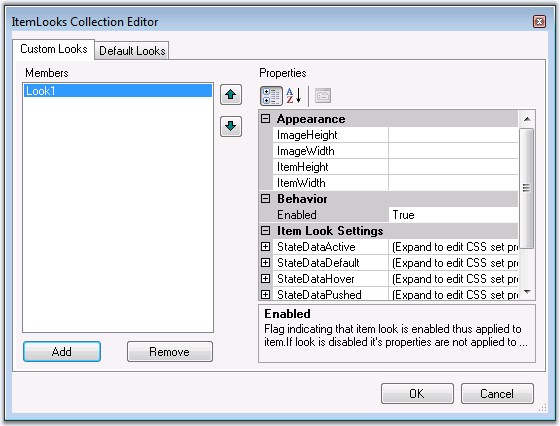{border="0"}

Figure 282

[]{style="FONT-FAMILY: 'Trebuchet MS','sans-serif'; COLOR: #15428b; FONT-SIZE: 9pt"} 

The ItemLook Editor allows you to apply custom looks on individual **ToolbarItem** instances. The css related property values should point to a custom css style defined in a .css file attached to the application.[ ]{style="COLOR: black"}The code below (which will get added to the aspx code when a new ItemLook is created), shows a toolbar\'s ItemLooks collection that contains an ItemLook for the toolbar items in pushed, hover, active and default states. The **StatePushed** styles is applicable only for toggle button types.

[]{style="FONT-FAMILY: 'Trebuchet MS','sans-serif'; COLOR: #15428b; FONT-SIZE: 9pt"} 

+---------------------------------------------------------------------------------------------------------------------------------------------------------------------------------------------------------------------------------------------------------------------------------------------------------------------------------------------------------------------------------------------------------------------------------------+
| [\<]{style="FONT-FAMILY: 'Courier New'; COLOR: blue; FONT-SIZE: 9pt"}[ItemLooks]{style="FONT-FAMILY: 'Courier New'; COLOR: maroon; FONT-SIZE: 9pt"}[\>]{style="FONT-FAMILY: 'Courier New'; COLOR: blue; FONT-SIZE: 9pt"}                                                                                                                                                                                                              |
|                                                                                                                                                                                                                                                                                                                                                                                                                                       |
| [    \<]{style="FONT-FAMILY: 'Courier New'; COLOR: blue; FONT-SIZE: 9pt"}[cc1]{style="FONT-FAMILY: 'Courier New'; COLOR: maroon; FONT-SIZE: 9pt"}[:]{style="FONT-FAMILY: 'Courier New'; COLOR: blue; FONT-SIZE: 9pt"}[ToolBarItemLook]{style="FONT-FAMILY: 'Courier New'; COLOR: maroon; FONT-SIZE: 9pt"}[ [ID]{style="COLOR: red"}[=\"Look1\"\>]{style="COLOR: blue"}]{style="FONT-FAMILY: 'Courier New'; FONT-SIZE: 9pt"}           |
|                                                                                                                                                                                                                                                                                                                                                                                                                                       |
| [        \<]{style="FONT-FAMILY: 'Courier New'; COLOR: blue; FONT-SIZE: 9pt"}[StatePushed]{style="FONT-FAMILY: 'Courier New'; COLOR: maroon; FONT-SIZE: 9pt"}[ [ItemCSSClass]{style="COLOR: red"}[=\"itempushed\"]{style="COLOR: blue"} [TextCSSClass]{style="COLOR: red"}[=\"itemtext\"\>\</]{style="COLOR: blue"}[StatePushed]{style="COLOR: maroon"}[\>]{style="COLOR: blue"}]{style="FONT-FAMILY: 'Courier New'; FONT-SIZE: 9pt"} |
|                                                                                                                                                                                                                                                                                                                                                                                                                                       |
| [        \<]{style="FONT-FAMILY: 'Courier New'; COLOR: blue; FONT-SIZE: 9pt"}[StateHover]{style="FONT-FAMILY: 'Courier New'; COLOR: maroon; FONT-SIZE: 9pt"}[ [ItemCSSClass]{style="COLOR: red"}[=\"itemhover\"]{style="COLOR: blue"} [TextCSSClass]{style="COLOR: red"}[=\"itemtext\"\>\</]{style="COLOR: blue"}[StateHover]{style="COLOR: maroon"}[\>]{style="COLOR: blue"}]{style="FONT-FAMILY: 'Courier New'; FONT-SIZE: 9pt"}    |
|                                                                                                                                                                                                                                                                                                                                                                                                                                       |
| [        \<]{style="FONT-FAMILY: 'Courier New'; COLOR: blue; FONT-SIZE: 9pt"}[StateActive]{style="FONT-FAMILY: 'Courier New'; COLOR: maroon; FONT-SIZE: 9pt"}[ [ItemCSSClass]{style="COLOR: red"}[=\"itemactive\"]{style="COLOR: blue"} [TextCSSClass]{style="COLOR: red"}[=\"itemtext\"\>\</]{style="COLOR: blue"}[StateActive]{style="COLOR: maroon"}[\>]{style="COLOR: blue"}]{style="FONT-FAMILY: 'Courier New'; FONT-SIZE: 9pt"} |
|                                                                                                                                                                                                                                                                                                                                                                                                                                       |
| [        [\<]{style="COLOR: blue"}[StateDefault]{style="COLOR: maroon"} [ItemCSSClass]{style="COLOR: red"}[=\"item\"]{style="COLOR: blue"} [TextCSSClass]{style="COLOR: red"}[=\"itemtext\"\>\</]{style="COLOR: blue"}[StateDefault]{style="COLOR: maroon"}[\>]{style="COLOR: blue"}]{style="FONT-FAMILY: 'Courier New'; FONT-SIZE: 9pt"}                                                                                             |
|                                                                                                                                                                                                                                                                                                                                                                                                                                       |
| [    \</]{style="FONT-FAMILY: 'Courier New'; COLOR: blue; FONT-SIZE: 9pt"}[cc1]{style="FONT-FAMILY: 'Courier New'; COLOR: maroon; FONT-SIZE: 9pt"}[:]{style="FONT-FAMILY: 'Courier New'; COLOR: blue; FONT-SIZE: 9pt"}[ToolBarItemLookItemLook]{style="FONT-FAMILY: 'Courier New'; COLOR: maroon; FONT-SIZE: 9pt"}[\>]{style="FONT-FAMILY: 'Courier New'; COLOR: blue; FONT-SIZE: 9pt"}                                               |
|                                                                                                                                                                                                                                                                                                                                                                                                                                       |
| [\</]{style="FONT-FAMILY: 'Courier New'; COLOR: blue; FONT-SIZE: 9pt"}[ItemLooks]{style="FONT-FAMILY: 'Courier New'; COLOR: maroon; FONT-SIZE: 9pt"}[\>]{style="FONT-FAMILY: 'Courier New'; COLOR: blue; FONT-SIZE: 9pt"}[ ]{style="FONT-FAMILY: 'Courier New'; FONT-SIZE: 9pt"}                                                                                                                                                      |
+---------------------------------------------------------------------------------------------------------------------------------------------------------------------------------------------------------------------------------------------------------------------------------------------------------------------------------------------------------------------------------------------------------------------------------------+

[]{style="FONT-FAMILY: 'Trebuchet MS','sans-serif'; COLOR: #15428b; FONT-SIZE: 9pt"} 

The following code snippet illustrates adding css styles through code.

[]{style="FONT-FAMILY: 'Trebuchet MS','sans-serif'; COLOR: #15428b; FONT-SIZE: 9pt"} 

+--------------------------------------------------------------------------------------------------------------------------------------+
| **[\[C#\]]{style="FONT-FAMILY: 'Courier New'; FONT-SIZE: 9pt"}**                                                                     |
|                                                                                                                                      |
| **[]{style="FONT-FAMILY: 'Courier New'; FONT-SIZE: 9pt"}**                                                                           |
|                                                                                                                                      |
| [ToolBarItemLook lookcommon = [new]{style="COLOR: blue"} ToolBarItemLook();]{style="FONT-FAMILY: 'Courier New'; FONT-SIZE: 9pt"}     |
|                                                                                                                                      |
| [lookcommon.ID =[\"lookcommon\"]{style="COLOR: maroon"};]{style="FONT-FAMILY: 'Courier New'; FONT-SIZE: 9pt"}                        |
|                                                                                                                                      |
| [        ]{style="FONT-FAMILY: 'Courier New'; FONT-SIZE: 9pt"}                                                                       |
|                                                                                                                                      |
| [lookcommon.StateActive.ItemCSSClass = [\"itemactive\"]{style="COLOR: maroon"};]{style="FONT-FAMILY: 'Courier New'; FONT-SIZE: 9pt"} |
|                                                                                                                                      |
| [lookcommon.StateActive.TextCSSClass = [\"itemtext\"]{style="COLOR: maroon"};]{style="FONT-FAMILY: 'Courier New'; FONT-SIZE: 9pt"}   |
|                                                                                                                                      |
| [        ]{style="FONT-FAMILY: 'Courier New'; FONT-SIZE: 9pt"}                                                                       |
|                                                                                                                                      |
| [lookcommon.StateDefault.ItemCSSClass = [\"item\"]{style="COLOR: maroon"};]{style="FONT-FAMILY: 'Courier New'; FONT-SIZE: 9pt"}      |
|                                                                                                                                      |
| [lookcommon.StateDefault.TextCSSClass = [\"itemtext\"]{style="COLOR: maroon"};]{style="FONT-FAMILY: 'Courier New'; FONT-SIZE: 9pt"}  |
|                                                                                                                                      |
| [        ]{style="FONT-FAMILY: 'Courier New'; FONT-SIZE: 9pt"}                                                                       |
|                                                                                                                                      |
| [lookcommon.StateHover.ItemCSSClass = [\"itemhover\"]{style="COLOR: maroon"};]{style="FONT-FAMILY: 'Courier New'; FONT-SIZE: 9pt"}   |
|                                                                                                                                      |
| [lookcommon.StateHover.TextCSSClass = [\"itemtext\"]{style="COLOR: maroon"};]{style="FONT-FAMILY: 'Courier New'; FONT-SIZE: 9pt"}    |
|                                                                                                                                      |
| [                        ]{style="FONT-FAMILY: 'Courier New'; FONT-SIZE: 9pt"}                                                       |
|                                                                                                                                      |
| [lookcommon.StatePushed.ItemCSSClass= [\"itempushed\"]{style="COLOR: maroon"};]{style="FONT-FAMILY: 'Courier New'; FONT-SIZE: 9pt"}  |
|                                                                                                                                      |
| [lookcommon.StatePushed.TextCSSClass = [\"itemtext\"]{style="COLOR: maroon"};]{style="FONT-FAMILY: 'Courier New'; FONT-SIZE: 9pt"}   |
|                                                                                                                                      |
| []{style="FONT-FAMILY: 'Courier New'; FONT-SIZE: 9pt"}                                                                               |
|                                                                                                                                      |
| [ToolBar1.ItemLooks.Add(lookcommon);]{style="FONT-FAMILY: 'Courier New'; FONT-SIZE: 9pt"}                                            |
+--------------------------------------------------------------------------------------------------------------------------------------+

[]{style="FONT-FAMILY: 'Trebuchet MS','sans-serif'; COLOR: #15428b; FONT-SIZE: 9pt"} 

+--------------------------------------------------------------------------------------------------------------------+
| **[\[VB\]]{style="FONT-FAMILY: 'Courier New'; FONT-SIZE: 9pt"}**                                                   |
|                                                                                                                    |
| **[]{style="FONT-FAMILY: 'Courier New'; FONT-SIZE: 9pt"}**                                                         |
|                                                                                                                    |
| [Private ToolBarItemLook As ItemLooks]{style="FONT-FAMILY: 'Courier New'; FONT-SIZE: 9pt"}                         |
|                                                                                                                    |
| [Private lookcommon.ID =\"lookcommon\"]{style="FONT-FAMILY: 'Courier New'; FONT-SIZE: 9pt"}                        |
|                                                                                                                    |
| []{style="FONT-FAMILY: 'Courier New'; FONT-SIZE: 9pt"}                                                             |
|                                                                                                                    |
| [Private lookcommon.StateActive.ItemCSSClass = \"itemactive\"]{style="FONT-FAMILY: 'Courier New'; FONT-SIZE: 9pt"} |
|                                                                                                                    |
| [Private lookcommon.StateActive.TextCSSClass = \"itemtext\"]{style="FONT-FAMILY: 'Courier New'; FONT-SIZE: 9pt"}   |
|                                                                                                                    |
| []{style="FONT-FAMILY: 'Courier New'; FONT-SIZE: 9pt"}                                                             |
|                                                                                                                    |
| [Private lookcommon.StateDefault.ItemCSSClass = \"item\"]{style="FONT-FAMILY: 'Courier New'; FONT-SIZE: 9pt"}      |
|                                                                                                                    |
| [Private lookcommon.StateDefault.TextCSSClass = \"itemtext\"]{style="FONT-FAMILY: 'Courier New'; FONT-SIZE: 9pt"}  |
|                                                                                                                    |
| []{style="FONT-FAMILY: 'Courier New'; FONT-SIZE: 9pt"}                                                             |
|                                                                                                                    |
| [Private lookcommon.StateHover.ItemCSSClass = \"itemhover\"]{style="FONT-FAMILY: 'Courier New'; FONT-SIZE: 9pt"}   |
|                                                                                                                    |
| [Private lookcommon.StateHover.TextCSSClass = \"itemtext\"]{style="FONT-FAMILY: 'Courier New'; FONT-SIZE: 9pt"}    |
|                                                                                                                    |
| []{style="FONT-FAMILY: 'Courier New'; FONT-SIZE: 9pt"}                                                             |
|                                                                                                                    |
| [Private lookcommon.StatePushed.ItemCSSClass= \"itempushed\"]{style="FONT-FAMILY: 'Courier New'; FONT-SIZE: 9pt"}  |
|                                                                                                                    |
| [Private lookcommon.StatePushed.TextCSSClass = \"itemtext\"]{style="FONT-FAMILY: 'Courier New'; FONT-SIZE: 9pt"}   |
|                                                                                                                    |
| []{style="FONT-FAMILY: 'Courier New'; FONT-SIZE: 9pt"}                                                             |
|                                                                                                                    |
| [ToolBar1.ItemLooks.Add(lookcommon)]{style="FONT-FAMILY: 'Courier New'; FONT-SIZE: 9pt"}                           |
+--------------------------------------------------------------------------------------------------------------------+

[]{style="FONT-FAMILY: 'Trebuchet MS','sans-serif'; COLOR: #15428b; FONT-SIZE: 9pt"} 

See Also

[]{style="FONT-FAMILY: 'Trebuchet MS','sans-serif'; COLOR: #15428b; FONT-SIZE: 9pt"} 

[[ItemLook Properties]{.UGHyperlink}]()[, ]{.UGHyperlink}[[Default Looks]{.UGHyperlink}]()[, ]{.UGHyperlink}[CSS Styles]{.UGHyperlink}[]{.UGHyperlink}

 

###### []{#_CSS_Styles_4}5.4.2.2.11.3        CSS Styles {#css-styles style="tab-stops: 0pt"}

[]{style="FONT-FAMILY: 'Trebuchet MS','sans-serif'; COLOR: #15428b; FONT-SIZE: 9pt"} 

The ToolBar control comprises of distinct segments for which CSS style definitions can be set. The default styles of the layered toolbar structure can be replaced with custom style settings by applying the CSS class names to the corresponding style properties.

[]{style="FONT-FAMILY: 'Trebuchet MS','sans-serif'; COLOR: #15428b; FONT-SIZE: 9pt"} 

Structure of ToolBar control

[]{style="FONT-FAMILY: 'Trebuchet MS','sans-serif'; COLOR: #15428b; FONT-SIZE: 9pt"} 

The toolbar structure consists of 3 panel-level and 1 item-level segments as shown below.

[]{style="FONT-FAMILY: 'Trebuchet MS','sans-serif'; COLOR: #15428b; FONT-SIZE: 9pt"} 

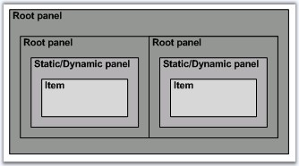{border="0"}

[]{style="FONT-FAMILY: 'Trebuchet MS','sans-serif'; COLOR: #15428b; FONT-SIZE: 9pt"} 

Figure 283: Structure of ToolBar control

[]{style="FONT-FAMILY: 'Trebuchet MS','sans-serif'; COLOR: #15428b; FONT-SIZE: 9pt"} 

The below table lists the panel-level segments and their corresponding CSS properties whose settings affect their styles.

[]{style="FONT-FAMILY: 'Trebuchet MS','sans-serif'; COLOR: #15428b; FONT-SIZE: 9pt"} 

::: {align="center"}
  ---------------------- -------------------------- --------------------------------
  Element                Property                   Default Value (CSS Class Name)
  Root panel             ControlRootCSSClass        toolbarRoot
  Static/Dynamic panel   ControlRootTableCSSClass   toolbarRootTable
  ---------------------- -------------------------- --------------------------------
:::

[]{style="FONT-FAMILY: 'Trebuchet MS','sans-serif'; COLOR: #15428b; FONT-SIZE: 9pt"} 

Customizing ToolBar Root-level segments

[]{style="FONT-FAMILY: 'Trebuchet MS','sans-serif'; COLOR: #15428b; FONT-SIZE: 9pt"} 

To customize the look and feel of one of the above segments, simply create a custom CSS style and associate it with the CSS property corresponding to that segment.

[]{style="FONT-FAMILY: 'Trebuchet MS','sans-serif'; COLOR: #15428b; FONT-SIZE: 9pt"} 

{border="0"}

[]{style="FONT-FAMILY: 'Trebuchet MS','sans-serif'; COLOR: #15428b; FONT-SIZE: 9pt"} 

Figure 284: ToolBar with css settings for the root elements

[]{style="FONT-FAMILY: 'Trebuchet MS','sans-serif'; COLOR: #15428b; FONT-SIZE: 9pt"} 

The CSS properties set to the custom CSS values and the style definitions are shown below.

[]{style="FONT-FAMILY: 'Trebuchet MS','sans-serif'; COLOR: #15428b; FONT-SIZE: 9pt"} 

::: {align="center"}
  -------------------------- -------------------------------
  Property                   Value (Custom CSS Class Name)
  ControlRootCSSClass        RootCSS
  ControlRootTableCSSClass   RootTableCSS
  -------------------------- -------------------------------
:::

[]{style="FONT-FAMILY: 'Trebuchet MS','sans-serif'; COLOR: #15428b; FONT-SIZE: 9pt"} 

+-------------------------------------------------------------------------------------------------------------------------------------------------------------------------------------+
| **[\[Css Styles\]]{style="FONT-FAMILY: 'Courier New'; COLOR: black; FONT-SIZE: 9pt"}**                                                                                              |
|                                                                                                                                                                                     |
| []{style="FONT-FAMILY: 'Courier New'; COLOR: maroon; FONT-SIZE: 9pt"}                                                                                                               |
|                                                                                                                                                                                     |
| [.RootCSS]{style="FONT-FAMILY: 'Courier New'; COLOR: maroon; FONT-SIZE: 9pt"}                                                                                                       |
|                                                                                                                                                                                     |
| [{]{style="FONT-FAMILY: 'Courier New'; FONT-SIZE: 9pt"}                                                                                                                             |
|                                                                                                                                                                                     |
| [        [background-color]{style="COLOR: red"}:[#dadae2]{style="COLOR: blue"} ;]{style="FONT-FAMILY: 'Courier New'; FONT-SIZE: 9pt"}                                               |
|                                                                                                                                                                                     |
| [        [padding]{style="COLOR: red"} :[10px]{style="COLOR: blue"}; ]{style="FONT-FAMILY: 'Courier New'; FONT-SIZE: 9pt"}                                                          |
|                                                                                                                                                                                     |
| [        [border]{style="COLOR: red"}:[1px]{style="COLOR: blue"} [solid]{style="COLOR: blue"} [#757d95]{style="COLOR: blue"}; ]{style="FONT-FAMILY: 'Courier New'; FONT-SIZE: 9pt"} |
|                                                                                                                                                                                     |
| [        [width]{style="COLOR: red"}:[100px]{style="COLOR: blue"}; ]{style="FONT-FAMILY: 'Courier New'; FONT-SIZE: 9pt"}                                                            |
|                                                                                                                                                                                     |
| [}]{style="FONT-FAMILY: 'Courier New'; FONT-SIZE: 9pt"}                                                                                                                             |
|                                                                                                                                                                                     |
| [.RootTableCSS]{style="FONT-FAMILY: 'Courier New'; COLOR: maroon; FONT-SIZE: 9pt"}                                                                                                  |
|                                                                                                                                                                                     |
| [{]{style="FONT-FAMILY: 'Courier New'; FONT-SIZE: 9pt"}                                                                                                                             |
|                                                                                                                                                                                     |
| [        [background-color]{style="COLOR: red"}:[#757d95]{style="COLOR: blue"}  ;]{style="FONT-FAMILY: 'Courier New'; FONT-SIZE: 9pt"}                                              |
|                                                                                                                                                                                     |
| [        [padding]{style="COLOR: red"}:[10px]{style="COLOR: blue"};  ]{style="FONT-FAMILY: 'Courier New'; FONT-SIZE: 9pt"}                                                          |
|                                                                                                                                                                                     |
| [}]{style="FONT-FAMILY: 'Courier New'; FONT-SIZE: 9pt"}                                                                                                                             |
+-------------------------------------------------------------------------------------------------------------------------------------------------------------------------------------+

[]{style="FONT-FAMILY: 'Trebuchet MS','sans-serif'; COLOR: #15428b; FONT-SIZE: 9pt"} 

Structure of the ToolBar Item

[]{style="FONT-FAMILY: 'Trebuchet MS','sans-serif'; COLOR: #15428b; FONT-SIZE: 9pt"} 

A single toolbar item is segregated into different image and text sections, the look for all of which can again be controlled through their corresponding css-property settings. An item consists of a text and optionally an image that could be placed either to the left or to the right.

[]{style="FONT-FAMILY: 'Trebuchet MS','sans-serif'; COLOR: #15428b; FONT-SIZE: 9pt"} 

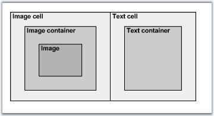{border="0"}

[]{style="FONT-FAMILY: 'Trebuchet MS','sans-serif'; COLOR: #15428b; FONT-SIZE: 9pt"} 

Figure 285: Structure of a ToolBar Item

[]{style="FONT-FAMILY: 'Trebuchet MS','sans-serif'; COLOR: #15428b; FONT-SIZE: 9pt"} 

The below table lists the item-level segments and their corresponding CSS properties whose settings affect their styles.

[]{style="FONT-FAMILY: 'Trebuchet MS','sans-serif'; COLOR: #15428b; FONT-SIZE: 9pt"} 

::: {align="center"}
  ----------------- ------------------------ --------------------------------
  Element           Property                 Default Value (CSS Class Name)
  Image cell        ImageCellCSSClass        toolbarImageCell
  Image Container   ImageContainerCSSClass   toolbarImageContainer
  Image             ImageCSSClass            toolbarImage
  Item              ItemCSSClass             toolbarItemActive
  Text cell         TextCellCssClass         toolbarTextCell
  Text container    TextCssClass             toolbarContainerText
  ----------------- ------------------------ --------------------------------
:::

[]{style="FONT-FAMILY: 'Trebuchet MS','sans-serif'; COLOR: black"} 

Customizing ToolBar Item-level segments

[]{style="FONT-FAMILY: 'Trebuchet MS','sans-serif'; COLOR: #15428b; FONT-SIZE: 9pt"} 

The following section shows some custom styles applied on the different item-level segments and a screenshot of the resulting look.

[]{style="FONT-FAMILY: 'Trebuchet MS','sans-serif'; COLOR: #15428b; FONT-SIZE: 9pt"} 

::: {align="center"}
+---------------------------------------------------------------------+------------------------+------------------+-----------------------------------------------------------------------------------------------------------------------+
| Image                                                               | Property               | Custom CSS Style | CSS Definition                                                                                                        |
+---------------------------------------------------------------------+------------------------+------------------+-----------------------------------------------------------------------------------------------------------------------+
| 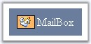{border="0"}                          | ItemCSSClass           | Def_ItemCSS      | .Def_ItemCSS                                                                                                          |
|                                                                     |                        |                  |                                                                                                                       |
| []{style="FONT-FAMILY: 'Trebuchet MS','sans-serif'; COLOR: black"}  |                        |                  | {                                                                                                                     |
|                                                                     |                        |                  |                                                                                                                       |
| ToolBar with style settings for image                               |                        |                  |   [background-color]{style="COLOR: red"}:[#7a87a1]{style="COLOR: blue"}  ;                                            |
|                                                                     |                        |                  |                                                                                                                       |
|                                                                     |                        |                  |   [padding]{style="COLOR: red"}:[10px]{style="COLOR: blue"};                                                          |
|                                                                     |                        |                  |                                                                                                                       |
|                                                                     |                        |                  | }                                                                                                                     |
|                                                                     |                        |                  |                                                                                                                       |
|                                                                     |                        |                  | .Def_ImgCellCSS                                                                                                       |
|                                                                     |                        |                  |                                                                                                                       |
|                                                                     |                        |                  | {                                                                                                                     |
|                                                                     |                        |                  |                                                                                                                       |
|                                                                     |                        |                  |   [background-color]{style="COLOR: red"}: [#ffbb6f]{style="COLOR: blue"};                                             |
|                                                                     |                        |                  |                                                                                                                       |
|                                                                     |                        |                  |   [border]{style="COLOR: red"}:[1px]{style="COLOR: blue"} [solid]{style="COLOR: blue"} [black]{style="COLOR: blue"};  |
|                                                                     |                        |                  |                                                                                                                       |
|                                                                     |                        |                  | }                                                                                                                     |
|                                                                     |                        |                  |                                                                                                                       |
|                                                                     |                        |                  | .Def_ImgContCSS                                                                                                       |
|                                                                     |                        |                  |                                                                                                                       |
|                                                                     |                        |                  | {                                                                                                                     |
|                                                                     |                        |                  |                                                                                                                       |
|                                                                     |                        |                  |   [padding-right]{style="COLOR: red"}:[5px]{style="COLOR: blue"};                                                     |
|                                                                     |                        |                  |                                                                                                                       |
|                                                                     |                        |                  |   [padding-left]{style="COLOR: red"}:[3px]{style="COLOR: blue"};                                                      |
|                                                                     |                        |                  |                                                                                                                       |
|                                                                     |                        |                  | }                                                                                                                     |
|                                                                     |                        |                  |                                                                                                                       |
|                                                                     |                        |                  | .Def_ImgCSS                                                                                                           |
|                                                                     |                        |                  |                                                                                                                       |
|                                                                     |                        |                  | {                                                                                                                     |
|                                                                     |                        |                  |                                                                                                                       |
|                                                                     |                        |                  |   [height]{style="COLOR: red"} :[15px]{style="COLOR: blue"};                                                          |
|                                                                     |                        |                  |                                                                                                                       |
|                                                                     |                        |                  |   [width]{style="COLOR: red"} :[16px]{style="COLOR: blue"};                                                           |
|                                                                     |                        |                  |                                                                                                                       |
|                                                                     |                        |                  | }                                                                                                                     |
|                                                                     +------------------------+------------------+                                                                                                                       |
|                                                                     | ImageCellCSSClass      | ImgCellCSS       |                                                                                                                       |
|                                                                     +------------------------+------------------+                                                                                                                       |
|                                                                     | ImageContainerCSSClass | ImgContCSS       |                                                                                                                       |
|                                                                     +------------------------+------------------+                                                                                                                       |
|                                                                     | ImageCSSClass          | ImgCSS           |                                                                                                                       |
+---------------------------------------------------------------------+------------------------+------------------+-----------------------------------------------------------------------------------------------------------------------+
| {border="0"}                          | TextCellCssClass       | Def_TextCellCSS  | .Def_TextCellCSS                                                                                                      |
|                                                                     |                        |                  |                                                                                                                       |
| []{style="FONT-FAMILY: 'Trebuchet MS','sans-serif'; COLOR: black"}  |                        |                  | {                                                                                                                     |
|                                                                     |                        |                  |                                                                                                                       |
| ToolBar with style settings for text                                |                        |                  |    [background-color]{style="COLOR: red"}: [#aebace]{style="COLOR: blue"};                                            |
|                                                                     |                        |                  |                                                                                                                       |
|                                                                     |                        |                  |    [padding]{style="COLOR: red"}:[5px]{style="COLOR: blue"};                                                          |
|                                                                     |                        |                  |                                                                                                                       |
|                                                                     |                        |                  | }                                                                                                                     |
|                                                                     |                        |                  |                                                                                                                       |
|                                                                     |                        |                  | .Def_TextCSS                                                                                                          |
|                                                                     |                        |                  |                                                                                                                       |
|                                                                     |                        |                  | {                                                                                                                     |
|                                                                     |                        |                  |                                                                                                                       |
|                                                                     |                        |                  |   [color]{style="COLOR: red"} :[White]{style="COLOR: blue"} ;                                                         |
|                                                                     |                        |                  |                                                                                                                       |
|                                                                     |                        |                  |   [padding-left]{style="COLOR: red"}:[8px]{style="COLOR: blue"};                                                      |
|                                                                     |                        |                  |                                                                                                                       |
|                                                                     |                        |                  |   [padding-right]{style="COLOR: red"}:[8px]{style="COLOR: blue"};                                                     |
|                                                                     |                        |                  |                                                                                                                       |
|                                                                     |                        |                  | }                                                                                                                     |
|                                                                     +------------------------+------------------+                                                                                                                       |
|                                                                     | TextContainerCssClass  | Def_TextContCSS  |                                                                                                                       |
+---------------------------------------------------------------------+------------------------+------------------+-----------------------------------------------------------------------------------------------------------------------+
:::

[]{style="FONT-FAMILY: 'Trebuchet MS','sans-serif'; COLOR: #15428b; FONT-SIZE: 9pt"} 

The structure of the item will be altered according to the text and the image position. The image and the text position can be controlled by setting the **TextPosition** property. The below table shows the image, on setting the various options of the TextPosition property.

[]{style="FONT-FAMILY: 'Trebuchet MS','sans-serif'; COLOR: #15428b; FONT-SIZE: 9pt"} 

::: {align="center"}
  --------------------- --------------------------------------------
  Text Position Value   Image
  ImageLeftTextRight    {border="0"}
  TextLeftImageRight    {border="0"}
  ImageOverText         {border="0"}
  TextOverImage         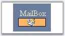{border="0"}
  --------------------- --------------------------------------------
:::

[]{style="FONT-FAMILY: 'Trebuchet MS','sans-serif'; COLOR: #15428b; FONT-SIZE: 9pt"} 

See Also

[]{style="FONT-FAMILY: 'Trebuchet MS','sans-serif'; COLOR: #15428b; FONT-SIZE: 9pt"} 

[[ItemLook Properties]{.UGHyperlink}]()[]{.UGHyperlink}

 

###### 5.4.2.2.11.4        ClientSideObjectModel {#clientsideobjectmodel style="tab-stops: 0pt"}

[]{style="FONT-FAMILY: 'Trebuchet MS','sans-serif'; COLOR: #15428b; FONT-SIZE: 9pt"} 

::: {align="center"}
+-----------------------+---------------------------+----------------------------------------------------------------------------------------------------------------------------------------------------------------------------------------------------------------------+
| Method                | Parameter                 | Description                                                                                                                                                                                                          |
+-----------------------+---------------------------+----------------------------------------------------------------------------------------------------------------------------------------------------------------------------------------------------------------------+
| Refresh               | string                    | For .NET Framework version 2.0 only. Sends callback to server without page refreshing and triggers CallbackRefresh server side ToolBar event. To perform callback the EnableCallbacks property must be set to True . |
+-----------------------+---------------------------+----------------------------------------------------------------------------------------------------------------------------------------------------------------------------------------------------------------------+
| SetHorizontalLayout   | bool                      | Sets horizontal/vertical layout for ToolBar control.                                                                                                                                                                 |
+-----------------------+---------------------------+----------------------------------------------------------------------------------------------------------------------------------------------------------------------------------------------------------------------+
| GetCaptionText        | [-]{style="COLOR: black"} | Gets toolbar name.                                                                                                                                                                                                   |
+-----------------------+---------------------------+----------------------------------------------------------------------------------------------------------------------------------------------------------------------------------------------------------------------+
| SetCaptionText        | string                    | Sets toolbar name.                                                                                                                                                                                                   |
+-----------------------+---------------------------+----------------------------------------------------------------------------------------------------------------------------------------------------------------------------------------------------------------------+
| IsLocked              | [-]{style="COLOR: black"} | Specifies whether drag image is locked.                                                                                                                                                                              |
+-----------------------+---------------------------+----------------------------------------------------------------------------------------------------------------------------------------------------------------------------------------------------------------------+
| SetLocked             | bool                      | Sets drag image locking.                                                                                                                                                                                             |
+-----------------------+---------------------------+----------------------------------------------------------------------------------------------------------------------------------------------------------------------------------------------------------------------+
| IsFloating            |                           | Gets floating flag.                                                                                                                                                                                                  |
+-----------------------+---------------------------+----------------------------------------------------------------------------------------------------------------------------------------------------------------------------------------------------------------------+
| SetFloating           | bool                      | Sets floating flag.                                                                                                                                                                                                  |
+-----------------------+---------------------------+----------------------------------------------------------------------------------------------------------------------------------------------------------------------------------------------------------------------+
| SetDisabled           | obj, bool                 | Sets enable/disable item.                                                                                                                                                                                            |
|                       |                           |                                                                                                                                                                                                                      |
|                       |                           | First parameter is identifier of HTML-element, index of item array or item object.                                                                                                                                   |
|                       |                           |                                                                                                                                                                                                                      |
|                       |                           | If second parameter is false then item will be  undisabled.                                                                                                                                                          |
+-----------------------+---------------------------+----------------------------------------------------------------------------------------------------------------------------------------------------------------------------------------------------------------------+
| Push                  | obj, oEv, bool            | Sets item into pushing state.                                                                                                                                                                                        |
|                       |                           |                                                                                                                                                                                                                      |
|                       |                           | First parameter is identifier of HTML-element, index of item array or item object.                                                                                                                                   |
|                       |                           |                                                                                                                                                                                                                      |
|                       |                           | Second parameter represents event.                                                                                                                                                                                   |
|                       |                           |                                                                                                                                                                                                                      |
|                       |                           | If third parameter is true then ClientSideOnItemSelect will be called.                                                                                                                                               |
+-----------------------+---------------------------+----------------------------------------------------------------------------------------------------------------------------------------------------------------------------------------------------------------------+
| UnPush                | obj, oEv, bool            | Sets item into unpushing state.                                                                                                                                                                                      |
|                       |                           |                                                                                                                                                                                                                      |
|                       |                           | First parameter is identifier of HTML-element, index of item array or item object.                                                                                                                                   |
|                       |                           |                                                                                                                                                                                                                      |
|                       |                           | Second parameter represents event.                                                                                                                                                                                   |
|                       |                           |                                                                                                                                                                                                                      |
|                       |                           | If third parameter is true then ClientSideOnItemSelect will be called.                                                                                                                                               |
+-----------------------+---------------------------+----------------------------------------------------------------------------------------------------------------------------------------------------------------------------------------------------------------------+
:::

[]{style="FONT-FAMILY: 'Trebuchet MS','sans-serif'; COLOR: #15428b; FONT-SIZE: 9pt"} 

[]{style="FONT-FAMILY: 'Trebuchet MS','sans-serif'; COLOR: #15428b; FONT-SIZE: 9pt"} 

The following sample show how to use this methods.

[]{style="FONT-FAMILY: 'Trebuchet MS','sans-serif'; COLOR: #15428b; FONT-SIZE: 9pt"} 

+---------------------------------------------------------------------------------------------------------------------------------------------------------------------------------------------------------------------------------------------------------------------------------------------------------------------------------------------------------------------------------------------------------------------------------------------------------------------------------------------------------------------------------------------------------------------------------------------------------------------------------------------------------------+
| **[\[ASPX\]]{style="FONT-FAMILY: 'Courier New'; COLOR: black; FONT-SIZE: 9pt"}**                                                                                                                                                                                                                                                                                                                                                                                                                                                                                                                                                                              |
|                                                                                                                                                                                                                                                                                                                                                                                                                                                                                                                                                                                                                                                               |
| []{style="FONT-FAMILY: 'Courier New'; COLOR: maroon; FONT-SIZE: 9pt"}                                                                                                                                                                                                                                                                                                                                                                                                                                                                                                                                                                                         |
|                                                                                                                                                                                                                                                                                                                                                                                                                                                                                                                                                                                                                                                               |
| [\<]{style="FONT-FAMILY: 'Times New Roman','serif'; COLOR: blue"}[asp]{style="FONT-FAMILY: 'Courier New'; COLOR: maroon; FONT-SIZE: 9pt"}[:]{style="FONT-FAMILY: 'Courier New'; COLOR: blue; FONT-SIZE: 9pt"}[CheckBox]{style="FONT-FAMILY: 'Courier New'; COLOR: maroon; FONT-SIZE: 9pt"}[ [onclick]{style="COLOR: red"}[=\"DisableItem1(this.checked)\"]{style="COLOR: blue"} [Text]{style="COLOR: red"}[=\"Disable \'Item1\'\"]{style="COLOR: blue"} [runat]{style="COLOR: red"}[=\"server\"]{style="COLOR: blue"} [/\>\<]{style="COLOR: blue"}[br]{style="COLOR: maroon"} [/\>]{style="COLOR: blue"}]{style="FONT-FAMILY: 'Courier New'; FONT-SIZE: 9pt"} |
|                                                                                                                                                                                                                                                                                                                                                                                                                                                                                                                                                                                                                                                               |
| [\<]{style="FONT-FAMILY: 'Courier New'; COLOR: blue; FONT-SIZE: 9pt"}[asp]{style="FONT-FAMILY: 'Courier New'; COLOR: maroon; FONT-SIZE: 9pt"}[:]{style="FONT-FAMILY: 'Courier New'; COLOR: blue; FONT-SIZE: 9pt"}[CheckBox]{style="FONT-FAMILY: 'Courier New'; COLOR: maroon; FONT-SIZE: 9pt"}[ [onclick]{style="COLOR: red"}[=\"PushItem2(this.checked)\"]{style="COLOR: blue"} [Text]{style="COLOR: red"}[=\"Push \'Item2\'\"]{style="COLOR: blue"} [runat]{style="COLOR: red"}[=\"server\"/\>\<]{style="COLOR: blue"}[br]{style="COLOR: maroon"} [/\>]{style="COLOR: blue"}]{style="FONT-FAMILY: 'Courier New'; FONT-SIZE: 9pt"}                           |
|                                                                                                                                                                                                                                                                                                                                                                                                                                                                                                                                                                                                                                                               |
| [\<]{style="FONT-FAMILY: 'Courier New'; COLOR: blue; FONT-SIZE: 9pt"}[asp]{style="FONT-FAMILY: 'Courier New'; COLOR: maroon; FONT-SIZE: 9pt"}[:]{style="FONT-FAMILY: 'Courier New'; COLOR: blue; FONT-SIZE: 9pt"}[CheckBox]{style="FONT-FAMILY: 'Courier New'; COLOR: maroon; FONT-SIZE: 9pt"}[ [onclick]{style="COLOR: red"}[=\"FloatToolBar(this.checked)\"]{style="COLOR: blue"} [Text]{style="COLOR: red"}[=\"Float ToolBar\"]{style="COLOR: blue"} [runat]{style="COLOR: red"}[=\"server\"/\>]{style="COLOR: blue"} [\<]{style="COLOR: blue"}[br]{style="COLOR: maroon"} [/\>]{style="COLOR: blue"}]{style="FONT-FAMILY: 'Courier New'; FONT-SIZE: 9pt"} |
|                                                                                                                                                                                                                                                                                                                                                                                                                                                                                                                                                                                                                                                               |
| [\<]{style="FONT-FAMILY: 'Courier New'; COLOR: blue; FONT-SIZE: 9pt"}[cc1]{style="FONT-FAMILY: 'Courier New'; COLOR: maroon; FONT-SIZE: 9pt"}[:]{style="FONT-FAMILY: 'Courier New'; COLOR: blue; FONT-SIZE: 9pt"}[ToolBar]{style="FONT-FAMILY: 'Courier New'; COLOR: maroon; FONT-SIZE: 9pt"}[ [ID]{style="COLOR: red"}[=\"ToolBar1\"]{style="COLOR: blue"} [ClientObjectId]{style="COLOR: red"}[=\"\_sfToolBar1\"]{style="COLOR: blue"} [runat]{style="COLOR: red"}[=\"server\"]{style="COLOR: blue"} [ClientSideOnItemSelect]{style="COLOR: red"}[=\"OnItemSelect(this)\"]{style="COLOR: blue"}]{style="FONT-FAMILY: 'Courier New'; FONT-SIZE: 9pt"}        |
|                                                                                                                                                                                                                                                                                                                                                                                                                                                                                                                                                                                                                                                               |
| [    [AutoFormat]{style="COLOR: red"}[=\"Windows Classic\"]{style="COLOR: blue"} [Caption]{style="COLOR: red"}[=\"ToolBar\"\>]{style="COLOR: blue"}]{style="FONT-FAMILY: 'Courier New'; FONT-SIZE: 9pt"}                                                                                                                                                                                                                                                                                                                                                                                                                                                      |
|                                                                                                                                                                                                                                                                                                                                                                                                                                                                                                                                                                                                                                                               |
| [    [\<]{style="COLOR: blue"}[Items]{style="COLOR: maroon"}[\>]{style="COLOR: blue"}]{style="FONT-FAMILY: 'Courier New'; FONT-SIZE: 9pt"}                                                                                                                                                                                                                                                                                                                                                                                                                                                                                                                    |
|                                                                                                                                                                                                                                                                                                                                                                                                                                                                                                                                                                                                                                                               |
| [        [\<]{style="COLOR: blue"}[cc1]{style="COLOR: maroon"}[:]{style="COLOR: blue"}[ToolBarItem]{style="COLOR: maroon"} [Text]{style="COLOR: red"}[=\"Item0\"]{style="COLOR: blue"} [/\>]{style="COLOR: blue"}]{style="FONT-FAMILY: 'Courier New'; FONT-SIZE: 9pt"}                                                                                                                                                                                                                                                                                                                                                                                        |
|                                                                                                                                                                                                                                                                                                                                                                                                                                                                                                                                                                                                                                                               |
| [        [\<]{style="COLOR: blue"}[cc1]{style="COLOR: maroon"}[:]{style="COLOR: blue"}[ToolBarItem]{style="COLOR: maroon"} [Text]{style="COLOR: red"}[=\"Item1\"]{style="COLOR: blue"} [/\>]{style="COLOR: blue"}]{style="FONT-FAMILY: 'Courier New'; FONT-SIZE: 9pt"}                                                                                                                                                                                                                                                                                                                                                                                        |
|                                                                                                                                                                                                                                                                                                                                                                                                                                                                                                                                                                                                                                                               |
| [        [\<]{style="COLOR: blue"}[cc1]{style="COLOR: maroon"}[:]{style="COLOR: blue"}[ToolBarItem]{style="COLOR: maroon"} [Text]{style="COLOR: red"}[=\"Item2\"]{style="COLOR: blue"} [/\>]{style="COLOR: blue"}]{style="FONT-FAMILY: 'Courier New'; FONT-SIZE: 9pt"}                                                                                                                                                                                                                                                                                                                                                                                        |
|                                                                                                                                                                                                                                                                                                                                                                                                                                                                                                                                                                                                                                                               |
| [        [\<]{style="COLOR: blue"}[cc1]{style="COLOR: maroon"}[:]{style="COLOR: blue"}[ToolBarItem]{style="COLOR: maroon"} [ButtonType]{style="COLOR: red"}[=\"Toggle\"]{style="COLOR: blue"} [Text]{style="COLOR: red"}[=\"Item3\"]{style="COLOR: blue"} [/\>]{style="COLOR: blue"}                ]{style="FONT-FAMILY: 'Courier New'; FONT-SIZE: 9pt"}                                                                                                                                                                                                                                                                                                     |
|                                                                                                                                                                                                                                                                                                                                                                                                                                                                                                                                                                                                                                                               |
| [    [\</]{style="COLOR: blue"}[Items]{style="COLOR: maroon"}[\>]{style="COLOR: blue"}]{style="FONT-FAMILY: 'Courier New'; FONT-SIZE: 9pt"}                                                                                                                                                                                                                                                                                                                                                                                                                                                                                                                   |
|                                                                                                                                                                                                                                                                                                                                                                                                                                                                                                                                                                                                                                                               |
| [\</]{style="FONT-FAMILY: 'Courier New'; COLOR: blue; FONT-SIZE: 9pt"}[cc1]{style="FONT-FAMILY: 'Courier New'; COLOR: maroon; FONT-SIZE: 9pt"}[:]{style="FONT-FAMILY: 'Courier New'; COLOR: blue; FONT-SIZE: 9pt"}[ToolBar]{style="FONT-FAMILY: 'Courier New'; COLOR: maroon; FONT-SIZE: 9pt"}[\>]{style="FONT-FAMILY: 'Courier New'; COLOR: blue; FONT-SIZE: 9pt"}                                                                                                                                                                                                                                                                                           |
|                                                                                                                                                                                                                                                                                                                                                                                                                                                                                                                                                                                                                                                               |
| []{style="FONT-FAMILY: 'Courier New'; FONT-SIZE: 9pt"}                                                                                                                                                                                                                                                                                                                                                                                                                                                                                                                                                                                                        |
|                                                                                                                                                                                                                                                                                                                                                                                                                                                                                                                                                                                                                                                               |
| **[\[javascript\]]{style="FONT-FAMILY: 'Courier New'; FONT-SIZE: 9pt"}**                                                                                                                                                                                                                                                                                                                                                                                                                                                                                                                                                                                      |
|                                                                                                                                                                                                                                                                                                                                                                                                                                                                                                                                                                                                                                                               |
| [function]{style="FONT-FAMILY: 'Courier New'; COLOR: blue; FONT-SIZE: 9pt"}[ DisableItem1( bDisable )]{style="FONT-FAMILY: 'Courier New'; FONT-SIZE: 9pt"}                                                                                                                                                                                                                                                                                                                                                                                                                                                                                                    |
|                                                                                                                                                                                                                                                                                                                                                                                                                                                                                                                                                                                                                                                               |
| [{]{style="FONT-FAMILY: 'Courier New'; FONT-SIZE: 9pt"}                                                                                                                                                                                                                                                                                                                                                                                                                                                                                                                                                                                                       |
|                                                                                                                                                                                                                                                                                                                                                                                                                                                                                                                                                                                                                                                               |
| [    \_sfToolBar1.SetDisabled( 1, bDisable );]{style="FONT-FAMILY: 'Courier New'; FONT-SIZE: 9pt"}                                                                                                                                                                                                                                                                                                                                                                                                                                                                                                                                                            |
|                                                                                                                                                                                                                                                                                                                                                                                                                                                                                                                                                                                                                                                               |
| [}]{style="FONT-FAMILY: 'Courier New'; FONT-SIZE: 9pt"}                                                                                                                                                                                                                                                                                                                                                                                                                                                                                                                                                                                                       |
|                                                                                                                                                                                                                                                                                                                                                                                                                                                                                                                                                                                                                                                               |
| []{style="FONT-FAMILY: 'Courier New'; FONT-SIZE: 9pt"}                                                                                                                                                                                                                                                                                                                                                                                                                                                                                                                                                                                                        |
|                                                                                                                                                                                                                                                                                                                                                                                                                                                                                                                                                                                                                                                               |
| [function]{style="FONT-FAMILY: 'Courier New'; COLOR: blue; FONT-SIZE: 9pt"}[ PushItem2(bPush)]{style="FONT-FAMILY: 'Courier New'; FONT-SIZE: 9pt"}                                                                                                                                                                                                                                                                                                                                                                                                                                                                                                            |
|                                                                                                                                                                                                                                                                                                                                                                                                                                                                                                                                                                                                                                                               |
| [{]{style="FONT-FAMILY: 'Courier New'; FONT-SIZE: 9pt"}                                                                                                                                                                                                                                                                                                                                                                                                                                                                                                                                                                                                       |
|                                                                                                                                                                                                                                                                                                                                                                                                                                                                                                                                                                                                                                                               |
| [    [if]{style="COLOR: blue"}( bPush )]{style="FONT-FAMILY: 'Courier New'; FONT-SIZE: 9pt"}                                                                                                                                                                                                                                                                                                                                                                                                                                                                                                                                                                  |
|                                                                                                                                                                                                                                                                                                                                                                                                                                                                                                                                                                                                                                                               |
| [    {]{style="FONT-FAMILY: 'Courier New'; FONT-SIZE: 9pt"}                                                                                                                                                                                                                                                                                                                                                                                                                                                                                                                                                                                                   |
|                                                                                                                                                                                                                                                                                                                                                                                                                                                                                                                                                                                                                                                               |
| [        \_sfToolBar1.Push( 2 );]{style="FONT-FAMILY: 'Courier New'; FONT-SIZE: 9pt"}                                                                                                                                                                                                                                                                                                                                                                                                                                                                                                                                                                         |
|                                                                                                                                                                                                                                                                                                                                                                                                                                                                                                                                                                                                                                                               |
| [    }]{style="FONT-FAMILY: 'Courier New'; FONT-SIZE: 9pt"}                                                                                                                                                                                                                                                                                                                                                                                                                                                                                                                                                                                                   |
|                                                                                                                                                                                                                                                                                                                                                                                                                                                                                                                                                                                                                                                               |
| [    [else]{style="COLOR: blue"}]{style="FONT-FAMILY: 'Courier New'; FONT-SIZE: 9pt"}                                                                                                                                                                                                                                                                                                                                                                                                                                                                                                                                                                         |
|                                                                                                                                                                                                                                                                                                                                                                                                                                                                                                                                                                                                                                                               |
| [    {]{style="FONT-FAMILY: 'Courier New'; FONT-SIZE: 9pt"}                                                                                                                                                                                                                                                                                                                                                                                                                                                                                                                                                                                                   |
|                                                                                                                                                                                                                                                                                                                                                                                                                                                                                                                                                                                                                                                               |
| [        \_sfToolBar1.UnPush( 2 )]{style="FONT-FAMILY: 'Courier New'; FONT-SIZE: 9pt"}                                                                                                                                                                                                                                                                                                                                                                                                                                                                                                                                                                        |
|                                                                                                                                                                                                                                                                                                                                                                                                                                                                                                                                                                                                                                                               |
| [    }]{style="FONT-FAMILY: 'Courier New'; FONT-SIZE: 9pt"}                                                                                                                                                                                                                                                                                                                                                                                                                                                                                                                                                                                                   |
|                                                                                                                                                                                                                                                                                                                                                                                                                                                                                                                                                                                                                                                               |
| [}]{style="FONT-FAMILY: 'Courier New'; FONT-SIZE: 9pt"}                                                                                                                                                                                                                                                                                                                                                                                                                                                                                                                                                                                                       |
|                                                                                                                                                                                                                                                                                                                                                                                                                                                                                                                                                                                                                                                               |
| []{style="FONT-FAMILY: 'Courier New'; FONT-SIZE: 9pt"}                                                                                                                                                                                                                                                                                                                                                                                                                                                                                                                                                                                                        |
|                                                                                                                                                                                                                                                                                                                                                                                                                                                                                                                                                                                                                                                               |
| [function]{style="FONT-FAMILY: 'Courier New'; COLOR: blue; FONT-SIZE: 9pt"}[ FloatToolBar( bFloat )]{style="FONT-FAMILY: 'Courier New'; FONT-SIZE: 9pt"}                                                                                                                                                                                                                                                                                                                                                                                                                                                                                                      |
|                                                                                                                                                                                                                                                                                                                                                                                                                                                                                                                                                                                                                                                               |
| [{]{style="FONT-FAMILY: 'Courier New'; FONT-SIZE: 9pt"}                                                                                                                                                                                                                                                                                                                                                                                                                                                                                                                                                                                                       |
|                                                                                                                                                                                                                                                                                                                                                                                                                                                                                                                                                                                                                                                               |
| [    \_sfToolBar1.SetFloating( bFloat );]{style="FONT-FAMILY: 'Courier New'; FONT-SIZE: 9pt"}                                                                                                                                                                                                                                                                                                                                                                                                                                                                                                                                                                 |
|                                                                                                                                                                                                                                                                                                                                                                                                                                                                                                                                                                                                                                                               |
| [}]{style="FONT-FAMILY: 'Courier New'; FONT-SIZE: 9pt"}                                                                                                                                                                                                                                                                                                                                                                                                                                                                                                                                                                                                       |
+---------------------------------------------------------------------------------------------------------------------------------------------------------------------------------------------------------------------------------------------------------------------------------------------------------------------------------------------------------------------------------------------------------------------------------------------------------------------------------------------------------------------------------------------------------------------------------------------------------------------------------------------------------------+

[]{#p386} 

###### 5.4.2.2.11.5        Support for Sprite Image {#support-for-sprite-image style="tab-stops: 0pt"}

[]{style="FONT-FAMILY: 'Trebuchet MS','sans-serif'; COLOR: #15428b; FONT-SIZE: 9pt"} 

The **CSS Sprites** can majorly reduce the number of **HTTP** requests for images referenced by the Page.

1.   Set **EnableSpriteImage** property to **True** to render the toolbar to support the **CSS Sprites** and use Sprite Images in **Toolbar**.

89.  You can set sprite image to **Toolbar** by setting the background image **CSS** Class to the **SpriteImageCSSClass** property of the **Toolbar**.

[]{style="FONT-FAMILY: 'Trebuchet MS','sans-serif'; COLOR: #15428b; FONT-SIZE: 9pt"} 

[]{style="FONT-FAMILY: 'Trebuchet MS','sans-serif'; COLOR: #15428b; FONT-SIZE: 9pt"} 

::: {align="center"}
+-----------------------------------+----------------------------------------------------+
|                                   |                                                    |
|                                   |                                                    |
| Property                          | Description                                        |
+-----------------------------------+----------------------------------------------------+
| EnableSpriteImage                 | Enable/disable the use of Sprite Image for Toolbar |
|                                   |                                                    |
|                                   | The options available are:                         |
|                                   |                                                    |
|                                   | [·      ]{style="FONT-FAMILY: Symbol"}True         |
|                                   |                                                    |
|                                   | [·      ]{style="FONT-FAMILY: Symbol"}False        |
+-----------------------------------+----------------------------------------------------+
| SpriteImageCSSClass               | The background sprite image Css Class.             |
+-----------------------------------+----------------------------------------------------+
:::

[]{style="FONT-FAMILY: 'Trebuchet MS','sans-serif'; COLOR: #15428b; FONT-SIZE: 9pt"} 

[]{style="FONT-FAMILY: 'Times New Roman','serif'"} 

90.  You can set **IsUsingImageSprite** and **SpriteImageCSSClass** properties for the Toolbar.

[]{style="FONT-FAMILY: 'Calibri','sans-serif'"} 

+--------------------------------------------------------------------------------------------------------------------------------------------------------------------------------------------------------------------------------------------------------------------------------------------------------------------------------------------------------------+
| **[\[ASPX\]]{style="FONT-FAMILY: 'Calibri','sans-serif'; FONT-SIZE: 12pt"}**                                                                                                                                                                                                                                                                                 |
|                                                                                                                                                                                                                                                                                                                                                              |
| [        [\<]{style="COLOR: blue"}[syncfusion]{style="COLOR: #a31515"}[:]{style="COLOR: blue"}[ToolBar]{style="COLOR: #a31515"} [ID]{style="COLOR: red"}[=\"ToolBar1\"]{style="COLOR: blue"} [runat]{style="COLOR: red"}[=\"server\"]{style="COLOR: blue"} [Locked]{style="COLOR: red"}[=\"True\"]{style="COLOR: blue"}]{style="FONT-FAMILY: 'Courier New'"} |
|                                                                                                                                                                                                                                                                                                                                                              |
| [ [ControlRootCSSClass]{style="COLOR: red"}[=\"TBRoot\"]{style="COLOR: blue"}]{style="FONT-FAMILY: 'Courier New'"}                                                                                                                                                                                                                                           |
|                                                                                                                                                                                                                                                                                                                                                              |
| [            [EnableSpriteImage]{style="COLOR: red"}[ =\"true\"]{style="COLOR: blue"} [SpriteImageCSSClass]{style="COLOR: red"}[=\"Sprite\"]{style="COLOR: blue"} ]{style="FONT-FAMILY: 'Courier New'"}                                                                                                                                                      |
|                                                                                                                                                                                                                                                                                                                                                              |
| [AutoFormat]{style="FONT-FAMILY: 'Courier New'; COLOR: red"}[=\"Office2007 Blue\"\>]{style="FONT-FAMILY: 'Courier New'; COLOR: blue"}                                                                                                                                                                                                                        |
|                                                                                                                                                                                                                                                                                                                                                              |
| []{style="FONT-FAMILY: 'Courier New'; COLOR: blue"}                                                                                                                                                                                                                                                                                                          |
|                                                                                                                                                                                                                                                                                                                                                              |
| [            [\<]{style="COLOR: blue"}[Items]{style="COLOR: #a31515"}[\>]{style="COLOR: blue"}]{style="FONT-FAMILY: 'Courier New'"}                                                                                                                                                                                                                          |
|                                                                                                                                                                                                                                                                                                                                                              |
| [                [\<]{style="COLOR: blue"}[syncfusion]{style="COLOR: #a31515"}[:]{style="COLOR: blue"}[ToolBarItem]{style="COLOR: #a31515"} [Text]{style="COLOR: red"}[=\"Bold\"]{style="COLOR: blue"}]{style="FONT-FAMILY: 'Courier New'"}                                                                                                                  |
|                                                                                                                                                                                                                                                                                                                                                              |
| [ [AppearanceMode]{style="COLOR: red"}[=\"ImageOnly\"]{style="COLOR: blue"} [/\>]{style="COLOR: blue"}]{style="FONT-FAMILY: 'Courier New'"}                                                                                                                                                                                                                  |
|                                                                                                                                                                                                                                                                                                                                                              |
| [                [\<]{style="COLOR: blue"}[syncfusion]{style="COLOR: #a31515"}[:]{style="COLOR: blue"}[ToolBarItem]{style="COLOR: #a31515"} [Text]{style="COLOR: red"}[=\"Angry\"]{style="COLOR: blue"} ]{style="FONT-FAMILY: 'Courier New'"}                                                                                                                |
|                                                                                                                                                                                                                                                                                                                                                              |
| [AppearanceMode]{style="FONT-FAMILY: 'Courier New'; COLOR: red"}[=\"ImageOnly\"]{style="FONT-FAMILY: 'Courier New'; COLOR: blue"}[ [/\>]{style="COLOR: blue"}]{style="FONT-FAMILY: 'Courier New'"}                                                                                                                                                           |
|                                                                                                                                                                                                                                                                                                                                                              |
| [                [\<]{style="COLOR: blue"}[syncfusion]{style="COLOR: #a31515"}[:]{style="COLOR: blue"}[ToolBarItem]{style="COLOR: #a31515"} [Text]{style="COLOR: red"}[=\"Computer\"]{style="COLOR: blue"} ]{style="FONT-FAMILY: 'Courier New'"}                                                                                                             |
|                                                                                                                                                                                                                                                                                                                                                              |
| [AppearanceMode]{style="FONT-FAMILY: 'Courier New'; COLOR: red"}[=\"ImageOnly\"]{style="FONT-FAMILY: 'Courier New'; COLOR: blue"}[ [/\>]{style="COLOR: blue"}]{style="FONT-FAMILY: 'Courier New'"}                                                                                                                                                           |
|                                                                                                                                                                                                                                                                                                                                                              |
| [                [\<]{style="COLOR: blue"}[syncfusion]{style="COLOR: #a31515"}[:]{style="COLOR: blue"}[ToolBarItem]{style="COLOR: #a31515"} [Text]{style="COLOR: red"}[=\"Cut\"]{style="COLOR: blue"} ]{style="FONT-FAMILY: 'Courier New'"}                                                                                                                  |
|                                                                                                                                                                                                                                                                                                                                                              |
| [AppearanceMode]{style="FONT-FAMILY: 'Courier New'; COLOR: red"}[=\"ImageOnly\"]{style="FONT-FAMILY: 'Courier New'; COLOR: blue"}[ [/\>]{style="COLOR: blue"}]{style="FONT-FAMILY: 'Courier New'"}                                                                                                                                                           |
|                                                                                                                                                                                                                                                                                                                                                              |
| [                [\<]{style="COLOR: blue"}[syncfusion]{style="COLOR: #a31515"}[:]{style="COLOR: blue"}[ToolBarItem]{style="COLOR: #a31515"} [Text]{style="COLOR: red"}[=\"Clock\"]{style="COLOR: blue"} ]{style="FONT-FAMILY: 'Courier New'"}                                                                                                                |
|                                                                                                                                                                                                                                                                                                                                                              |
| [AppearanceMode]{style="FONT-FAMILY: 'Courier New'; COLOR: red"}[=\"ImageOnly\"]{style="FONT-FAMILY: 'Courier New'; COLOR: blue"}[ [/\>]{style="COLOR: blue"}]{style="FONT-FAMILY: 'Courier New'"}                                                                                                                                                           |
|                                                                                                                                                                                                                                                                                                                                                              |
| [                [\<]{style="COLOR: blue"}[syncfusion]{style="COLOR: #a31515"}[:]{style="COLOR: blue"}[ToolBarItem]{style="COLOR: #a31515"} [Text]{style="COLOR: red"}[=\"Embarrassed\"]{style="COLOR: blue"}]{style="FONT-FAMILY: 'Courier New'"}                                                                                                           |
|                                                                                                                                                                                                                                                                                                                                                              |
| [ [AppearanceMode]{style="COLOR: red"}[=\"ImageOnly\"]{style="COLOR: blue"} [/\>]{style="COLOR: blue"}]{style="FONT-FAMILY: 'Courier New'"}                                                                                                                                                                                                                  |
|                                                                                                                                                                                                                                                                                                                                                              |
| [                [\<]{style="COLOR: blue"}[syncfusion]{style="COLOR: #a31515"}[:]{style="COLOR: blue"}[ToolBarItem]{style="COLOR: #a31515"} [Text]{style="COLOR: red"}[=\"WindowRefresh\"]{style="COLOR: blue"} ]{style="FONT-FAMILY: 'Courier New'"}                                                                                                        |
|                                                                                                                                                                                                                                                                                                                                                              |
| [AppearanceMode]{style="FONT-FAMILY: 'Courier New'; COLOR: red"}[=\"ImageOnly\"]{style="FONT-FAMILY: 'Courier New'; COLOR: blue"}[ [/\>]{style="COLOR: blue"}]{style="FONT-FAMILY: 'Courier New'"}                                                                                                                                                           |
|                                                                                                                                                                                                                                                                                                                                                              |
| [            [\</]{style="COLOR: blue"}[Items]{style="COLOR: #a31515"}[\>]{style="COLOR: blue"}]{style="FONT-FAMILY: 'Courier New'"}                                                                                                                                                                                                                         |
|                                                                                                                                                                                                                                                                                                                                                              |
| [        [\</]{style="COLOR: blue"}[syncfusion]{style="COLOR: #a31515"}[:]{style="COLOR: blue"}[ToolBar]{style="COLOR: #a31515"}[\>]{style="COLOR: blue"}]{style="FONT-FAMILY: 'Courier New'"}                                                                                                                                                               |
+--------------------------------------------------------------------------------------------------------------------------------------------------------------------------------------------------------------------------------------------------------------------------------------------------------------------------------------------------------------+

[]{style="FONT-FAMILY: 'Times New Roman','serif'"} 

91.  Set the background position, width and height of the part of sprite image.

92.  Set the background image (Sprite Image) with the class name that matches the class name given in the **SpriteImageCSSClass** property of the **ToolBar**[.]{style="FONT-FAMILY: 'Calibri','sans-serif'"}

[]{style="FONT-FAMILY: 'Calibri','sans-serif'"} 

+------------------------------------------------------------------------------------------------------------------------------------------------------------------------------------------------------------------------------------------------------------------------------------------------------------------+
| **[\[CSS\]]{style="FONT-FAMILY: 'Calibri','sans-serif'; FONT-SIZE: 12pt"}**                                                                                                                                                                                                                                      |
|                                                                                                                                                                                                                                                                                                                  |
| **[]{style="FONT-FAMILY: 'Calibri','sans-serif'; FONT-SIZE: 12pt"}**                                                                                                                                                                                                                                             |
|                                                                                                                                                                                                                                                                                                                  |
| [ [.About]{style="COLOR: #a31515"} { [background-position]{style="COLOR: red"}: [0]{style="COLOR: blue"} [0]{style="COLOR: blue"}; [width]{style="COLOR: red"}: [23px]{style="COLOR: blue"}; [height]{style="COLOR: red"}: [22px]{style="COLOR: blue"}; } ]{style="FONT-FAMILY: 'Courier New'"}                  |
|                                                                                                                                                                                                                                                                                                                  |
| [ [.Angry]{style="COLOR: #a31515"} { [background-position]{style="COLOR: red"}: [-33px]{style="COLOR: blue"} [0]{style="COLOR: blue"}; [width]{style="COLOR: red"}: [19px]{style="COLOR: blue"}; [height]{style="COLOR: red"}: [19px]{style="COLOR: blue"}; }  ]{style="FONT-FAMILY: 'Courier New'"}             |
|                                                                                                                                                                                                                                                                                                                  |
| [ [.Bold]{style="COLOR: #a31515"} { [background-position]{style="COLOR: red"}: [-153px]{style="COLOR: blue"} [0]{style="COLOR: blue"}; [width]{style="COLOR: red"}: [23px]{style="COLOR: blue"}; [height]{style="COLOR: red"}: [22px]{style="COLOR: blue"}; }  ]{style="FONT-FAMILY: 'Courier New'"}             |
|                                                                                                                                                                                                                                                                                                                  |
| [ [.Clock]{style="COLOR: #a31515"} { [background-position]{style="COLOR: red"}: [-281px]{style="COLOR: blue"} [0]{style="COLOR: blue"}; [width]{style="COLOR: red"}: [19px]{style="COLOR: blue"}; [height]{style="COLOR: red"}: [19px]{style="COLOR: blue"}; }  ]{style="FONT-FAMILY: 'Courier New'"}            |
|                                                                                                                                                                                                                                                                                                                  |
| [ [.Computer]{style="COLOR: #a31515"} { [background-position]{style="COLOR: red"}: [-339px]{style="COLOR: blue"} [0]{style="COLOR: blue"}; [width]{style="COLOR: red"}: [19px]{style="COLOR: blue"}; [height]{style="COLOR: red"}: [19px]{style="COLOR: blue"}; }  ]{style="FONT-FAMILY: 'Courier New'"}         |
|                                                                                                                                                                                                                                                                                                                  |
| [ [.Cut]{style="COLOR: #a31515"} { [background-position]{style="COLOR: red"}: [-430px]{style="COLOR: blue"} [0]{style="COLOR: blue"}; [width]{style="COLOR: red"}: [23px]{style="COLOR: blue"}; [height]{style="COLOR: red"}: [22px]{style="COLOR: blue"}; }  ]{style="FONT-FAMILY: 'Courier New'"}              |
|                                                                                                                                                                                                                                                                                                                  |
| [ [.Embarrassed]{style="COLOR: #a31515"} { [background-position]{style="COLOR: red"}: [-851px]{style="COLOR: blue"} [0]{style="COLOR: blue"}; [width]{style="COLOR: red"}: [19px]{style="COLOR: blue"}; [height]{style="COLOR: red"}: [19px]{style="COLOR: blue"}; } ]{style="FONT-FAMILY: 'Courier New'"}       |
|                                                                                                                                                                                                                                                                                                                  |
| [ [.WindowRefresh]{style="COLOR: #a31515"} { [background-position]{style="COLOR: red"}: [-743px]{style="COLOR: blue"} [-34px]{style="COLOR: blue"}; [width]{style="COLOR: red"}: [23px]{style="COLOR: blue"}; [height]{style="COLOR: red"}: [22px]{style="COLOR: blue"}; } ]{style="FONT-FAMILY: 'Courier New'"} |
|                                                                                                                                                                                                                                                                                                                  |
| [.Sprite]{style="FONT-FAMILY: 'Courier New'; COLOR: #a31515"}[ { [background-image]{style="COLOR: red"}:[url(\'Sprite.png\')]{style="COLOR: blue"}; }]{style="FONT-FAMILY: 'Courier New'"}                                                                                                                       |
+------------------------------------------------------------------------------------------------------------------------------------------------------------------------------------------------------------------------------------------------------------------------------------------------------------------+

[]{style="FONT-FAMILY: 'Courier New'; COLOR: blue"} 

93.  Set the **EnableSpriteImage** and **SpriteImageCSSClass** properties for the Toolbar in the following method.

[]{style="FONT-FAMILY: 'Trebuchet MS','sans-serif'; COLOR: #15428b; FONT-SIZE: 9pt"} 

+---------------------------------------------------------------------------------------------------------------------------------------------------------+
| **[\[C#\]]{style="FONT-FAMILY: 'Calibri','sans-serif'; FONT-SIZE: 12pt"}**                                                                              |
|                                                                                                                                                         |
| **[]{style="FONT-FAMILY: 'Calibri','sans-serif'; FONT-SIZE: 12pt"}**                                                                                    |
|                                                                                                                                                         |
| [this]{style="FONT-FAMILY: 'Courier New'; COLOR: blue"}[.ToolBar1.EnableSpriteImage = [true]{style="COLOR: blue"};]{style="FONT-FAMILY: 'Courier New'"} |
|                                                                                                                                                         |
| [        [this]{style="COLOR: blue"}.ToolBar1.SpriteImageCSSClass = [\"Sprite\"]{style="COLOR: #a31515"};]{style="FONT-FAMILY: 'Courier New'"}          |
+---------------------------------------------------------------------------------------------------------------------------------------------------------+

[]{style="FONT-FAMILY: 'Courier New'"} 

[]{style="FONT-FAMILY: 'Courier New'"} 

+-----------------------------------------------------------------------------------------------------------------------------------------------------------------+
| **[\[VB\]]{style="FONT-FAMILY: 'Calibri','sans-serif'; FONT-SIZE: 12pt"}**                                                                                      |
|                                                                                                                                                                 |
| **[]{style="FONT-FAMILY: 'Calibri','sans-serif'; FONT-SIZE: 12pt"}**                                                                                            |
|                                                                                                                                                                 |
| [Me]{style="FONT-FAMILY: 'Courier New'; COLOR: blue"}[.ToolBar1.EnableSpriteImage = [True]{style="COLOR: blue"}]{style="FONT-FAMILY: 'Courier New'"}            |
|                                                                                                                                                                 |
| [Me]{style="FONT-FAMILY: 'Courier New'; COLOR: blue"}[.ToolBar1.SpriteImageCSSClass = [\"Sprite\"]{style="COLOR: #a31515"}]{style="FONT-FAMILY: 'Courier New'"} |
+-----------------------------------------------------------------------------------------------------------------------------------------------------------------+

[]{style="FONT-FAMILY: 'Trebuchet MS','sans-serif'; COLOR: #15428b; FONT-SIZE: 9pt"} 

When the code runs, the following output displays.

[]{style="FONT-FAMILY: 'Calibri','sans-serif'"} 

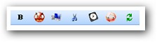{border="0"}

Figure 286: ToolBar

 

[]{#related-topics}
::::::::::::::
