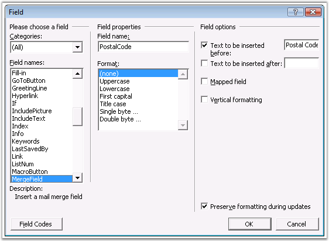
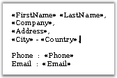

::: {style="DISPLAY: none"}
{#d2h_url_template}{#d2h_package_url style="WIDTH: 0px; DISPLAY: none; HEIGHT: 0px"}
:::

::::: {#nsbanner .d2h_main_nsbanner style="BORDER-BOTTOM: #999999 1px solid; POSITION: relative; PADDING-BOTTOM: 0px; BACKGROUND-COLOR: transparent; PADDING-LEFT: 0px; PADDING-RIGHT: 0px; DISPLAY: none; BORDER-TOP: #999999 1px solid; PADDING-TOP: 0px; LEFT: 0px"}
:::: {#TitleRow .d2h_main_titlerow style="PADDING-BOTTOM: 4px; BACKGROUND-COLOR: transparent; PADDING-LEFT: 22px; WIDTH: 100%; PADDING-RIGHT: 10px; DISPLAY: none; PADDING-TOP: 4px"}
::: {#ienav .d2h_main_ienav style="DISPLAY: none"}
{#D2HPrevious .D2HPreviousEnabled}  {#D2HNext .D2HNextEnabled}
:::
::::
:::::

:::::: {#nstext .d2h_main_nstext style="PADDING-BOTTOM: 10px; BACKGROUND-COLOR: transparent; PADDING-LEFT: 22px; PADDING-RIGHT: 10px; HEIGHT: 100%; OVERFLOW: auto; PADDING-TOP: 5px" hasuserbackground="true" valign="bottom"}
::: {#d2h_breadcrumbs .d2h_breadcrumbs}
[Essential Studio User Guide Documentation](ms-xhelp:///?Id=12457748-09e3-4d74-a240-8e049cedf030){.d2h_breadcrumbsNormal}[ \> ]{.d2h_breadcrumbsLinkSeparator}[Reporting Edition](ms-xhelp:///?Id=027aa5b6-6676-4f93-ad23-c20e8c45792e){.d2h_breadcrumbsNormal}[ \> ]{.d2h_breadcrumbsLinkSeparator}[Essential DocIO](ms-xhelp:///?Id=b88d77b3-4c51-460f-a761-d2ef6d5b0ca6){.d2h_breadcrumbsNormal}[ \> ]{.d2h_breadcrumbsLinkSeparator}[Concepts and Features](ms-xhelp:///?Id=c1881696-52ce-4414-9f3d-97433d8e9775){.d2h_breadcrumbsNormal}
:::

## []{style="FONT-SIZE: 10pt"}[]{#p80}Mail Merge {#mail-merge style="tab-stops: 0pt"}

 

The mail merge function allows you to fill a template document with data from the data source. It is represented by the **MailMerge** class. The following data source types are used in mail merge: String Arrays, DataTable, DataReader or DataView class objects. The template of the document is created by using the MergeFields of MS Word.

 

To perform Mail Merge

**[]{style="COLOR: red"}** 

1.   Open the **Insert** menu, point to **Fields**, and then click **MergeField**.

 

{border="0"}

Figure 78: Field Dialog Box

 

2.   Provide the merge field name, and the text to be inserted before and after the field. Note that the merge field name should match the field name of the data source.

 

[]{#p81}{border="0"}

Figure 79[: Merge field name Provided]{style="FONT-STYLE: normal"}

 

 

Mail merge operations are performed by the **Execute** or **ExecuteGroup** methods. There are several overloads of these methods for different data sources.

 

**Execute**

 

[·      ]{style="FONT-FAMILY: Symbol"}**void Execute(string\[ \] fieldNames, string\[ \] fieldValues)**: performs replacements of every merge field in the document, in which field name matches one of the values from fieldNames string array, with the corresponding value from fieldValues string array.

[·      ]{style="FONT-FAMILY: Symbol"}**void Execute(DataTable table**): performs replacements of merge fields, in which field names match the table column names, with the corresponding values of table cell. These replacements are performed for every row contained in the table.

 

For example, consider you have a document containing a single page, with a MergeField on it, whose field name is \"Country\", with the words: \"is a beautiful country\". Also, you have a DataTable, \"Geography\", containing the following data.

 

::: {align="center"}
  -------- --------------- -----------
  Column   Continent       Country
  1        Australia       Australia
  2        North America   USA
  3        Eurasia         France
  -------- --------------- -----------
:::

 

After performing mail merge operations, you will have a document containing three pages with the following text.

 

**1 page**: Australia is a beautiful country.

**2 page**: USA is a beautiful country.

**3 page**: France is a beautiful country.

 

You can also use the **Next** field, if you want to display the values of some rows at the same place.

 

For example, if you want to enumerate all the countries contained in the table, you have to insert the Next field before every MergeField, with field name \"Country\" beginning with the second MergeField.

 

[·      ]{style="FONT-FAMILY: Symbol"}**void Execute(DataRow row)**: works similarly to that with DataTable parameter for the only row

[·      ]{style="FONT-FAMILY: Symbol"}**void Execute(DataView dataView)**: works similarly to that with DataTable parameter

[·      ]{style="FONT-FAMILY: Symbol"}**void Execute(IDataReader dataReader)**: works similarly to that with DataTable parameter

 

ExecuteGroup

 

[·      ]{style="FONT-FAMILY: Symbol"}**void ExecuteGroup(DataTable table)**: performs replacements of merge fields, in which field names match the table column names, with the corresponding values of table cell

 

These replacements are performed for every row contained in the table in the specified region. The region where the mail merge operations are to be performed must be marked by two MergeFields with the following names:

 

[·      ]{style="FONT-FAMILY: Symbol"}**TableStart:TableName** -- for the entry point of the region

[·      ]{style="FONT-FAMILY: Symbol"}**TableEnd:TableName** -- for the end point of the region

 

For example, consider you have a DataTable containing the same data as in previous example, and you want to get the document with following content:

 

Australia

USA

France

 

are beautiful countries.

 

You have to insert three MergeFields in the document with the following field names:

 

[·      ]{style="FONT-FAMILY: Symbol"}**TableStart:Geography** -- marks the beginning of mail merge region

[·      ]{style="FONT-FAMILY: Symbol"}**Country** -- will be replaced by values from table, \"Geography\"

[·      ]{style="FONT-FAMILY: Symbol"}**TableEnd:Geography** -- marks the end of mail merge region

 

[·      ]{style="FONT-FAMILY: Symbol"}**void ExecuteGroup(DataView dataView)**: works similarly to that with DataTable parameter

[·      ]{style="FONT-FAMILY: Symbol"}**void ExecuteGroup(IDataReader dataReader)**: works similarly to that with DataTable parameter

 

Public Methods

 

::: {align="center"}
  -------------------- -----------------------------------------------------------------
  Name                 Description
  Execute              Executes mail merge.
  ExecuteGroup         Executes mail merge for a group (region). 
  GetMergeFieldNames   Returns a collection of mergefield names found in the document.
  ExecuteNestedGroup   Executes nested mail merge for a group(Region or tables)
  -------------------- -----------------------------------------------------------------
:::

 

The following example illustrates how to use the MailMerge class for different data sources.

 

+-----------------------------------------------------------------------------------------------------------------------------------------------------------------------------------------------------------------------------------------------------------------------------------------------------+
| **[\[C#\]]{style="FONT-FAMILY: 'Courier New'; COLOR: black"}**                                                                                                                                                                                                                                      |
|                                                                                                                                                                                                                                                                                                     |
| []{style="COLOR: black"}                                                                                                                                                                                                                                                                            |
|                                                                                                                                                                                                                                                                                                     |
| [IWordDocument]{style="FONT-FAMILY: 'Courier New'; COLOR: teal"}[ document = [new]{style="COLOR: blue"} [WordDocument]{style="COLOR: teal"}( [\"MailMergeDocument.doc\"]{style="COLOR: maroon"} );]{style="FONT-FAMILY: 'Courier New'"}                                                             |
|                                                                                                                                                                                                                                                                                                     |
| []{style="FONT-FAMILY: 'Courier New'"}                                                                                                                                                                                                                                                              |
|                                                                                                                                                                                                                                                                                                     |
| [// Mail merge operations with string arrays data sources]{style="FONT-FAMILY: 'Courier New'; COLOR: green"}                                                                                                                                                                                        |
|                                                                                                                                                                                                                                                                                                     |
| [string]{style="FONT-FAMILY: 'Courier New'; COLOR: blue"}[\[\] fieldNames = [new]{style="COLOR: blue"} [string]{style="COLOR: blue"}\[\]{ [\"Continent\"]{style="COLOR: maroon"}, [\"Country\"]{style="COLOR: maroon"}, [\"Region\"]{style="COLOR: maroon"} };]{style="FONT-FAMILY: 'Courier New'"} |
|                                                                                                                                                                                                                                                                                                     |
| [string]{style="FONT-FAMILY: 'Courier New'; COLOR: blue"}[\[\] fieldValues = [new]{style="COLOR: blue"} [string]{style="COLOR: blue"}\[\]{ [\"Eurasia\"]{style="COLOR: maroon"}, [\"Germany\"]{style="COLOR: maroon"}, [\"Bavaria\"]{style="COLOR: maroon"} };]{style="FONT-FAMILY: 'Courier New'"} |
|                                                                                                                                                                                                                                                                                                     |
| [document.MailMerge.Execute( fieldNames, fieldValues );]{style="FONT-FAMILY: 'Courier New'"}                                                                                                                                                                                                        |
|                                                                                                                                                                                                                                                                                                     |
| []{style="FONT-FAMILY: 'Courier New'; COLOR: green"}                                                                                                                                                                                                                                                |
|                                                                                                                                                                                                                                                                                                     |
| [// Mail merge operations with DataTable data source containing data from database.]{style="FONT-FAMILY: 'Courier New'; COLOR: green"}                                                                                                                                                              |
|                                                                                                                                                                                                                                                                                                     |
| [DataTable]{style="FONT-FAMILY: 'Courier New'; COLOR: teal"}[ table = GetDataTable( [\"select \* from Geography\"]{style="COLOR: maroon"} );]{style="FONT-FAMILY: 'Courier New'"}                                                                                                                   |
|                                                                                                                                                                                                                                                                                                     |
| [document.MailMerge.Execute( table );]{style="FONT-FAMILY: 'Courier New'"}                                                                                                                                                                                                                          |
|                                                                                                                                                                                                                                                                                                     |
| []{style="FONT-FAMILY: 'Courier New'; COLOR: green"}                                                                                                                                                                                                                                                |
|                                                                                                                                                                                                                                                                                                     |
| [// Mail merge operations with DataView data source, created basing on the DataTable]{style="FONT-FAMILY: 'Courier New'; COLOR: green"}                                                                                                                                                             |
|                                                                                                                                                                                                                                                                                                     |
| [DataView]{style="FONT-FAMILY: 'Courier New'; COLOR: teal"}[ dataView = [new]{style="COLOR: blue"} [DataView]{style="COLOR: teal"}( GetDataTable( [\"select \* from Geography \"]{style="COLOR: maroon"} ) );]{style="FONT-FAMILY: 'Courier New'"}                                                  |
|                                                                                                                                                                                                                                                                                                     |
| [dataView.Sort = [\"CountryName ASC\"]{style="COLOR: maroon"};]{style="FONT-FAMILY: 'Courier New'"}                                                                                                                                                                                                 |
|                                                                                                                                                                                                                                                                                                     |
| [document.MailMerge.Execute( dataView );]{style="FONT-FAMILY: 'Courier New'"}                                                                                                                                                                                                                       |
|                                                                                                                                                                                                                                                                                                     |
| []{style="FONT-FAMILY: 'Courier New'; COLOR: green"}                                                                                                                                                                                                                                                |
|                                                                                                                                                                                                                                                                                                     |
| [// Mail merge operations with DataReader data source]{style="FONT-FAMILY: 'Courier New'; COLOR: green"}                                                                                                                                                                                            |
|                                                                                                                                                                                                                                                                                                     |
| [IDataReader]{style="FONT-FAMILY: 'Courier New'; COLOR: teal"}[ dataReader = GetDataReader( [\"select \* from Geography \"]{style="COLOR: maroon"} );]{style="FONT-FAMILY: 'Courier New'"}                                                                                                          |
|                                                                                                                                                                                                                                                                                                     |
| [document.MailMerge.Execute( dataReader );]{style="FONT-FAMILY: 'Courier New'"}                                                                                                                                                                                                                     |
|                                                                                                                                                                                                                                                                                                     |
| [dataReader.Close();]{style="FONT-FAMILY: 'Courier New'"}                                                                                                                                                                                                                                           |
|                                                                                                                                                                                                                                                                                                     |
| []{style="FONT-FAMILY: 'Courier New'; COLOR: green"}                                                                                                                                                                                                                                                |
|                                                                                                                                                                                                                                                                                                     |
| [// Mail merge operations for the specified region]{style="FONT-FAMILY: 'Courier New'; COLOR: green"}                                                                                                                                                                                               |
|                                                                                                                                                                                                                                                                                                     |
| [DataTable]{style="FONT-FAMILY: 'Courier New'; COLOR: teal"}[ table = GetDataTable( [\"select \* from Employees\"]{style="COLOR: maroon"} );]{style="FONT-FAMILY: 'Courier New'"}                                                                                                                   |
|                                                                                                                                                                                                                                                                                                     |
| [table.TableName = [\"Geography\"]{style="COLOR: maroon"};]{style="FONT-FAMILY: 'Courier New'"}                                                                                                                                                                                                     |
|                                                                                                                                                                                                                                                                                                     |
| [document.MailMerge.ExecuteGroup( table );]{style="FONT-FAMILY: 'Courier New'"}                                                                                                                                                                                                                     |
|                                                                                                                                                                                                                                                                                                     |
| []{style="FONT-FAMILY: 'Courier New'"}                                                                                                                                                                                                                                                              |
|                                                                                                                                                                                                                                                                                                     |
| [document.Save( [\"AfterMailMerge.doc\"]{style="COLOR: maroon"} );]{style="FONT-FAMILY: 'Courier New'"}                                                                                                                                                                                             |
|                                                                                                                                                                                                                                                                                                     |
| [//or]{style="FONT-FAMILY: 'Courier New'"}                                                                                                                                                                                                                                                          |
|                                                                                                                                                                                                                                                                                                     |
| [document.Save([\"AfterMailMerge.docx\",FormatType.Docx]{style="COLOR: maroon"});]{style="FONT-FAMILY: 'Courier New'"}                                                                                                                                                                              |
+-----------------------------------------------------------------------------------------------------------------------------------------------------------------------------------------------------------------------------------------------------------------------------------------------------+

 

+----------------------------------------------------------------------------------------------------------------------------------------------------------------------------------------------------------------------------------------------------------------------------------------------------------------------------------------------------+
| **[\[VB.NET\]]{style="FONT-FAMILY: 'Courier New'; COLOR: black"}**                                                                                                                                                                                                                                                                                 |
|                                                                                                                                                                                                                                                                                                                                                    |
| []{style="COLOR: black"}                                                                                                                                                                                                                                                                                                                           |
|                                                                                                                                                                                                                                                                                                                                                    |
| [Dim]{style="FONT-FAMILY: 'Courier New'; COLOR: blue"}[ document [As]{style="COLOR: blue"} IWordDocument = [New]{style="COLOR: blue"} WordDocument([\"MailMergeDocument.doc\"]{style="COLOR: maroon"})]{style="FONT-FAMILY: 'Courier New'"}                                                                                                        |
|                                                                                                                                                                                                                                                                                                                                                    |
| []{style="FONT-FAMILY: 'Courier New'"}                                                                                                                                                                                                                                                                                                             |
|                                                                                                                                                                                                                                                                                                                                                    |
| [\' Mail merge operations with string arrays data sources]{style="FONT-FAMILY: 'Courier New'; COLOR: green"}                                                                                                                                                                                                                                       |
|                                                                                                                                                                                                                                                                                                                                                    |
| [Dim]{style="FONT-FAMILY: 'Courier New'; COLOR: blue"}[ fieldNames [As]{style="COLOR: blue"} [String]{style="COLOR: blue"}() = [New]{style="COLOR: blue"} [String]{style="COLOR: blue"}() {[\"Continent\"]{style="COLOR: maroon"}, [\"Country\"]{style="COLOR: maroon"}, [\"Region\"]{style="COLOR: maroon"}}]{style="FONT-FAMILY: 'Courier New'"} |
|                                                                                                                                                                                                                                                                                                                                                    |
| [Dim]{style="FONT-FAMILY: 'Courier New'; COLOR: blue"}[ fieldValues [As]{style="COLOR: blue"} [String]{style="COLOR: blue"}() = [New]{style="COLOR: blue"} [String]{style="COLOR: blue"}() {[\"Eurasia\"]{style="COLOR: maroon"}, [\"Germany\"]{style="COLOR: maroon"}, [\"Bavaria\"]{style="COLOR: maroon"}}]{style="FONT-FAMILY: 'Courier New'"} |
|                                                                                                                                                                                                                                                                                                                                                    |
| [document.MailMerge.Execute(fieldNames, fieldValues)]{style="FONT-FAMILY: 'Courier New'"}                                                                                                                                                                                                                                                          |
|                                                                                                                                                                                                                                                                                                                                                    |
| []{style="FONT-FAMILY: 'Courier New'"}                                                                                                                                                                                                                                                                                                             |
|                                                                                                                                                                                                                                                                                                                                                    |
| [\' Mail merge operations with DataTable data source containing data from database.]{style="FONT-FAMILY: 'Courier New'; COLOR: green"}                                                                                                                                                                                                             |
|                                                                                                                                                                                                                                                                                                                                                    |
| [Dim]{style="FONT-FAMILY: 'Courier New'; COLOR: blue"}[ table [As]{style="COLOR: blue"} DataTable = GetDataTable([\"select \* from Geography\"]{style="COLOR: maroon"})]{style="FONT-FAMILY: 'Courier New'"}                                                                                                                                       |
|                                                                                                                                                                                                                                                                                                                                                    |
| [document.MailMerge.Execute(table)]{style="FONT-FAMILY: 'Courier New'"}                                                                                                                                                                                                                                                                            |
|                                                                                                                                                                                                                                                                                                                                                    |
| []{style="FONT-FAMILY: 'Courier New'"}                                                                                                                                                                                                                                                                                                             |
|                                                                                                                                                                                                                                                                                                                                                    |
| [\' Mail merge operations with DataView data source, created basing on the DataTable]{style="FONT-FAMILY: 'Courier New'; COLOR: green"}                                                                                                                                                                                                            |
|                                                                                                                                                                                                                                                                                                                                                    |
| [Dim]{style="FONT-FAMILY: 'Courier New'; COLOR: blue"}[ dataView [As]{style="COLOR: blue"} DataView = [New]{style="COLOR: blue"} DataView(GetDataTable([\"select \* from Geography \"]{style="COLOR: maroon"}))]{style="FONT-FAMILY: 'Courier New'"}                                                                                               |
|                                                                                                                                                                                                                                                                                                                                                    |
| [dataView.Sort = [\"CountryName ASC\"]{style="COLOR: maroon"}]{style="FONT-FAMILY: 'Courier New'"}                                                                                                                                                                                                                                                 |
|                                                                                                                                                                                                                                                                                                                                                    |
| [document.MailMerge.Execute(dataView)]{style="FONT-FAMILY: 'Courier New'"}                                                                                                                                                                                                                                                                         |
|                                                                                                                                                                                                                                                                                                                                                    |
| []{style="FONT-FAMILY: 'Courier New'"}                                                                                                                                                                                                                                                                                                             |
|                                                                                                                                                                                                                                                                                                                                                    |
| [\' Mail merge operations with DataReader data source]{style="FONT-FAMILY: 'Courier New'; COLOR: green"}                                                                                                                                                                                                                                           |
|                                                                                                                                                                                                                                                                                                                                                    |
| [Dim]{style="FONT-FAMILY: 'Courier New'; COLOR: blue"}[ dataReader [As]{style="COLOR: blue"} IDataReader = GetDataReader([\"select \* from Geography \"]{style="COLOR: maroon"})]{style="FONT-FAMILY: 'Courier New'"}                                                                                                                              |
|                                                                                                                                                                                                                                                                                                                                                    |
| [document.MailMerge.Execute(dataReader)]{style="FONT-FAMILY: 'Courier New'"}                                                                                                                                                                                                                                                                       |
|                                                                                                                                                                                                                                                                                                                                                    |
| [dataReader.Close()]{style="FONT-FAMILY: 'Courier New'"}                                                                                                                                                                                                                                                                                           |
|                                                                                                                                                                                                                                                                                                                                                    |
| []{style="FONT-FAMILY: 'Courier New'"}                                                                                                                                                                                                                                                                                                             |
|                                                                                                                                                                                                                                                                                                                                                    |
| [\' Mail merge operations for the specified region]{style="FONT-FAMILY: 'Courier New'; COLOR: green"}                                                                                                                                                                                                                                              |
|                                                                                                                                                                                                                                                                                                                                                    |
| [Dim]{style="FONT-FAMILY: 'Courier New'; COLOR: blue"}[ table [As]{style="COLOR: blue"} DataTable = GetDataTable([\"select \* from Employees\"]{style="COLOR: maroon"})]{style="FONT-FAMILY: 'Courier New'"}                                                                                                                                       |
|                                                                                                                                                                                                                                                                                                                                                    |
| [table.TableName = [\"Geography\"]{style="COLOR: maroon"}]{style="FONT-FAMILY: 'Courier New'"}                                                                                                                                                                                                                                                     |
|                                                                                                                                                                                                                                                                                                                                                    |
| [document.MailMerge.ExecuteGroup(table)]{style="FONT-FAMILY: 'Courier New'"}                                                                                                                                                                                                                                                                       |
|                                                                                                                                                                                                                                                                                                                                                    |
| []{style="FONT-FAMILY: 'Courier New'"}                                                                                                                                                                                                                                                                                                             |
|                                                                                                                                                                                                                                                                                                                                                    |
| [document.Save([\"AfterMailMerge.doc\"]{style="COLOR: maroon"})]{style="FONT-FAMILY: 'Courier New'"}                                                                                                                                                                                                                                               |
|                                                                                                                                                                                                                                                                                                                                                    |
| [\'or]{style="FONT-FAMILY: 'Courier New'"}                                                                                                                                                                                                                                                                                                         |
|                                                                                                                                                                                                                                                                                                                                                    |
| [document.Save([\"AfterMailMerge.docx\",FormatType.Docx]{style="COLOR: maroon"})]{style="FONT-FAMILY: 'Courier New'"}                                                                                                                                                                                                                              |
+----------------------------------------------------------------------------------------------------------------------------------------------------------------------------------------------------------------------------------------------------------------------------------------------------------------------------------------------------+

 

It is also possible to conditionally format the merge fields dynamically by using the **MergeField** events.

 

**See Also**

 

[[Nested Mail Merge]{.UGHyperlink}](), [[Mail merge Events]{.UGHyperlink}](ms-xhelp:///?Id=2b05f541-f80e-42ac-8b96-dff440a7da54), [[[[Additional Mail Merge Features]{style="COLOR: blue"}]{.underline}](ms-xhelp:///?Id=baa78835-756c-40a8-ac98-60e59dacb9ba)]{.UGHyperlink}

[]{#_Nested_Mail_Merge} 

 

More:

[ ]{#related-topics}

[{border="0" align="absMiddle"}Nested Mail Merge](ms-xhelp:///?Id=476951df-e53e-4cce-b123-21d6cb256dde){style="TEXT-DECORATION: none"}

[{border="0" align="absMiddle"}Mail Merge Events](ms-xhelp:///?Id=2b05f541-f80e-42ac-8b96-dff440a7da54){style="TEXT-DECORATION: none"}

[{border="0" align="absMiddle"}Additional Mail Merge Features](ms-xhelp:///?Id=baa78835-756c-40a8-ac98-60e59dacb9ba){style="TEXT-DECORATION: none"}
::::::
