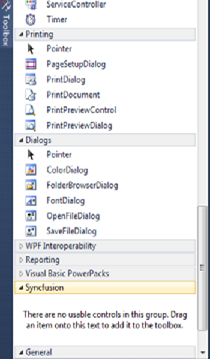
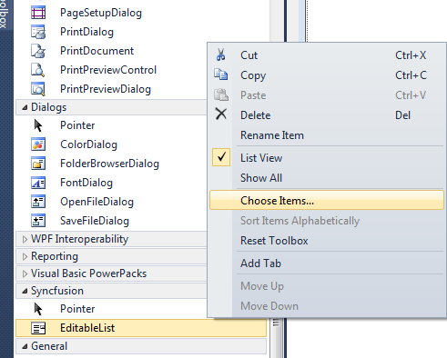
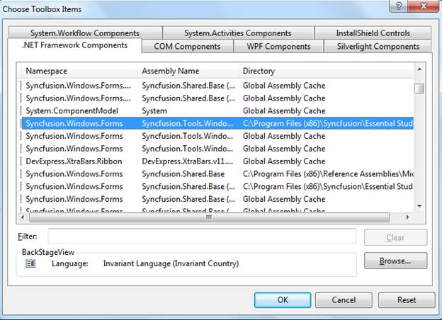

::: {style="DISPLAY: none"}
{#d2h_url_template}{#d2h_package_url style="WIDTH: 0px; DISPLAY: none; HEIGHT: 0px"}
:::

::::: {#nsbanner .d2h_main_nsbanner style="BORDER-BOTTOM: #999999 1px solid; POSITION: relative; PADDING-BOTTOM: 0px; BACKGROUND-COLOR: transparent; PADDING-LEFT: 0px; PADDING-RIGHT: 0px; DISPLAY: none; BORDER-TOP: #999999 1px solid; PADDING-TOP: 0px; LEFT: 0px"}
:::: {#TitleRow .d2h_main_titlerow style="PADDING-BOTTOM: 4px; BACKGROUND-COLOR: transparent; PADDING-LEFT: 22px; WIDTH: 100%; PADDING-RIGHT: 10px; DISPLAY: none; PADDING-TOP: 4px"}
::: {#ienav .d2h_main_ienav style="DISPLAY: none"}
{#D2HPrevious .D2HPreviousEnabled}  {#D2HNext .D2HNextEnabled}
:::
::::
:::::

::::: {#nstext .d2h_main_nstext style="PADDING-BOTTOM: 10px; BACKGROUND-COLOR: transparent; PADDING-LEFT: 22px; PADDING-RIGHT: 10px; HEIGHT: 100%; OVERFLOW: auto; PADDING-TOP: 5px" hasuserbackground="true" valign="bottom"}
::: {#d2h_breadcrumbs .d2h_breadcrumbs}
[Essential Studio User Guide Documentation](ms-xhelp:///?Id=12457748-09e3-4d74-a240-8e049cedf030){.d2h_breadcrumbsNormal}[ \> ]{.d2h_breadcrumbsLinkSeparator}[Essential Common](ms-xhelp:///?Id=2bfe10b6-fac1-4f91-a173-04db314f10c3){.d2h_breadcrumbsNormal}[ \> ]{.d2h_breadcrumbsLinkSeparator}[Frequently Asked Questions](ms-xhelp:///?Id=8c0b82fa-382a-437e-9ce1-9b9ffd3f2ead){.d2h_breadcrumbsNormal}[ \> ]{.d2h_breadcrumbsLinkSeparator}[How to Configure the Toolbox of Visual Studio Manually](ms-xhelp:///?Id=5a9f4e2b-2823-4453-a5dd-28cd57e13a7c){.d2h_breadcrumbsNormal}
:::

### Manually Configuring VS Toolbox {#manually-configuring-vs-toolbox style="tab-stops: 0pt"}

**[]{style="FONT-FAMILY: 'Trebuchet MS','sans-serif'; COLOR: #15428b"}** 

The following are the steps to configure VS Toolbox manually for Syncfusion tools:

[]{style="FONT-FAMILY: 'Times New Roman','serif'; FONT-SIZE: 12pt"} 

1.   Close all Visual Studio running instance.

2.  Remove the **\*.tbd** files except the **toolbox.tbd** from the following location:

 

**Windows XP:**

 

**C:\\Documents and Settings\\{user name}\\Local Settings\\Application Data\\Microsoft\\VisualStudio\\10.0**

 

**Vista/Windows 7:**

 

**C:\\Users\\{user name}\\AppData\\Local\\Microsoft\\VisualStudio\\10.0**

::: {style="BORDER-BOTTOM: windowtext 1pt solid; BORDER-LEFT: medium none; PADDING-BOTTOM: 1pt; MARGIN-TOP: 9pt; PADDING-LEFT: 0pt; PADDING-RIGHT: 0pt; MARGIN-BOTTOM: 9pt; BORDER-TOP: windowtext 1pt solid; BORDER-RIGHT: medium none; PADDING-TOP: 1pt"}
{border="0"}Note:[, It will take some time to configure toolbox and creating tbd files, when initially loading the toolbox in VS2010.]{style="COLOR: black"}
:::

[]{style="FONT-FAMILY: 'Trebuchet MS','sans-serif'; COLOR: black; FONT-SIZE: 9pt"} 

3.   Re-open the visual studio environment. The VS toolbox will be configured.

 

Adding Syncfusion controls in the customized toolbox

 

The following are the steps to add the Syncfusion controls in the user customized toolbox:

 

1.   Open the Visual Studio and then create a new tab as **Syncfusion** in the toolbox.

 

 

{border="0"}

Figure 147: New tab in the toolbox

 

2.  Right-click and then select **Choose Items**.

{border="0"}

Figure 148: Choose Items

The **Choose Toolbox Items** opens.

{border="0"}

Figure 149: Choose Toolbox Items

 

3.   Select all the Syncfusion assemblies and then click **Ok**. Assemblies will be copied to the newly created Syncfusion toolbox tab.

[]{style="FONT-FAMILY: 'Trebuchet MS','sans-serif'; COLOR: #15428b; FONT-SIZE: 9pt"} 

 

 

 

 

 

 

 

[]{#related-topics}
:::::
