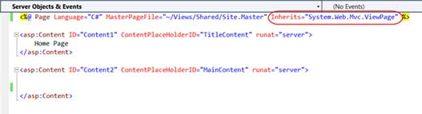
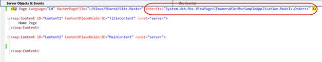

::: {style="DISPLAY: none"}
{#d2h_url_template} {#d2h_package_url style="WIDTH: 0px; DISPLAY: none; HEIGHT: 0px"}
:::

::: {.d2h_secondary_topic style="PADDING-BOTTOM: 10pt; MARGIN: 0pt; PADDING-LEFT: 0pt; PADDING-RIGHT: 0pt; PADDING-TOP: 0pt"}
#### Manually Creating a Strongly Typed View {#manually-creating-a-strongly-typed-view style="TEXT-INDENT: -43.2pt; MARGIN-LEFT: 43.2pt; tab-stops: 43.2pt"}

If you create a view and later need to convert it to a strongly typed view, the process is quite simple. Change the \"Inherits\" statement in the view declaration from:

*** *** ***System.Web.Mvc.ViewPage to*** ***System.Web.Mvc.ViewPage\<YourNamespace.YourClass*** ***\>***

Here our model is "MvcSampleApplication.Models.Order,"so update the index page like this:

[]{style="FONT-FAMILY: 'Calibri','sans-serif'"} 

+----------------------------------------------------------------------------------------------------------------------------------------------------------------------------------------------------------------------------------------------------------------------------------------------------------------------------------------------------------------------------------------------------------------------------------------------------------------------------------------------------------------------------------------------------------+
| ***[\[]{style="FONT-FAMILY: 'Courier New'; COLOR: #4f81bd"}*** ***[View]{style="FONT-FAMILY: 'Courier New'; COLOR: #4f81bd"}*** ***[\]]{style="FONT-FAMILY: 'Courier New'; COLOR: #4f81bd"}*** **[]{style="FONT-FAMILY: 'Courier New'"}**                                                                                                                                                                                                                                                                                                                |
|                                                                                                                                                                                                                                                                                                                                                                                                                                                                                                                                                          |
| [\<%]{style="FONT-FAMILY: 'Courier New'; BACKGROUND: yellow"} [@]{style="FONT-FAMILY: 'Courier New'; COLOR: blue"} [ [Page]{style="COLOR: maroon"} [Language]{style="COLOR: red"} [=\"C#\"]{style="COLOR: blue"} [MasterPageFile]{style="COLOR: red"} [=\"\~/Views/Shared/Site.Master\"]{style="COLOR: blue"} [Inherits]{style="COLOR: red"} [=\"System.Web.Mvc.ViewPage[\<IEnumerable\<MvcSampleApplication.Models.Order\>\>]{style="BACKGROUND: aqua"}\"]{style="COLOR: blue"} [%\>]{style="BACKGROUND: yellow"} ]{style="FONT-FAMILY: 'Courier New'"} |
|                                                                                                                                                                                                                                                                                                                                                                                                                                                                                                                                                          |
| []{style="FONT-FAMILY: 'Courier New'; BACKGROUND: yellow; FONT-SIZE: 9.5pt"}                                                                                                                                                                                                                                                                                                                                                                                                                                                                             |
+----------------------------------------------------------------------------------------------------------------------------------------------------------------------------------------------------------------------------------------------------------------------------------------------------------------------------------------------------------------------------------------------------------------------------------------------------------------------------------------------------------------------------------------------------------+

[]{style="FONT-FAMILY: 'Times New Roman','serif'"} 

[ {border="0"} ]{style="FONT-FAMILY: 'Times New Roman','serif'; FONT-SIZE: 12pt"} []{style="FONT-FAMILY: 'Times New Roman','serif'; FONT-SIZE: 12pt"}

Figure 70: Default Index View

 

{border="0"}

Figure 71: Default Index View

 

[]{#related-topics}
:::
