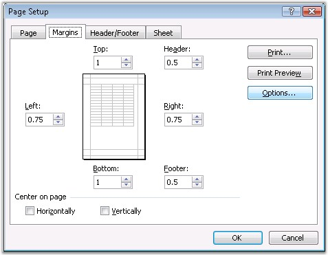
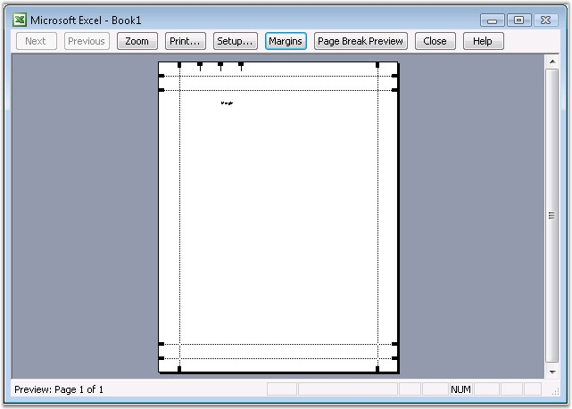

::: {style="DISPLAY: none"}
{#d2h_url_template}{#d2h_package_url style="WIDTH: 0px; DISPLAY: none; HEIGHT: 0px"}
:::

::: {.d2h_secondary_topic style="PADDING-BOTTOM: 10pt; MARGIN: 0pt; PADDING-LEFT: 0pt; PADDING-RIGHT: 0pt; PADDING-TOP: 0pt"}
#### Margins {#margins style="tab-stops: 0pt"}

 

Page margins are the blank spaces between the worksheet data and the edges of the printed page, and hence provide better readability. Page margins can be used for items such as headers, footers and page numbers.

 

Excel allows to set the page margin through the Page Setup dialog box. Note that the page margins that you define in a given worksheet, are stored with that particular worksheet, when you save the workbook. You cannot change the default page margins for new workbooks.

 

{border="0"}

Figure 107: Page Setup - Margins[]{style="FONT-FAMILY: 'Trebuchet MS','sans-serif'; COLOR: #15428b"}

[]{style="FONT-FAMILY: 'Trebuchet MS','sans-serif'; COLOR: #15428b; FONT-SIZE: 9pt"} 

XlsIO has APIs to define the margins in a sheet through the properties of IPageSetup. It sets the value in terms of inches.

 

Following code example illustrates how to set the margin.

 

+---------------------------------------------------------------------------------------+
| **[\[C#\]]{style="FONT-FAMILY: 'Courier New'"}**                                      |
|                                                                                       |
| **[]{style="FONT-FAMILY: 'Courier New'"}**                                            |
|                                                                                       |
| [// Page Setup Using Margins.]{style="FONT-FAMILY: 'Courier New'; COLOR: green"}      |
|                                                                                       |
| [sheet.PageSetup.LeftMargin = 2;]{style="FONT-FAMILY: 'Courier New'; COLOR: black"}   |
|                                                                                       |
| [sheet.PageSetup.RightMargin = 2;]{style="FONT-FAMILY: 'Courier New'; COLOR: black"}  |
|                                                                                       |
| [sheet.PageSetup.TopMargin = 2;]{style="FONT-FAMILY: 'Courier New'; COLOR: black"}    |
|                                                                                       |
| [sheet.PageSetup.BottomMargin = 2;]{style="FONT-FAMILY: 'Courier New'; COLOR: black"} |
+---------------------------------------------------------------------------------------+

[]{style="FONT-FAMILY: 'Trebuchet MS','sans-serif'; COLOR: #15428b; FONT-SIZE: 9pt"} 

+--------------------------------------------------------------------------------------+
| **[\[VB.NET\]]{style="FONT-FAMILY: 'Courier New'"}**                                 |
|                                                                                      |
| **[]{style="FONT-FAMILY: 'Courier New'"}**                                           |
|                                                                                      |
| [\' Page Setup Using Margins.]{style="FONT-FAMILY: 'Courier New'; COLOR: green"}     |
|                                                                                      |
| [sheet.PageSetup.LeftMargin = 2]{style="FONT-FAMILY: 'Courier New'; COLOR: black"}   |
|                                                                                      |
| [sheet.PageSetup.RightMargin = 2]{style="FONT-FAMILY: 'Courier New'; COLOR: black"}  |
|                                                                                      |
| [sheet.PageSetup.TopMargin = 2]{style="FONT-FAMILY: 'Courier New'; COLOR: black"}    |
|                                                                                      |
| [sheet.PageSetup.BottomMargin = 2]{style="FONT-FAMILY: 'Courier New'; COLOR: black"} |
+--------------------------------------------------------------------------------------+

[]{style="FONT-FAMILY: 'Trebuchet MS','sans-serif'; COLOR: #15428b; FONT-SIZE: 9pt"} 

{border="0"}

Figure 108: XlsIO with Margins[]{style="FONT-FAMILY: 'Trebuchet MS','sans-serif'; COLOR: #15428b"}

[]{style="FONT-FAMILY: 'Trebuchet MS','sans-serif'; COLOR: #15428b; FONT-SIZE: 9pt"} 

 

[]{#related-topics}
:::
