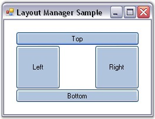

::: {style="DISPLAY: none"}
{#d2h_url_template}{#d2h_package_url style="WIDTH: 0px; DISPLAY: none; HEIGHT: 0px"}
:::

:::: {.d2h_secondary_topic style="PADDING-BOTTOM: 10pt; MARGIN: 0pt; PADDING-LEFT: 0pt; PADDING-RIGHT: 0pt; PADDING-TOP: 0pt"}
##### Margin Settings {#margin-settings style="tab-stops: 0pt"}

[]{style="COLOR: #15428b"} 

The margin settings that are common to all the Layout Managers are discussed below.

 

The layout bounds will also be adjusted to include some margin space along the borders according to the values specified in the properties given below. The default values of these properties are set to \'Zero\'.

[]{style="COLOR: #15428b"} 

::: {align="center"}
  -------------------------- --------------------------------------------------------------------------------------
  LayoutManager Properties   Description
  TopMargin                  Gets / sets the top margin between the client rectangle and the layout rectangle.
  HorzNearMargin             Gets / sets the left margin between the client rectangle and the layout rectangle.
  HorzFarMargin              Gets / sets the right margin between the client rectangle and the layout rectangle.
  BottonMargin               Gets / sets the bottom margin between the client rectangle and the layout rectangle.
  -------------------------- --------------------------------------------------------------------------------------
:::

[]{style="COLOR: #15428b"} 

+----------------------------------------------------------------------------------------------------------------------------------+
| **[\[C#\]]{style="FONT-FAMILY: 'Courier New'; COLOR: black"}**                                                                   |
|                                                                                                                                  |
| []{style="FONT-FAMILY: 'Courier New'; COLOR: black"}                                                                             |
|                                                                                                                                  |
| [this]{style="FONT-FAMILY: 'Courier New'; COLOR: blue"}[.borderLayout1.TopMargin = 20;]{style="FONT-FAMILY: 'Courier New'"}      |
|                                                                                                                                  |
| [this]{style="FONT-FAMILY: 'Courier New'; COLOR: blue"}[.borderLayout1.HorzFarMargin = 20;]{style="FONT-FAMILY: 'Courier New'"}  |
|                                                                                                                                  |
| [this]{style="FONT-FAMILY: 'Courier New'; COLOR: blue"}[.borderLayout1.HorzNearMargin = 20;]{style="FONT-FAMILY: 'Courier New'"} |
|                                                                                                                                  |
| [this]{style="FONT-FAMILY: 'Courier New'; COLOR: blue"}[.borderLayout1.BottomMargin = 20;]{style="FONT-FAMILY: 'Courier New'"}   |
+----------------------------------------------------------------------------------------------------------------------------------+

[]{style="COLOR: #15428b"} 

+-------------------------------------------------------------------------------------------------------------------------------+
| **[\[VB.NET\]]{style="FONT-FAMILY: 'Courier New'; COLOR: black"}**                                                            |
|                                                                                                                               |
| []{style="FONT-FAMILY: 'Courier New'; COLOR: black"}                                                                          |
|                                                                                                                               |
| [Me]{style="FONT-FAMILY: 'Courier New'; COLOR: blue"}[.borderLayout1.TopMargin = 20]{style="FONT-FAMILY: 'Courier New'"}      |
|                                                                                                                               |
| [Me]{style="FONT-FAMILY: 'Courier New'; COLOR: blue"}[.borderLayout1.HorzFarMargin = 20]{style="FONT-FAMILY: 'Courier New'"}  |
|                                                                                                                               |
| [Me]{style="FONT-FAMILY: 'Courier New'; COLOR: blue"}[.borderLayout1.HorzNearMargin = 20]{style="FONT-FAMILY: 'Courier New'"} |
|                                                                                                                               |
| [Me]{style="FONT-FAMILY: 'Courier New'; COLOR: blue"}[.borderLayout1.BottomMargin = 20]{style="FONT-FAMILY: 'Courier New'"}   |
+-------------------------------------------------------------------------------------------------------------------------------+

[]{style="COLOR: #4a5c8c; FONT-SIZE: 8pt"} 

{border="0"}

[]{style="COLOR: #15428b"} 

Figure 654: Margins set for Layout Manager (BorderLayout)

[]{style="COLOR: #15428b"} 

**[]{style="COLOR: #15428b"}** 

See Also

[]{style="COLOR: #15428b"} 

[Configuring BorderLayout]{.UGHyperlink}[, ]{.UGHyperlink}[Configuring FlowLayout]{.UGHyperlink}[, ]{.UGHyperlink}[Configuring GridLayout]{.UGHyperlink}[]{.UGHyperlink}

[]{#related-topics}
::::
