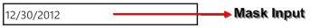

::: {style="DISPLAY: none"}
{#d2h_url_template}{#d2h_package_url style="WIDTH: 0px; DISPLAY: none; HEIGHT: 0px"}
:::

::: {.d2h_secondary_topic style="PADDING-BOTTOM: 10pt; MARGIN: 0pt; PADDING-LEFT: 0pt; PADDING-RIGHT: 0pt; PADDING-TOP: 0pt"}
#### Mask {#mask style="TEXT-JUSTIFY: inter-ideograph; TEXT-ALIGN: justify; tab-stops: 0pt"}

The MaskEditTextBox control has a **Mask** property using which you can specify the following input without writing any custom validation logic in your application.

[·      ]{style="FONT-FAMILY: Symbol"}[Required input characters.]{style="FONT-FAMILY: 'Arial','sans-serif'"}

[·      ]{style="FONT-FAMILY: Symbol"}[Optional input characters.]{style="FONT-FAMILY: 'Arial','sans-serif'"}

[·      ]{style="FONT-FAMILY: Symbol"}[The type of input expected at a given position in the mask; for example, a digit, alphabetic, or alphanumeric character. ]{style="FONT-FAMILY: 'Arial','sans-serif'"}

[·      ]{style="FONT-FAMILY: Symbol"}[Mask literals or characters that should appear directly in the MaskEditTextBox; for example, the hyphens (-) in a phone number, or the currency symbol in a price.]{style="FONT-FAMILY: 'Arial','sans-serif'"}

[·      ]{style="FONT-FAMILY: Symbol"}[Special processing for input characters; for example, to convert alphabetic characters to uppercase.]{style="FONT-FAMILY: 'Arial','sans-serif'"}

 

When a MaskEditTextBox control is displayed at run time, it represents the mask as a series of prompt characters and optional literal characters. Each editable mask position represents a required or optional input which is shown with a single prompt character. For example, the number sign (#) is often used as a placeholder for a numeric character input. You can use the **PromptChar** property to specify a custom prompt character.

The mask must be a string composed of one or more of masking elements, as shown in the following table.

 

  ---------------------- -------------------------------------------------------------------------------------------------------------------------------------------------------------------------------------------------
  Masking element        Description
  0                      Digit, required. This element will accept any single digit between 0 and 9.
  9                      Digit or space, optional.
  \#                     Digit or space, optional. If this position is blank in the mask, it will be rendered as a space. Plus (+) and minus (-) signs are allowed.
  L                      Letter, required. Restricts input to the ASCII letters a-z and A-Z. This mask element is equivalent to \[a-zA-Z\] in regular expressions.
  ?                      Letter, optional. Restricts input to the ASCII letters a-z and A-Z. This mask element is equivalent to \[a-zA-Z\]? In regular expressions.
  C                      Character, optional. Any non-control character.
  A                      Alphanumeric, required.
  a                      Alphanumeric, optional.
  .                      Decimal placeholder. Determined by Culture and DecimalSeparator property.
   ,                     Thousands placeholder. Determined by Culture and NumberGroupSeparator.
  :                      Time separator. Determined by Culture and TimeSeparator property.
  /                      Date separator. Determined by Culture and DateSeparator property.
  \$                     Currency symbol. Determined by Culture Property.
  \<                     Shift down. Converts all characters that follow to lowercase.
  \>                     Shift up. Converts all characters that follow to uppercase.
  \|                     Disable a previous shift up or shift down.
  All other characters   Literals. All non-mask elements will appear as themselves within MaskEditTextBox. Literals always occupy a static position in the mask at run time, and cannot be moved or deleted by the user.
  ---------------------- -------------------------------------------------------------------------------------------------------------------------------------------------------------------------------------------------

 

  -----------------------------------------------------------------------------------------------------------------------------------------------------------------------------------------------------------------------------------------------------------------------------------------------------------------------------------------------------------------------------------------------------------------------------------------------------------------------------------------------------------------------------------------------------------------------------------------------------------------------------------------------------------------------------------------------------------------------------------------------------------------------------------------------------------------------------------------------------------------------------------------------
  [\<]{style="FONT-FAMILY: Consolas; COLOR: blue; FONT-SIZE: 9.5pt"}[syncfusion]{style="FONT-FAMILY: Consolas; COLOR: #a31515; FONT-SIZE: 9.5pt"}[:]{style="FONT-FAMILY: Consolas; COLOR: blue; FONT-SIZE: 9.5pt"}[MaskEditTextBox]{style="FONT-FAMILY: Consolas; COLOR: #a31515; FONT-SIZE: 9.5pt"}[ x]{style="FONT-FAMILY: Consolas; COLOR: red; FONT-SIZE: 9.5pt"}[:]{style="FONT-FAMILY: Consolas; COLOR: blue; FONT-SIZE: 9.5pt"}[Name]{style="FONT-FAMILY: Consolas; COLOR: red; FONT-SIZE: 9.5pt"}[=\"maskedittxtbx\" ]{style="FONT-FAMILY: Consolas; COLOR: blue; FONT-SIZE: 9.5pt"}[Height]{style="FONT-FAMILY: Consolas; COLOR: red; FONT-SIZE: 9.5pt"}[ =\"75\" ]{style="FONT-FAMILY: Consolas; COLOR: blue; FONT-SIZE: 9.5pt"}[Mask]{style="FONT-FAMILY: Consolas; COLOR: red; FONT-SIZE: 9.5pt"}[=\"00/00/0000\"/\>]{style="FONT-FAMILY: Consolas; COLOR: blue; FONT-SIZE: 9.5pt"}
  -----------------------------------------------------------------------------------------------------------------------------------------------------------------------------------------------------------------------------------------------------------------------------------------------------------------------------------------------------------------------------------------------------------------------------------------------------------------------------------------------------------------------------------------------------------------------------------------------------------------------------------------------------------------------------------------------------------------------------------------------------------------------------------------------------------------------------------------------------------------------------------------------

 

 

{border="0"}

Fig 136: Mask

[]{#related-topics}
:::
