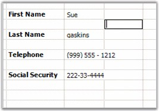

::: {style="DISPLAY: none"}
{#d2h_url_template}{#d2h_package_url style="WIDTH: 0px; DISPLAY: none; HEIGHT: 0px"}
:::

::: {.d2h_secondary_topic style="PADDING-BOTTOM: 10pt; MARGIN: 0pt; PADDING-LEFT: 0pt; PADDING-RIGHT: 0pt; PADDING-TOP: 0pt"}
##### Masked Edit {#masked-edit style="tab-stops: 0pt"}

[]{style="FONT-FAMILY: 'Trebuchet MS','sans-serif'; COLOR: #15428b; FONT-SIZE: 9pt"} 

The **MaskedEdit** cell type lets you to edit and display specially formatted text cells that conform to an edit mask that you specify. To make use of this cell type, set the CellType property to *MaskedEdit*. You can set additional properties like Mask, ClipMode, and so on, through the cell style\'s **GridMaskEditInfo** object. The various options will allow you to input masks to control the type of input that is valid within a cell. For example, you can use a MaskedEdit cell to facilitate the entry of a formatted Social Security number, a phone number, or a 3 character alpha-code.

[]{style="FONT-FAMILY: 'Trebuchet MS','sans-serif'; COLOR: #15428b; FONT-SIZE: 9pt"} 

The following code example illustrates how to set the cell type to MaskedEdit.

[]{style="FONT-FAMILY: 'Trebuchet MS','sans-serif'; COLOR: #15428b; FONT-SIZE: 9pt"} 

+----------------------------------------------------------------------------------------------------------------------------------------------------------------------------------------+
| **[\[C#\]]{style="FONT-FAMILY: 'Courier New'; COLOR: black"}**                                                                                                                         |
|                                                                                                                                                                                        |
| []{style="FONT-FAMILY: 'Courier New'; COLOR: black"}                                                                                                                                   |
|                                                                                                                                                                                        |
| [gridControl1\[2, 3\].Text = [\"First Name\"]{style="COLOR: #a31515"};]{style="FONT-FAMILY: 'Courier New'"}                                                                            |
|                                                                                                                                                                                        |
| [GridStyleInfo]{style="FONT-FAMILY: 'Courier New'; COLOR: #2b91af"}[ style1 = gridControl1\[2, 4\];]{style="FONT-FAMILY: 'Courier New'"}                                               |
|                                                                                                                                                                                        |
| [GridMaskEditInfo]{style="FONT-FAMILY: 'Courier New'; COLOR: #2b91af"}[ maskedEditStyle1 = style1.MaskEdit;]{style="FONT-FAMILY: 'Courier New'"}                                       |
|                                                                                                                                                                                        |
| [gridControl1\[4, 3\].Text = [\"Last Name\"]{style="COLOR: #a31515"};]{style="FONT-FAMILY: 'Courier New'"}                                                                             |
|                                                                                                                                                                                        |
| [gridControl1\[8, 3\].Text = [\"Social Security\"]{style="COLOR: #a31515"};]{style="FONT-FAMILY: 'Courier New'"}                                                                       |
|                                                                                                                                                                                        |
| [GridStyleInfo]{style="FONT-FAMILY: 'Courier New'; COLOR: #2b91af"}[ style4 = gridControl1\[8, 4\];]{style="FONT-FAMILY: 'Courier New'"}                                               |
|                                                                                                                                                                                        |
| [GridMaskEditInfo]{style="FONT-FAMILY: 'Courier New'; COLOR: #2b91af"}[ maskedEditStyle4 = style4.MaskEdit;]{style="FONT-FAMILY: 'Courier New'"}                                       |
|                                                                                                                                                                                        |
| [        ]{style="FONT-FAMILY: 'Courier New'"}                                                                                                                                         |
|                                                                                                                                                                                        |
| [// Masked Edit Box 1]{style="FONT-FAMILY: 'Courier New'; COLOR: green"}                                                                                                               |
|                                                                                                                                                                                        |
| [style1.CellType = [\"MaskEdit\"]{style="COLOR: #a31515"};]{style="FONT-FAMILY: 'Courier New'"}                                                                                        |
|                                                                                                                                                                                        |
| [maskedEditStyle1.AllowPrompt = [false]{style="COLOR: blue"};]{style="FONT-FAMILY: 'Courier New'"}                                                                                     |
|                                                                                                                                                                                        |
| [maskedEditStyle1.ClipMode = Syncfusion.Windows.Forms.Tools.[ClipModes]{style="COLOR: #2b91af"}.ExcludeLiterals;]{style="FONT-FAMILY: 'Courier New'"}                                  |
|                                                                                                                                                                                        |
| [style1.CultureInfo = [new]{style="COLOR: blue"} System.Globalization.[CultureInfo]{style="COLOR: #2b91af"}([\"en-US\"]{style="COLOR: #a31515"});]{style="FONT-FAMILY: 'Courier New'"} |
|                                                                                                                                                                                        |
| [maskedEditStyle1.DateSeparator = [\'-\']{style="COLOR: #a31515"};]{style="FONT-FAMILY: 'Courier New'"}                                                                                |
|                                                                                                                                                                                        |
| [maskedEditStyle1.Mask = [\"\>C\<CCCCCCCCCCCC\"]{style="COLOR: #a31515"};]{style="FONT-FAMILY: 'Courier New'"}                                                                         |
|                                                                                                                                                                                        |
| [style1.MaxLength = 13;]{style="FONT-FAMILY: 'Courier New'"}                                                                                                                           |
|                                                                                                                                                                                        |
| [style1.AutoSize = [true]{style="COLOR: blue"};]{style="FONT-FAMILY: 'Courier New'"}                                                                                                   |
|                                                                                                                                                                                        |
| [maskedEditStyle1.SpecialCultureValue = Syncfusion.Windows.Forms.Tools.[SpecialCultureValues]{style="COLOR: #2b91af"}.None;]{style="FONT-FAMILY: 'Courier New'"}                       |
|                                                                                                                                                                                        |
| [maskedEditStyle1.UseLocaleDefault = [false]{style="COLOR: blue"};]{style="FONT-FAMILY: 'Courier New'"}                                                                                |
|                                                                                                                                                                                        |
| [maskedEditStyle1.UseUserOverride = [true]{style="COLOR: blue"};]{style="FONT-FAMILY: 'Courier New'"}                                                                                  |
|                                                                                                                                                                                        |
| []{style="FONT-FAMILY: 'Courier New'"}                                                                                                                                                 |
|                                                                                                                                                                                        |
| [// Masked Edit Box 4]{style="FONT-FAMILY: 'Courier New'; COLOR: green"}                                                                                                               |
|                                                                                                                                                                                        |
| [style4.CellType = [\"MaskEdit\"]{style="COLOR: #a31515"};]{style="FONT-FAMILY: 'Courier New'"}                                                                                        |
|                                                                                                                                                                                        |
| [maskedEditStyle4.AllowPrompt = [false]{style="COLOR: blue"};]{style="FONT-FAMILY: 'Courier New'"}                                                                                     |
|                                                                                                                                                                                        |
| [maskedEditStyle4.ClipMode = Syncfusion.Windows.Forms.Tools.[ClipModes]{style="COLOR: #2b91af"}.IncludeLiterals;]{style="FONT-FAMILY: 'Courier New'"}                                  |
|                                                                                                                                                                                        |
| [style4.CultureInfo = [new]{style="COLOR: blue"} System.Globalization.[CultureInfo]{style="COLOR: #2b91af"}([\"en-US\"]{style="COLOR: #a31515"});]{style="FONT-FAMILY: 'Courier New'"} |
|                                                                                                                                                                                        |
| [maskedEditStyle4.DateSeparator = [\'-\']{style="COLOR: #a31515"};]{style="FONT-FAMILY: 'Courier New'"}                                                                                |
|                                                                                                                                                                                        |
| [maskedEditStyle4.Mask = [\"999-99-9999\"]{style="COLOR: #a31515"};]{style="FONT-FAMILY: 'Courier New'"}                                                                               |
|                                                                                                                                                                                        |
| [style4.MaxLength = 11;]{style="FONT-FAMILY: 'Courier New'"}                                                                                                                           |
|                                                                                                                                                                                        |
| [maskedEditStyle4.SpecialCultureValue = Syncfusion.Windows.Forms.Tools.[SpecialCultureValues]{style="COLOR: #2b91af"}.None;]{style="FONT-FAMILY: 'Courier New'"}                       |
|                                                                                                                                                                                        |
| [style4.Text = [\"\_\_\_-\_\_-\_\_\_\_\"]{style="COLOR: #a31515"};]{style="FONT-FAMILY: 'Courier New'"}                                                                                |
|                                                                                                                                                                                        |
| [maskedEditStyle4.UseLocaleDefault = [false]{style="COLOR: blue"};]{style="FONT-FAMILY: 'Courier New'"}                                                                                |
|                                                                                                                                                                                        |
| [maskedEditStyle4.UseUserOverride = [true]{style="COLOR: blue"};]{style="FONT-FAMILY: 'Courier New'"}                                                                                  |
+----------------------------------------------------------------------------------------------------------------------------------------------------------------------------------------+

[]{style="FONT-FAMILY: 'Trebuchet MS','sans-serif'; COLOR: #15428b; FONT-SIZE: 9pt"} 

+----------------------------------------------------------------------------------------------------------------------------------------------------------------------------+
| **[\[VB.NET\]]{style="FONT-FAMILY: 'Courier New'; COLOR: black"}**                                                                                                         |
|                                                                                                                                                                            |
| []{style="FONT-FAMILY: 'Courier New'; COLOR: black"}                                                                                                                       |
|                                                                                                                                                                            |
| [gridControl1(2, 3).Text = [\"First Name\"]{style="COLOR: #a31515"}]{style="FONT-FAMILY: 'Courier New'"}                                                                   |
|                                                                                                                                                                            |
| [Dim]{style="FONT-FAMILY: 'Courier New'; COLOR: blue"}[ style1 [As]{style="COLOR: blue"} GridStyleInfo = gridControl1(2, 4)]{style="FONT-FAMILY: 'Courier New'"}           |
|                                                                                                                                                                            |
| [Dim]{style="FONT-FAMILY: 'Courier New'; COLOR: blue"}[ maskedEditStyle1 [As]{style="COLOR: blue"} GridMaskEditInfo = style1.MaskEdit]{style="FONT-FAMILY: 'Courier New'"} |
|                                                                                                                                                                            |
| [gridControl1(4, 3).Text = [\"Last Name\"]{style="COLOR: #a31515"}]{style="FONT-FAMILY: 'Courier New'"}                                                                    |
|                                                                                                                                                                            |
| [gridControl1(8, 3).Text = [\"Social Security\"]{style="COLOR: #a31515"}]{style="FONT-FAMILY: 'Courier New'"}                                                              |
|                                                                                                                                                                            |
| [Dim]{style="FONT-FAMILY: 'Courier New'; COLOR: blue"}[ style4 [As]{style="COLOR: blue"} GridStyleInfo = gridControl1(8, 4)]{style="FONT-FAMILY: 'Courier New'"}           |
|                                                                                                                                                                            |
| [Dim]{style="FONT-FAMILY: 'Courier New'; COLOR: blue"}[ maskedEditStyle4 [As]{style="COLOR: blue"} GridMaskEditInfo = style4.MaskEdit]{style="FONT-FAMILY: 'Courier New'"} |
|                                                                                                                                                                            |
| []{style="FONT-FAMILY: 'Courier New'"}                                                                                                                                     |
|                                                                                                                                                                            |
| [\' Masked Edit Box 1]{style="FONT-FAMILY: 'Courier New'; COLOR: green"}                                                                                                   |
|                                                                                                                                                                            |
| [style1.CellType = [\"MaskEdit\"]{style="COLOR: #a31515"}]{style="FONT-FAMILY: 'Courier New'"}                                                                             |
|                                                                                                                                                                            |
| [maskedEditStyle1.AllowPrompt = [False]{style="COLOR: blue"}]{style="FONT-FAMILY: 'Courier New'"}                                                                          |
|                                                                                                                                                                            |
| [maskedEditStyle1.ClipMode = Syncfusion.Windows.Forms.Tools.ClipModes.ExcludeLiterals]{style="FONT-FAMILY: 'Courier New'"}                                                 |
|                                                                                                                                                                            |
| [style1.CultureInfo = [New]{style="COLOR: blue"} System.Globalization.CultureInfo([\"en-US\"]{style="COLOR: #a31515"})]{style="FONT-FAMILY: 'Courier New'"}                |
|                                                                                                                                                                            |
| [maskedEditStyle1.DateSeparator = [\"-\"c]{style="COLOR: #a31515"}]{style="FONT-FAMILY: 'Courier New'"}                                                                    |
|                                                                                                                                                                            |
| [maskedEditStyle1.Mask = [\"\>C\<CCCCCCCCCCCC\"]{style="COLOR: #a31515"}]{style="FONT-FAMILY: 'Courier New'"}                                                              |
|                                                                                                                                                                            |
| [style1.MaxLength = 13]{style="FONT-FAMILY: 'Courier New'"}                                                                                                                |
|                                                                                                                                                                            |
| [style1.AutoSize = [True]{style="COLOR: blue"}]{style="FONT-FAMILY: 'Courier New'"}                                                                                        |
|                                                                                                                                                                            |
| [maskedEditStyle1.SpecialCultureValue = Syncfusion.Windows.Forms.Tools.SpecialCultureValues.None]{style="FONT-FAMILY: 'Courier New'"}                                      |
|                                                                                                                                                                            |
| [maskedEditStyle1.UseLocaleDefault = [False]{style="COLOR: blue"}]{style="FONT-FAMILY: 'Courier New'"}                                                                     |
|                                                                                                                                                                            |
| [maskedEditStyle1.UseUserOverride = [True]{style="COLOR: blue"}]{style="FONT-FAMILY: 'Courier New'"}                                                                       |
|                                                                                                                                                                            |
| []{style="FONT-FAMILY: 'Courier New'; COLOR: blue"}                                                                                                                        |
|                                                                                                                                                                            |
| [\' Masked Edit Box 4]{style="FONT-FAMILY: 'Courier New'; COLOR: green"}                                                                                                   |
|                                                                                                                                                                            |
| [style4.CellType = [\"MaskEdit\"]{style="COLOR: #a31515"}]{style="FONT-FAMILY: 'Courier New'"}                                                                             |
|                                                                                                                                                                            |
| [maskedEditStyle4.AllowPrompt = [False]{style="COLOR: blue"}]{style="FONT-FAMILY: 'Courier New'"}                                                                          |
|                                                                                                                                                                            |
| [maskedEditStyle4.ClipMode = Syncfusion.Windows.Forms.Tools.ClipModes.IncludeLiterals]{style="FONT-FAMILY: 'Courier New'"}                                                 |
|                                                                                                                                                                            |
| [style4.CultureInfo = [New]{style="COLOR: blue"} System.Globalization.CultureInfo([\"en-US\"]{style="COLOR: #a31515"})]{style="FONT-FAMILY: 'Courier New'"}                |
|                                                                                                                                                                            |
| [maskedEditStyle4.DateSeparator = [\"-\"c]{style="COLOR: #a31515"}]{style="FONT-FAMILY: 'Courier New'"}                                                                    |
|                                                                                                                                                                            |
| [maskedEditStyle4.Mask = [\"999-99-9999\"]{style="COLOR: #a31515"}]{style="FONT-FAMILY: 'Courier New'"}                                                                    |
|                                                                                                                                                                            |
| [style4.MaxLength = 11]{style="FONT-FAMILY: 'Courier New'"}                                                                                                                |
|                                                                                                                                                                            |
| [maskedEditStyle4.SpecialCultureValue = Syncfusion.Windows.Forms.Tools.SpecialCultureValues.None]{style="FONT-FAMILY: 'Courier New'"}                                      |
|                                                                                                                                                                            |
| [style4.Text = [\"\_\_\_-\_\_-\_\_\_\_\"]{style="COLOR: #a31515"}]{style="FONT-FAMILY: 'Courier New'"}                                                                     |
|                                                                                                                                                                            |
| [maskedEditStyle4.UseLocaleDefault = [False]{style="COLOR: blue"}]{style="FONT-FAMILY: 'Courier New'"}                                                                     |
|                                                                                                                                                                            |
| [maskedEditStyle4.UseUserOverride = [True]{style="COLOR: blue"}]{style="FONT-FAMILY: 'Courier New'"}                                                                       |
+----------------------------------------------------------------------------------------------------------------------------------------------------------------------------+

[]{style="FONT-FAMILY: 'Trebuchet MS','sans-serif'; COLOR: #15428b; FONT-SIZE: 9pt"} 

{border="0"}

[]{style="FONT-FAMILY: 'Trebuchet MS','sans-serif'; COLOR: #15428b; FONT-SIZE: 9pt"} 

*[Figure ]{style="FONT-SIZE: 9pt"}[83]{style="FONT-SIZE: 9pt"}[: Masked Edit Cells]{style="FONT-SIZE: 9pt"}*

 

[]{#p59} 

 

[]{#related-topics}
:::
