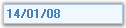

::: {style="DISPLAY: none"}
{#d2h_url_template}{#d2h_package_url style="WIDTH: 0px; DISPLAY: none; HEIGHT: 0px"}
:::

::: {.d2h_secondary_topic style="PADDING-BOTTOM: 10pt; MARGIN: 0pt; PADDING-LEFT: 0pt; PADDING-RIGHT: 0pt; PADDING-TOP: 0pt"}
#### MaskedEditBox {#maskededitbox style="tab-stops: 0pt"}

The **MaskedEditBox control** is an edit control that provides an easy and reliable way of collecting user input and displaying standard data in specific formats from any data source. Some of the common uses of the MaskedEditBox controls are** IP Address** **edit control, Phone Number edit control **and** Social Security edit control.**[]{style="COLOR: black"}

[]{style="COLOR: black"} 

{border="0"}

[]{style="COLOR: black"} 

Figure 527: MaskedEditBox Control

[]{style="COLOR: black"} 

If you define an input mask using the **Mask** property, each character position in the MaskedEditBox control maps to either a placeholder of a specified type or a literal character. Literal characters, or literals, can give visual cues about the type of data being used. For example, the parentheses surrounding the area code of a telephone number are literals: (919).[]{style="COLOR: black"}

[]{style="COLOR: black"} 

MaskedEditBox control exhibits the similar properties of CurrencyTextBox[.]{style="FONT-FAMILY: 'Verdana','sans-serif'; COLOR: black; FONT-SIZE: 8pt"}[]{style="COLOR: black"}

 

More:

[ ]{#related-topics}

[{border="0" align="absMiddle"}Features](ms-xhelp:///?Id=d1e9c388-e29c-4345-af4f-e326e31bff71){style="TEXT-DECORATION: none"}

[{border="0" align="absMiddle"}Creating MaskedEditBox](ms-xhelp:///?Id=bddd69dd-fe2f-4cfd-8fb9-2955a8fd49cf){style="TEXT-DECORATION: none"}

[{border="0" align="absMiddle"}Concepts and Features](ms-xhelp:///?Id=4f9d2ef3-3907-4325-bf95-9567b24ed265){style="TEXT-DECORATION: none"}

[{border="0" align="absMiddle"}MaskedEditBox Events](ms-xhelp:///?Id=8e09fc10-d9b5-4590-8c2c-565f9818f505){style="TEXT-DECORATION: none"}
:::
