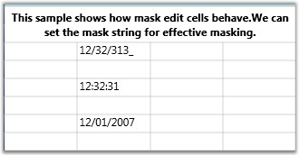

::: {style="DISPLAY: none"}
{#d2h_url_template}{#d2h_package_url style="WIDTH: 0px; DISPLAY: none; HEIGHT: 0px"}
:::

:::: {.d2h_secondary_topic style="PADDING-BOTTOM: 10pt; MARGIN: 0pt; PADDING-LEFT: 0pt; PADDING-RIGHT: 0pt; PADDING-TOP: 0pt"}
##### Mask Edit Cells {#mask-edit-cells style="tab-stops: 0pt"}

MaskEdit cell type allows you to create specially formatted text cells that confirm to an edit mask that you specify. The Style.MaskEdit.Mask property holds the mask string, which will control the format of the input text being entered. The Mask Edit cells are useful when the user wants to display some formatted text such as Social Security Number (SSN), telephone number etc.

**[]{style="COLOR: #15428b"}** 

Example

Setting up Mask Edit cells with different mask string.

 

+---------------------------------------------------------------------------------------------------------------------------------------+
| [\[C#\]]{style="FONT-FAMILY: 'Courier New'; COLOR: black"}                                                                            |
|                                                                                                                                       |
| **[]{style="FONT-FAMILY: 'Courier New'; COLOR: black"}**                                                                              |
|                                                                                                                                       |
| [var maskStyleInfo = [this]{style="COLOR: blue"}.grid.Model\[6, 2\];]{style="FONT-FAMILY: 'Courier New'"}                             |
|                                                                                                                                       |
| [maskStyleInfo.CellType = [\"MaskEdit\"]{style="COLOR: #a31515"};]{style="FONT-FAMILY: 'Courier New'"}                                |
|                                                                                                                                       |
| [maskStyleInfo.MaskEdit = GridMaskEditInfo.Default;]{style="FONT-FAMILY: 'Courier New'"}                                              |
|                                                                                                                                       |
| [maskStyleInfo.MaskEdit.Mask = [\"00/00/0000\"]{style="COLOR: #a31515"};]{style="FONT-FAMILY: 'Courier New'"}                         |
|                                                                                                                                       |
| [maskStyleInfo.CellValue = 1232313;]{style="FONT-FAMILY: 'Courier New'"}                                                              |
|                                                                                                                                       |
| []{style="FONT-FAMILY: 'Courier New'"}                                                                                                |
|                                                                                                                                       |
| [var maskStyleInfo1 = [this]{style="COLOR: blue"}.grid.Model\[8, 2\];]{style="FONT-FAMILY: 'Courier New'"}                            |
|                                                                                                                                       |
| [maskStyleInfo1.CellType = [\"MaskEdit\"]{style="COLOR: #a31515"};]{style="FONT-FAMILY: 'Courier New'"}                               |
|                                                                                                                                       |
| [maskStyleInfo1.MaskEdit = GridMaskEditInfo.Default;]{style="FONT-FAMILY: 'Courier New'"}                                             |
|                                                                                                                                       |
| [maskStyleInfo1.MaskEdit.Mask = [\"00:00:00\"]{style="COLOR: #a31515"};]{style="FONT-FAMILY: 'Courier New'"}                          |
|                                                                                                                                       |
| [maskStyleInfo1.CellValue = 1232313;]{style="FONT-FAMILY: 'Courier New'"}                                                             |
|                                                                                                                                       |
| []{style="FONT-FAMILY: 'Courier New'"}                                                                                                |
|                                                                                                                                       |
| [var maskStyleInfo2 = [this]{style="COLOR: blue"}.grid.Model\[10, 2\];]{style="FONT-FAMILY: 'Courier New'"}                           |
|                                                                                                                                       |
| [maskStyleInfo2.CellType = [\"MaskEdit\"]{style="COLOR: #a31515"};]{style="FONT-FAMILY: 'Courier New'"}                               |
|                                                                                                                                       |
| [maskStyleInfo2.MaskEdit = GridMaskEditInfo.Default;]{style="FONT-FAMILY: 'Courier New'"}                                             |
|                                                                                                                                       |
| [maskStyleInfo2.MaskEdit.Mask = [\"00/00/0000\"]{style="COLOR: #a31515"};]{style="FONT-FAMILY: 'Courier New'"}                        |
|                                                                                                                                       |
| [maskStyleInfo2.CellValue = [\"12012007\"]{style="COLOR: #a31515"};[\"]{style="COLOR: #a31515"};]{style="FONT-FAMILY: 'Courier New'"} |
+---------------------------------------------------------------------------------------------------------------------------------------+

 

Output

The following output is generated using the code above.

 

{border="0"}

Figure 31: Mask Edit Cell

::: {style="BORDER-BOTTOM: windowtext 1pt solid; BORDER-LEFT: medium none; PADDING-BOTTOM: 1pt; MARGIN-TOP: 9pt; PADDING-LEFT: 0pt; PADDING-RIGHT: 0pt; MARGIN-BOTTOM: 9pt; BORDER-TOP: windowtext 1pt solid; BORDER-RIGHT: medium none; PADDING-TOP: 1pt"}
{border="0"}Note: For complete code, please refer to the following browser sample.
:::

**[]{style="COLOR: #15428b"}** 

\...\\My Documents\\Syncfusion\\EssentialStudio\\\<Version Number\>\\WPF\\Grid.WPF\\Samples\\3.5\\WindowsSamples\\Cell Types\\Mask Edit Cell Demo

[]{#related-topics}
::::
