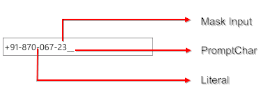

::: {style="DISPLAY: none"}
{#d2h_url_template}{#d2h_package_url style="WIDTH: 0px; DISPLAY: none; HEIGHT: 0px"}
:::

::::: {#nsbanner .d2h_main_nsbanner style="BORDER-BOTTOM: #999999 1px solid; POSITION: relative; PADDING-BOTTOM: 0px; BACKGROUND-COLOR: transparent; PADDING-LEFT: 0px; PADDING-RIGHT: 0px; DISPLAY: none; BORDER-TOP: #999999 1px solid; PADDING-TOP: 0px; LEFT: 0px"}
:::: {#TitleRow .d2h_main_titlerow style="PADDING-BOTTOM: 4px; BACKGROUND-COLOR: transparent; PADDING-LEFT: 22px; WIDTH: 100%; PADDING-RIGHT: 10px; DISPLAY: none; PADDING-TOP: 4px"}
::: {#ienav .d2h_main_ienav style="DISPLAY: none"}
{#D2HPrevious .D2HPreviousEnabled}  {#D2HNext .D2HNextEnabled}
:::
::::
:::::

:::: {#nstext .d2h_main_nstext style="PADDING-BOTTOM: 10px; BACKGROUND-COLOR: transparent; PADDING-LEFT: 22px; PADDING-RIGHT: 10px; HEIGHT: 100%; OVERFLOW: auto; PADDING-TOP: 5px" hasuserbackground="true" valign="bottom"}
::: {#d2h_breadcrumbs .d2h_breadcrumbs}
[Essential Studio User Guide Documentation](ms-xhelp:///?Id=12457748-09e3-4d74-a240-8e049cedf030){.d2h_breadcrumbsNormal}[ \> ]{.d2h_breadcrumbsLinkSeparator}[User Interface Edition](ms-xhelp:///?Id=c29296b7-531c-413b-a0ec-488ca1f7f669){.d2h_breadcrumbsNormal}[ \> ]{.d2h_breadcrumbsLinkSeparator}[Essential Windows Phone](ms-xhelp:///?Id=5ea1999c-4eff-4775-b84e-407dc825f555){.d2h_breadcrumbsNormal}[ \> ]{.d2h_breadcrumbsLinkSeparator}[Essential Tools]{.d2h_breadcrumbsContentsOnly}[ \> ]{.d2h_breadcrumbsLinkSeparator}[Tools Phone Controls](ms-xhelp:///?Id=785aeb70-aa68-45ce-9666-964f209e58fd){.d2h_breadcrumbsNormal}
:::

## MaskEditTextBox {#maskedittextbox style="tab-stops: 0pt"}

The **MaskEditTextBox** class is an enhanced TextBox control that supports a declarative syntax for accepting or rejecting user input. It uses the Mask property to distinguish between proper and improper user input and a validation string to perform RegEx validation.

 

The core features of the MaskEditTextBox control are as follows:

 

[·      ]{style="FONT-FAMILY: Symbol"}[Using the Mask property, you can specify the input without writing any custom validation logic in your application. ]{style="FONT-FAMILY: 'Arial','sans-serif'"}

[·      ]{style="FONT-FAMILY: Symbol"}[Data binding support. ]{style="FONT-FAMILY: 'Arial','sans-serif'"}

[·      ]{style="FONT-FAMILY: Symbol"}[Watermark support. ]{style="FONT-FAMILY: 'Arial','sans-serif'"}

[·      ]{style="FONT-FAMILY: Symbol"}[Data validation.]{style="FONT-FAMILY: 'Arial','sans-serif'"}[]{style="FONT-FAMILY: 'Arial','sans-serif'"}

{border="0"}

Fig 133: Structure of MaskEditTextBox

Use Case Scenarios

The MaskEditTextBox control is helpful for data entry operations such as phone number, date, time, etc.

 

More:

[ ]{#related-topics}

[{border="0" align="absMiddle"}Tables for Properties, Methods, and Events](ms-xhelp:///?Id=a55e8cef-7c9f-4d27-90c5-2127e78676e7){style="TEXT-DECORATION: none"}

[{border="0" align="absMiddle"}Features of MaskEditTextBox](ms-xhelp:///?Id=e1950d71-6956-4862-8312-071169826c87){style="TEXT-DECORATION: none"}
::::
