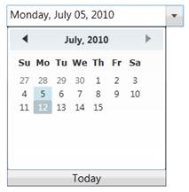

::: {style="DISPLAY: none"}
{#d2h_url_template}{#d2h_package_url style="WIDTH: 0px; DISPLAY: none; HEIGHT: 0px"}
:::

::: {.d2h_secondary_topic style="PADDING-BOTTOM: 10pt; MARGIN: 0pt; PADDING-LEFT: 0pt; PADDING-RIGHT: 0pt; PADDING-TOP: 0pt"}
#### Maximum and Minimum Value {#maximum-and-minimum-value style="tab-stops: 0pt"}

DateTimeEdit control allows you to set the start and end dates by using the **MinDateTime** and **MaxDateTime** properties. The Calendar also displays only the dates between the MinDateTime and MaxDateTime.

When the MinDateTime is set, if the new MinDateTime property value is greater than the MaxDateTime property value, then the MaxDateTime is set equal to the MinDateTime. If the DateTime (DateTime property) is less than the new MinDateTime, then the DateTime property is also set equal to the MinDateTime.

When the MaxDateTime is set, if the MinDateTime property is greater than the new MaxDateTime property, then the MinDateTime property value is set equal to the MaxDateTime. If the current DateTime (DateTime property) is greater than the new MaxDateTime, then the DateTime property is set equal to the MaxDateTime.

 

+-------------------------------------------------------------------------------------------------------------------------------------------------------------------------------------------------------------------------------------------------------------------------------------------------------------------------------------------------------------------------------------------------------------------------------------------------------------------------------------------------------------------------------------------------------------------------------------------------------------------------------------------------------------------------------------------------------------------------------------------------------------------------------------------------------------------------------------------------------------------------------------------------------------------------------------------------+
| [XAML]{style="COLOR: black"}                                                                                                                                                                                                                                                                                                                                                                                                                                                                                                                                                                                                                                                                                                                                                                                                                                                                                                                    |
+-------------------------------------------------------------------------------------------------------------------------------------------------------------------------------------------------------------------------------------------------------------------------------------------------------------------------------------------------------------------------------------------------------------------------------------------------------------------------------------------------------------------------------------------------------------------------------------------------------------------------------------------------------------------------------------------------------------------------------------------------------------------------------------------------------------------------------------------------------------------------------------------------------------------------------------------------+
| [\<]{style="FONT-FAMILY: Consolas; COLOR: blue; FONT-SIZE: 9.5pt"}[syncfusion]{style="FONT-FAMILY: Consolas; COLOR: #a31515; FONT-SIZE: 9.5pt"}[:]{style="FONT-FAMILY: Consolas; COLOR: blue; FONT-SIZE: 9.5pt"}[DateTimeEdit]{style="FONT-FAMILY: Consolas; COLOR: #a31515; FONT-SIZE: 9.5pt"}[ x]{style="FONT-FAMILY: Consolas; COLOR: red; FONT-SIZE: 9.5pt"}[:]{style="FONT-FAMILY: Consolas; COLOR: blue; FONT-SIZE: 9.5pt"}[Name]{style="FONT-FAMILY: Consolas; COLOR: red; FONT-SIZE: 9.5pt"}[=\"dateTimeEdit\"]{style="FONT-FAMILY: Consolas; COLOR: blue; FONT-SIZE: 9.5pt"}[ Height]{style="FONT-FAMILY: Consolas; COLOR: red; FONT-SIZE: 9.5pt"}[=\"25\"]{style="FONT-FAMILY: Consolas; COLOR: blue; FONT-SIZE: 9.5pt"}[ Width]{style="FONT-FAMILY: Consolas; COLOR: red; FONT-SIZE: 9.5pt"}[=\"200\"]{style="FONT-FAMILY: Consolas; COLOR: blue; FONT-SIZE: 9.5pt"}[ ]{style="FONT-FAMILY: Consolas; COLOR: red; FONT-SIZE: 9.5pt"} |
|                                                                                                                                                                                                                                                                                                                                                                                                                                                                                                                                                                                                                                                                                                                                                                                                                                                                                                                                                 |
| [                         DateTime]{style="FONT-FAMILY: Consolas; COLOR: red; FONT-SIZE: 9.5pt"}[=\"07/05/2010\"]{style="FONT-FAMILY: Consolas; COLOR: blue; FONT-SIZE: 9.5pt"}[ Pattern]{style="FONT-FAMILY: Consolas; COLOR: red; FONT-SIZE: 9.5pt"}[=\"LongDate\"]{style="FONT-FAMILY: Consolas; COLOR: blue; FONT-SIZE: 9.5pt"}[ ]{style="FONT-FAMILY: Consolas; FONT-SIZE: 9.5pt"}                                                                                                                                                                                                                                                                                                                                                                                                                                                                                                                                                         |
|                                                                                                                                                                                                                                                                                                                                                                                                                                                                                                                                                                                                                                                                                                                                                                                                                                                                                                                                                 |
| [                         [MinDateTime]{style="COLOR: red"}[=\"01/01/2010\"]{style="COLOR: blue"}[ MaxDateTime]{style="COLOR: red"}[=\"07/15/2010\"/\>]{style="COLOR: blue"}]{style="FONT-FAMILY: Consolas; FONT-SIZE: 9.5pt"}                                                                                                                                                                                                                                                                                                                                                                                                                                                                                                                                                                                                                                                                                                                  |
+-------------------------------------------------------------------------------------------------------------------------------------------------------------------------------------------------------------------------------------------------------------------------------------------------------------------------------------------------------------------------------------------------------------------------------------------------------------------------------------------------------------------------------------------------------------------------------------------------------------------------------------------------------------------------------------------------------------------------------------------------------------------------------------------------------------------------------------------------------------------------------------------------------------------------------------------------+

[]{style="COLOR: black"} 

+----------------------------------------------------------------------------------------------------------------------------------------------------------------+
| [C#]{style="COLOR: black"}                                                                                                                                     |
+----------------------------------------------------------------------------------------------------------------------------------------------------------------+
| [Syncfusion.Windows.Shared.[DateTimeEdit]{style="COLOR: #2b91af"} dateTimeEdit = [new]{style="COLOR: blue"} ]{style="FONT-FAMILY: Consolas; FONT-SIZE: 9.5pt"} |
|                                                                                                                                                                |
| [                          Syncfusion.Windows.Shared.[DateTimeEdit]{style="COLOR: #2b91af"}();]{style="FONT-FAMILY: Consolas; FONT-SIZE: 9.5pt"}               |
|                                                                                                                                                                |
| [dateTimeEdit.Width = 200;]{style="FONT-FAMILY: Consolas; FONT-SIZE: 9.5pt"}                                                                                   |
|                                                                                                                                                                |
| [dateTimeEdit.Height = 25;]{style="FONT-FAMILY: Consolas; FONT-SIZE: 9.5pt"}                                                                                   |
|                                                                                                                                                                |
| [dateTimeEdit.DateTime = [new]{style="COLOR: blue"} [DateTime]{style="COLOR: #2b91af"}(2010, 07, 05);]{style="FONT-FAMILY: Consolas; FONT-SIZE: 9.5pt"}        |
|                                                                                                                                                                |
| [dateTimeEdit.MinDateTime = [new]{style="COLOR: blue"} [DateTime]{style="COLOR: #2b91af"}(2010, 01, 01);]{style="FONT-FAMILY: Consolas; FONT-SIZE: 9.5pt"}     |
|                                                                                                                                                                |
| [dateTimeEdit.MaxDateTime = [new]{style="COLOR: blue"} [DateTime]{style="COLOR: #2b91af"}(2010, 07, 15);]{style="FONT-FAMILY: Consolas; FONT-SIZE: 9.5pt"}     |
|                                                                                                                                                                |
| [dateTimeEdit.Pattern = [DateTimePattern]{style="COLOR: #2b91af"}.LongDate;]{style="FONT-FAMILY: Consolas; FONT-SIZE: 9.5pt"}                                  |
|                                                                                                                                                                |
| [this]{style="FONT-FAMILY: Consolas; COLOR: blue; FONT-SIZE: 9.5pt"}[.LayoutRoot.Children.Add(dateTimeEdit);]{style="FONT-FAMILY: Consolas; FONT-SIZE: 9.5pt"} |
+----------------------------------------------------------------------------------------------------------------------------------------------------------------+

 

{border="0"}

Figure 284: DateTimeEdit

This Calendar also displays the range of dates between the MinDateTime and MaxDateTime.

 

 

[]{#related-topics}
:::
