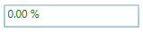
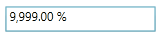
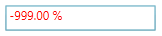

::: {style="DISPLAY: none"}
{#d2h_url_template}{#d2h_package_url style="WIDTH: 0px; DISPLAY: none; HEIGHT: 0px"}
:::

::::: {.d2h_secondary_topic style="PADDING-BOTTOM: 10pt; MARGIN: 0pt; PADDING-LEFT: 0pt; PADDING-RIGHT: 0pt; PADDING-TOP: 0pt"}
#### Maximum and Minimum Value {#maximum-and-minimum-value style="tab-stops: 0pt"}

[]{#_MinValue_3} 

MinValue

Minimum allowed PercentValue for the PercentTextBox. If the new MinValue property value is greater than the MaxValue property value, then the MaxValue is set equal to the MinValue. If the Value is less than the new MinValue, then the Value property is also set equal to the MinValue.

 

[]{#_MaxValue_3}MaxValue

Maximum allowed PercentValue for the PercentTextBox. If the MinValue property is greater than the new MaxValue property, then the MinValue property value is set equal to the MaxValue. If the current Value is greater than the new MaxValue, then the Value property is set equal to the Maxvalue.

 

[]{#_MinValidation_3}MinValidation

You can validate the MinValue in two ways:

[·      ]{style="FONT-FAMILY: Symbol"}OnKeyPress -- MinValue of the PercentTextBox is validated on the key press.

[·      ]{style="FONT-FAMILY: Symbol"}OnLostFocus -- MinValue of the PercentTextBox is validated on the lost focus only.

[]{style="FONT-FAMILY: 'Trebuchet MS','sans-serif'; COLOR: #15428b; FONT-SIZE: 9pt"} 

[]{#_MaxValidation_3}MaxValidation

You can validate the MaxValue in two ways:

[·      ]{style="FONT-FAMILY: Symbol"}OnKeyPress -- MaxValue of the PercentTextBox is validated on the key press.

[·      ]{style="FONT-FAMILY: Symbol"}OnLostFocus -- MaxValue of the PercentTextBox is validated on the lost focus only.

 

[]{#_MinValueOnExceedMinDigit_3}MinValueOnExceedMinDigit

If this property is set to true, then when you enter a value less than the MinValue then it will automatically assign the MinValue to the PercentValue property. Otherwise it will not allow the key press.

::: {style="BORDER-BOTTOM: windowtext 1pt solid; BORDER-LEFT: medium none; PADDING-BOTTOM: 1pt; MARGIN: 9pt 0pt 9pt 18pt; PADDING-LEFT: 0pt; PADDING-RIGHT: 0pt; BORDER-TOP: windowtext 1pt solid; BORDER-RIGHT: medium none; PADDING-TOP: 1pt"}
Note: This will be enabled only when the MinValidation is set to OnKeyPress.

 
:::

[]{#_MaxValueOnExceedMaxDigit_3}MaxValueOnExceedMaxDigit

If this property is set to true, then when you enter a value greater than the MaxValue then it will automatically assign the MaxValue to the PercentValue property. Otherwise it will not allow the key press.

 

::: {style="BORDER-BOTTOM: windowtext 1pt solid; BORDER-LEFT: medium none; PADDING-BOTTOM: 1pt; MARGIN: 9pt 0pt 9pt 18pt; PADDING-LEFT: 0pt; PADDING-RIGHT: 0pt; BORDER-TOP: windowtext 1pt solid; BORDER-RIGHT: medium none; PADDING-TOP: 1pt"}
Note: This will be enabled only when the MaxValidation is set to OnKeyPress.

 
:::

+-----------------------------------------------------------------------------------------------------------------------------------------------------------------------------------------------------------------------------------------------------------------------------------------------------------------------------------------------------------------------------------------------------------------------------------------------------------------------------------------------------------------------------------------------------------------------------------------------------------------------------------------------------------------------------------------------------------------------------------------------------------------------------------------------------------------------------------------------------------------------------------------------------------------------------------------+
| **[XAML]{style="COLOR: black"}**[]{style="COLOR: black"}                                                                                                                                                                                                                                                                                                                                                                                                                                                                                                                                                                                                                                                                                                                                                                                                                                                                                |
|                                                                                                                                                                                                                                                                                                                                                                                                                                                                                                                                                                                                                                                                                                                                                                                                                                                                                                                                         |
|                                                                                                                                                                                                                                                                                                                                                                                                                                                                                                                                                                                                                                                                                                                                                                                                                                                                                                                                         |
|                                                                                                                                                                                                                                                                                                                                                                                                                                                                                                                                                                                                                                                                                                                                                                                                                                                                                                                                         |
| [\<]{style="FONT-FAMILY: Consolas; COLOR: blue; FONT-SIZE: 9.5pt"}[syncfusion]{style="FONT-FAMILY: Consolas; COLOR: #a31515; FONT-SIZE: 9.5pt"}[:]{style="FONT-FAMILY: Consolas; COLOR: blue; FONT-SIZE: 9.5pt"}[PercentTextBox]{style="FONT-FAMILY: Consolas; COLOR: #a31515; FONT-SIZE: 9.5pt"}[ x]{style="FONT-FAMILY: Consolas; COLOR: red; FONT-SIZE: 9.5pt"}[:]{style="FONT-FAMILY: Consolas; COLOR: blue; FONT-SIZE: 9.5pt"}[Name]{style="FONT-FAMILY: Consolas; COLOR: red; FONT-SIZE: 9.5pt"}[=\"percentTextBox\"]{style="FONT-FAMILY: Consolas; COLOR: blue; FONT-SIZE: 9.5pt"}[ Height]{style="FONT-FAMILY: Consolas; COLOR: red; FONT-SIZE: 9.5pt"}[=\"25\"]{style="FONT-FAMILY: Consolas; COLOR: blue; FONT-SIZE: 9.5pt"}[ Width]{style="FONT-FAMILY: Consolas; COLOR: red; FONT-SIZE: 9.5pt"}[=\"150\"]{style="FONT-FAMILY: Consolas; COLOR: blue; FONT-SIZE: 9.5pt"}[ ]{style="FONT-FAMILY: Consolas; FONT-SIZE: 9.5pt"} |
|                                                                                                                                                                                                                                                                                                                                                                                                                                                                                                                                                                                                                                                                                                                                                                                                                                                                                                                                         |
| [                           [ MinValue]{style="COLOR: red"}[=\"-999\"]{style="COLOR: blue"}[ MaxValue]{style="COLOR: red"}[=\"999\"]{style="COLOR: blue"} ]{style="FONT-FAMILY: Consolas; FONT-SIZE: 9.5pt"}                                                                                                                                                                                                                                                                                                                                                                                                                                                                                                                                                                                                                                                                                                                            |
|                                                                                                                                                                                                                                                                                                                                                                                                                                                                                                                                                                                                                                                                                                                                                                                                                                                                                                                                         |
| [                           [ MinValidation]{style="COLOR: red"}[=\"OnKeyPress\"]{style="COLOR: blue"}[ MaxValidation]{style="COLOR: red"}[=\"OnLostFocus\"]{style="COLOR: blue"}]{style="FONT-FAMILY: Consolas; FONT-SIZE: 9.5pt"}                                                                                                                                                                                                                                                                                                                                                                                                                                                                                                                                                                                                                                                                                                     |
|                                                                                                                                                                                                                                                                                                                                                                                                                                                                                                                                                                                                                                                                                                                                                                                                                                                                                                                                         |
| [                           [ MinValueOnExceedMinDigit]{style="COLOR: red"}[=\"True\"]{style="COLOR: blue"} ]{style="FONT-FAMILY: Consolas; FONT-SIZE: 9.5pt"}                                                                                                                                                                                                                                                                                                                                                                                                                                                                                                                                                                                                                                                                                                                                                                          |
|                                                                                                                                                                                                                                                                                                                                                                                                                                                                                                                                                                                                                                                                                                                                                                                                                                                                                                                                         |
| [                           [ MaxValueOnExceedMaxDigit]{style="COLOR: red"}[=\"True\"/\>]{style="COLOR: blue"}]{style="FONT-FAMILY: Consolas; FONT-SIZE: 9.5pt"}                                                                                                                                                                                                                                                                                                                                                                                                                                                                                                                                                                                                                                                                                                                                                                        |
+-----------------------------------------------------------------------------------------------------------------------------------------------------------------------------------------------------------------------------------------------------------------------------------------------------------------------------------------------------------------------------------------------------------------------------------------------------------------------------------------------------------------------------------------------------------------------------------------------------------------------------------------------------------------------------------------------------------------------------------------------------------------------------------------------------------------------------------------------------------------------------------------------------------------------------------------+

 

+------------------------------------------------------------------------------------------------------------------------------------------------------------------------------------------------------------------------------+
| **[C# ]{style="COLOR: black"}**                                                                                                                                                                                              |
|                                                                                                                                                                                                                              |
| []{style="FONT-FAMILY: Consolas; COLOR: #2b91af; FONT-SIZE: 9.5pt"}                                                                                                                                                          |
|                                                                                                                                                                                                                              |
| [PercentTextBox]{style="FONT-FAMILY: Consolas; COLOR: #2b91af; FONT-SIZE: 9.5pt"}[ percentTextBox = [new]{style="COLOR: blue"} [PercentTextBox]{style="COLOR: #2b91af"}();]{style="FONT-FAMILY: Consolas; FONT-SIZE: 9.5pt"} |
|                                                                                                                                                                                                                              |
| [percentTextBox.Width = 150;]{style="FONT-FAMILY: Consolas; FONT-SIZE: 9.5pt"}                                                                                                                                               |
|                                                                                                                                                                                                                              |
| [percentTextBox.Height = 25;]{style="FONT-FAMILY: Consolas; FONT-SIZE: 9.5pt"}                                                                                                                                               |
|                                                                                                                                                                                                                              |
| [percentTextBox.MinValue = -999.99;]{style="FONT-FAMILY: Consolas; FONT-SIZE: 9.5pt"}                                                                                                                                        |
|                                                                                                                                                                                                                              |
| [percentTextBox.MaxValue = 999.99;]{style="FONT-FAMILY: Consolas; FONT-SIZE: 9.5pt"}                                                                                                                                         |
|                                                                                                                                                                                                                              |
| [percentTextBox.MinValidation = [MinValidation]{style="COLOR: #2b91af"}.OnKeyPress;]{style="FONT-FAMILY: Consolas; FONT-SIZE: 9.5pt"}                                                                                        |
|                                                                                                                                                                                                                              |
| [percentTextBox.MaxValidation = [MaxValidation]{style="COLOR: #2b91af"}.OnLostFocus;]{style="FONT-FAMILY: Consolas; FONT-SIZE: 9.5pt"}                                                                                       |
|                                                                                                                                                                                                                              |
| [percentTextBox.MinValueOnExceedMinDigit = [true]{style="COLOR: blue"};]{style="FONT-FAMILY: Consolas; FONT-SIZE: 9.5pt"}                                                                                                    |
|                                                                                                                                                                                                                              |
| [percentTextBox.MaxValueOnExceedMaxDigit = [true]{style="COLOR: blue"};]{style="FONT-FAMILY: Consolas; FONT-SIZE: 9.5pt"}                                                                                                    |
+------------------------------------------------------------------------------------------------------------------------------------------------------------------------------------------------------------------------------+

 

Initially there is no value assigned to the PercentTextBox. So it displays the default value as zero.

{border="0"}

 

Figure 785: PercentTextBox

 

MaxValidation is set to OnLostFocus, so the MaxValidation will be performed only in the lost focus.

{border="0"}

 

Figure 786: PercentTextBox

 

MinValidation is set to OnKeyPress, so you cannot enter a value less than the MinValue. If you try to enter a value less than the MinValue, then the MinValue will be set to the PercentValue property if the MinValueOnExceedMinDigit is set to true, otherwise it will not allow the key press.

 

{border="0"}

Figure 787: PercentTextBox

[]{#related-topics}
:::::
