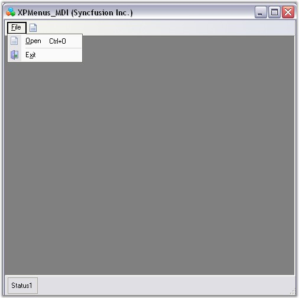
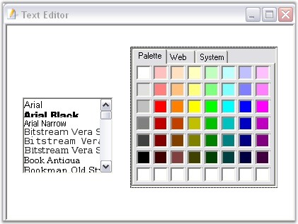
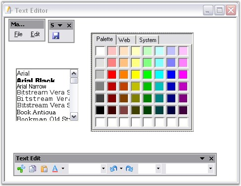

::: {style="DISPLAY: none"}
{#d2h_url_template}{#d2h_package_url style="WIDTH: 0px; DISPLAY: none; HEIGHT: 0px"}
:::

::: {.d2h_secondary_topic style="PADDING-BOTTOM: 10pt; MARGIN: 0pt; PADDING-LEFT: 0pt; PADDING-RIGHT: 0pt; PADDING-TOP: 0pt"}
#### MDI Child Forms {#mdi-child-forms style="tab-stops: 0pt"}

[]{style="COLOR: #15428b"} 

This section illustrates how to create MDI Child forms using the ChildFrameBarManager.

 

Follow the steps below to create MDI parent form and MDI child form.

[]{style="COLOR: #15428b"} 

Creating MDI ParentForm

[]{style="COLOR: #15428b"} 

1.   Set up an **MDIParent** form by setting **Form.IsMdiContainer** property to true.

 

2.   Add bar items, \'Open\' and \'Exit\', under File menu bar using **MainFrameBarManager**. Refer to [Creating Menus]{style="COLOR: black"}.

[]{style="COLOR: #15428b"} 

{border="0"}

[]{style="COLOR: #15428b"} 

Figure 822: MDIMainForm

[]{style="COLOR: #15428b"} 

3.   Create a new form named TextEditor, with the controls **FontListBox** and **ColorUIControl.** We will consider this form as the MDIChildForm.

[]{style="COLOR: #15428b"} 

{border="0"}

[]{style="COLOR: #15428b"} 

Figure 823: MDIChildForm with Fontlist and ColorUIControl

[]{style="COLOR: #15428b"} 

4.   Drag-and-Drop ChildFrameBarManager to the child form and add necessary Bar items**.** Adding bar items using ChildFrameBarManager is similar to MainFrameBarManager.

[]{style="COLOR: #15428b"} 

[{border="0"}]{style="COLOR: #15428b"}[]{style="COLOR: #15428b"}

**[]{style="COLOR: #15428b"}** 

Figure 824: MDIChildForm with Fontlist, ColorUIControl and XP Toolbars

[]{style="COLOR: #15428b"} 

5.   Now merge the toolbars and menus of the child form with the Main form using **RegisterMDIChildType** function as follows.

[]{style="COLOR: #15428b"} 

+------------------------------------------------------------------------------------------------------------------------------------------------------------------------------------------------------------------------------------------------------------------------------------------------------+
| **[\[C#\]]{style="FONT-FAMILY: 'Courier New'; COLOR: black"}**                                                                                                                                                                                                                                       |
|                                                                                                                                                                                                                                                                                                      |
| **[]{style="FONT-FAMILY: 'Courier New'; COLOR: black"}**                                                                                                                                                                                                                                             |
|                                                                                                                                                                                                                                                                                                      |
| [this]{style="FONT-FAMILY: 'Courier New'; COLOR: blue"}[.MainFrameBarManager1.RegisterMdiChildTypes(]{style="FONT-FAMILY: 'Courier New'; COLOR: black"}[new]{style="FONT-FAMILY: 'Courier New'; COLOR: blue"}[ Type\[\]{typeof(TextEditorForm)});]{style="FONT-FAMILY: 'Courier New'; COLOR: black"} |
+------------------------------------------------------------------------------------------------------------------------------------------------------------------------------------------------------------------------------------------------------------------------------------------------------+

[]{style="COLOR: #15428b"} 

+---------------------------------------------------------------------------------------------------------------------------------------------------------------------------------------------------------------------------+
| **[\[VB.NET\]]{style="FONT-FAMILY: 'Courier New'; COLOR: black"}**                                                                                                                                                        |
|                                                                                                                                                                                                                           |
| **[]{style="COLOR: black"}**                                                                                                                                                                                              |
|                                                                                                                                                                                                                           |
| [Me]{style="FONT-FAMILY: 'Courier New'; COLOR: blue"}[.MainFrameBarManager1.RegisterMdiChildTypes([New]{style="COLOR: blue"} Type(){[GetType]{style="COLOR: blue"}(TextEditorForm)})]{style="FONT-FAMILY: 'Courier New'"} |
+---------------------------------------------------------------------------------------------------------------------------------------------------------------------------------------------------------------------------+

[]{style="COLOR: #15428b"} 

A sample demonstrating the MDI feature is available in the below sample installation location.

[]{style="COLOR: #15428b"} 

..\\My Documents\\Syncfusion\\EssentialStudio\\***Version Number***\\Windows\\Tools.Windows\\Samples\\2.0\\Menus Package\\XPMenusMDI

[]{style="COLOR: #15428b"} 

More:

[ ]{#related-topics}

[{border="0" align="absMiddle"}MDI Merging](ms-xhelp:///?Id=696f144b-e550-4df8-abd3-8efb685c7ece){style="TEXT-DECORATION: none"}
:::
