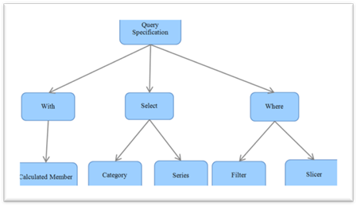

::: {style="DISPLAY: none"}
{#d2h_url_template}{#d2h_package_url style="WIDTH: 0px; DISPLAY: none; HEIGHT: 0px"}
:::

::::: {#nsbanner .d2h_main_nsbanner style="BORDER-BOTTOM: #999999 1px solid; POSITION: relative; PADDING-BOTTOM: 0px; BACKGROUND-COLOR: transparent; PADDING-LEFT: 0px; PADDING-RIGHT: 0px; DISPLAY: none; BORDER-TOP: #999999 1px solid; PADDING-TOP: 0px; LEFT: 0px"}
:::: {#TitleRow .d2h_main_titlerow style="PADDING-BOTTOM: 4px; BACKGROUND-COLOR: transparent; PADDING-LEFT: 22px; WIDTH: 100%; PADDING-RIGHT: 10px; DISPLAY: none; PADDING-TOP: 4px"}
::: {#ienav .d2h_main_ienav style="DISPLAY: none"}
{#D2HPrevious .D2HPreviousEnabled}  {#D2HNext .D2HNextEnabled}
:::
::::
:::::

:::: {#nstext .d2h_main_nstext style="PADDING-BOTTOM: 10px; BACKGROUND-COLOR: transparent; PADDING-LEFT: 22px; PADDING-RIGHT: 10px; HEIGHT: 100%; OVERFLOW: auto; PADDING-TOP: 5px" hasuserbackground="true" valign="bottom"}
::: {#d2h_breadcrumbs .d2h_breadcrumbs}
[Essential Studio User Guide Documentation](ms-xhelp:///?Id=12457748-09e3-4d74-a240-8e049cedf030){.d2h_breadcrumbsNormal}[ \> ]{.d2h_breadcrumbsLinkSeparator}[Business Intelligence Edition](ms-xhelp:///?Id=fdf33dd8-62b2-47b9-ad7b-fc50e590bca5){.d2h_breadcrumbsNormal}[ \> ]{.d2h_breadcrumbsLinkSeparator}[Essential BI Common](ms-xhelp:///?Id=51cb28d1-f201-4ea8-9963-a8afa451f64c){.d2h_breadcrumbsNormal}[ \> ]{.d2h_breadcrumbsLinkSeparator}[Concepts](ms-xhelp:///?Id=c4af561c-5904-4dc4-8eaf-ec1e14451e92){.d2h_breadcrumbsNormal}[ \> ]{.d2h_breadcrumbsLinkSeparator}[QueryBuilderEngine](ms-xhelp:///?Id=355fc08c-4d81-4bea-8a8c-9a957615e282){.d2h_breadcrumbsNormal}
:::

### MDXQuerySpecification {#mdxqueryspecification style="tab-stops: 0pt"}

MDXQuerySpecification is the base for query creation. The MDXQuerySpecification will categorize the element into three clauses namely:

[·      ]{style="FONT-FAMILY: Symbol"}With

[·      ]{style="FONT-FAMILY: Symbol"}Select and

[·      ]{style="FONT-FAMILY: Symbol"}Where

The elements in the given report are iterated and stored according to the specification.

[·      ]{style="FONT-FAMILY: Symbol"}The calculated member element in the given report will be added under the **With** clause.

[·      ]{style="FONT-FAMILY: Symbol"}The categorical and series items in the given report's categorical elements and series element will come in the **Select** category.

[·      ]{style="FONT-FAMILY: Symbol"}The **Slicer** and **Filter** items will comes under the **Where** category.

Based on the current report, the **TogglePivot** value and the axis position of each item will be assigned before it is stored in the appropriate clauses.

{border="0"}

 

Figure 8: MDXQuerySpecification

[]{style="FONT-FAMILY: 'Times New Roman','serif'"} 

Once the query specification is created, the **GenerateQueryEx()** method of QueryBuilderEngine was called by passing the created MDXQuerySpecification to generate the query.

[]{#related-topics}
::::
