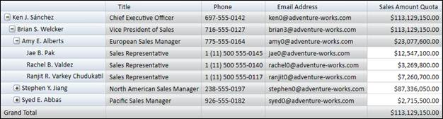
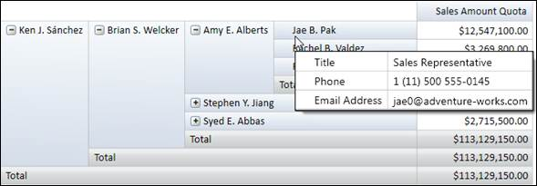

::: {style="DISPLAY: none"}
{#d2h_url_template} {#d2h_package_url style="WIDTH: 0px; DISPLAY: none; HEIGHT: 0px"}
:::

::::: {#nsbanner .d2h_main_nsbanner style="BORDER-BOTTOM: #999999 1px solid; POSITION: relative; PADDING-BOTTOM: 0px; BACKGROUND-COLOR: transparent; PADDING-LEFT: 0px; PADDING-RIGHT: 0px; DISPLAY: none; BORDER-TOP: #999999 1px solid; PADDING-TOP: 0px; LEFT: 0px"}
:::: {#TitleRow .d2h_main_titlerow style="PADDING-BOTTOM: 4px; BACKGROUND-COLOR: transparent; PADDING-LEFT: 22px; WIDTH: 100%; PADDING-RIGHT: 10px; DISPLAY: none; PADDING-TOP: 4px"}
::: {#ienav .d2h_main_ienav style="DISPLAY: none"}
{#D2HPrevious .D2HPreviousEnabled}  {#D2HNext .D2HNextEnabled}
:::
::::
:::::

:::: {#nstext .d2h_main_nstext style="PADDING-BOTTOM: 10px; BACKGROUND-COLOR: transparent; PADDING-LEFT: 22px; PADDING-RIGHT: 10px; HEIGHT: 100%; OVERFLOW: auto; PADDING-TOP: 5px" hasuserbackground="true" valign="bottom"}
::: {#d2h_breadcrumbs .d2h_breadcrumbs}
[Essential Studio User Guide Documentation](ms-xhelp:///?Id=12457748-09e3-4d74-a240-8e049cedf030){.d2h_breadcrumbsNormal} [ \> ]{.d2h_breadcrumbsLinkSeparator} [Business Intelligence Edition](ms-xhelp:///?Id=fdf33dd8-62b2-47b9-ad7b-fc50e590bca5){.d2h_breadcrumbsNormal} [ \> ]{.d2h_breadcrumbsLinkSeparator} [Essential BI WPF](ms-xhelp:///?Id=41e3d586-d922-4a01-8272-679fe4ae7343){.d2h_breadcrumbsNormal} [ \> ]{.d2h_breadcrumbsLinkSeparator} [Essential BI Grid]{.d2h_breadcrumbsContentsOnly} [ \> ]{.d2h_breadcrumbsLinkSeparator} [Concepts and Features](ms-xhelp:///?Id=ea758680-939d-4d65-8abe-8c3be198af29){.d2h_breadcrumbsNormal}
:::

## Member Properties {#member-properties style="tab-stops: 0pt"}

 

**OlapGrid** allows binding of **Dimension Members** along with their properties. Member properties cover the basic information about each member in each tuple. This basic information includes the member name, parent level, the number of children, and so on. Member properties are available for all members at a given level. In order to display member properties along with the dimension member, **OlapReport** requires member properties to be defined in the concerned dimension element. Also, the grid layout should be set to **ExcelLikeLayoutWithMemberProperties**.

[Click here for Sample Report with Member Properties]{.UGHyperlink} []{.UGHyperlink}

[]{style="FONT-SIZE: 11pt"} 

{border="0"}

Figure 26: OlapGrid with Member Properties

 

To display member properties via header tooltip, the following property of **OlapGrid** should be set to true.

+--------------------------------------------------------------------------------------------------+
| \[C#\]                                                                                           |
|                                                                                                  |
|                                                                                                  |
|                                                                                                  |
| [// To Display Member Properties in ToolTip]{style="COLOR: green"}                               |
|                                                                                                  |
| [this]{style="COLOR: blue"}.OlapGrid1.ShowMemberPropertiesToolTip = [true]{style="COLOR: blue"}; |
|                                                                                                  |
|                                                                                                  |
+--------------------------------------------------------------------------------------------------+

[]{style="FONT-SIZE: 11pt"} 

+-----------------------------------------------------------------------------------------------+
| \[VB\]                                                                                        |
|                                                                                               |
|                                                                                               |
|                                                                                               |
| [\' To Display Member Properties in ToolTip]{style="COLOR: green"}                            |
|                                                                                               |
| [Me]{style="COLOR: blue"}.OlapGrid1.ShowMemberPropertiesToolTip = [True]{style="COLOR: blue"} |
|                                                                                               |
|                                                                                               |
+-----------------------------------------------------------------------------------------------+

[]{style="FONT-SIZE: 11pt"} 

{border="0"}

Figure 27: OlapGrid displaying Member Properties via Header Tooltip

 

Sample Location

A sample demo is available at the following location:

**..\\Syncfusion\\EssentialStudio\\\<Versionnumber\>\\BI\\WPF\\OlapGrid.WPF\\Samples\\Application Scenario\\Member Properties Demo**

[]{#related-topics}
::::
