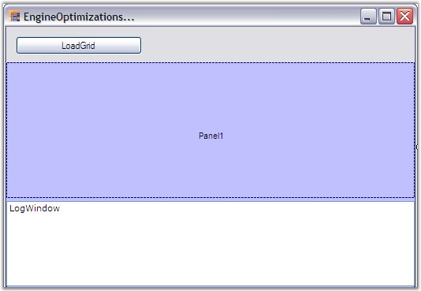
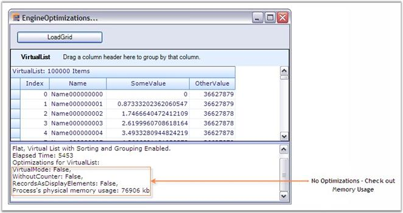
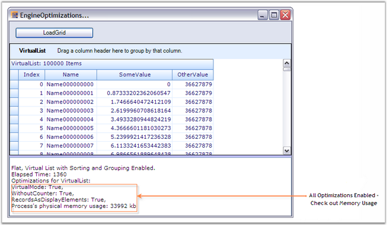
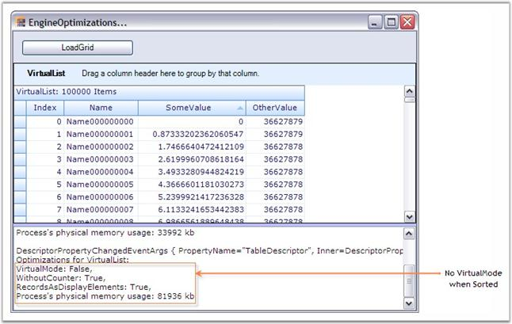
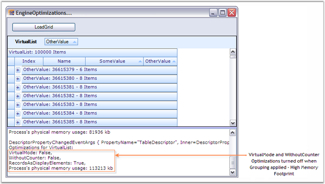

::: {style="DISPLAY: none"}
{#d2h_url_template}{#d2h_package_url style="WIDTH: 0px; DISPLAY: none; HEIGHT: 0px"}
:::

:::::: {.d2h_secondary_topic style="PADDING-BOTTOM: 10pt; MARGIN: 0pt; PADDING-LEFT: 0pt; PADDING-RIGHT: 0pt; PADDING-TOP: 0pt"}
##### Memory Performance - Engine Optimizations {#memory-performance---engine-optimizations style="tab-stops: 0pt"}

[]{style="FONT-FAMILY: 'Trebuchet MS','sans-serif'; COLOR: #15428b; FONT-SIZE: 9pt"} 

This section discusses the various optimizations that GroupingEngine provides. **EngineOptimizations** will greatly help to improve **Memory** **Performance**. Triggering these optimizations selectively will help a lot in reducing the memory footprint.

 

Engine optimizations can be enabled by setting **AllowOptimizations** to some value other than None. To optimize the memory usage, **CounterLogic** property needs to be assigned with a proper value.

[]{style="FONT-FAMILY: 'Trebuchet MS','sans-serif'; COLOR: #15428b; FONT-SIZE: 9pt"} 

AllowOptimizations

 

The following is the list of optimizations the grid offers which are defined by EngineOptimizations enumeration. By default they are turned off, but you can tell the engine which optimizations should be applied when the specified criteria for the optimizations met.

**[]{style="FONT-SIZE: 9pt"}** 

[·      ]{style="FONT-FAMILY: Symbol; FONT-SIZE: 9pt"}**[EngineOptimizations Enumeration]{style="FONT-SIZE: 9pt"}**

 

[Specifies the values for AllowedOptimizations property.]{style="FONT-SIZE: 9pt"}

[]{style="FONT-FAMILY: 'Verdana','sans-serif'; FONT-SIZE: 8pt"} 

[·      ]{style="FONT-FAMILY: Symbol; FONT-SIZE: 9pt"}**[None]{style="FONT-SIZE: 9pt"}**

[]{style="FONT-FAMILY: 'Verdana','sans-serif'; COLOR: #4a5c8c; FONT-SIZE: 8pt"} 

[All optimizations are disabled.]{style="FONT-SIZE: 9pt"}

[]{style="FONT-FAMILY: 'Verdana','sans-serif'; FONT-SIZE: 8pt"} 

[·      ]{style="FONT-FAMILY: Symbol; FONT-SIZE: 9pt"}**[DisableCounters]{style="FONT-SIZE: 9pt"}**

[]{style="FONT-FAMILY: 'Verdana','sans-serif'; COLOR: #4a5c8c; FONT-SIZE: 8pt"} 

[When the engine detects that a table does not have RecordFilters, GroupedColumns or nested relations, counter logic will be disabled for the RecordsDetails collection since all counters are in sync with actual records (e.g. all records in data source are shown in TopLevelGroup). With this optimization the engine does still have full support for sorting.]{style="FONT-SIZE: 9pt"}

[]{style="FONT-FAMILY: 'Verdana','sans-serif'; FONT-SIZE: 8pt"} 

[·      ]{style="FONT-FAMILY: Symbol; FONT-SIZE: 9pt"}**[VirtualMode]{style="FONT-SIZE: 9pt"}**

[]{style="FONT-FAMILY: 'Verdana','sans-serif'; COLOR: #4a5c8c; FONT-SIZE: 8pt"} 

[When all criteria are met for the optimization and in addition to that no SortedColumns are set, the RecordsDetails collection does not have to be initialized at all. Instead, it can create records elements on demand and discard them using regular garbage collection when no references to a Record exist any more (e.g. once you scroll them out of view). This approach reduces memory footprint to absolute minimum. You should be able to load and display millions of records in a table. The PrimaryKey collection is still supported, but it will be initialized only on demand if you do access the Table.PrimaryKeyRecords collection. In such case all records will be enumerated.]{style="FONT-SIZE: 9pt"}

[]{style="FONT-FAMILY: 'Verdana','sans-serif'; FONT-SIZE: 8pt"} 

[·      ]{style="FONT-FAMILY: Symbol; FONT-SIZE: 9pt"}**[PassThroughSort]{style="FONT-SIZE: 9pt"}**

[]{style="FONT-FAMILY: 'Segoe UI','sans-serif'; FONT-SIZE: 9pt"} 

[When all criteria are met for the optimization and SortedColumns are set, the engine will normally have to loop through records and sort them. When you specify the engine will check if the data source is an IBindingList and if IBindingList.SupportsSort returns true. In such case the data source will be sorted using its IBindingList.Sort routine and the engine will access records using VirtualMode. Using the IBindingList is usually a bit faster than the engines own sorting routines, but the disadvantage is that you will loose CurrentRecord and SelectedRecords information. Also, inserting and removing records will be slower (especially if the underlying data source is a DataView).]{style="FONT-SIZE: 9pt"}

[]{style="FONT-FAMILY: 'Verdana','sans-serif'; FONT-SIZE: 8pt"} 

[PassThroughSort will be ignored if criteria are met for the optimization are not met. If you want to force a Pass-through sort mechanism in such case, it can be done by implementing the IGroupingList interface. This allows performing the sort on the dataview directly instead of letting the grouping engine perform the sorting. Normally, it is recommended to use the engines own Sort mechanism and only rely on PassThroughSort for Virtual mode scenarios.]{style="FONT-SIZE: 9pt"}

[]{style="FONT-FAMILY: 'Segoe UI','sans-serif'; FONT-SIZE: 9pt"} 

[·      ]{style="FONT-FAMILY: Symbol; FONT-SIZE: 9pt"}**[RecordsAsDisplayElements]{style="FONT-SIZE: 9pt"}**

[]{style="FONT-FAMILY: 'Verdana','sans-serif'; COLOR: #4a5c8c; FONT-SIZE: 8pt"} 

[When the engine detects that records do not have nested child tables, no record preview rows are being used and each record only has one row (no ColumnSets are used), records do not have to be split into RecordParts. Instead when querying the DisplayElements collection for a specific row, the engine can simply return a Record element instead of a RecordRow element. The same applies to CaptionSection, ColumnHeaderSection and FilterBarSection. Instead of returning a CaptionRow, ColumnHeaderRow or FilterBarRow element the DisplayElements collection returns the section element. If you use this optimization you need to be careful in your own code and be aware that when you query the DisplayElements collection instead of a RecordRow element a Record element can be returned. Same issue is also with ColumnHeader, FilterBase and Caption.]{style="FONT-SIZE: 9pt"}

[]{style="FONT-FAMILY: 'Verdana','sans-serif'; FONT-SIZE: 8pt"} 

[·      ]{style="FONT-FAMILY: Symbol; FONT-SIZE: 9pt"}**[All]{style="FONT-SIZE: 9pt"}**

[]{style="FONT-FAMILY: 'Verdana','sans-serif'; COLOR: #4a5c8c; FONT-SIZE: 8pt"} 

[Enables the optimizations - DisableCounters, VirtualMode and RecordsAsDisplayElements.]{style="FONT-SIZE: 9pt"}

[]{style="FONT-FAMILY: 'Verdana','sans-serif'; FONT-SIZE: 8pt"} 

[Based on the schema that you specify the engine will determine if certain optimizations can be applied. If you do have a flat table and do not sort the records VirtualMode will be applied and the records don\'t have to be touched at all (only when drawing). If you sort records then TreeTables will be built so that the grid can sort the records but the logic for filtering and grouping is turned off (DisableCounters optimization). In case of pass-through sorting, the table is sorted by using the DataView.Sort routine and records will be accessed with VirtualMode. If you group records or if you have nested tables then full grouping logic will be needed.]{style="FONT-SIZE: 9pt"}

[]{style="FONT-SIZE: 9pt"} 

[·      ]{style="FONT-FAMILY: Symbol"}**CounterLogic**

[]{style="FONT-SIZE: 9pt"} 

[In addition to being able to specify VirtualMode or WithoutCounter mode, you can also specify which counters you need. Most of the times you only want to count visible elements and filtered records and you can leave out custom counters, hidden element counter and others. That can save you a few bytes per record (40-80 bytes). The engine will also determine whether records actually need to be broken into pieces or if a record can be returned as leave elements (RecordsAsDisplayElements option). This again saves a few bytes per record.]{style="FONT-SIZE: 9pt"}

[]{style="FONT-SIZE: 9pt"} 

[o  ]{style="FONT-FAMILY: 'Courier New'; FONT-SIZE: 9pt"}**[EngineCounters Enumeration]{style="FONT-SIZE: 9pt"}**

 

[Specifies the values for CounterLogic.]{style="FONT-SIZE: 9pt"}

[]{style="FONT-FAMILY: 'Verdana','sans-serif'; FONT-SIZE: 8pt"} 

[o  ]{style="FONT-FAMILY: 'Courier New'; FONT-SIZE: 9pt"}**[All]{style="FONT-SIZE: 9pt"}**

[]{style="FONT-FAMILY: 'Verdana','sans-serif'; COLOR: #4a5c8c; FONT-SIZE: 8pt"} 

[All counters are supported: visible elements, filtered records, YAmount, hidden elements, hidden records, CustomCount and VisibleCustomCount. Highest memory footprint.]{style="FONT-SIZE: 9pt"}

[]{style="FONT-FAMILY: 'Verdana','sans-serif'; FONT-SIZE: 8pt"} 

[o  ]{style="FONT-FAMILY: 'Courier New'; FONT-SIZE: 9pt"}**[FilteredRecords]{style="FONT-SIZE: 9pt"}**

[]{style="FONT-FAMILY: 'Verdana','sans-serif'; COLOR: #4a5c8c; FONT-SIZE: 8pt"} 

[Counts only visible elements and filtered records. Smallest memory footprint.]{style="FONT-SIZE: 9pt"}

[]{style="FONT-FAMILY: 'Verdana','sans-serif'; FONT-SIZE: 8pt"} 

[o  ]{style="FONT-FAMILY: 'Courier New'; FONT-SIZE: 9pt"}**[YAmount]{style="FONT-SIZE: 9pt"}**

[]{style="FONT-FAMILY: 'Verdana','sans-serif'; COLOR: #4a5c8c; FONT-SIZE: 8pt"} 

[Counts visible elements, filtered records and YAmount. Medium memory footprint.]{style="FONT-SIZE: 9pt"}

[]{style="FONT-SIZE: 8pt"} 

::: {style="BORDER-BOTTOM: windowtext 1pt solid; BORDER-LEFT: medium none; PADDING-BOTTOM: 1pt; MARGIN-TOP: 9pt; PADDING-LEFT: 0pt; PADDING-RIGHT: 0pt; MARGIN-BOTTOM: 9pt; BORDER-TOP: windowtext 1pt solid; BORDER-RIGHT: medium none; PADDING-TOP: 1pt"}
[{border="0"}]{style="FONT-SIZE: 8pt"}Note:[ ]{style="FONT-SIZE: 8pt"}Allowing certain optimizations does not mean that the optimization is necessarily used. Optimizations will only be used when applicable. Take for example the optimization. If you allow this optimization the engine will check schema settings when loading the table. If there are no SortedColumns, RecordFilters, GroupedColumns and no nested relations for a table, then virtual mode can be used and no records need to be loaded into memory. If the user later sorts by one column, the virtual mode cannot be used any more. Records will need to be iterated through and sorted and tree structures will be built that allow quick access to records and IndexOf operations. When initializing the table the engine will check if criteria for DisableCounters optimization are met.
:::

[]{style="FONT-FAMILY: 'Trebuchet MS','sans-serif'; FONT-SIZE: 9pt"} 

Example

 

This example illustrates the Virtual Mode and WithoutCounter optimizations having a VirtualList as the data source. The VirtualList is just a [CustomCollection]{.UGHyperlink} that implements [IList]{.UGHyperlink}[ ]{.UGHyperlink}and [ITypedList]{.UGHyperlink}[ ]{.UGHyperlink}interfaces. The list is populated with 100K items and the same is bound to the grid grouping control. The example also displays a Log Window where you could track the different optimizations applied at different instances. It also displays the time elapsed for populating the grid grouping control.

 

All the optimizations are enabled by setting AllowedOptimizations to All. As said earlier, the optimizations specified will not be applied at all times. They will only be used when applicable, that is, when the criteria for those optimizations are met. This example best illustrates this process. On every property change, the log window displays the list of optimizations applied to the grid at that instance. When you run the sample, you could be able to track the optimizations applied in different engine states like with/without grouping, with/without sorting, etc.

[]{style="FONT-FAMILY: 'Trebuchet MS','sans-serif'; COLOR: #15428b; FONT-SIZE: 9pt"} 

::: {style="BORDER-BOTTOM: windowtext 1pt solid; BORDER-LEFT: medium none; PADDING-BOTTOM: 1pt; MARGIN-TOP: 9pt; PADDING-LEFT: 0pt; PADDING-RIGHT: 0pt; MARGIN-BOTTOM: 9pt; BORDER-TOP: windowtext 1pt solid; BORDER-RIGHT: medium none; PADDING-TOP: 1pt"}
{border="0"}Note:[ ]{style="FONT-SIZE: 8pt"}For more details, refer the following Browser Sample:
:::

[]{style="FONT-FAMILY: 'Trebuchet MS','sans-serif'; COLOR: #15428b; FONT-SIZE: 9pt"} 

::: {style="BORDER-BOTTOM: windowtext 1pt solid; BORDER-LEFT: medium none; PADDING-BOTTOM: 1pt; MARGIN-TOP: 9pt; PADDING-LEFT: 0pt; PADDING-RIGHT: 0pt; MARGIN-BOTTOM: 9pt; BORDER-TOP: windowtext 1pt solid; BORDER-RIGHT: medium none; PADDING-TOP: 1pt"}
\<Install Location\>\\Syncfusion\\EssentialStudio\\\[Version Number\]\\Windows\\Grid.Grouping.Windows\\Samples\\2.0\\Performance\\Engine Optimization Demo
:::

[]{style="FONT-FAMILY: 'Trebuchet MS','sans-serif'; COLOR: #15428b; FONT-SIZE: 9pt"} 

Implementation

[]{style="FONT-FAMILY: 'Verdana','sans-serif'; COLOR: #4a5c8c; FONT-SIZE: 8pt"} 

Follow the steps below to experiment different engine optimizations.

[]{style="FONT-FAMILY: 'Trebuchet MS','sans-serif'; COLOR: #15428b; FONT-SIZE: 9pt"} 

1.   Create a class (VirtualItem) that represents the record structure. It\'s data members form the record fields.

[]{style="FONT-FAMILY: 'Trebuchet MS','sans-serif'; COLOR: #15428b; FONT-SIZE: 9pt"} 

+--------------------------------------------------------------------------------------------------------------------------------------------------------------------+
| **[\[C#\]]{style="FONT-FAMILY: 'Courier New'; COLOR: black"}**                                                                                                     |
|                                                                                                                                                                    |
| []{style="FONT-FAMILY: 'Courier New'; COLOR: black"}                                                                                                               |
|                                                                                                                                                                    |
| [public]{style="FONT-FAMILY: 'Courier New'; COLOR: blue"}[ [class]{style="COLOR: blue"} [VirtualItem]{style="COLOR: #2b91af"}]{style="FONT-FAMILY: 'Courier New'"} |
|                                                                                                                                                                    |
| [{]{style="FONT-FAMILY: 'Courier New'"}                                                                                                                            |
|                                                                                                                                                                    |
| [int]{style="FONT-FAMILY: 'Courier New'; COLOR: blue"}[ index;]{style="FONT-FAMILY: 'Courier New'"}                                                                |
|                                                                                                                                                                    |
| [string]{style="FONT-FAMILY: 'Courier New'; COLOR: blue"}[ name;]{style="FONT-FAMILY: 'Courier New'"}                                                              |
|                                                                                                                                                                    |
| [double]{style="FONT-FAMILY: 'Courier New'; COLOR: blue"}[ someValue;]{style="FONT-FAMILY: 'Courier New'"}                                                         |
|                                                                                                                                                                    |
| [double]{style="FONT-FAMILY: 'Courier New'; COLOR: blue"}[ otherValue;]{style="FONT-FAMILY: 'Courier New'"}                                                        |
|                                                                                                                                                                    |
| []{style="FONT-FAMILY: 'Courier New'"}                                                                                                                             |
|                                                                                                                                                                    |
| [public]{style="FONT-FAMILY: 'Courier New'; COLOR: blue"}[ [int]{style="COLOR: blue"} Index]{style="FONT-FAMILY: 'Courier New'"}                                   |
|                                                                                                                                                                    |
| [{]{style="FONT-FAMILY: 'Courier New'"}                                                                                                                            |
|                                                                                                                                                                    |
| [get]{style="FONT-FAMILY: 'Courier New'; COLOR: blue"}                                                                                                             |
|                                                                                                                                                                    |
| [{]{style="FONT-FAMILY: 'Courier New'"}                                                                                                                            |
|                                                                                                                                                                    |
| [return]{style="FONT-FAMILY: 'Courier New'; COLOR: blue"}[ index;]{style="FONT-FAMILY: 'Courier New'"}                                                             |
|                                                                                                                                                                    |
| [}]{style="FONT-FAMILY: 'Courier New'"}                                                                                                                            |
|                                                                                                                                                                    |
| [set]{style="FONT-FAMILY: 'Courier New'; COLOR: blue"}                                                                                                             |
|                                                                                                                                                                    |
| [{]{style="FONT-FAMILY: 'Courier New'"}                                                                                                                            |
|                                                                                                                                                                    |
| [index = [value]{style="COLOR: blue"};]{style="FONT-FAMILY: 'Courier New'"}                                                                                        |
|                                                                                                                                                                    |
| [}]{style="FONT-FAMILY: 'Courier New'"}                                                                                                                            |
|                                                                                                                                                                    |
| [}]{style="FONT-FAMILY: 'Courier New'"}                                                                                                                            |
|                                                                                                                                                                    |
| [public]{style="FONT-FAMILY: 'Courier New'; COLOR: blue"}[ [string]{style="COLOR: blue"} Name]{style="FONT-FAMILY: 'Courier New'"}                                 |
|                                                                                                                                                                    |
| [{]{style="FONT-FAMILY: 'Courier New'"}                                                                                                                            |
|                                                                                                                                                                    |
| [get]{style="FONT-FAMILY: 'Courier New'; COLOR: blue"}                                                                                                             |
|                                                                                                                                                                    |
| [{]{style="FONT-FAMILY: 'Courier New'"}                                                                                                                            |
|                                                                                                                                                                    |
| [return]{style="FONT-FAMILY: 'Courier New'; COLOR: blue"}[ name;]{style="FONT-FAMILY: 'Courier New'"}                                                              |
|                                                                                                                                                                    |
| [}]{style="FONT-FAMILY: 'Courier New'"}                                                                                                                            |
|                                                                                                                                                                    |
| [set]{style="FONT-FAMILY: 'Courier New'; COLOR: blue"}                                                                                                             |
|                                                                                                                                                                    |
| [{]{style="FONT-FAMILY: 'Courier New'"}                                                                                                                            |
|                                                                                                                                                                    |
| [name = [value]{style="COLOR: blue"};]{style="FONT-FAMILY: 'Courier New'"}                                                                                         |
|                                                                                                                                                                    |
| [}]{style="FONT-FAMILY: 'Courier New'"}                                                                                                                            |
|                                                                                                                                                                    |
| [}]{style="FONT-FAMILY: 'Courier New'"}                                                                                                                            |
|                                                                                                                                                                    |
| [public]{style="FONT-FAMILY: 'Courier New'; COLOR: blue"}[ [double]{style="COLOR: blue"} SomeValue]{style="FONT-FAMILY: 'Courier New'"}                            |
|                                                                                                                                                                    |
| [{]{style="FONT-FAMILY: 'Courier New'"}                                                                                                                            |
|                                                                                                                                                                    |
| [get]{style="FONT-FAMILY: 'Courier New'; COLOR: blue"}                                                                                                             |
|                                                                                                                                                                    |
| [{]{style="FONT-FAMILY: 'Courier New'"}                                                                                                                            |
|                                                                                                                                                                    |
| [return]{style="FONT-FAMILY: 'Courier New'; COLOR: blue"}[ someValue;]{style="FONT-FAMILY: 'Courier New'"}                                                         |
|                                                                                                                                                                    |
| [}]{style="FONT-FAMILY: 'Courier New'"}                                                                                                                            |
|                                                                                                                                                                    |
| [set]{style="FONT-FAMILY: 'Courier New'; COLOR: blue"}                                                                                                             |
|                                                                                                                                                                    |
| [{]{style="FONT-FAMILY: 'Courier New'"}                                                                                                                            |
|                                                                                                                                                                    |
| [someValue = [value]{style="COLOR: blue"};]{style="FONT-FAMILY: 'Courier New'"}                                                                                    |
|                                                                                                                                                                    |
| [}]{style="FONT-FAMILY: 'Courier New'"}                                                                                                                            |
|                                                                                                                                                                    |
| [}]{style="FONT-FAMILY: 'Courier New'"}                                                                                                                            |
|                                                                                                                                                                    |
| [public]{style="FONT-FAMILY: 'Courier New'; COLOR: blue"}[ [double]{style="COLOR: blue"} OtherValue]{style="FONT-FAMILY: 'Courier New'"}                           |
|                                                                                                                                                                    |
| [{]{style="FONT-FAMILY: 'Courier New'"}                                                                                                                            |
|                                                                                                                                                                    |
| [get]{style="FONT-FAMILY: 'Courier New'; COLOR: blue"}                                                                                                             |
|                                                                                                                                                                    |
| [{]{style="FONT-FAMILY: 'Courier New'"}                                                                                                                            |
|                                                                                                                                                                    |
| [return]{style="FONT-FAMILY: 'Courier New'; COLOR: blue"}[ otherValue;]{style="FONT-FAMILY: 'Courier New'"}                                                        |
|                                                                                                                                                                    |
| [}]{style="FONT-FAMILY: 'Courier New'"}                                                                                                                            |
|                                                                                                                                                                    |
| [set]{style="FONT-FAMILY: 'Courier New'; COLOR: blue"}                                                                                                             |
|                                                                                                                                                                    |
| [{]{style="FONT-FAMILY: 'Courier New'"}                                                                                                                            |
|                                                                                                                                                                    |
| [otherValue = [value]{style="COLOR: blue"};]{style="FONT-FAMILY: 'Courier New'"}                                                                                   |
|                                                                                                                                                                    |
| [}]{style="FONT-FAMILY: 'Courier New'"}                                                                                                                            |
|                                                                                                                                                                    |
| [}]{style="FONT-FAMILY: 'Courier New'"}                                                                                                                            |
|                                                                                                                                                                    |
| [}]{style="FONT-FAMILY: 'Courier New'"}                                                                                                                            |
+--------------------------------------------------------------------------------------------------------------------------------------------------------------------+

[]{style="FONT-FAMILY: 'Trebuchet MS','sans-serif'; COLOR: #15428b; FONT-SIZE: 9pt"} 

+------------------------------------------------------------------------------------------------------------------------------------------------------------------------------------------------------+
| **[\[VB\]]{style="FONT-FAMILY: 'Courier New'; COLOR: black"}**                                                                                                                                       |
|                                                                                                                                                                                                      |
| []{style="FONT-FAMILY: 'Courier New'; COLOR: black"}                                                                                                                                                 |
|                                                                                                                                                                                                      |
| [Public]{style="FONT-FAMILY: 'Courier New'; COLOR: blue"}[ [Class]{style="COLOR: blue"} VirtualItem]{style="FONT-FAMILY: 'Courier New'"}                                                             |
|                                                                                                                                                                                                      |
| [Private]{style="FONT-FAMILY: 'Courier New'; COLOR: blue"}[ index_Renamed [As]{style="COLOR: blue"} [Integer]{style="COLOR: blue"}]{style="FONT-FAMILY: 'Courier New'"}                              |
|                                                                                                                                                                                                      |
| [Private]{style="FONT-FAMILY: 'Courier New'; COLOR: blue"}[ name_Renamed [As]{style="COLOR: blue"} [String]{style="COLOR: blue"}]{style="FONT-FAMILY: 'Courier New'"}                                |
|                                                                                                                                                                                                      |
| [Private]{style="FONT-FAMILY: 'Courier New'; COLOR: blue"}[ someValue_Renamed [As]{style="COLOR: blue"} [Double]{style="COLOR: blue"}]{style="FONT-FAMILY: 'Courier New'"}                           |
|                                                                                                                                                                                                      |
| [Private]{style="FONT-FAMILY: 'Courier New'; COLOR: blue"}[ otherValue_Renamed [As]{style="COLOR: blue"} [Double]{style="COLOR: blue"}]{style="FONT-FAMILY: 'Courier New'"}                          |
|                                                                                                                                                                                                      |
| []{style="FONT-FAMILY: 'Courier New'; COLOR: blue"}                                                                                                                                                  |
|                                                                                                                                                                                                      |
| [Public]{style="FONT-FAMILY: 'Courier New'; COLOR: blue"}[ [Property]{style="COLOR: blue"} Index() [As]{style="COLOR: blue"} [Integer]{style="COLOR: blue"}]{style="FONT-FAMILY: 'Courier New'"}     |
|                                                                                                                                                                                                      |
| [Get]{style="FONT-FAMILY: 'Courier New'; COLOR: blue"}                                                                                                                                               |
|                                                                                                                                                                                                      |
| [Return]{style="FONT-FAMILY: 'Courier New'; COLOR: blue"}[ index_Renamed]{style="FONT-FAMILY: 'Courier New'"}                                                                                        |
|                                                                                                                                                                                                      |
| [End]{style="FONT-FAMILY: 'Courier New'; COLOR: blue"}[ [Get]{style="COLOR: blue"}]{style="FONT-FAMILY: 'Courier New'"}                                                                              |
|                                                                                                                                                                                                      |
| [Set]{style="FONT-FAMILY: 'Courier New'; COLOR: blue"}                                                                                                                                               |
|                                                                                                                                                                                                      |
| [index_Renamed = Value]{style="FONT-FAMILY: 'Courier New'"}                                                                                                                                          |
|                                                                                                                                                                                                      |
| [End]{style="FONT-FAMILY: 'Courier New'; COLOR: blue"}[ [Set]{style="COLOR: blue"}]{style="FONT-FAMILY: 'Courier New'"}                                                                              |
|                                                                                                                                                                                                      |
| [End]{style="FONT-FAMILY: 'Courier New'; COLOR: blue"}[ [Property]{style="COLOR: blue"}]{style="FONT-FAMILY: 'Courier New'"}                                                                         |
|                                                                                                                                                                                                      |
| [Public]{style="FONT-FAMILY: 'Courier New'; COLOR: blue"}[ [Property]{style="COLOR: blue"} Name() [As]{style="COLOR: blue"} [String]{style="COLOR: blue"}]{style="FONT-FAMILY: 'Courier New'"}       |
|                                                                                                                                                                                                      |
| [Get]{style="FONT-FAMILY: 'Courier New'; COLOR: blue"}                                                                                                                                               |
|                                                                                                                                                                                                      |
| [Return]{style="FONT-FAMILY: 'Courier New'; COLOR: blue"}[ name_Renamed]{style="FONT-FAMILY: 'Courier New'"}                                                                                         |
|                                                                                                                                                                                                      |
| [End]{style="FONT-FAMILY: 'Courier New'; COLOR: blue"}[ [Get]{style="COLOR: blue"}]{style="FONT-FAMILY: 'Courier New'"}                                                                              |
|                                                                                                                                                                                                      |
| [Set]{style="FONT-FAMILY: 'Courier New'; COLOR: blue"}                                                                                                                                               |
|                                                                                                                                                                                                      |
| [name_Renamed = Value]{style="FONT-FAMILY: 'Courier New'"}                                                                                                                                           |
|                                                                                                                                                                                                      |
| [End]{style="FONT-FAMILY: 'Courier New'; COLOR: blue"}[ [Set]{style="COLOR: blue"}]{style="FONT-FAMILY: 'Courier New'"}                                                                              |
|                                                                                                                                                                                                      |
| [End]{style="FONT-FAMILY: 'Courier New'; COLOR: blue"}[ [Property]{style="COLOR: blue"}]{style="FONT-FAMILY: 'Courier New'"}                                                                         |
|                                                                                                                                                                                                      |
| [Public]{style="FONT-FAMILY: 'Courier New'; COLOR: blue"}[ [Property]{style="COLOR: blue"} SomeValue() [As]{style="COLOR: blue"} [Double]{style="COLOR: blue"}]{style="FONT-FAMILY: 'Courier New'"}  |
|                                                                                                                                                                                                      |
| [Get]{style="FONT-FAMILY: 'Courier New'; COLOR: blue"}                                                                                                                                               |
|                                                                                                                                                                                                      |
| [Return]{style="FONT-FAMILY: 'Courier New'; COLOR: blue"}[ someValue_Renamed]{style="FONT-FAMILY: 'Courier New'"}                                                                                    |
|                                                                                                                                                                                                      |
| [End]{style="FONT-FAMILY: 'Courier New'; COLOR: blue"}[ [Get]{style="COLOR: blue"}]{style="FONT-FAMILY: 'Courier New'"}                                                                              |
|                                                                                                                                                                                                      |
| [Set]{style="FONT-FAMILY: 'Courier New'; COLOR: blue"}                                                                                                                                               |
|                                                                                                                                                                                                      |
| [someValue_Renamed = Value]{style="FONT-FAMILY: 'Courier New'"}                                                                                                                                      |
|                                                                                                                                                                                                      |
| [End]{style="FONT-FAMILY: 'Courier New'; COLOR: blue"}[ [Set]{style="COLOR: blue"}]{style="FONT-FAMILY: 'Courier New'"}                                                                              |
|                                                                                                                                                                                                      |
| [End]{style="FONT-FAMILY: 'Courier New'; COLOR: blue"}[ [Property]{style="COLOR: blue"}]{style="FONT-FAMILY: 'Courier New'"}                                                                         |
|                                                                                                                                                                                                      |
| [Public]{style="FONT-FAMILY: 'Courier New'; COLOR: blue"}[ [Property]{style="COLOR: blue"} OtherValue() [As]{style="COLOR: blue"} [Double]{style="COLOR: blue"}]{style="FONT-FAMILY: 'Courier New'"} |
|                                                                                                                                                                                                      |
| [Get]{style="FONT-FAMILY: 'Courier New'; COLOR: blue"}                                                                                                                                               |
|                                                                                                                                                                                                      |
| [Return]{style="FONT-FAMILY: 'Courier New'; COLOR: blue"}[ otherValue_Renamed]{style="FONT-FAMILY: 'Courier New'"}                                                                                   |
|                                                                                                                                                                                                      |
| [End]{style="FONT-FAMILY: 'Courier New'; COLOR: blue"}[ [Get]{style="COLOR: blue"}]{style="FONT-FAMILY: 'Courier New'"}                                                                              |
|                                                                                                                                                                                                      |
| [Set]{style="FONT-FAMILY: 'Courier New'; COLOR: blue"}                                                                                                                                               |
|                                                                                                                                                                                                      |
| [otherValue_Renamed = Value]{style="FONT-FAMILY: 'Courier New'"}                                                                                                                                     |
|                                                                                                                                                                                                      |
| [End]{style="FONT-FAMILY: 'Courier New'; COLOR: blue"}[ [Set]{style="COLOR: blue"}]{style="FONT-FAMILY: 'Courier New'"}                                                                              |
|                                                                                                                                                                                                      |
| [End]{style="FONT-FAMILY: 'Courier New'; COLOR: blue"}[ [Property]{style="COLOR: blue"}]{style="FONT-FAMILY: 'Courier New'"}                                                                         |
|                                                                                                                                                                                                      |
| [End]{style="FONT-FAMILY: 'Courier New'; COLOR: blue"}[ [Class]{style="COLOR: blue"}]{style="FONT-FAMILY: 'Courier New'"}                                                                            |
+------------------------------------------------------------------------------------------------------------------------------------------------------------------------------------------------------+

[]{style="FONT-FAMILY: 'Trebuchet MS','sans-serif'; COLOR: #15428b; FONT-SIZE: 9pt"} 

2.   Create another class(VirtualList) by implementing[ ]{.UGHyperlink}[IList]{.UGHyperlink} and [ITypedList]{.UGHyperlink} interfaces. This class represents your collection that serves as the data source for the grid grouping control. Refer [CustomCollections]{.UGHyperlink} to know about how to implement these interfaces.

[]{style="FONT-SIZE: 8pt"} 

+--------------------------------------------------------------------------------------------------------------------------------------------------------------------------------------------------------------------------------------------------------------------------------------------------------------------------------------+
| **[\[C#\]]{style="FONT-FAMILY: 'Courier New'; COLOR: black"}**                                                                                                                                                                                                                                                                       |
|                                                                                                                                                                                                                                                                                                                                      |
| []{style="FONT-FAMILY: 'Courier New'; COLOR: black"}                                                                                                                                                                                                                                                                                 |
|                                                                                                                                                                                                                                                                                                                                      |
| [public]{style="FONT-FAMILY: 'Courier New'; COLOR: blue"}[ [class]{style="COLOR: blue"} [VirtualList]{style="COLOR: #2b91af"} : [IList]{style="COLOR: #2b91af"}, [ITypedList]{style="COLOR: #2b91af"}]{style="FONT-FAMILY: 'Courier New'"}                                                                                           |
|                                                                                                                                                                                                                                                                                                                                      |
| [{]{style="FONT-FAMILY: 'Courier New'"}                                                                                                                                                                                                                                                                                              |
|                                                                                                                                                                                                                                                                                                                                      |
| [int]{style="FONT-FAMILY: 'Courier New'; COLOR: blue"}[ virtualCount;]{style="FONT-FAMILY: 'Courier New'"}                                                                                                                                                                                                                           |
|                                                                                                                                                                                                                                                                                                                                      |
| [public]{style="FONT-FAMILY: 'Courier New'; COLOR: blue"}[ VirtualList([int]{style="COLOR: blue"} count)]{style="FONT-FAMILY: 'Courier New'"}                                                                                                                                                                                        |
|                                                                                                                                                                                                                                                                                                                                      |
| [{]{style="FONT-FAMILY: 'Courier New'"}                                                                                                                                                                                                                                                                                              |
|                                                                                                                                                                                                                                                                                                                                      |
| [virtualCount = count;]{style="FONT-FAMILY: 'Courier New'"}                                                                                                                                                                                                                                                                          |
|                                                                                                                                                                                                                                                                                                                                      |
| [}]{style="FONT-FAMILY: 'Courier New'"}                                                                                                                                                                                                                                                                                              |
|                                                                                                                                                                                                                                                                                                                                      |
| []{style="FONT-FAMILY: 'Courier New'"}                                                                                                                                                                                                                                                                                               |
|                                                                                                                                                                                                                                                                                                                                      |
| [// IList Members.]{style="FONT-FAMILY: 'Courier New'; COLOR: green"}                                                                                                                                                                                                                                                                |
|                                                                                                                                                                                                                                                                                                                                      |
| [public]{style="FONT-FAMILY: 'Courier New'; COLOR: blue"}[ [bool]{style="COLOR: blue"} IsReadOnly]{style="FONT-FAMILY: 'Courier New'"}                                                                                                                                                                                               |
|                                                                                                                                                                                                                                                                                                                                      |
| [{]{style="FONT-FAMILY: 'Courier New'"}                                                                                                                                                                                                                                                                                              |
|                                                                                                                                                                                                                                                                                                                                      |
| [get]{style="FONT-FAMILY: 'Courier New'; COLOR: blue"}                                                                                                                                                                                                                                                                               |
|                                                                                                                                                                                                                                                                                                                                      |
| [{]{style="FONT-FAMILY: 'Courier New'"}                                                                                                                                                                                                                                                                                              |
|                                                                                                                                                                                                                                                                                                                                      |
| [return]{style="FONT-FAMILY: 'Courier New'; COLOR: blue"}[ [true]{style="COLOR: blue"};]{style="FONT-FAMILY: 'Courier New'"}                                                                                                                                                                                                         |
|                                                                                                                                                                                                                                                                                                                                      |
| [}]{style="FONT-FAMILY: 'Courier New'"}                                                                                                                                                                                                                                                                                              |
|                                                                                                                                                                                                                                                                                                                                      |
| [}]{style="FONT-FAMILY: 'Courier New'"}                                                                                                                                                                                                                                                                                              |
|                                                                                                                                                                                                                                                                                                                                      |
| []{style="FONT-FAMILY: 'Courier New'"}                                                                                                                                                                                                                                                                                               |
|                                                                                                                                                                                                                                                                                                                                      |
| [public]{style="FONT-FAMILY: 'Courier New'; COLOR: blue"}[ [object]{style="COLOR: blue"} [this]{style="COLOR: blue"}\[[int]{style="COLOR: blue"} index\]]{style="FONT-FAMILY: 'Courier New'"}                                                                                                                                        |
|                                                                                                                                                                                                                                                                                                                                      |
| [{]{style="FONT-FAMILY: 'Courier New'"}                                                                                                                                                                                                                                                                                              |
|                                                                                                                                                                                                                                                                                                                                      |
| [get]{style="FONT-FAMILY: 'Courier New'; COLOR: blue"}                                                                                                                                                                                                                                                                               |
|                                                                                                                                                                                                                                                                                                                                      |
| [{]{style="FONT-FAMILY: 'Courier New'"}                                                                                                                                                                                                                                                                                              |
|                                                                                                                                                                                                                                                                                                                                      |
| [VirtualItem item = [new]{style="COLOR: blue"} VirtualItem();]{style="FONT-FAMILY: 'Courier New'"}                                                                                                                                                                                                                                   |
|                                                                                                                                                                                                                                                                                                                                      |
| [item.Index = index;]{style="FONT-FAMILY: 'Courier New'"}                                                                                                                                                                                                                                                                            |
|                                                                                                                                                                                                                                                                                                                                      |
| [item.Name = [\"Name\"]{style="COLOR: #a31515"} + index.ToString([\"000000000\"]{style="COLOR: #a31515"});]{style="FONT-FAMILY: 'Courier New'"}                                                                                                                                                                                      |
|                                                                                                                                                                                                                                                                                                                                      |
| [item.SomeValue = index\*0.873332f;]{style="FONT-FAMILY: 'Courier New'"}                                                                                                                                                                                                                                                             |
|                                                                                                                                                                                                                                                                                                                                      |
| [item.OtherValue = (293023033-index)/8;]{style="FONT-FAMILY: 'Courier New'"}                                                                                                                                                                                                                                                         |
|                                                                                                                                                                                                                                                                                                                                      |
| []{style="FONT-FAMILY: 'Courier New'"}                                                                                                                                                                                                                                                                                               |
|                                                                                                                                                                                                                                                                                                                                      |
| [return]{style="FONT-FAMILY: 'Courier New'; COLOR: blue"}[ item;]{style="FONT-FAMILY: 'Courier New'"}                                                                                                                                                                                                                                |
|                                                                                                                                                                                                                                                                                                                                      |
| [}]{style="FONT-FAMILY: 'Courier New'"}                                                                                                                                                                                                                                                                                              |
|                                                                                                                                                                                                                                                                                                                                      |
| [set]{style="FONT-FAMILY: 'Courier New'; COLOR: blue"}[{}]{style="FONT-FAMILY: 'Courier New'"}                                                                                                                                                                                                                                       |
|                                                                                                                                                                                                                                                                                                                                      |
| [}]{style="FONT-FAMILY: 'Courier New'"}                                                                                                                                                                                                                                                                                              |
|                                                                                                                                                                                                                                                                                                                                      |
| []{style="FONT-FAMILY: 'Courier New'"}                                                                                                                                                                                                                                                                                               |
|                                                                                                                                                                                                                                                                                                                                      |
| [// Other IList members.]{style="FONT-FAMILY: 'Courier New'; COLOR: green"}                                                                                                                                                                                                                                                          |
|                                                                                                                                                                                                                                                                                                                                      |
| [\...\...\...\...]{style="FONT-FAMILY: 'Courier New'"}                                                                                                                                                                                                                                                                               |
|                                                                                                                                                                                                                                                                                                                                      |
| [\...\...\...\...]{style="FONT-FAMILY: 'Courier New'"}                                                                                                                                                                                                                                                                               |
|                                                                                                                                                                                                                                                                                                                                      |
| []{style="FONT-FAMILY: 'Courier New'"}                                                                                                                                                                                                                                                                                               |
|                                                                                                                                                                                                                                                                                                                                      |
| [// ICollection Members.]{style="FONT-FAMILY: 'Courier New'; COLOR: green"}                                                                                                                                                                                                                                                          |
|                                                                                                                                                                                                                                                                                                                                      |
| [\...\...\...\...]{style="FONT-FAMILY: 'Courier New'"}                                                                                                                                                                                                                                                                               |
|                                                                                                                                                                                                                                                                                                                                      |
| [\...\...\...\...]{style="FONT-FAMILY: 'Courier New'"}                                                                                                                                                                                                                                                                               |
|                                                                                                                                                                                                                                                                                                                                      |
| []{style="FONT-FAMILY: 'Courier New'"}                                                                                                                                                                                                                                                                                               |
|                                                                                                                                                                                                                                                                                                                                      |
| [// IEnumerator Members.]{style="FONT-FAMILY: 'Courier New'; COLOR: green"}                                                                                                                                                                                                                                                          |
|                                                                                                                                                                                                                                                                                                                                      |
| [\...\...\...\...]{style="FONT-FAMILY: 'Courier New'"}                                                                                                                                                                                                                                                                               |
|                                                                                                                                                                                                                                                                                                                                      |
| [\...\...\...\...]{style="FONT-FAMILY: 'Courier New'"}                                                                                                                                                                                                                                                                               |
|                                                                                                                                                                                                                                                                                                                                      |
| []{style="FONT-FAMILY: 'Courier New'; COLOR: green"}                                                                                                                                                                                                                                                                                 |
|                                                                                                                                                                                                                                                                                                                                      |
| [// ITypedList Members.]{style="FONT-FAMILY: 'Courier New'; COLOR: green"}                                                                                                                                                                                                                                                           |
|                                                                                                                                                                                                                                                                                                                                      |
| [public]{style="FONT-FAMILY: 'Courier New'; COLOR: blue"}[ [PropertyDescriptorCollection]{style="COLOR: #2b91af"} GetItemProperties([PropertyDescriptor]{style="COLOR: #2b91af"}\[\] listAccessors)]{style="FONT-FAMILY: 'Courier New'"}                                                                                             |
|                                                                                                                                                                                                                                                                                                                                      |
| [{]{style="FONT-FAMILY: 'Courier New'"}                                                                                                                                                                                                                                                                                              |
|                                                                                                                                                                                                                                                                                                                                      |
| [PropertyDescriptorCollection]{style="FONT-FAMILY: 'Courier New'; COLOR: #2b91af"}[ pds = [TypeDescriptor]{style="COLOR: #2b91af"}.GetProperties([typeof]{style="COLOR: blue"}(VirtualItem));]{style="FONT-FAMILY: 'Courier New'"}                                                                                                   |
|                                                                                                                                                                                                                                                                                                                                      |
| [string]{style="FONT-FAMILY: 'Courier New'; COLOR: blue"}[\[\] atts = [new]{style="COLOR: blue"} [string]{style="COLOR: blue"}\[\]{[\"Index\"]{style="COLOR: #a31515"}, [\"Name\"]{style="COLOR: #a31515"}, [\"SomeValue\"]{style="COLOR: #a31515"}, [\"OtherValue\"]{style="COLOR: #a31515"}};]{style="FONT-FAMILY: 'Courier New'"} |
|                                                                                                                                                                                                                                                                                                                                      |
| [return]{style="FONT-FAMILY: 'Courier New'; COLOR: blue"}[ pds.Sort(atts);]{style="FONT-FAMILY: 'Courier New'"}                                                                                                                                                                                                                      |
|                                                                                                                                                                                                                                                                                                                                      |
| [}]{style="FONT-FAMILY: 'Courier New'"}                                                                                                                                                                                                                                                                                              |
|                                                                                                                                                                                                                                                                                                                                      |
| []{style="FONT-FAMILY: 'Courier New'"}                                                                                                                                                                                                                                                                                               |
|                                                                                                                                                                                                                                                                                                                                      |
| [public]{style="FONT-FAMILY: 'Courier New'; COLOR: blue"}[ [string]{style="COLOR: blue"} GetListName([PropertyDescriptor]{style="COLOR: #2b91af"}\[\] listAccessors)]{style="FONT-FAMILY: 'Courier New'"}                                                                                                                            |
|                                                                                                                                                                                                                                                                                                                                      |
| [{]{style="FONT-FAMILY: 'Courier New'"}                                                                                                                                                                                                                                                                                              |
|                                                                                                                                                                                                                                                                                                                                      |
| [return]{style="FONT-FAMILY: 'Courier New'; COLOR: blue"}[ [\"VirtualList\"]{style="COLOR: #a31515"};]{style="FONT-FAMILY: 'Courier New'"}                                                                                                                                                                                           |
|                                                                                                                                                                                                                                                                                                                                      |
| [}]{style="FONT-FAMILY: 'Courier New'"}                                                                                                                                                                                                                                                                                              |
|                                                                                                                                                                                                                                                                                                                                      |
| [}]{style="FONT-FAMILY: 'Courier New'"}                                                                                                                                                                                                                                                                                              |
+--------------------------------------------------------------------------------------------------------------------------------------------------------------------------------------------------------------------------------------------------------------------------------------------------------------------------------------+

[]{style="FONT-FAMILY: 'Trebuchet MS','sans-serif'; COLOR: #15428b; FONT-SIZE: 9pt"} 

+-----------------------------------------------------------------------------------------------------------------------------------------------------------------------------------------------------------------------------------------------------------------------------------------------------------------------------------------------------------------------------------+
| **[\[VB\]]{style="FONT-FAMILY: 'Courier New'; COLOR: black"}**                                                                                                                                                                                                                                                                                                                    |
|                                                                                                                                                                                                                                                                                                                                                                                   |
| [Public]{style="FONT-FAMILY: 'Courier New'; COLOR: blue"}[ [Class]{style="COLOR: blue"} VirtualList : [Implements]{style="COLOR: blue"} IList, ITypedList]{style="FONT-FAMILY: 'Courier New'"}                                                                                                                                                                                    |
|                                                                                                                                                                                                                                                                                                                                                                                   |
| [Private]{style="FONT-FAMILY: 'Courier New'; COLOR: blue"}[ virtualCount [As]{style="COLOR: blue"} [Integer]{style="COLOR: blue"}]{style="FONT-FAMILY: 'Courier New'"}                                                                                                                                                                                                            |
|                                                                                                                                                                                                                                                                                                                                                                                   |
| []{style="FONT-FAMILY: 'Courier New'; COLOR: green"}                                                                                                                                                                                                                                                                                                                              |
|                                                                                                                                                                                                                                                                                                                                                                                   |
| [Public]{style="FONT-FAMILY: 'Courier New'; COLOR: blue"}[ [Sub]{style="COLOR: blue"} [New]{style="COLOR: blue"}([ByVal]{style="COLOR: blue"} count_Renamed [As]{style="COLOR: blue"} [Integer]{style="COLOR: blue"})]{style="FONT-FAMILY: 'Courier New'"}                                                                                                                        |
|                                                                                                                                                                                                                                                                                                                                                                                   |
| [virtualCount = count_Renamed]{style="FONT-FAMILY: 'Courier New'"}                                                                                                                                                                                                                                                                                                                |
|                                                                                                                                                                                                                                                                                                                                                                                   |
| [End]{style="FONT-FAMILY: 'Courier New'; COLOR: blue"}[ [Sub]{style="COLOR: blue"}]{style="FONT-FAMILY: 'Courier New'"}                                                                                                                                                                                                                                                           |
|                                                                                                                                                                                                                                                                                                                                                                                   |
| []{style="FONT-FAMILY: 'Courier New'; COLOR: blue"}                                                                                                                                                                                                                                                                                                                               |
|                                                                                                                                                                                                                                                                                                                                                                                   |
| [\' IList Members.]{style="FONT-FAMILY: 'Courier New'; COLOR: green"}                                                                                                                                                                                                                                                                                                             |
|                                                                                                                                                                                                                                                                                                                                                                                   |
| [Public]{style="FONT-FAMILY: 'Courier New'; COLOR: blue"}[ [ReadOnly]{style="COLOR: blue"} [Property]{style="COLOR: blue"} IsReadOnly() [As]{style="COLOR: blue"} [Boolean]{style="COLOR: blue"} [Implements]{style="COLOR: blue"} IList.IsReadOnly]{style="FONT-FAMILY: 'Courier New'"}                                                                                          |
|                                                                                                                                                                                                                                                                                                                                                                                   |
| [Get]{style="FONT-FAMILY: 'Courier New'; COLOR: blue"}                                                                                                                                                                                                                                                                                                                            |
|                                                                                                                                                                                                                                                                                                                                                                                   |
| [Return]{style="FONT-FAMILY: 'Courier New'; COLOR: blue"}[ [True]{style="COLOR: blue"}]{style="FONT-FAMILY: 'Courier New'"}                                                                                                                                                                                                                                                       |
|                                                                                                                                                                                                                                                                                                                                                                                   |
| [End]{style="FONT-FAMILY: 'Courier New'; COLOR: blue"}[ [Get]{style="COLOR: blue"}]{style="FONT-FAMILY: 'Courier New'"}                                                                                                                                                                                                                                                           |
|                                                                                                                                                                                                                                                                                                                                                                                   |
| [End]{style="FONT-FAMILY: 'Courier New'; COLOR: blue"}[ [Property]{style="COLOR: blue"}]{style="FONT-FAMILY: 'Courier New'"}                                                                                                                                                                                                                                                      |
|                                                                                                                                                                                                                                                                                                                                                                                   |
| []{style="FONT-FAMILY: 'Courier New'; COLOR: blue"}                                                                                                                                                                                                                                                                                                                               |
|                                                                                                                                                                                                                                                                                                                                                                                   |
| [Public]{style="FONT-FAMILY: 'Courier New'; COLOR: blue"}[ [Default]{style="COLOR: blue"} [Property]{style="COLOR: blue"} Item([ByVal]{style="COLOR: blue"} index [As]{style="COLOR: blue"} [Integer]{style="COLOR: blue"}) [As]{style="COLOR: blue"} [Object]{style="COLOR: blue"}]{style="FONT-FAMILY: 'Courier New'"}                                                          |
|                                                                                                                                                                                                                                                                                                                                                                                   |
| [Get]{style="FONT-FAMILY: 'Courier New'; COLOR: blue"}                                                                                                                                                                                                                                                                                                                            |
|                                                                                                                                                                                                                                                                                                                                                                                   |
| [Dim]{style="FONT-FAMILY: 'Courier New'; COLOR: blue"}[ item [As]{style="COLOR: blue"} VirtualItem = [New]{style="COLOR: blue"} VirtualItem()]{style="FONT-FAMILY: 'Courier New'"}                                                                                                                                                                                                |
|                                                                                                                                                                                                                                                                                                                                                                                   |
| [item.Index = index]{style="FONT-FAMILY: 'Courier New'"}                                                                                                                                                                                                                                                                                                                          |
|                                                                                                                                                                                                                                                                                                                                                                                   |
| [item.Name = [\"Name\"]{style="COLOR: maroon"} & index.ToString([\"000000000\"]{style="COLOR: maroon"})]{style="FONT-FAMILY: 'Courier New'"}                                                                                                                                                                                                                                      |
|                                                                                                                                                                                                                                                                                                                                                                                   |
| [item.SomeValue = index\*0.873332f]{style="FONT-FAMILY: 'Courier New'"}                                                                                                                                                                                                                                                                                                           |
|                                                                                                                                                                                                                                                                                                                                                                                   |
| [item.OtherValue = (293023033-index)/8]{style="FONT-FAMILY: 'Courier New'"}                                                                                                                                                                                                                                                                                                       |
|                                                                                                                                                                                                                                                                                                                                                                                   |
| [Return]{style="FONT-FAMILY: 'Courier New'; COLOR: blue"}[ item]{style="FONT-FAMILY: 'Courier New'"}                                                                                                                                                                                                                                                                              |
|                                                                                                                                                                                                                                                                                                                                                                                   |
| [End]{style="FONT-FAMILY: 'Courier New'; COLOR: blue"}[ [Get]{style="COLOR: blue"}]{style="FONT-FAMILY: 'Courier New'"}                                                                                                                                                                                                                                                           |
|                                                                                                                                                                                                                                                                                                                                                                                   |
| [Set]{style="FONT-FAMILY: 'Courier New'; COLOR: blue"}                                                                                                                                                                                                                                                                                                                            |
|                                                                                                                                                                                                                                                                                                                                                                                   |
| [End]{style="FONT-FAMILY: 'Courier New'; COLOR: blue"}[ [Set]{style="COLOR: blue"}]{style="FONT-FAMILY: 'Courier New'"}                                                                                                                                                                                                                                                           |
|                                                                                                                                                                                                                                                                                                                                                                                   |
| [End]{style="FONT-FAMILY: 'Courier New'; COLOR: blue"}[ [Property]{style="COLOR: blue"}]{style="FONT-FAMILY: 'Courier New'"}                                                                                                                                                                                                                                                      |
|                                                                                                                                                                                                                                                                                                                                                                                   |
| []{style="FONT-FAMILY: 'Courier New'; COLOR: blue"}                                                                                                                                                                                                                                                                                                                               |
|                                                                                                                                                                                                                                                                                                                                                                                   |
| [\' Other IList Members.]{style="FONT-FAMILY: 'Courier New'; COLOR: green"}                                                                                                                                                                                                                                                                                                       |
|                                                                                                                                                                                                                                                                                                                                                                                   |
| [\...\...\...\...]{style="FONT-FAMILY: 'Courier New'"}                                                                                                                                                                                                                                                                                                                            |
|                                                                                                                                                                                                                                                                                                                                                                                   |
| [\...\...\...\...]{style="FONT-FAMILY: 'Courier New'"}                                                                                                                                                                                                                                                                                                                            |
|                                                                                                                                                                                                                                                                                                                                                                                   |
| []{style="FONT-FAMILY: 'Courier New'"}                                                                                                                                                                                                                                                                                                                                            |
|                                                                                                                                                                                                                                                                                                                                                                                   |
| [\' ICollection Members.]{style="FONT-FAMILY: 'Courier New'; COLOR: green"}                                                                                                                                                                                                                                                                                                       |
|                                                                                                                                                                                                                                                                                                                                                                                   |
| [\...\...\...\...]{style="FONT-FAMILY: 'Courier New'"}                                                                                                                                                                                                                                                                                                                            |
|                                                                                                                                                                                                                                                                                                                                                                                   |
| [\...\...\...\...]{style="FONT-FAMILY: 'Courier New'"}                                                                                                                                                                                                                                                                                                                            |
|                                                                                                                                                                                                                                                                                                                                                                                   |
| []{style="FONT-FAMILY: 'Courier New'"}                                                                                                                                                                                                                                                                                                                                            |
|                                                                                                                                                                                                                                                                                                                                                                                   |
| [\' IEnumerable Members.]{style="FONT-FAMILY: 'Courier New'; COLOR: green"}                                                                                                                                                                                                                                                                                                       |
|                                                                                                                                                                                                                                                                                                                                                                                   |
| [\...\...\...\...]{style="FONT-FAMILY: 'Courier New'"}                                                                                                                                                                                                                                                                                                                            |
|                                                                                                                                                                                                                                                                                                                                                                                   |
| [\...\...\...\...]{style="FONT-FAMILY: 'Courier New'"}                                                                                                                                                                                                                                                                                                                            |
|                                                                                                                                                                                                                                                                                                                                                                                   |
| []{style="FONT-FAMILY: 'Courier New'"}                                                                                                                                                                                                                                                                                                                                            |
|                                                                                                                                                                                                                                                                                                                                                                                   |
| [\' ITypedList Members.]{style="FONT-FAMILY: 'Courier New'; COLOR: green"}                                                                                                                                                                                                                                                                                                        |
|                                                                                                                                                                                                                                                                                                                                                                                   |
| [Public]{style="FONT-FAMILY: 'Courier New'; COLOR: blue"}[ [Function]{style="COLOR: blue"} GetItemProperties([ByVal]{style="COLOR: blue"} listAccessors [As]{style="COLOR: blue"} PropertyDescriptor()) [As]{style="COLOR: blue"} PropertyDescriptorCollection [Implements]{style="COLOR: blue"} ITypedList.GetItemProperties]{style="FONT-FAMILY: 'Courier New'"}                |
|                                                                                                                                                                                                                                                                                                                                                                                   |
| [Dim]{style="FONT-FAMILY: 'Courier New'; COLOR: blue"}[ pds [As]{style="COLOR: blue"} PropertyDescriptorCollection = TypeDescriptor.GetProperties([GetType]{style="COLOR: blue"}(VirtualItem))]{style="FONT-FAMILY: 'Courier New'"}                                                                                                                                               |
|                                                                                                                                                                                                                                                                                                                                                                                   |
| [Dim]{style="FONT-FAMILY: 'Courier New'; COLOR: blue"}[ atts [As]{style="COLOR: blue"} [String]{style="COLOR: blue"}() = [New]{style="COLOR: blue"} [String]{style="COLOR: blue"}() {[\"Index\"]{style="COLOR: maroon"}, [\"Name\"]{style="COLOR: maroon"}, [\"SomeValue\"]{style="COLOR: maroon"}, [\"OtherValue\"]{style="COLOR: maroon"}}]{style="FONT-FAMILY: 'Courier New'"} |
|                                                                                                                                                                                                                                                                                                                                                                                   |
| [Return]{style="FONT-FAMILY: 'Courier New'; COLOR: blue"}[ pds.Sort(atts)]{style="FONT-FAMILY: 'Courier New'"}                                                                                                                                                                                                                                                                    |
|                                                                                                                                                                                                                                                                                                                                                                                   |
| [End]{style="FONT-FAMILY: 'Courier New'; COLOR: blue"}[ [Function]{style="COLOR: blue"}]{style="FONT-FAMILY: 'Courier New'"}                                                                                                                                                                                                                                                      |
|                                                                                                                                                                                                                                                                                                                                                                                   |
| []{style="FONT-FAMILY: 'Courier New'; COLOR: blue"}                                                                                                                                                                                                                                                                                                                               |
|                                                                                                                                                                                                                                                                                                                                                                                   |
| [Public]{style="FONT-FAMILY: 'Courier New'; COLOR: blue"}[ [Function]{style="COLOR: blue"} GetListName([ByVal]{style="COLOR: blue"} listAccessors [As]{style="COLOR: blue"} PropertyDescriptor()) [As]{style="COLOR: blue"} [String]{style="COLOR: blue"} [Implements]{style="COLOR: blue"} ITypedList.GetListName]{style="FONT-FAMILY: 'Courier New'"}                           |
|                                                                                                                                                                                                                                                                                                                                                                                   |
| [Return]{style="FONT-FAMILY: 'Courier New'; COLOR: blue"}[ [\"VirtualList\"]{style="COLOR: maroon"}]{style="FONT-FAMILY: 'Courier New'"}                                                                                                                                                                                                                                          |
|                                                                                                                                                                                                                                                                                                                                                                                   |
| [End]{style="FONT-FAMILY: 'Courier New'; COLOR: blue"}[ [Function]{style="COLOR: blue"}]{style="FONT-FAMILY: 'Courier New'"}                                                                                                                                                                                                                                                      |
|                                                                                                                                                                                                                                                                                                                                                                                   |
| [End Class]{style="FONT-FAMILY: 'Courier New'; COLOR: blue"}                                                                                                                                                                                                                                                                                                                      |
+-----------------------------------------------------------------------------------------------------------------------------------------------------------------------------------------------------------------------------------------------------------------------------------------------------------------------------------------------------------------------------------+

[]{style="FONT-FAMILY: 'Trebuchet MS','sans-serif'; COLOR: #15428b; FONT-SIZE: 9pt"} 

3.   Add a button and listbox to the main form. Clicking the button will create a grid grouping control and load it with the Virtual List. ListBox serves as the Log Window where in you will display the log messages like time elapsed for loading the grid, list of optimizations applied, and so on. Your form will look like the one below at design time.

[]{style="FONT-FAMILY: 'Trebuchet MS','sans-serif'; COLOR: #15428b; FONT-SIZE: 9pt"} 

{border="0"}

[]{style="FONT-FAMILY: 'Trebuchet MS','sans-serif'; COLOR: #15428b; FONT-SIZE: 9pt"} 

*[Figure ]{style="FONT-SIZE: 9pt"}[253]{style="FONT-SIZE: 9pt"}[: Loading Grid Grouping Control]{style="FONT-SIZE: 9pt"}*

[]{style="FONT-FAMILY: 'Trebuchet MS','sans-serif'; COLOR: #15428b; FONT-SIZE: 9pt"} 

4.   Set up a new engine and specify the optimizations settings required.

[]{style="FONT-SIZE: 8pt"} 

+------------------------------------------------------------------------------------------------------------------------------------------------------------------------------------+
| **[\[C#\]]{style="FONT-FAMILY: 'Courier New'; COLOR: black"}**                                                                                                                     |
|                                                                                                                                                                                    |
| []{style="FONT-FAMILY: 'Courier New'; COLOR: black"}                                                                                                                               |
|                                                                                                                                                                                    |
| [GridEngine]{style="FONT-FAMILY: 'Courier New'; COLOR: #2b91af"}[ schema = [new]{style="COLOR: blue"} [GridEngine]{style="COLOR: #2b91af"}();]{style="FONT-FAMILY: 'Courier New'"} |
|                                                                                                                                                                                    |
| [schema.InvalidateAllWhenListChanged = [false]{style="COLOR: blue"};]{style="FONT-FAMILY: 'Courier New'"}                                                                          |
|                                                                                                                                                                                    |
| [schema.AllowedOptimizations = [EngineOptimizations]{style="COLOR: #2b91af"}.All;]{style="FONT-FAMILY: 'Courier New'"}                                                             |
|                                                                                                                                                                                    |
| [schema.CounterLogic = [EngineCounters]{style="COLOR: #2b91af"}.YAmount;]{style="FONT-FAMILY: 'Courier New'"}                                                                      |
|                                                                                                                                                                                    |
| []{style="FONT-FAMILY: 'Courier New'; COLOR: green"}                                                                                                                               |
|                                                                                                                                                                                    |
| [// Also dependant on CounterLogic = EngineCounters.YAmount.]{style="FONT-FAMILY: 'Courier New'; COLOR: green"}                                                                    |
|                                                                                                                                                                                    |
| [schema.TableOptions.VerticalPixelScroll = [true]{style="COLOR: blue"};]{style="FONT-FAMILY: 'Courier New'"}                                                                       |
|                                                                                                                                                                                    |
| [schema.TableOptions.ColumnsMaxLengthStrategy = [GridColumnsMaxLengthStrategy]{style="COLOR: #2b91af"}.FirstNRecords;]{style="FONT-FAMILY: 'Courier New'"}                         |
|                                                                                                                                                                                    |
| [schema.TableOptions.ColumnsMaxLengthFirstNRecords = 100;]{style="FONT-FAMILY: 'Courier New'"}                                                                                     |
|                                                                                                                                                                                    |
| [schema.TableOptions.AllowSortColumns = [true]{style="COLOR: blue"};]{style="FONT-FAMILY: 'Courier New'"}                                                                          |
|                                                                                                                                                                                    |
| [schema.TableDescriptor.AllowEdit = [false]{style="COLOR: blue"};]{style="FONT-FAMILY: 'Courier New'"}                                                                             |
|                                                                                                                                                                                    |
| [schema.DataSource = [new]{style="COLOR: blue"} VirtualList(100000);]{style="FONT-FAMILY: 'Courier New'"}                                                                          |
|                                                                                                                                                                                    |
| [schema.Reset();]{style="FONT-FAMILY: 'Courier New'"}                                                                                                                              |
|                                                                                                                                                                                    |
| [schema.TableDescriptor.Columns\[[\"Index\"]{style="COLOR: #a31515"}\].MaxLength = 10;]{style="FONT-FAMILY: 'Courier New'"}                                                        |
+------------------------------------------------------------------------------------------------------------------------------------------------------------------------------------+

[]{style="FONT-FAMILY: 'Trebuchet MS','sans-serif'; COLOR: #15428b; FONT-SIZE: 9pt"} 

+------------------------------------------------------------------------------------------------------------------------------------------------------------------------------------+
| **[\[VB\]]{style="FONT-FAMILY: 'Courier New'; COLOR: black"}**                                                                                                                     |
|                                                                                                                                                                                    |
| []{style="FONT-FAMILY: 'Courier New'; COLOR: black"}                                                                                                                               |
|                                                                                                                                                                                    |
| [Dim]{style="FONT-FAMILY: 'Courier New'; COLOR: blue"}[ schema [As]{style="COLOR: blue"} GridEngine = [New]{style="COLOR: blue"} GridEngine()]{style="FONT-FAMILY: 'Courier New'"} |
|                                                                                                                                                                                    |
| [schema.InvalidateAllWhenListChanged = [False]{style="COLOR: blue"}]{style="FONT-FAMILY: 'Courier New'"}                                                                           |
|                                                                                                                                                                                    |
| [schema.AllowedOptimizations = EngineOptimizations.All]{style="FONT-FAMILY: 'Courier New'"}                                                                                        |
|                                                                                                                                                                                    |
| [schema.CounterLogic = EngineCounters.YAmount]{style="FONT-FAMILY: 'Courier New'"}                                                                                                 |
|                                                                                                                                                                                    |
| []{style="FONT-FAMILY: 'Courier New'; COLOR: green"}                                                                                                                               |
|                                                                                                                                                                                    |
| [\' Also dependant on CounterLogic = EngineCounters.YAmount.]{style="FONT-FAMILY: 'Courier New'; COLOR: green"}                                                                    |
|                                                                                                                                                                                    |
| [schema.TableOptions.VerticalPixelScroll = [True]{style="COLOR: blue"}  [ ]{style="COLOR: green"}]{style="FONT-FAMILY: 'Courier New'"}                                             |
|                                                                                                                                                                                    |
| [schema.TableOptions.ColumnsMaxLengthStrategy = GridColumnsMaxLengthStrategy.FirstNRecords]{style="FONT-FAMILY: 'Courier New'"}                                                    |
|                                                                                                                                                                                    |
| [schema.TableOptions.ColumnsMaxLengthFirstNRecords = 100]{style="FONT-FAMILY: 'Courier New'"}                                                                                      |
|                                                                                                                                                                                    |
| [schema.TableOptions.AllowSortColumns = [True]{style="COLOR: blue"}]{style="FONT-FAMILY: 'Courier New'"}                                                                           |
|                                                                                                                                                                                    |
| [schema.TableDescriptor.AllowEdit = [False]{style="COLOR: blue"}]{style="FONT-FAMILY: 'Courier New'"}                                                                              |
|                                                                                                                                                                                    |
| [schema.DataSource = [New]{style="COLOR: blue"} VirtualList(100000)]{style="FONT-FAMILY: 'Courier New'"}                                                                           |
|                                                                                                                                                                                    |
| [schema.Reset()]{style="FONT-FAMILY: 'Courier New'"}                                                                                                                               |
|                                                                                                                                                                                    |
| [schema.TableDescriptor.Columns\[[\"Index\"]{style="COLOR: #a31515"}\].MaxLength = 10]{style="FONT-FAMILY: 'Courier New'"}                                                         |
+------------------------------------------------------------------------------------------------------------------------------------------------------------------------------------+

[]{style="FONT-FAMILY: 'Trebuchet MS','sans-serif'; COLOR: #15428b; FONT-SIZE: 9pt"} 

5.   Define a method LogMemoryUsage that calculates the amount of memory consumed and displays various optimizations applied to the grouping engine.

[]{style="FONT-SIZE: 8pt"} 

+------------------------------------------------------------------------------------------------------------------------------------------------------------------------------------------------------------------------------------+
| **[\[C#\]]{style="FONT-FAMILY: 'Courier New'; COLOR: black"}**                                                                                                                                                                     |
|                                                                                                                                                                                                                                    |
| []{style="FONT-FAMILY: 'Courier New'; COLOR: black"}                                                                                                                                                                               |
|                                                                                                                                                                                                                                    |
| [void]{style="FONT-FAMILY: 'Courier New'; COLOR: blue"}[ LogMemoryUsage()]{style="FONT-FAMILY: 'Courier New'"}                                                                                                                     |
|                                                                                                                                                                                                                                    |
| [{]{style="FONT-FAMILY: 'Courier New'"}                                                                                                                                                                                            |
|                                                                                                                                                                                                                                    |
| [    [// Force garbage collection and get used memory size.]{style="COLOR: green"}]{style="FONT-FAMILY: 'Courier New'"}                                                                                                            |
|                                                                                                                                                                                                                                    |
| [    [GC]{style="COLOR: #2b91af"}.Collect();]{style="FONT-FAMILY: 'Courier New'"}                                                                                                                                                  |
|                                                                                                                                                                                                                                    |
| [    System.Threading.[Thread]{style="COLOR: #2b91af"}.Sleep(10);]{style="FONT-FAMILY: 'Courier New'"}                                                                                                                             |
|                                                                                                                                                                                                                                    |
| [    [GC]{style="COLOR: #2b91af"}.Collect();]{style="FONT-FAMILY: 'Courier New'"}                                                                                                                                                  |
|                                                                                                                                                                                                                                    |
| [    System.Threading.[Thread]{style="COLOR: #2b91af"}.Sleep(100);]{style="FONT-FAMILY: 'Courier New'"}                                                                                                                            |
|                                                                                                                                                                                                                                    |
| [    [GC]{style="COLOR: #2b91af"}.Collect();]{style="FONT-FAMILY: 'Courier New'"}                                                                                                                                                  |
|                                                                                                                                                                                                                                    |
| [    LogWindow.Items.Add([string]{style="COLOR: blue"}.Format([\"Optimizations for {0}: \"]{style="COLOR: #a31515"}, [this]{style="COLOR: blue"}.gridGroupingControl1.TableDescriptor.Name));]{style="FONT-FAMILY: 'Courier New'"} |
|                                                                                                                                                                                                                                    |
| [    LogWindow.Items.Add([string]{style="COLOR: blue"}.Format([\"VirtualMode: {0}, \"]{style="COLOR: #a31515"}, [this]{style="COLOR: blue"}.gridGroupingControl1.Table.VirtualMode));]{style="FONT-FAMILY: 'Courier New'"}         |
|                                                                                                                                                                                                                                    |
| [    LogWindow.Items.Add([string]{style="COLOR: blue"}.Format([\"WithoutCounter: {0}, \"]{style="COLOR: #a31515"}, [this]{style="COLOR: blue"}.gridGroupingControl1.Table.WithoutCounter));]{style="FONT-FAMILY: 'Courier New'"}   |
|                                                                                                                                                                                                                                    |
| [    LogWindow.Items.Add([string]{style="COLOR: blue"}.Format([\"RecordsAsDisplayElements: {0}, \"]{style="COLOR: #a31515"}, gridGroupingControl1.Table.RecordsAsDisplayElements));]{style="FONT-FAMILY: 'Courier New'"}           |
|                                                                                                                                                                                                                                    |
| [    ]{style="FONT-FAMILY: 'Courier New'"}                                                                                                                                                                                         |
|                                                                                                                                                                                                                                    |
| [    Process myProcess = Process.GetCurrentProcess();]{style="FONT-FAMILY: 'Courier New'"}                                                                                                                                         |
|                                                                                                                                                                                                                                    |
| [    [double]{style="COLOR: blue"} workingSetSizeinKiloBytes = myProcess.WorkingSet64 / 1000;]{style="FONT-FAMILY: 'Courier New'"}                                                                                                 |
|                                                                                                                                                                                                                                    |
| [    [string]{style="COLOR: blue"} s = [\"Process\'s physical memory usage: \"]{style="COLOR: #a31515"} + workingSetSizeinKiloBytes.ToString() + [\" kb\"]{style="COLOR: #a31515"};]{style="FONT-FAMILY: 'Courier New'"}           |
|                                                                                                                                                                                                                                    |
| [    LogWindow.Items.Add(s);]{style="FONT-FAMILY: 'Courier New'"}                                                                                                                                                                  |
|                                                                                                                                                                                                                                    |
| [    LogWindow.Items.Add([\"\"]{style="COLOR: #a31515"});]{style="FONT-FAMILY: 'Courier New'"}                                                                                                                                     |
|                                                                                                                                                                                                                                    |
| [}]{style="FONT-FAMILY: 'Courier New'"}                                                                                                                                                                                            |
+------------------------------------------------------------------------------------------------------------------------------------------------------------------------------------------------------------------------------------+

[]{style="FONT-FAMILY: 'Trebuchet MS','sans-serif'; COLOR: #15428b; FONT-SIZE: 9pt"} 

+------------------------------------------------------------------------------------------------------------------------------------------------------------------------------------------------------------------------------------------------------------------------------------------------------+
| **[\[VB.NET\]]{style="FONT-FAMILY: 'Courier New'; COLOR: black"}**                                                                                                                                                                                                                                   |
|                                                                                                                                                                                                                                                                                                      |
| []{style="FONT-FAMILY: 'Courier New'; COLOR: black"}                                                                                                                                                                                                                                                 |
|                                                                                                                                                                                                                                                                                                      |
| [Private]{style="FONT-FAMILY: 'Courier New'; COLOR: blue"}[ [Sub]{style="COLOR: blue"} LogMemoryUsage()]{style="FONT-FAMILY: 'Courier New'"}                                                                                                                                                         |
|                                                                                                                                                                                                                                                                                                      |
| []{style="FONT-FAMILY: 'Courier New'; COLOR: green"}                                                                                                                                                                                                                                                 |
|                                                                                                                                                                                                                                                                                                      |
| [\' Force garbage collection and get used memory size.]{style="FONT-FAMILY: 'Courier New'; COLOR: green"}                                                                                                                                                                                            |
|                                                                                                                                                                                                                                                                                                      |
| [GC.Collect()]{style="FONT-FAMILY: 'Courier New'"}                                                                                                                                                                                                                                                   |
|                                                                                                                                                                                                                                                                                                      |
| [System.Threading.Thread.Sleep(10)]{style="FONT-FAMILY: 'Courier New'"}                                                                                                                                                                                                                              |
|                                                                                                                                                                                                                                                                                                      |
| [GC.Collect()]{style="FONT-FAMILY: 'Courier New'"}                                                                                                                                                                                                                                                   |
|                                                                                                                                                                                                                                                                                                      |
| [System.Threading.Thread.Sleep(100)]{style="FONT-FAMILY: 'Courier New'"}                                                                                                                                                                                                                             |
|                                                                                                                                                                                                                                                                                                      |
| [GC.Collect()]{style="FONT-FAMILY: 'Courier New'"}                                                                                                                                                                                                                                                   |
|                                                                                                                                                                                                                                                                                                      |
| [LogWindow.Items.Add([String]{style="COLOR: blue"}.Format([\"Optimizations for {0}: \"]{style="COLOR: #a31515"}, [Me]{style="COLOR: blue"}.gridGroupingControl1.TableDescriptor.Name))]{style="FONT-FAMILY: 'Courier New'"}                                                                          |
|                                                                                                                                                                                                                                                                                                      |
| [LogWindow.Items.Add([String]{style="COLOR: blue"}.Format([\"VirtualMode: {0}, \"]{style="COLOR: #a31515"}, [Me]{style="COLOR: blue"}.gridGroupingControl1.Table.VirtualMode))]{style="FONT-FAMILY: 'Courier New'"}                                                                                  |
|                                                                                                                                                                                                                                                                                                      |
| [LogWindow.Items.Add([String]{style="COLOR: blue"}.Format([\"WithoutCounter: {0}, \"]{style="COLOR: #a31515"}, [Me]{style="COLOR: blue"}.gridGroupingControl1.Table.WithoutCounter))]{style="FONT-FAMILY: 'Courier New'"}                                                                            |
|                                                                                                                                                                                                                                                                                                      |
| [LogWindow.Items.Add([String]{style="COLOR: blue"}.Format([\"RecordsAsDisplayElements: {0}, \"]{style="COLOR: #a31515"}, gridGroupingControl1.Table.RecordsAsDisplayElements))]{style="FONT-FAMILY: 'Courier New'"}                                                                                  |
|                                                                                                                                                                                                                                                                                                      |
| []{style="FONT-FAMILY: 'Courier New'; COLOR: blue"}                                                                                                                                                                                                                                                  |
|                                                                                                                                                                                                                                                                                                      |
| [Dim]{style="FONT-FAMILY: 'Courier New'; COLOR: blue"}[ myProcess [As]{style="COLOR: blue"} Process = Process.GetCurrentProcess()]{style="FONT-FAMILY: 'Courier New'"}                                                                                                                               |
|                                                                                                                                                                                                                                                                                                      |
| [Dim]{style="FONT-FAMILY: 'Courier New'; COLOR: blue"}[ workingSetSizeinKiloBytes [As]{style="COLOR: blue"} [Double]{style="COLOR: blue"} = myProcess.WorkingSet64 / 1000]{style="FONT-FAMILY: 'Courier New'"}                                                                                       |
|                                                                                                                                                                                                                                                                                                      |
| [Dim]{style="FONT-FAMILY: 'Courier New'; COLOR: blue"}[ s [As]{style="COLOR: blue"} [String]{style="COLOR: blue"} = [\"Process\'s physical memory usage: \"]{style="COLOR: #a31515"} & workingSetSizeinKiloBytes.ToString() & [\" kb\"]{style="COLOR: #a31515"}]{style="FONT-FAMILY: 'Courier New'"} |
|                                                                                                                                                                                                                                                                                                      |
| [LogWindow.Items.Add(s)]{style="FONT-FAMILY: 'Courier New'"}                                                                                                                                                                                                                                         |
|                                                                                                                                                                                                                                                                                                      |
| [LogWindow.Items.Add([\"\"]{style="COLOR: #a31515"})]{style="FONT-FAMILY: 'Courier New'"}                                                                                                                                                                                                            |
|                                                                                                                                                                                                                                                                                                      |
| [End]{style="FONT-FAMILY: 'Courier New'; COLOR: blue"}[ [Sub]{style="COLOR: blue"}]{style="FONT-FAMILY: 'Courier New'"}                                                                                                                                                                              |
+------------------------------------------------------------------------------------------------------------------------------------------------------------------------------------------------------------------------------------------------------------------------------------------------------+

[]{style="FONT-FAMILY: 'Trebuchet MS','sans-serif'; COLOR: #15428b; FONT-SIZE: 9pt"} 

6.   Handle the ButtonClick event in order to populate the grid when the button is clicked. It also calls LogMemoryUsage method to display the initial optimization settings for the grid - the optimizations for an ungrouped and unsorted grid.

[]{style="FONT-SIZE: 8pt"} 

+--------------------------------------------------------------------------------------------------------------------------------------------------------------------------------------------------------------------------------------------------------------------------------------------------------------------------+
| **[\[C#\]]{style="FONT-FAMILY: 'Courier New'; COLOR: black"}**                                                                                                                                                                                                                                                           |
|                                                                                                                                                                                                                                                                                                                          |
| []{style="FONT-FAMILY: 'Courier New'; COLOR: blue"}                                                                                                                                                                                                                                                                      |
|                                                                                                                                                                                                                                                                                                                          |
| [this]{style="FONT-FAMILY: 'Courier New'; COLOR: blue"}[.button1.Click += [new]{style="COLOR: blue"} System.[EventHandler]{style="COLOR: #2b91af"}([this]{style="COLOR: blue"}.button1_Click);]{style="FONT-FAMILY: 'Courier New'"}                                                                                      |
|                                                                                                                                                                                                                                                                                                                          |
| []{style="FONT-FAMILY: 'Courier New'"}                                                                                                                                                                                                                                                                                   |
|                                                                                                                                                                                                                                                                                                                          |
| [private]{style="FONT-FAMILY: 'Courier New'; COLOR: blue"}[ [void]{style="COLOR: blue"} button1_Click([object]{style="COLOR: blue"} sender, [EventArgs]{style="COLOR: #2b91af"} e)]{style="FONT-FAMILY: 'Courier New'"}                                                                                                  |
|                                                                                                                                                                                                                                                                                                                          |
| [{]{style="FONT-FAMILY: 'Courier New'"}                                                                                                                                                                                                                                                                                  |
|                                                                                                                                                                                                                                                                                                                          |
| [    [this]{style="COLOR: blue"}.LogWindow.Items.Add([\"\"]{style="COLOR: #a31515"});]{style="FONT-FAMILY: 'Courier New'"}                                                                                                                                                                                               |
|                                                                                                                                                                                                                                                                                                                          |
| [    [this]{style="COLOR: blue"}.LogWindow.Items.Add([\"Flat, Virtual List with Sorting and Grouping Enabled.\"]{style="COLOR: #a31515"});]{style="FONT-FAMILY: 'Courier New'"}                                                                                                                                          |
|                                                                                                                                                                                                                                                                                                                          |
| [    [int]{style="COLOR: blue"} time = [Environment]{style="COLOR: #2b91af"}.TickCount;]{style="FONT-FAMILY: 'Courier New'"}                                                                                                                                                                                             |
|                                                                                                                                                                                                                                                                                                                          |
| [    [Cursor]{style="COLOR: #2b91af"}.Current = [Cursors]{style="COLOR: #2b91af"}.WaitCursor;]{style="FONT-FAMILY: 'Courier New'"}                                                                                                                                                                                       |
|                                                                                                                                                                                                                                                                                                                          |
| []{style="FONT-FAMILY: 'Courier New'"}                                                                                                                                                                                                                                                                                   |
|                                                                                                                                                                                                                                                                                                                          |
| [    [// Load a Grid Grouping control with a new engine.]{style="COLOR: green"}]{style="FONT-FAMILY: 'Courier New'"}                                                                                                                                                                                                     |
|                                                                                                                                                                                                                                                                                                                          |
| [    gridGroupingControl1 = [new]{style="COLOR: blue"} [GridGroupingControl]{style="COLOR: #2b91af"}();]{style="FONT-FAMILY: 'Courier New'"}                                                                                                                                                                             |
|                                                                                                                                                                                                                                                                                                                          |
| [    gridGroupingControl1.BackColor = System.Drawing.[SystemColors]{style="COLOR: #2b91af"}.Window;]{style="FONT-FAMILY: 'Courier New'"}                                                                                                                                                                                 |
|                                                                                                                                                                                                                                                                                                                          |
| [    gridGroupingControl1.Dock = System.Windows.Forms.[DockStyle]{style="COLOR: #2b91af"}.Fill;]{style="FONT-FAMILY: 'Courier New'"}                                                                                                                                                                                     |
|                                                                                                                                                                                                                                                                                                                          |
| [    gridGroupingControl1.Name = [\"gridGroupingControl1\"]{style="COLOR: #a31515"};]{style="FONT-FAMILY: 'Courier New'"}                                                                                                                                                                                                |
|                                                                                                                                                                                                                                                                                                                          |
| [    gridGroupingControl1.TabIndex = 0;]{style="FONT-FAMILY: 'Courier New'"}                                                                                                                                                                                                                                             |
|                                                                                                                                                                                                                                                                                                                          |
| [    gridGroupingControl1.VersionInfo = [\"3.2.0.0\"]{style="COLOR: #a31515"};]{style="FONT-FAMILY: 'Courier New'"}                                                                                                                                                                                                      |
|                                                                                                                                                                                                                                                                                                                          |
| [    gridGroupingControl1.IntelliMousePanning = [true]{style="COLOR: blue"};]{style="FONT-FAMILY: 'Courier New'"}                                                                                                                                                                                                        |
|                                                                                                                                                                                                                                                                                                                          |
| [    [this]{style="COLOR: blue"}.splitContainer1.Panel1.Controls.Add([this]{style="COLOR: blue"}.gridGroupingControl1);]{style="FONT-FAMILY: 'Courier New'"}                                                                                                                                                             |
|                                                                                                                                                                                                                                                                                                                          |
| [    gridGroupingControl1.Engine = schema;]{style="FONT-FAMILY: 'Courier New'"}                                                                                                                                                                                                                                          |
|                                                                                                                                                                                                                                                                                                                          |
| [    gridGroupingControl1.DataSource = [new]{style="COLOR: blue"} TestEngineOptimizations.VirtualList(100000);]{style="FONT-FAMILY: 'Courier New'"}                                                                                                                                                                      |
|                                                                                                                                                                                                                                                                                                                          |
| [    gridGroupingControl1.ShowGroupDropArea = [true]{style="COLOR: blue"};]{style="FONT-FAMILY: 'Courier New'"}                                                                                                                                                                                                          |
|                                                                                                                                                                                                                                                                                                                          |
| [    [this]{style="COLOR: blue"}.Refresh();]{style="FONT-FAMILY: 'Courier New'"}                                                                                                                                                                                                                                         |
|                                                                                                                                                                                                                                                                                                                          |
| []{style="FONT-FAMILY: 'Courier New'"}                                                                                                                                                                                                                                                                                   |
|                                                                                                                                                                                                                                                                                                                          |
| [    [Cursor]{style="COLOR: #2b91af"}.Current = [Cursors]{style="COLOR: #2b91af"}.Arrow;]{style="FONT-FAMILY: 'Courier New'"}                                                                                                                                                                                            |
|                                                                                                                                                                                                                                                                                                                          |
| [    [this]{style="COLOR: blue"}.LogWindow.Items.Add([string]{style="COLOR: blue"}.Format([\"Elapsed Time: {0}\"]{style="COLOR: #a31515"}, [Environment]{style="COLOR: #2b91af"}.TickCount - time));]{style="FONT-FAMILY: 'Courier New'"}                                                                                |
|                                                                                                                                                                                                                                                                                                                          |
| [    gridGroupingControl1.Appearance.AnyCell.Font.Facename = [\"Verdana\"]{style="COLOR: #a31515"};]{style="FONT-FAMILY: 'Courier New'"}                                                                                                                                                                                 |
|                                                                                                                                                                                                                                                                                                                          |
| [    gridGroupingControl1.Appearance.AnyCell.TextColor = [Color]{style="COLOR: #2b91af"}.MidnightBlue;]{style="FONT-FAMILY: 'Courier New'"}                                                                                                                                                                              |
|                                                                                                                                                                                                                                                                                                                          |
| [    gridGroupingControl1.TableOptions.GridVisualStyles = Syncfusion.Windows.Forms.[GridVisualStyles]{style="COLOR: #2b91af"}.Office2007Blue;]{style="FONT-FAMILY: 'Courier New'"}                                                                                                                                       |
|                                                                                                                                                                                                                                                                                                                          |
| [    gridGroupingControl1.TableOptions.GridLineBorder = [new]{style="COLOR: blue"} [GridBorder]{style="COLOR: #2b91af"}([GridBorderStyle]{style="COLOR: #2b91af"}.Solid, [Color]{style="COLOR: #2b91af"}.FromArgb(227, 239, 255), [GridBorderWeight]{style="COLOR: #2b91af"}.Thin);]{style="FONT-FAMILY: 'Courier New'"} |
|                                                                                                                                                                                                                                                                                                                          |
| [    ]{style="FONT-FAMILY: 'Courier New'"}                                                                                                                                                                                                                                                                               |
|                                                                                                                                                                                                                                                                                                                          |
| [    // Initial Log Display.]{style="FONT-FAMILY: 'Courier New'; COLOR: green"}                                                                                                                                                                                                                                          |
|                                                                                                                                                                                                                                                                                                                          |
| [    LogMemoryUsage();]{style="FONT-FAMILY: 'Courier New'"}                                                                                                                                                                                                                                                              |
|                                                                                                                                                                                                                                                                                                                          |
| [}]{style="FONT-FAMILY: 'Courier New'"}                                                                                                                                                                                                                                                                                  |
+--------------------------------------------------------------------------------------------------------------------------------------------------------------------------------------------------------------------------------------------------------------------------------------------------------------------------+

[]{style="FONT-FAMILY: 'Trebuchet MS','sans-serif'; COLOR: #15428b; FONT-SIZE: 9pt"} 

+---------------------------------------------------------------------------------------------------------------------------------------------------------------------------------------------------------------------------------------------------------------------------------------------------------------------------------------------------------+
| **[\[VB.NET\]]{style="FONT-FAMILY: 'Courier New'; COLOR: black"}**                                                                                                                                                                                                                                                                                      |
|                                                                                                                                                                                                                                                                                                                                                         |
| []{style="FONT-FAMILY: 'Courier New'; COLOR: black"}                                                                                                                                                                                                                                                                                                    |
|                                                                                                                                                                                                                                                                                                                                                         |
| [Private]{style="FONT-FAMILY: 'Courier New'; COLOR: blue"}[ [Sub]{style="COLOR: blue"} button1_Click([ByVal]{style="COLOR: blue"} sender [As]{style="COLOR: blue"} [Object]{style="COLOR: blue"}, [ByVal]{style="COLOR: blue"} e [As]{style="COLOR: blue"} EventArgs) [Handles]{style="COLOR: blue"} button1.Click]{style="FONT-FAMILY: 'Courier New'"} |
|                                                                                                                                                                                                                                                                                                                                                         |
| [Me]{style="FONT-FAMILY: 'Courier New'; COLOR: blue"}[.LogWindow.Items.Add([\"\"]{style="COLOR: #a31515"})]{style="FONT-FAMILY: 'Courier New'"}                                                                                                                                                                                                         |
|                                                                                                                                                                                                                                                                                                                                                         |
| [Me]{style="FONT-FAMILY: 'Courier New'; COLOR: blue"}[.LogWindow.Items.Add([\"Flat, Virtual List with Sorting and Grouping Enabled.\"]{style="COLOR: #a31515"})]{style="FONT-FAMILY: 'Courier New'"}                                                                                                                                                    |
|                                                                                                                                                                                                                                                                                                                                                         |
| [Dim]{style="FONT-FAMILY: 'Courier New'; COLOR: blue"}[ time [As]{style="COLOR: blue"} [Integer]{style="COLOR: blue"} = Environment.TickCount]{style="FONT-FAMILY: 'Courier New'"}                                                                                                                                                                      |
|                                                                                                                                                                                                                                                                                                                                                         |
| [Windows.Forms.Cursor.Current = Cursors.WaitCursor]{style="FONT-FAMILY: 'Courier New'"}                                                                                                                                                                                                                                                                 |
|                                                                                                                                                                                                                                                                                                                                                         |
| []{style="FONT-FAMILY: 'Courier New'"}                                                                                                                                                                                                                                                                                                                  |
|                                                                                                                                                                                                                                                                                                                                                         |
| [\' Load a Grid Grouping control with a new engine.]{style="FONT-FAMILY: 'Courier New'; COLOR: green"}                                                                                                                                                                                                                                                  |
|                                                                                                                                                                                                                                                                                                                                                         |
| [gridGroupingControl1 = [New]{style="COLOR: blue"} GridGroupingControl()]{style="FONT-FAMILY: 'Courier New'"}                                                                                                                                                                                                                                           |
|                                                                                                                                                                                                                                                                                                                                                         |
| [gridGroupingControl1.BackColor = System.Drawing.SystemColors.Window]{style="FONT-FAMILY: 'Courier New'"}                                                                                                                                                                                                                                               |
|                                                                                                                                                                                                                                                                                                                                                         |
| [gridGroupingControl1.Dock = System.Windows.Forms.DockStyle.Fill]{style="FONT-FAMILY: 'Courier New'"}                                                                                                                                                                                                                                                   |
|                                                                                                                                                                                                                                                                                                                                                         |
| [gridGroupingControl1.Name = [\"gridGroupingControl1\"]{style="COLOR: #a31515"}]{style="FONT-FAMILY: 'Courier New'"}                                                                                                                                                                                                                                    |
|                                                                                                                                                                                                                                                                                                                                                         |
| [gridGroupingControl1.TabIndex = 0]{style="FONT-FAMILY: 'Courier New'"}                                                                                                                                                                                                                                                                                 |
|                                                                                                                                                                                                                                                                                                                                                         |
| [gridGroupingControl1.VersionInfo = [\"3.2.0.0\"]{style="COLOR: #a31515"}]{style="FONT-FAMILY: 'Courier New'"}                                                                                                                                                                                                                                          |
|                                                                                                                                                                                                                                                                                                                                                         |
| [gridGroupingControl1.IntelliMousePanning = [True]{style="COLOR: blue"}]{style="FONT-FAMILY: 'Courier New'"}                                                                                                                                                                                                                                            |
|                                                                                                                                                                                                                                                                                                                                                         |
| [Me]{style="FONT-FAMILY: 'Courier New'; COLOR: blue"}[.splitContainer1.Panel1.Controls.Add([Me]{style="COLOR: blue"}.gridGroupingControl1)]{style="FONT-FAMILY: 'Courier New'"}                                                                                                                                                                         |
|                                                                                                                                                                                                                                                                                                                                                         |
| [gridGroupingControl1.Engine = schema]{style="FONT-FAMILY: 'Courier New'"}                                                                                                                                                                                                                                                                              |
|                                                                                                                                                                                                                                                                                                                                                         |
| [gridGroupingControl1.DataSource = [New]{style="COLOR: blue"} TestEngineOptimizations.VirtualList(100000)]{style="FONT-FAMILY: 'Courier New'"}                                                                                                                                                                                                          |
|                                                                                                                                                                                                                                                                                                                                                         |
| [gridGroupingControl1.ShowGroupDropArea = [True]{style="COLOR: blue"}]{style="FONT-FAMILY: 'Courier New'"}                                                                                                                                                                                                                                              |
|                                                                                                                                                                                                                                                                                                                                                         |
| [Me]{style="FONT-FAMILY: 'Courier New'; COLOR: blue"}[.Refresh()]{style="FONT-FAMILY: 'Courier New'"}                                                                                                                                                                                                                                                   |
|                                                                                                                                                                                                                                                                                                                                                         |
| []{style="FONT-FAMILY: 'Courier New'"}                                                                                                                                                                                                                                                                                                                  |
|                                                                                                                                                                                                                                                                                                                                                         |
| [Cursor.Current = Cursors.Arrow]{style="FONT-FAMILY: 'Courier New'"}                                                                                                                                                                                                                                                                                    |
|                                                                                                                                                                                                                                                                                                                                                         |
| [Me]{style="FONT-FAMILY: 'Courier New'; COLOR: blue"}[.LogWindow.Items.Add([String]{style="COLOR: blue"}.Format([\"Elapsed Time: {0}\"]{style="COLOR: #a31515"}, Environment.TickCount - time))]{style="FONT-FAMILY: 'Courier New'"}                                                                                                                    |
|                                                                                                                                                                                                                                                                                                                                                         |
| [gridGroupingControl1.Appearance.AnyCell.Font.Facename = [\"Verdana\"]{style="COLOR: #a31515"}]{style="FONT-FAMILY: 'Courier New'"}                                                                                                                                                                                                                     |
|                                                                                                                                                                                                                                                                                                                                                         |
| [gridGroupingControl1.Appearance.AnyCell.TextColor = Color.MidnightBlue]{style="FONT-FAMILY: 'Courier New'"}                                                                                                                                                                                                                                            |
|                                                                                                                                                                                                                                                                                                                                                         |
| [gridGroupingControl1.TableOptions.GridVisualStyles = GridVisualStyles.Office2007Blue]{style="FONT-FAMILY: 'Courier New'"}                                                                                                                                                                                                                              |
|                                                                                                                                                                                                                                                                                                                                                         |
| [gridGroupingControl1.TableOptions.GridLineBorder = [New]{style="COLOR: blue"} GridBorder(GridBorderStyle.Solid, Color.FromArgb(227, 239, 255), GridBorderWeight.Thin)]{style="FONT-FAMILY: 'Courier New'"}                                                                                                                                             |
|                                                                                                                                                                                                                                                                                                                                                         |
| []{style="FONT-FAMILY: 'Courier New'"}                                                                                                                                                                                                                                                                                                                  |
|                                                                                                                                                                                                                                                                                                                                                         |
| [\' Initial Log Display.]{style="FONT-FAMILY: 'Courier New'; COLOR: green"}                                                                                                                                                                                                                                                                             |
|                                                                                                                                                                                                                                                                                                                                                         |
| [LogMemoryUsage()]{style="FONT-FAMILY: 'Courier New'"}                                                                                                                                                                                                                                                                                                  |
|                                                                                                                                                                                                                                                                                                                                                         |
| [End]{style="FONT-FAMILY: 'Courier New'; COLOR: blue"}[ [Sub]{style="COLOR: blue"}]{style="FONT-FAMILY: 'Courier New'"}                                                                                                                                                                                                                                 |
+---------------------------------------------------------------------------------------------------------------------------------------------------------------------------------------------------------------------------------------------------------------------------------------------------------------------------------------------------------+

[]{style="FONT-FAMILY: 'Trebuchet MS','sans-serif'; COLOR: #15428b; FONT-SIZE: 9pt"} 

7.   Handle PropertyChanging event to display the log for every property that is being changed in the grid. This will be raised when you group or sort the grid grouping control and hence you could track the results of these operations (especially the current optimizations) here.

[]{style="FONT-SIZE: 8pt"} 

+-------------------------------------------------------------------------------------------------------------------------------------------------------------------------------------------------------------------------------------------+
| **[\[C#\]]{style="FONT-FAMILY: 'Courier New'; COLOR: black"}**                                                                                                                                                                            |
|                                                                                                                                                                                                                                           |
| []{style="FONT-FAMILY: 'Courier New'; COLOR: black"}                                                                                                                                                                                      |
|                                                                                                                                                                                                                                           |
| [gridGroupingControl1.PropertyChanging += [new]{style="COLOR: blue"} [DescriptorPropertyChangedEventHandler]{style="COLOR: #2b91af"}(gridGroupingControl1_PropertyChanging);]{style="FONT-FAMILY: 'Courier New'"}                         |
|                                                                                                                                                                                                                                           |
| []{style="FONT-FAMILY: 'Courier New'"}                                                                                                                                                                                                    |
|                                                                                                                                                                                                                                           |
| [Timer]{style="FONT-FAMILY: 'Courier New'; COLOR: #2b91af"}[ t = [null]{style="COLOR: blue"};]{style="FONT-FAMILY: 'Courier New'"}                                                                                                        |
|                                                                                                                                                                                                                                           |
| [void]{style="FONT-FAMILY: 'Courier New'; COLOR: blue"}[ gridGroupingControl1_PropertyChanging([object]{style="COLOR: blue"} sender, [DescriptorPropertyChangedEventArgs]{style="COLOR: #2b91af"} e)]{style="FONT-FAMILY: 'Courier New'"} |
|                                                                                                                                                                                                                                           |
| [{]{style="FONT-FAMILY: 'Courier New'"}                                                                                                                                                                                                   |
|                                                                                                                                                                                                                                           |
| [    LogWindow.Items.Add(e.ToString());]{style="FONT-FAMILY: 'Courier New'"}                                                                                                                                                              |
|                                                                                                                                                                                                                                           |
| [    [if]{style="COLOR: blue"} (t != [null]{style="COLOR: blue"})]{style="FONT-FAMILY: 'Courier New'"}                                                                                                                                    |
|                                                                                                                                                                                                                                           |
| [    {]{style="FONT-FAMILY: 'Courier New'"}                                                                                                                                                                                               |
|                                                                                                                                                                                                                                           |
| [        t.Tick -= [new]{style="COLOR: blue"} [EventHandler]{style="COLOR: #2b91af"}(t_Tick);]{style="FONT-FAMILY: 'Courier New'"}                                                                                                        |
|                                                                                                                                                                                                                                           |
| [        t.Dispose();]{style="FONT-FAMILY: 'Courier New'"}                                                                                                                                                                                |
|                                                                                                                                                                                                                                           |
| [    }]{style="FONT-FAMILY: 'Courier New'"}                                                                                                                                                                                               |
|                                                                                                                                                                                                                                           |
| [    t = [new]{style="COLOR: blue"} [Timer]{style="COLOR: #2b91af"}();]{style="FONT-FAMILY: 'Courier New'"}                                                                                                                               |
|                                                                                                                                                                                                                                           |
| [    t.Interval = 100;]{style="FONT-FAMILY: 'Courier New'"}                                                                                                                                                                               |
|                                                                                                                                                                                                                                           |
| [    t.Tick += [new]{style="COLOR: blue"} [EventHandler]{style="COLOR: #2b91af"}(t_Tick);]{style="FONT-FAMILY: 'Courier New'"}                                                                                                            |
|                                                                                                                                                                                                                                           |
| [    t.Start();]{style="FONT-FAMILY: 'Courier New'"}                                                                                                                                                                                      |
|                                                                                                                                                                                                                                           |
| [}]{style="FONT-FAMILY: 'Courier New'"}                                                                                                                                                                                                   |
|                                                                                                                                                                                                                                           |
| [        ]{style="FONT-FAMILY: 'Courier New'"}                                                                                                                                                                                            |
|                                                                                                                                                                                                                                           |
| [private]{style="FONT-FAMILY: 'Courier New'; COLOR: blue"}[ [void]{style="COLOR: blue"} t_Tick([object]{style="COLOR: blue"} sender, [EventArgs]{style="COLOR: #2b91af"} e)]{style="FONT-FAMILY: 'Courier New'"}                          |
|                                                                                                                                                                                                                                           |
| [{]{style="FONT-FAMILY: 'Courier New'"}                                                                                                                                                                                                   |
|                                                                                                                                                                                                                                           |
| [    [Timer]{style="COLOR: #2b91af"} t = ([Timer]{style="COLOR: #2b91af"})sender;]{style="FONT-FAMILY: 'Courier New'"}                                                                                                                    |
|                                                                                                                                                                                                                                           |
| [    t.Tick -= [new]{style="COLOR: blue"} [EventHandler]{style="COLOR: #2b91af"}(t_Tick);]{style="FONT-FAMILY: 'Courier New'"}                                                                                                            |
|                                                                                                                                                                                                                                           |
| [    t.Dispose();]{style="FONT-FAMILY: 'Courier New'"}                                                                                                                                                                                    |
|                                                                                                                                                                                                                                           |
| [    [this]{style="COLOR: blue"}.LogMemoryUsage();]{style="FONT-FAMILY: 'Courier New'"}                                                                                                                                                   |
|                                                                                                                                                                                                                                           |
| [}]{style="FONT-FAMILY: 'Courier New'"}                                                                                                                                                                                                   |
+-------------------------------------------------------------------------------------------------------------------------------------------------------------------------------------------------------------------------------------------+

[]{style="FONT-FAMILY: 'Trebuchet MS','sans-serif'; COLOR: #15428b; FONT-SIZE: 9pt"} 

+-------------------------------------------------------------------------------------------------------------------------------------------------------------------------------------------------------------------------------------------------------------------------------------------------------------------------------------------------------------+
| **[\[VB.NET\]]{style="FONT-FAMILY: 'Courier New'; COLOR: black"}**                                                                                                                                                                                                                                                                                          |
|                                                                                                                                                                                                                                                                                                                                                             |
| []{style="FONT-FAMILY: 'Courier New'; COLOR: black"}                                                                                                                                                                                                                                                                                                        |
|                                                                                                                                                                                                                                                                                                                                                             |
| [AddHandler]{style="FONT-FAMILY: 'Courier New'; COLOR: blue"}[ gridGroupingControl1.PropertyChanging, [AddressOf]{style="COLOR: blue"} gridGroupingControl1_PropertyChanging]{style="FONT-FAMILY: 'Courier New'"}                                                                                                                                           |
|                                                                                                                                                                                                                                                                                                                                                             |
| []{style="FONT-FAMILY: 'Courier New'; COLOR: black"}                                                                                                                                                                                                                                                                                                        |
|                                                                                                                                                                                                                                                                                                                                                             |
| [Private]{style="FONT-FAMILY: 'Courier New'; COLOR: blue"}[ t [As]{style="COLOR: blue"} Timer = [Nothing]{style="COLOR: blue"}]{style="FONT-FAMILY: 'Courier New'"}                                                                                                                                                                                         |
|                                                                                                                                                                                                                                                                                                                                                             |
| [Private]{style="FONT-FAMILY: 'Courier New'; COLOR: blue"}[ [Sub]{style="COLOR: blue"} gridGroupingControl1_PropertyChanging([ByVal]{style="COLOR: blue"} sender [As]{style="COLOR: blue"} [Object]{style="COLOR: blue"}, [ByVal]{style="COLOR: blue"} e [As]{style="COLOR: blue"} DescriptorPropertyChangedEventArgs)]{style="FONT-FAMILY: 'Courier New'"} |
|                                                                                                                                                                                                                                                                                                                                                             |
| [LogWindow.Items.Add(e.ToString())]{style="FONT-FAMILY: 'Courier New'"}                                                                                                                                                                                                                                                                                     |
|                                                                                                                                                                                                                                                                                                                                                             |
| [If]{style="FONT-FAMILY: 'Courier New'; COLOR: blue"}[ [Not]{style="COLOR: blue"} t [Is]{style="COLOR: blue"} [Nothing]{style="COLOR: blue"} [Then]{style="COLOR: blue"}]{style="FONT-FAMILY: 'Courier New'"}                                                                                                                                               |
|                                                                                                                                                                                                                                                                                                                                                             |
| [RemoveHandler]{style="FONT-FAMILY: 'Courier New'; COLOR: blue"}[ t.Tick, [AddressOf]{style="COLOR: blue"} t_Tick]{style="FONT-FAMILY: 'Courier New'"}                                                                                                                                                                                                      |
|                                                                                                                                                                                                                                                                                                                                                             |
| [t.Dispose()]{style="FONT-FAMILY: 'Courier New'"}                                                                                                                                                                                                                                                                                                           |
|                                                                                                                                                                                                                                                                                                                                                             |
| [End]{style="FONT-FAMILY: 'Courier New'; COLOR: blue"}[ [If]{style="COLOR: blue"}]{style="FONT-FAMILY: 'Courier New'"}                                                                                                                                                                                                                                      |
|                                                                                                                                                                                                                                                                                                                                                             |
| [t = [New]{style="COLOR: blue"} Timer()]{style="FONT-FAMILY: 'Courier New'"}                                                                                                                                                                                                                                                                                |
|                                                                                                                                                                                                                                                                                                                                                             |
| [t.Interval = 100]{style="FONT-FAMILY: 'Courier New'"}                                                                                                                                                                                                                                                                                                      |
|                                                                                                                                                                                                                                                                                                                                                             |
| [AddHandler]{style="FONT-FAMILY: 'Courier New'; COLOR: blue"}[ t.Tick, [AddressOf]{style="COLOR: blue"} t_Tick]{style="FONT-FAMILY: 'Courier New'"}                                                                                                                                                                                                         |
|                                                                                                                                                                                                                                                                                                                                                             |
| [t.Start()]{style="FONT-FAMILY: 'Courier New'"}                                                                                                                                                                                                                                                                                                             |
|                                                                                                                                                                                                                                                                                                                                                             |
| [End]{style="FONT-FAMILY: 'Courier New'; COLOR: blue"}[ [Sub]{style="COLOR: blue"}]{style="FONT-FAMILY: 'Courier New'"}                                                                                                                                                                                                                                     |
|                                                                                                                                                                                                                                                                                                                                                             |
| []{style="FONT-FAMILY: 'Courier New'; COLOR: blue"}                                                                                                                                                                                                                                                                                                         |
|                                                                                                                                                                                                                                                                                                                                                             |
| [Private]{style="FONT-FAMILY: 'Courier New'; COLOR: blue"}[ [Sub]{style="COLOR: blue"} t_Tick([ByVal]{style="COLOR: blue"} sender [As]{style="COLOR: blue"} [Object]{style="COLOR: blue"}, [ByVal]{style="COLOR: blue"} e [As]{style="COLOR: blue"} EventArgs)]{style="FONT-FAMILY: 'Courier New'"}                                                         |
|                                                                                                                                                                                                                                                                                                                                                             |
| [Dim]{style="FONT-FAMILY: 'Courier New'; COLOR: blue"}[ t [As]{style="COLOR: blue"} Timer = [CType]{style="COLOR: blue"}(sender, Timer)]{style="FONT-FAMILY: 'Courier New'"}                                                                                                                                                                                |
|                                                                                                                                                                                                                                                                                                                                                             |
| [RemoveHandler]{style="FONT-FAMILY: 'Courier New'; COLOR: blue"}[ t.Tick, [AddressOf]{style="COLOR: blue"} t_Tick]{style="FONT-FAMILY: 'Courier New'"}                                                                                                                                                                                                      |
|                                                                                                                                                                                                                                                                                                                                                             |
| [t.Dispose()]{style="FONT-FAMILY: 'Courier New'"}                                                                                                                                                                                                                                                                                                           |
|                                                                                                                                                                                                                                                                                                                                                             |
| [Me]{style="FONT-FAMILY: 'Courier New'; COLOR: blue"}[.LogMemoryUsage()]{style="FONT-FAMILY: 'Courier New'"}                                                                                                                                                                                                                                                |
|                                                                                                                                                                                                                                                                                                                                                             |
| [End]{style="FONT-FAMILY: 'Courier New'; COLOR: blue"}[ [Sub]{style="COLOR: blue"}]{style="FONT-FAMILY: 'Courier New'"}                                                                                                                                                                                                                                     |
+-------------------------------------------------------------------------------------------------------------------------------------------------------------------------------------------------------------------------------------------------------------------------------------------------------------------------------------------------------------+

[]{style="FONT-FAMILY: 'Trebuchet MS','sans-serif'; COLOR: #15428b; FONT-SIZE: 9pt"} 

8.   Here are the screen shots that show the optimizations applied at different engine states.

[]{style="FONT-SIZE: 8pt"} 

{border="0"}

[]{style="FONT-FAMILY: 'Trebuchet MS','sans-serif'; COLOR: #15428b; FONT-SIZE: 9pt"} 

*[Figure ]{style="FONT-SIZE: 9pt"}[254]{style="FONT-SIZE: 9pt"}[: Grid Grouping control with No Optimizations Enabled]{style="FONT-SIZE: 9pt"}*

**[]{style="FONT-SIZE: 8pt"}** 

{border="0"}

[]{style="FONT-SIZE: 8pt"} 

*[Figure ]{style="FONT-SIZE: 9pt"}[255]{style="FONT-SIZE: 9pt"}[: Grid Grouping control at StartUp - LogWindow displays Initial Optimizations Enabled]{style="FONT-SIZE: 9pt"}*

*[(Optimizations - All)]{style="FONT-SIZE: 9pt"}*

**[]{style="FONT-SIZE: 8pt"}** 

**[]{style="FONT-SIZE: 8pt"}** 

{border="0"}

**[]{style="FONT-SIZE: 8pt"}** 

*[Figure ]{style="FONT-SIZE: 9pt"}[256]{style="FONT-SIZE: 9pt"}[: Log displays optimizations after Sorting the Grid]{style="FONT-SIZE: 9pt"}*

*[(Virtual Mode disabled)]{style="FONT-SIZE: 9pt"}*

**[]{style="FONT-SIZE: 8pt"}** 

{border="0"}

**[]{style="FONT-FAMILY: 'Trebuchet MS','sans-serif'; COLOR: #15428b; FONT-SIZE: 9pt"}** 

*[Figure ]{style="FONT-SIZE: 9pt"}[257]{style="FONT-SIZE: 9pt"}[: LogWindow displays Optimizations for Grid Grouping control with Sorting Applied]{style="FONT-SIZE: 9pt"}*

*[(Both Virtual Mode and WithoutCounter optimizations disabled)]{style="FONT-SIZE: 9pt"}*

 

[]{#p399} 

 

[]{#related-topics}
::::::
