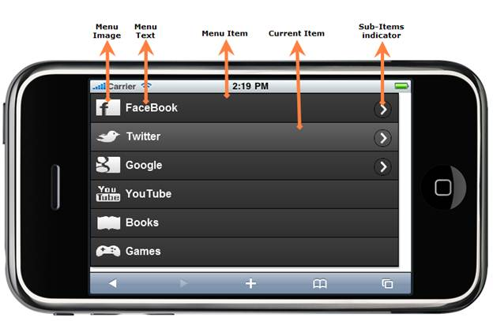

::: {style="DISPLAY: none"}
{#d2h_url_template} {#d2h_package_url style="WIDTH: 0px; DISPLAY: none; HEIGHT: 0px"}
:::

::::: {#nsbanner .d2h_main_nsbanner style="BORDER-BOTTOM: #999999 1px solid; POSITION: relative; PADDING-BOTTOM: 0px; BACKGROUND-COLOR: transparent; PADDING-LEFT: 0px; PADDING-RIGHT: 0px; DISPLAY: none; BORDER-TOP: #999999 1px solid; PADDING-TOP: 0px; LEFT: 0px"}
:::: {#TitleRow .d2h_main_titlerow style="PADDING-BOTTOM: 4px; BACKGROUND-COLOR: transparent; PADDING-LEFT: 22px; WIDTH: 100%; PADDING-RIGHT: 10px; DISPLAY: none; PADDING-TOP: 4px"}
::: {#ienav .d2h_main_ienav style="DISPLAY: none"}
{#D2HPrevious .D2HPreviousEnabled}  {#D2HNext .D2HNextEnabled}
:::
::::
:::::

:::: {#nstext .d2h_main_nstext style="PADDING-BOTTOM: 10px; BACKGROUND-COLOR: transparent; PADDING-LEFT: 22px; PADDING-RIGHT: 10px; HEIGHT: 100%; OVERFLOW: auto; PADDING-TOP: 5px" hasuserbackground="true" valign="bottom"}
::: {#d2h_breadcrumbs .d2h_breadcrumbs}
[Essential Studio User Guide Documentation](ms-xhelp:///?Id=12457748-09e3-4d74-a240-8e049cedf030){.d2h_breadcrumbsNormal} [ \> ]{.d2h_breadcrumbsLinkSeparator} [User Interface Edition](ms-xhelp:///?Id=c29296b7-531c-413b-a0ec-488ca1f7f669){.d2h_breadcrumbsNormal} [ \> ]{.d2h_breadcrumbsLinkSeparator} [Essential Mobile MVC](ms-xhelp:///?Id=74df42e3-5434-4590-9be6-3ae2f911cbbc){.d2h_breadcrumbsNormal} [ \> ]{.d2h_breadcrumbsLinkSeparator} [Essential Tools]{.d2h_breadcrumbsContentsOnly} [ \> ]{.d2h_breadcrumbsLinkSeparator} [Controls and Components](ms-xhelp:///?Id=143afae1-3f83-4d32-9bfa-92ed7022a696){.d2h_breadcrumbsNormal}
:::

## Menu {#menu style="tab-stops: 0pt"}

Essential Tools Menu for Mobile MVC supports displaying a menu out of list items. The menu is based on parent-child hierarchy.

Key Features

The key features are:

[·      ]{style="FONT-FAMILY: Symbol"}Vertical and horizontal orientation support

[·      ]{style="FONT-FAMILY: Symbol"}In-built animations support

[·      ]{style="FONT-FAMILY: Symbol"}Four in-built skins support

[·      ]{style="FONT-FAMILY: Symbol"}Template support

[·      ]{style="FONT-FAMILY: Symbol"}Data binding support

[·      ]{style="FONT-FAMILY: Symbol"}Rich set of client side events and methods

[]{style="FONT-WEIGHT: normal"} 

Elaborate Structure of Menu

The following image marks the important sections of Menu:

{border="0"}

Figure 73: Structure of Menu

More:

[ ]{#related-topics}

[{border="0" align="absMiddle"}Adding Menu to the Mobile MVC application](ms-xhelp:///?Id=64e2d6b3-168d-401f-a27e-98342f04870c){style="TEXT-DECORATION: none"}

[{border="0" align="absMiddle"}Concepts and Features](ms-xhelp:///?Id=3f4dc318-1101-4b73-bbd4-82185b91e758){style="TEXT-DECORATION: none"}
::::
