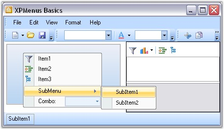

::: {style="DISPLAY: none"}
{#d2h_url_template}{#d2h_package_url style="WIDTH: 0px; DISPLAY: none; HEIGHT: 0px"}
:::

::::: {#nsbanner .d2h_main_nsbanner style="BORDER-BOTTOM: #999999 1px solid; POSITION: relative; PADDING-BOTTOM: 0px; BACKGROUND-COLOR: transparent; PADDING-LEFT: 0px; PADDING-RIGHT: 0px; DISPLAY: none; BORDER-TOP: #999999 1px solid; PADDING-TOP: 0px; LEFT: 0px"}
:::: {#TitleRow .d2h_main_titlerow style="PADDING-BOTTOM: 4px; BACKGROUND-COLOR: transparent; PADDING-LEFT: 22px; WIDTH: 100%; PADDING-RIGHT: 10px; DISPLAY: none; PADDING-TOP: 4px"}
::: {#ienav .d2h_main_ienav style="DISPLAY: none"}
{#D2HPrevious .D2HPreviousEnabled}  {#D2HNext .D2HNextEnabled}
:::
::::
:::::

:::: {#nstext .d2h_main_nstext style="PADDING-BOTTOM: 10px; BACKGROUND-COLOR: transparent; PADDING-LEFT: 22px; PADDING-RIGHT: 10px; HEIGHT: 100%; OVERFLOW: auto; PADDING-TOP: 5px" hasuserbackground="true" valign="bottom"}
::: {#d2h_breadcrumbs .d2h_breadcrumbs}
[Essential Studio User Guide Documentation](ms-xhelp:///?Id=12457748-09e3-4d74-a240-8e049cedf030){.d2h_breadcrumbsNormal}[ \> ]{.d2h_breadcrumbsLinkSeparator}[User Interface Edition](ms-xhelp:///?Id=c29296b7-531c-413b-a0ec-488ca1f7f669){.d2h_breadcrumbsNormal}[ \> ]{.d2h_breadcrumbsLinkSeparator}[Essential Windows](ms-xhelp:///?Id=e60759d8-47a4-4570-9d7a-16a68d63f2ea){.d2h_breadcrumbsNormal}[ \> ]{.d2h_breadcrumbsLinkSeparator}[Essential Tools]{.d2h_breadcrumbsContentsOnly}[ \> ]{.d2h_breadcrumbsLinkSeparator}[Tools Controls](ms-xhelp:///?Id=13c3c4f4-9d16-4b69-93f2-7e98eec67452){.d2h_breadcrumbsNormal}
:::

## Menus Package[]{#p843} {#menus-package style="tab-stops: 0pt"}

[]{style="COLOR: #15428b"} 

The Menus Framework allows you to create Menus and toolbars using an easy-to-use **MainFrameBarManager** and **ChildFrameBarManager** components. The BarItems required on the menus and toolbars can be dragged-and-dropped at any appropriate position in the menus and toolbars.

 

XPToolbars used to provide a toolbar look and feel that can be dragged-and-dropped on the form. XPToolbars can also be docked or floated as required. CommandBars can be dragged-and-dropped on to the form to implement the framework support that is required for Visual Studio .NET type dockable / floatable menus and toolbars.

 

The Essential Tools Menus package comes with the XP Menus framework which provides users the latest Office XP and Office 2007 look and feel and functionality for menus, toolbars and context menus.

 

Users may create full-fledged VS .NET and Office-like applications using the menus, docking and tabbed MDI packages as demonstrated in the sample located under the \\Tools.Windows\\Samples\\2.0\\Featured Samples.

[]{style="COLOR: #15428b"} 

{border="0"}

[]{style="COLOR: #15428b"} 

Figure 708: Syncfusion XP Menus

More:

[ ]{#related-topics}

[{border="0" align="absMiddle"}Features](ms-xhelp:///?Id=299a288b-192b-449d-8684-5dbd6821b054){style="TEXT-DECORATION: none"}

[{border="0" align="absMiddle"}Overview](ms-xhelp:///?Id=4c3111cb-94ae-4c46-9f74-54cce76e8c14){style="TEXT-DECORATION: none"}

[{border="0" align="absMiddle"}Creating Menus](ms-xhelp:///?Id=8d986dd2-909f-4ea5-8600-a49994df2477){style="TEXT-DECORATION: none"}

[{border="0" align="absMiddle"}Concepts and Features](ms-xhelp:///?Id=790e4041-e32b-4e4c-98b5-98e84917f511){style="TEXT-DECORATION: none"}

[{border="0" align="absMiddle"}Frequently Asked Questions](ms-xhelp:///?Id=c986fa91-4e22-4ee9-a4b6-885f6f23fc78){style="TEXT-DECORATION: none"}

[{border="0" align="absMiddle"}Event Handling](ms-xhelp:///?Id=a23f83b6-f8f6-47f5-bda8-ba78056e8e07){style="TEXT-DECORATION: none"}
::::
