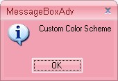

::: {style="DISPLAY: none"}
{#d2h_url_template}{#d2h_package_url style="WIDTH: 0px; DISPLAY: none; HEIGHT: 0px"}
:::

::: {.d2h_secondary_topic style="PADDING-BOTTOM: 10pt; MARGIN: 0pt; PADDING-LEFT: 0pt; PADDING-RIGHT: 0pt; PADDING-TOP: 0pt"}
#### MessageBoxAdv {#messageboxadv style="tab-stops: 0pt"}

**[]{style="COLOR: #15428b"}** 

Office2007 Style Message Box is available in Tools Windows. User can replace the .NET MessageBox with new MessageBoxAdv, which supports standard color schemes and custom color schemes in Office 2007 style, for consistent User Interface look and feel. Custom Icons support is also included in MessageBoxAdv. For showing the Message Box, call **MessageBoxAdv.Show** method.\
\

+----------------------------------------------------------------------------------------------------------------------------------------------------------------------------------------------------------------------------------------------------------------------+
| **[\[C#\]]{style="FONT-FAMILY: 'Courier New'; COLOR: black"}**                                                                                                                                                                                                       |
|                                                                                                                                                                                                                                                                      |
| []{style="FONT-FAMILY: 'Courier New'"}                                                                                                                                                                                                                               |
|                                                                                                                                                                                                                                                                      |
| [MessageBoxAdv.Office2007Theme = [Office2007Theme]{style="COLOR: #2b91af"}.Managed;]{style="FONT-FAMILY: 'Courier New'"}                                                                                                                                             |
|                                                                                                                                                                                                                                                                      |
| [Office2007Colors]{style="FONT-FAMILY: 'Courier New'; COLOR: #2b91af"}[.ApplyManagedColors([this]{style="COLOR: blue"}, ]{style="FONT-FAMILY: 'Courier New'"}[Color]{style="FONT-FAMILY: 'Courier New'; COLOR: #2b91af"}[.Red);]{style="FONT-FAMILY: 'Courier New'"} |
|                                                                                                                                                                                                                                                                      |
| [MessageBoxAdv.Show([\" Office 2007 Style with Black Color Scheme  \"]{style="COLOR: #a31515"}, [\"MessageBox Adv\"]{style="COLOR: #a31515"}, [MessageBoxButtons]{style="COLOR: #2b91af"}.OK);]{style="FONT-FAMILY: 'Courier New'"}                                  |
+----------------------------------------------------------------------------------------------------------------------------------------------------------------------------------------------------------------------------------------------------------------------+

[]{style="COLOR: #15428b"} 

+----------------------------------------------------------------------------------------------------------------------------------------------------------------------------------------------------------------------------------+
| **[\[VB.NET\]]{style="FONT-FAMILY: 'Courier New'; COLOR: black"}**                                                                                                                                                               |
|                                                                                                                                                                                                                                  |
| []{style="COLOR: #15428b"}                                                                                                                                                                                                       |
|                                                                                                                                                                                                                                  |
| [MessageBoxAdv.Office2007Theme = [Office2007Theme]{style="COLOR: black"}.Managed]{style="FONT-FAMILY: 'Courier New'"}                                                                                                            |
|                                                                                                                                                                                                                                  |
| [Office2007Colors]{style="FONT-FAMILY: 'Courier New'; COLOR: black"}[.ApplyManagedColors([Me]{style="COLOR: blue"}, [Color]{style="COLOR: black"}.Red)]{style="FONT-FAMILY: 'Courier New'"}                                      |
|                                                                                                                                                                                                                                  |
| [MessageBoxAdv.Show([\" Office 2007 Style with Black Color Scheme  \"]{style="COLOR: #a31515"}, [\"MessageBox Adv\"]{style="COLOR: #a31515"}, [MessageBoxButtons]{style="COLOR: black"}.OK)]{style="FONT-FAMILY: 'Courier New'"} |
+----------------------------------------------------------------------------------------------------------------------------------------------------------------------------------------------------------------------------------+

[]{style="COLOR: #15428b"} 

{border="0"}

[]{style="COLOR: #15428b"} 

Figure 1458: Custom Color applied to MessageBoxAdv

[]{#related-topics}
:::
