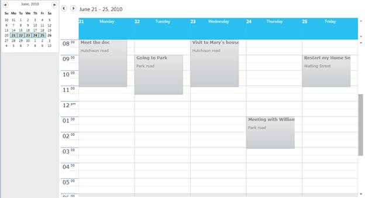

::: {style="DISPLAY: none"}
{#d2h_url_template}{#d2h_package_url style="WIDTH: 0px; DISPLAY: none; HEIGHT: 0px"}
:::

::: {.d2h_secondary_topic style="PADDING-BOTTOM: 10pt; MARGIN: 0pt; PADDING-LEFT: 0pt; PADDING-RIGHT: 0pt; PADDING-TOP: 0pt"}
#### Metro {#metro style="tab-stops: 0pt"}

The following code illustrates applying Metro theme for Schedule:

+-----------------------------------------------------------------------------------------------------------------------------------------------------------------------------------------------------------------------------------------------------------------------------------------------------------------------------------------------------------------------------------------------------------------------------------------------------------------------------------------------------------------------------------------------------------------------------------------------------------------------------------------------------------------------------------------------------------------------------------------------------------------------------------------------------------------------------------------------------------------------------------------------------------------------------------------------------------------+
| **[\[]{style="LINE-HEIGHT: 150%; FONT-FAMILY: 'Calibri','sans-serif'; COLOR: black; FONT-SIZE: 9pt"}[XAML\]]{style="LINE-HEIGHT: 150%; FONT-FAMILY: 'Calibri','sans-serif'; FONT-SIZE: 9pt"}**                                                                                                                                                                                                                                                                                                                                                                                                                                                                                                                                                                                                                                                                                                                                                                  |
|                                                                                                                                                                                                                                                                                                                                                                                                                                                                                                                                                                                                                                                                                                                                                                                                                                                                                                                                                                 |
| [\<]{style="LINE-HEIGHT: 150%; FONT-FAMILY: 'Courier New'; COLOR: blue; FONT-SIZE: 9pt"}[schedule]{style="LINE-HEIGHT: 150%; FONT-FAMILY: 'Courier New'; COLOR: #a31515; FONT-SIZE: 9pt"}[:]{style="LINE-HEIGHT: 150%; FONT-FAMILY: 'Courier New'; COLOR: blue; FONT-SIZE: 9pt"}[Schedule]{style="LINE-HEIGHT: 150%; FONT-FAMILY: 'Courier New'; COLOR: #a31515; FONT-SIZE: 9pt"}[ x]{style="LINE-HEIGHT: 150%; FONT-FAMILY: 'Courier New'; COLOR: red; FONT-SIZE: 9pt"}[:]{style="LINE-HEIGHT: 150%; FONT-FAMILY: 'Courier New'; COLOR: blue; FONT-SIZE: 9pt"}[Name]{style="LINE-HEIGHT: 150%; FONT-FAMILY: 'Courier New'; COLOR: red; FONT-SIZE: 9pt"}[=\"Schedule\"]{style="LINE-HEIGHT: 150%; FONT-FAMILY: 'Courier New'; COLOR: blue; FONT-SIZE: 9pt"}[ VisualStyle]{style="LINE-HEIGHT: 150%; FONT-FAMILY: 'Courier New'; COLOR: red; FONT-SIZE: 9pt"}[=\"Metro\"/\>]{style="LINE-HEIGHT: 150%; FONT-FAMILY: 'Courier New'; COLOR: blue; FONT-SIZE: 9pt"} |
+-----------------------------------------------------------------------------------------------------------------------------------------------------------------------------------------------------------------------------------------------------------------------------------------------------------------------------------------------------------------------------------------------------------------------------------------------------------------------------------------------------------------------------------------------------------------------------------------------------------------------------------------------------------------------------------------------------------------------------------------------------------------------------------------------------------------------------------------------------------------------------------------------------------------------------------------------------------------+

 

When the code runs, the following output displays:

 

{border="0"}

Figure 48: Metro Theme

 

[]{#related-topics}
:::
