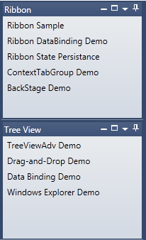
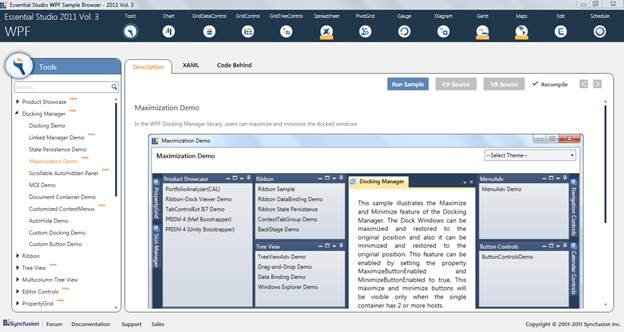

::: {style="DISPLAY: none"}
{#d2h_url_template}{#d2h_package_url style="WIDTH: 0px; DISPLAY: none; HEIGHT: 0px"}
:::

::: {.d2h_secondary_topic style="PADDING-BOTTOM: 10pt; MARGIN: 0pt; PADDING-LEFT: 0pt; PADDING-RIGHT: 0pt; PADDING-TOP: 0pt"}
#### Minimize/Maximize Support for Docked Windows {#minimizemaximize-support-for-docked-windows style="tab-stops: 0pt"}

This feature helps to Maximize/Minimize Docked Windows for better usage of each window. This support is enabled only when the parent container of a specific element contains more than one host.

Use Case Scenario

[·      ]{style="FONT-FAMILY: Symbol"}It helps a particular docked window to provide a maximized view

[·      ]{style="FONT-FAMILY: Symbol"}It can minimize a docked window and can be restored when needed

 

{border="0"}

Figure 367: Minimise/Maximize Support

Samples Link

To view samples:

1.   Click **Start**\--\>**All Programs**\--\>**Syncfusion**\--\>**Essential Studio** \<version number\> \--\>**Dashboard**. (Refer section 2.2)

2.   In the Dashboard window, click Run Locally Installed Samples for WPF under User Interface Edition panel.

{border="0"}

Figure 368: Sample Browser

 

The WPF Sample Browser window is displayed.

 

More:

[ ]{#related-topics}

[{border="0" align="absMiddle"}Properties, Methods and Events Tables](ms-xhelp:///?Id=eb0ad31c-a75e-4202-bf43-31179db9439c){style="TEXT-DECORATION: none"}

[{border="0" align="absMiddle"}Features of Minimize/Maximize Support for Docked Windows](ms-xhelp:///?Id=42666692-3443-4cd2-9234-8d3646cef59f){style="TEXT-DECORATION: none"}
:::
