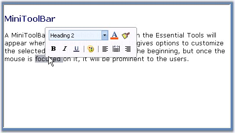

::: {style="DISPLAY: none"}
{#d2h_url_template}{#d2h_package_url style="WIDTH: 0px; DISPLAY: none; HEIGHT: 0px"}
:::

:::: {.d2h_secondary_topic style="PADDING-BOTTOM: 10pt; MARGIN: 0pt; PADDING-LEFT: 0pt; PADDING-RIGHT: 0pt; PADDING-TOP: 0pt"}
#### MiniToolBar {#minitoolbar style="tab-stops: 0pt"}

[]{style="COLOR: #15428b"} 

Essential Tools comes with MiniToolBar control with similar look and feel of MS Office 2007. It appears when the user selects and right clicks on the text. It gives options to customize the selected text. It will look blurred in the beginning, but once the mouse is focussed on it, it will be prominent to the users.

[]{style="COLOR: #15428b"} 

::: {style="BORDER-BOTTOM: windowtext 1pt solid; BORDER-LEFT: medium none; PADDING-BOTTOM: 1pt; MARGIN: 9pt 0pt 9pt 18pt; PADDING-LEFT: 0pt; PADDING-RIGHT: 0pt; BORDER-TOP: windowtext 1pt solid; BORDER-RIGHT: medium none; PADDING-TOP: 1pt"}
{border="0"} Note: MiniToolBar control uses a ToolStripPanelItem to hold its options.
:::

[]{style="COLOR: #15428b"} 

{border="0"}

[]{style="COLOR: #15428b"} 

Figure 1392: MiniToolBar Displayed on a RichTextBox

**[]{style="COLOR: #15428b"}** 

See Also

[]{style="COLOR: #15428b"} 

[[Through Designer]{.UGHyperlink}](../../../../../../../../Documents%20and%20Settings/sylviap/Desktop/Tools%20-%20Part%202.docx#_Through_Designer_3)[, ]{.UGHyperlink}[[Through Code]{.UGHyperlink}](../../../../../../../../Documents%20and%20Settings/sylviap/Desktop/Tools%20-%20Part%202.docx#_Through_Code_3)[ ]{.UGHyperlink}

 

 

More:

[ ]{#related-topics}

[{border="0" align="absMiddle"}Color Schemes in MiniToolBar](ms-xhelp:///?Id=73a286c3-bf00-4dfe-877c-3dea54147d9d){style="TEXT-DECORATION: none"}

[{border="0" align="absMiddle"}Creating MiniToolBar](ms-xhelp:///?Id=f00ec493-2455-46cc-b4e0-aad6336545ef){style="TEXT-DECORATION: none"}

[{border="0" align="absMiddle"}MiniToolBar Events](ms-xhelp:///?Id=8fa1415e-2885-47d0-9e55-d8c5e7a521e4){style="TEXT-DECORATION: none"}
::::
