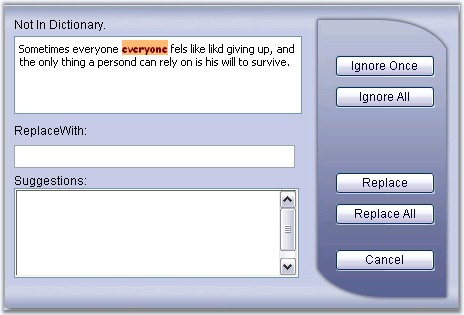

::: {style="DISPLAY: none"}
{#d2h_url_template}{#d2h_package_url style="WIDTH: 0px; DISPLAY: none; HEIGHT: 0px"}
:::

:::: {.d2h_secondary_topic style="PADDING-BOTTOM: 10pt; MARGIN: 0pt; PADDING-LEFT: 0pt; PADDING-RIGHT: 0pt; PADDING-TOP: 0pt"}
##### Misspelled word Styles {#misspelled-word-styles style="MARGIN-LEFT: 1.8pt; tab-stops: 1.8pt"}

[]{style="FONT-FAMILY: 'Trebuchet MS','sans-serif'; COLOR: #15428b; FONT-SIZE: 9pt"} 

The control comes with a built-in rich dialog form with support for customizing the style of misspelled words through style properties. Just set the properties, which reflects the style settings for the misspelled words in the SpellCheck dialog box.

[]{style="FONT-FAMILY: 'Trebuchet MS','sans-serif'; COLOR: #15428b; FONT-SIZE: 9pt"} 

::: {align="center"}
+-----------------------------------+----------------------------------------------------------------------------------------------------------+
|                                   |                                                                                                          |
|                                   |                                                                                                          |
| Property                          | Description                                                                                              |
+-----------------------------------+----------------------------------------------------------------------------------------------------------+
| MisspelledWordCss                 | Specifies a collection of style properties, that allows to customize the styles of the misspelled words. |
+-----------------------------------+----------------------------------------------------------------------------------------------------------+
:::

[]{style="FONT-FAMILY: 'Trebuchet MS','sans-serif'; COLOR: #15428b; FONT-SIZE: 9pt"} 

{border="0"}

[]{style="FONT-FAMILY: 'Trebuchet MS','sans-serif'; COLOR: #15428b; FONT-SIZE: 9pt"} 

Figure 92: CSS styles applied for the misspelled word

[]{style="FONT-FAMILY: 'Trebuchet MS','sans-serif'; COLOR: #15428b; FONT-SIZE: 9pt"} 

Programmatic settings of few misspelled style properties are given below.

[]{style="COLOR: black; FONT-SIZE: 8pt"} 

+----------------------------------------------------------------------------------------------------------------------------------------------------+
| **[\[C#\]]{style="FONT-FAMILY: 'Courier New'; FONT-SIZE: 9pt"}**                                                                                   |
|                                                                                                                                                    |
| **[]{style="FONT-FAMILY: 'Courier New'; FONT-SIZE: 9pt"}**                                                                                         |
|                                                                                                                                                    |
| [SpellCheck.MisspelledWordCss.BackColor = System.Drawing.[Color]{style="COLOR: teal"}.Orange;]{style="FONT-FAMILY: 'Courier New'; FONT-SIZE: 9pt"} |
|                                                                                                                                                    |
| [SpellCheck.MisspelledWordCss.ForeColor = System.Drawing.[Color]{style="COLOR: teal"}.Brown;]{style="FONT-FAMILY: 'Courier New'; FONT-SIZE: 9pt"}  |
|                                                                                                                                                    |
| [SpellCheck.MisspelledWordCss.Font = System.Drawing.[FontStyle]{style="COLOR: teal"}.Bold;]{style="FONT-FAMILY: 'Courier New'; FONT-SIZE: 9pt"}    |
+----------------------------------------------------------------------------------------------------------------------------------------------------+

[]{style="FONT-FAMILY: 'Trebuchet MS','sans-serif'; COLOR: #15428b; FONT-SIZE: 9pt"} 

+-------------------------------------------------------------------------------------------------------------------------------------------------------------------------------------------------------+
| **[\[VB\]]{style="FONT-FAMILY: 'Courier New'; FONT-SIZE: 9pt"}**                                                                                                                                      |
|                                                                                                                                                                                                       |
| **[]{style="FONT-FAMILY: 'Courier New'; FONT-SIZE: 9pt"}**                                                                                                                                            |
|                                                                                                                                                                                                       |
| [Private]{style="FONT-FAMILY: 'Courier New'; COLOR: blue; FONT-SIZE: 9pt"}[ SpellCheck.MisspelledWordCss.BackColor = System.Drawing.Color.Orange]{style="FONT-FAMILY: 'Courier New'; FONT-SIZE: 9pt"} |
|                                                                                                                                                                                                       |
| [Private]{style="FONT-FAMILY: 'Courier New'; COLOR: blue; FONT-SIZE: 9pt"}[ SpellCheck.MisspelledWordCss.ForeColor = System.Drawing.Color.Brown]{style="FONT-FAMILY: 'Courier New'; FONT-SIZE: 9pt"}  |
|                                                                                                                                                                                                       |
| [Private]{style="FONT-FAMILY: 'Courier New'; COLOR: blue; FONT-SIZE: 9pt"}[ SpellCheck.MisspelledWordCss.Font = System.Drawing.FontStyle.Bold]{style="FONT-FAMILY: 'Courier New'; FONT-SIZE: 9pt"}    |
+-------------------------------------------------------------------------------------------------------------------------------------------------------------------------------------------------------+

[]{#p152} 

[]{#related-topics}
::::
