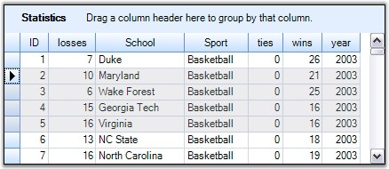
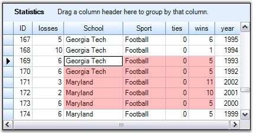

::: {style="DISPLAY: none"}
{#d2h_url_template}{#d2h_package_url style="WIDTH: 0px; DISPLAY: none; HEIGHT: 0px"}
:::

::::: {.d2h_secondary_topic style="PADDING-BOTTOM: 10pt; MARGIN: 0pt; PADDING-LEFT: 0pt; PADDING-RIGHT: 0pt; PADDING-TOP: 0pt"}
##### Model Based Selection {#model-based-selection style="tab-stops: 0pt"}

[]{style="FONT-FAMILY: 'Trebuchet MS','sans-serif'; COLOR: #15428b; FONT-SIZE: 9pt"} 

**Model Based Selection** is cell-based that allows you to do a selection across the cell which is not possible with record-based selection. This derives from the GridControlBase and hence will not be aware of the grouping elements like nested tables, groups, and so on.

 

A model-based selection can be set by initializing **AllowSelection** property to a value other than None. The possible values for this type of selection is defined by the enum **GridSelectionFlags**. By setting the various flags in AllowSelection, you can control the selection behavior of the grouping grids.

[]{style="FONT-FAMILY: 'Trebuchet MS','sans-serif'; COLOR: #15428b; FONT-SIZE: 9pt"} 

Selection Flags

[]{style="FONT-FAMILY: 'Trebuchet MS','sans-serif'; COLOR: #15428b; FONT-SIZE: 9pt"} 

::: {align="center"}
  -------------- ----------------------------------------------------------------------------------------------------------------------------
  Flag Name      Description
  AlphaBlend     Uses alpha blending to highlight selected cells.
  Cell           Individual cells can be selected.
  Column         Columns can be selected.
  Row            Rows can be selected.
  Table          Whole table can be selected.
  Shift          Allows user to extend the existing selection by holding the Shift key and clicking a cell.
  MixRangeType   Allows you to select multiple ranges by holding the CTRL key.
  Multiple       Allows both rows and columns to be selected at the same time when GridSelectionFlags.Multiple is enabled.
  Keyboard       Allows extend existing selection when user holds SHIFT+Arrow keys.
  Any            Default behavior for selecting cells: Rows, Columns, Cells, Table, Multiple, Extends Shift Key support and alpha blending.
  None           Disable selecting cells.
  -------------- ----------------------------------------------------------------------------------------------------------------------------
:::

 

You can combine more than one flags to customize the current selection behavior.

[]{style="FONT-FAMILY: 'Verdana','sans-serif'; FONT-SIZE: 8pt"} 

**Example**

 

Following code example illustrates how to set the selection mode for selecting multiple rows with alpha blending.

[]{style="FONT-FAMILY: 'Trebuchet MS','sans-serif'; COLOR: #15428b; FONT-SIZE: 9pt"} 

+------------------------------------------------------------------------------------------------------------------------------------------------------------------------------------------------------------------------------------------------------------------------------------------------------------------------+
| **[\[C#\]]{style="FONT-FAMILY: 'Courier New'; COLOR: black"}**                                                                                                                                                                                                                                                         |
|                                                                                                                                                                                                                                                                                                                        |
| []{style="FONT-FAMILY: 'Courier New'; COLOR: black"}                                                                                                                                                                                                                                                                   |
|                                                                                                                                                                                                                                                                                                                        |
| [this]{style="FONT-FAMILY: 'Courier New'; COLOR: blue"}[.gridGroupingControl1.TableOptions.AllowSelection = [GridSelectionFlags]{style="COLOR: #2b91af"}.AlphaBlend \| [GridSelectionFlags]{style="COLOR: #2b91af"}.Row \| [GridSelectionFlags]{style="COLOR: #2b91af"}.Multiple;]{style="FONT-FAMILY: 'Courier New'"} |
+------------------------------------------------------------------------------------------------------------------------------------------------------------------------------------------------------------------------------------------------------------------------------------------------------------------------+

[]{style="FONT-FAMILY: 'Trebuchet MS','sans-serif'; COLOR: #15428b; FONT-SIZE: 9pt"} 

+-------------------------------------------------------------------------------------------------------------------------------------------------------------------------------------------------------------------------------------------------------------------------------------+
| **[\[VB.NET\]]{style="FONT-FAMILY: 'Courier New'; COLOR: black"}**                                                                                                                                                                                                                  |
|                                                                                                                                                                                                                                                                                     |
| []{style="FONT-FAMILY: 'Courier New'; COLOR: black"}                                                                                                                                                                                                                                |
|                                                                                                                                                                                                                                                                                     |
| [Me]{style="FONT-FAMILY: 'Courier New'; COLOR: blue"}[.gridGroupingControl1.TableOptions.AllowSelection = GridSelectionFlags.AlphaBlend [Or]{style="COLOR: blue"} GridSelectionFlags.Row [Or]{style="COLOR: blue"} GridSelectionFlags.Multiple]{style="FONT-FAMILY: 'Courier New'"} |
+-------------------------------------------------------------------------------------------------------------------------------------------------------------------------------------------------------------------------------------------------------------------------------------+

[]{style="FONT-FAMILY: 'Trebuchet MS','sans-serif'; COLOR: #15428b; FONT-SIZE: 9pt"} 

{border="0"}

[]{style="FONT-FAMILY: 'Trebuchet MS','sans-serif'; COLOR: #15428b; FONT-SIZE: 9pt"} 

*[Figure ]{style="FONT-SIZE: 9pt"}[354]{style="FONT-SIZE: 9pt"}[: Model Based Selection Illustrated]{style="FONT-SIZE: 9pt"}****[]{style="FONT-FAMILY: 'Trebuchet MS','sans-serif'; COLOR: #15428b; FONT-SIZE: 9pt"}***

[]{style="FONT-FAMILY: 'Trebuchet MS','sans-serif'; COLOR: #15428b; FONT-SIZE: 9pt"} 

Format Selection

[]{style="FONT-FAMILY: 'Segoe UI','sans-serif'; COLOR: #4a5c8c; FONT-SIZE: 9pt"} 

[It is possible to modify the default color used for alphablend selection. This can be achieved by assigning a desired color to the AlphaBlendSelectionColor property. The example given below uses Red Color for alpha blending.]{style="FONT-SIZE: 9pt"}

**[]{style="COLOR: #4a5c8c; FONT-SIZE: 9pt"}** 

+----------------------------------------------------------------------------------------------------------------------------------------------------------------------------------------------------------------------------------------------------------------+
| **[\[C#\]]{style="FONT-FAMILY: 'Courier New'; COLOR: black"}**                                                                                                                                                                                                 |
|                                                                                                                                                                                                                                                                |
| []{style="FONT-FAMILY: 'Courier New'; COLOR: black"}                                                                                                                                                                                                           |
|                                                                                                                                                                                                                                                                |
| [this]{style="FONT-FAMILY: 'Courier New'; COLOR: blue"}[.gridGroupingControl1.TableOptions.AllowSelection = [GridSelectionFlags]{style="COLOR: #2b91af"}.AlphaBlend \| [GridSelectionFlags]{style="COLOR: #2b91af"}.Cell;]{style="FONT-FAMILY: 'Courier New'"} |
|                                                                                                                                                                                                                                                                |
| [this]{style="FONT-FAMILY: 'Courier New'; COLOR: blue"}[.gridGroupingControl1.TableModel.Options.AlphaBlendSelectionColor = [Color]{style="COLOR: #2b91af"}.Red;]{style="FONT-FAMILY: 'Courier New'"}                                                          |
+----------------------------------------------------------------------------------------------------------------------------------------------------------------------------------------------------------------------------------------------------------------+

[]{style="FONT-FAMILY: 'Trebuchet MS','sans-serif'; COLOR: #15428b; FONT-SIZE: 9pt"} 

+--------------------------------------------------------------------------------------------------------------------------------------------------------------------------------------------------------------------------------+
| **[\[VB.NET\]]{style="FONT-FAMILY: 'Courier New'; COLOR: black"}**                                                                                                                                                             |
|                                                                                                                                                                                                                                |
| []{style="FONT-FAMILY: 'Courier New'; COLOR: black"}                                                                                                                                                                           |
|                                                                                                                                                                                                                                |
| [Me]{style="FONT-FAMILY: 'Courier New'; COLOR: blue"}[.gridGroupingControl1.TableOptions.AllowSelection = GridSelectionFlags.AlphaBlend [Or]{style="COLOR: blue"} GridSelectionFlags.Cell]{style="FONT-FAMILY: 'Courier New'"} |
|                                                                                                                                                                                                                                |
| [Me]{style="FONT-FAMILY: 'Courier New'; COLOR: blue"}[.gridGroupingControl1.TableModel.Options.AlphaBlendSelectionColor = Color.Red]{style="FONT-FAMILY: 'Courier New'"}                                                       |
+--------------------------------------------------------------------------------------------------------------------------------------------------------------------------------------------------------------------------------+

[]{style="FONT-FAMILY: 'Trebuchet MS','sans-serif'; COLOR: #15428b; FONT-SIZE: 9pt"} 

{border="0"}

***[]{style="FONT-FAMILY: 'Trebuchet MS','sans-serif'; COLOR: #15428b; FONT-SIZE: 9pt"}*** 

*[Figure ]{style="FONT-SIZE: 9pt"}[355]{style="FONT-SIZE: 9pt"}[: AlphaBlendSelectionColor = \"Red\"]{style="FONT-SIZE: 9pt"}*

[]{style="FONT-FAMILY: 'Trebuchet MS','sans-serif'; COLOR: #15428b; FONT-SIZE: 9pt"} 

::: {style="BORDER-BOTTOM: windowtext 1pt solid; BORDER-LEFT: medium none; PADDING-BOTTOM: 1pt; MARGIN-TOP: 9pt; PADDING-LEFT: 0pt; PADDING-RIGHT: 0pt; MARGIN-BOTTOM: 9pt; BORDER-TOP: windowtext 1pt solid; BORDER-RIGHT: medium none; PADDING-TOP: 1pt"}
{border="0"}Note: For more details, refer the following browser sample:

 

\<Install Location\>\\Syncfusion\\EssentialStudio\\\[Version Number\]\\Windows\\Grid.Grouping.Windows\\Samples\\2.0\\Grouping Grid Options\\Table Options Demo
:::

 

[]{#p463} 

 

[]{#related-topics}
:::::
