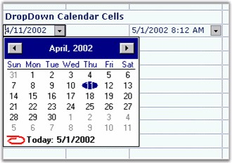

::: {style="DISPLAY: none"}
{#d2h_url_template}{#d2h_package_url style="WIDTH: 0px; DISPLAY: none; HEIGHT: 0px"}
:::

::: {.d2h_secondary_topic style="PADDING-BOTTOM: 10pt; MARGIN: 0pt; PADDING-LEFT: 0pt; PADDING-RIGHT: 0pt; PADDING-TOP: 0pt"}
##### Month Calendar {#month-calendar style="tab-stops: 0pt"}

[]{style="FONT-FAMILY: 'Trebuchet MS','sans-serif'; COLOR: #15428b; FONT-SIZE: 9pt"} 

The **MonthCalendar** cell type lets you pick dates. To make use of this cell type in grid, set the **CellType** property to *MonthCalendar* and **CellValue** property to *DateTime* object.

[]{style="FONT-FAMILY: 'Trebuchet MS','sans-serif'; COLOR: #15428b; FONT-SIZE: 9pt"} 

The following code example illustrates how to set the cell type to MonthCalendar.

[]{style="FONT-FAMILY: 'Trebuchet MS','sans-serif'; COLOR: #15428b; FONT-SIZE: 9pt"} 

+----------------------------------------------------------------------------------------------------------------------------------+
| **[\[C#\]]{style="FONT-FAMILY: 'Courier New'; COLOR: black"}**                                                                   |
|                                                                                                                                  |
| []{style="FONT-FAMILY: 'Courier New'; COLOR: black"}                                                                             |
|                                                                                                                                  |
| [// Set Cell Type.]{style="FONT-FAMILY: 'Courier New'; COLOR: green"}                                                            |
|                                                                                                                                  |
| [gridControl1\[rowIndex, colIndex\].CellType = [\"MonthCalendar\"]{style="COLOR: #a31515"};]{style="FONT-FAMILY: 'Courier New'"} |
|                                                                                                                                  |
| []{style="FONT-FAMILY: 'Courier New'"}                                                                                           |
|                                                                                                                                  |
| [// Assign initial value.]{style="FONT-FAMILY: 'Courier New'; COLOR: green"}                                                     |
|                                                                                                                                  |
| [gridControl1\[rowIndex, colIndex\].CellValue = [DateTime]{style="COLOR: #2b91af"}.Now;]{style="FONT-FAMILY: 'Courier New'"}     |
+----------------------------------------------------------------------------------------------------------------------------------+

[]{style="FONT-FAMILY: 'Trebuchet MS','sans-serif'; COLOR: #15428b; FONT-SIZE: 9pt"} 

+-------------------------------------------------------------------------------------------------------------------------------+
| **[\[VB.NET\]]{style="FONT-FAMILY: 'Courier New'; COLOR: black"}**                                                            |
|                                                                                                                               |
| []{style="FONT-FAMILY: 'Courier New'; COLOR: black"}                                                                          |
|                                                                                                                               |
| [\' Set Cell Type.]{style="FONT-FAMILY: 'Courier New'; COLOR: green"}                                                         |
|                                                                                                                               |
| [gridControl1(rowIndex, colIndex).CellType = [\"MonthCalendar\"]{style="COLOR: #a31515"}]{style="FONT-FAMILY: 'Courier New'"} |
|                                                                                                                               |
| []{style="FONT-FAMILY: 'Courier New'; COLOR: #a31515"}                                                                        |
|                                                                                                                               |
| [\' Assign initial value.]{style="FONT-FAMILY: 'Courier New'; COLOR: green"}                                                  |
|                                                                                                                               |
| [gridControl1(rowIndex, colIndex).CellValue = DateTime.Now]{style="FONT-FAMILY: 'Courier New'"}                               |
+-------------------------------------------------------------------------------------------------------------------------------+

[]{style="FONT-FAMILY: 'Trebuchet MS','sans-serif'; COLOR: #15428b; FONT-SIZE: 9pt"} 

{border="0"}

[]{style="FONT-FAMILY: 'Trebuchet MS','sans-serif'; COLOR: #15428b; FONT-SIZE: 9pt"} 

*[Figure ]{style="FONT-SIZE: 9pt"}[84]{style="FONT-SIZE: 9pt"}[: Month Calendar Cells]{style="FONT-SIZE: 9pt"}*

 

[]{#p60} 

 

[]{#related-topics}
:::
