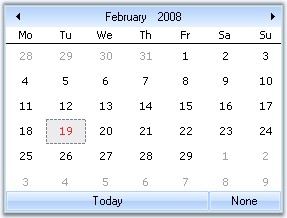

::: {style="DISPLAY: none"}
{#d2h_url_template}{#d2h_package_url style="WIDTH: 0px; DISPLAY: none; HEIGHT: 0px"}
:::

::: {.d2h_secondary_topic style="PADDING-BOTTOM: 10pt; MARGIN: 0pt; PADDING-LEFT: 0pt; PADDING-RIGHT: 0pt; PADDING-TOP: 0pt"}
#### MonthCalendarAdv {#monthcalendaradv style="tab-stops: 0pt"}

[]{style="COLOR: #15428b"} 

The Essential Tools **MonthCalendarAdv** **control** is an advanced calendar control that can display all the month of the year with the appropriate culture information for the months and days of the week. A wide variety of visual styles can be applied to the MonthCalendarAdv, to enhance the appearance of the control. This also includes the new Microsoft Office 2007 Style for all the child controls of the MonthCalendarAdv, such as the UpDown Spin Button, DropDown button of DateTimePickerAdv, ScrollButton, TodayButton and None button.

 

{border="0"}

**[]{style="COLOR: #15428b"}** 

Figure 205: MonthCalendarAdv Control

**[]{style="COLOR: #15428b"}** 

[]{style="COLOR: #15428b"} 

More:

[ ]{#related-topics}

[{border="0" align="absMiddle"}Features](ms-xhelp:///?Id=0e39ab30-ec0a-4a8b-9f0a-888b94fc6bda){style="TEXT-DECORATION: none"}

[{border="0" align="absMiddle"}MonthCalendarAdv](ms-xhelp:///?Id=fc1ee624-9985-4991-aaf1-470f6cdaacf4){style="TEXT-DECORATION: none"}

[{border="0" align="absMiddle"}Creating MonthCalendarAdv](ms-xhelp:///?Id=595c4dcc-e6f7-4e07-aa48-ab1b22b8c2b8){style="TEXT-DECORATION: none"}

[{border="0" align="absMiddle"}Concepts and Features](ms-xhelp:///?Id=f6d65767-a160-4602-8dab-60343e5e79cd){style="TEXT-DECORATION: none"}

[{border="0" align="absMiddle"}Event Handling](ms-xhelp:///?Id=d9eb85d8-9f60-4ad2-9a15-0fe7bc2922a9){style="TEXT-DECORATION: none"}

[{border="0" align="absMiddle"}Frequently Asked Questions](ms-xhelp:///?Id=f328fc05-6220-4ffe-9b3c-3e76d7a7a72f){style="TEXT-DECORATION: none"}
:::
