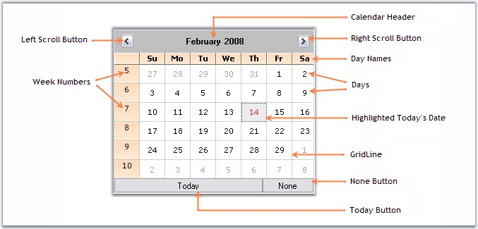

::: {style="DISPLAY: none"}
{#d2h_url_template}{#d2h_package_url style="WIDTH: 0px; DISPLAY: none; HEIGHT: 0px"}
:::

::: {.d2h_secondary_topic style="PADDING-BOTTOM: 10pt; MARGIN: 0pt; PADDING-LEFT: 0pt; PADDING-RIGHT: 0pt; PADDING-TOP: 0pt"}
##### MonthCalendarAdv {#monthcalendaradv style="tab-stops: 0pt"}

[]{#p270} 

Sections of MonthCalendarAdv control

[]{style="COLOR: #15428b"} 

The following figure displays the sections of MonthCalendarAdv control .

[]{style="COLOR: #15428b"} 

{border="0"}

[]{style="COLOR: #15428b"} 

Figure 206: Sections of CalendarAdv

**[]{style="COLOR: #15428b"}** 

[·      ]{style="FONT-FAMILY: Symbol"}Calendar Header - Header for the MonthCalendarAdv. See Header Settings.

[·      ]{style="FONT-FAMILY: Symbol"}Scroll Buttons - Allows the end user to scroll through the months. See Button Settings.

[·      ]{style="FONT-FAMILY: Symbol"}Week Number - Specifies a unique number for each week.

[·      ]{style="FONT-FAMILY: Symbol"}Day Names - Day names of each day in a week is displayed in DayNames section.

[·      ]{style="FONT-FAMILY: Symbol"}Days - Days of the month.

[·      ]{style="FONT-FAMILY: Symbol"}Highlighted Today\'s date - Today\'s date selected / highlighted at runtime.

[·      ]{style="FONT-FAMILY: Symbol"}Grid Line - Grid Line which separates the dates.

[·      ]{style="FONT-FAMILY: Symbol"}None Button - Lets you to withdraw focus from a day in the MonthCalendarAdv.

[·      ]{style="FONT-FAMILY: Symbol"}Today Button - Focus will be moved to today\'s date.

[]{style="COLOR: #15428b"} 

See Also

[]{style="COLOR: #15428b"} 

[Concepts and Features]{.UGHyperlink}[]{.UGHyperlink}

[]{#related-topics}
:::
