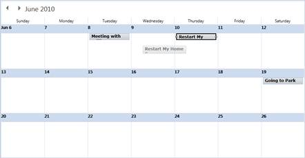
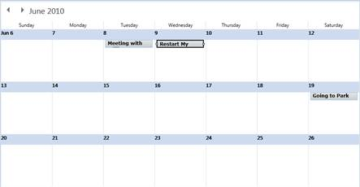

::: {style="DISPLAY: none"}
{#d2h_url_template}{#d2h_package_url style="WIDTH: 0px; DISPLAY: none; HEIGHT: 0px"}
:::

::: {.d2h_secondary_topic style="PADDING-BOTTOM: 10pt; MARGIN: 0pt; PADDING-LEFT: 0pt; PADDING-RIGHT: 0pt; PADDING-TOP: 0pt"}
##### Month View Drag and Drop {#month-view-drag-and-drop style="tab-stops: 0pt"}

Appointments can also be dragged to other days when displayed in the month View.  Appointments whose threshold time is not set will take the threshold time set in the Schedule control.

 

{border="0"}

 

Figure 18: Appointment Dragged in Month View[]{style="FONT-FAMILY: 'Courier New'; COLOR: blue"}

[]{style="FONT-SIZE: 9pt"} 

[]{style="LINE-HEIGHT: 150%; FONT-FAMILY: 'Courier New'; COLOR: blue; FONT-SIZE: 9pt"} 

{border="0"}

 

Figure 19: Appointment Dropped in Month View

[]{style="FONT-FAMILY: 'Courier New'; COLOR: blue"} 

[]{#related-topics}
:::
